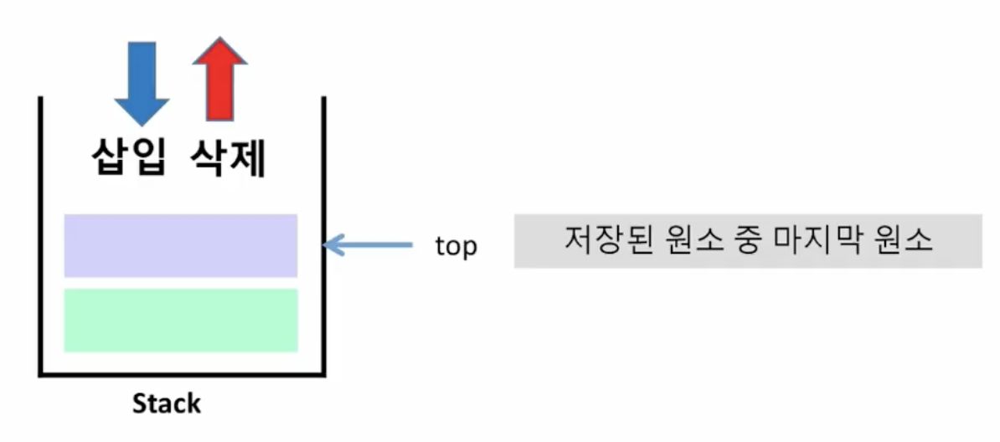
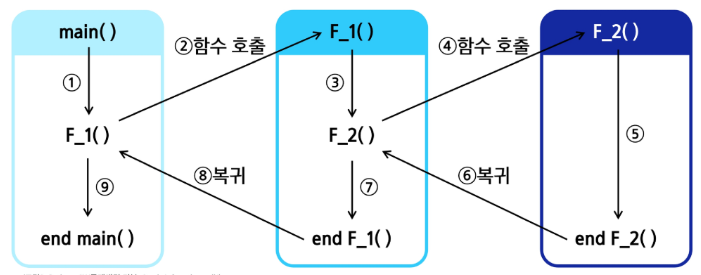
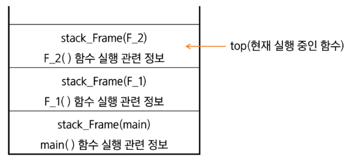

# 스스로 학습

## [스택]

### 스택 오버플로우와 언더플로우

이 두 가지 상황은 스택을 구현할 때 반드시 고려해야 하는 중요한 예외 처리입니다.

- **오버플로우(Overflow)**: 스택이 가득 찬 상태에서 `push` 연산을 시도할 때 발생합니다.
- **언더플로우(Underflow)**: 스택이 비어있는 상태에서 `pop` 연산을 시도할 때 발생합니다.

파이썬 리스트는 동적으로 크기를 조정하므로, 일반적으로 오버플로우는 발생하지 않습니다.

### 정적 스택과 동적 스택(권장)

1. 크기가 정해진 스택 (정적 스택)

- 미리 정해진 크기의 리스트를 스택으로 사용하는 경우
- **구현 방식**: `stack = [0] * size` 와 같이 특정 크기의 리스트를 미리 생성합니다.
- **`my_push` 함수의 목적**: `push` 연산을 수행하기 전에 **스택의 크기를 초과하는지(`top == size`)** 확인하여 `Overflow` 오류를 방지해야 합니다.
- **특징**: 스택의 크기가 고정되어 있어 메모리 사용량을 예측할 수 있지만, 정해진 크기를 넘어서면 요소를 추가할 수 없습니다.
- **장점**: 구현이 쉽다. 필요한 메모리 공간을 정확하게 예측하고 할당할 수 있습니다.
- **단점**:
    - 스택의 크기를 변경하기가 어렵습니다.
    - 정해진 크기를 초과하여 요소를 추가하려고 하면 오버플로우(Overflow)가 발생합니다.

2. 크기가 정해지지 않은 스택 (동적 스택)

파이썬의 리스트는 기본적으로 크기가 동적이므로, 이를 활용하면 스택의 크기를 미리 정하지 않아도 됩니다.

- **구현 방식**: `stack = []` 와 같이 빈 리스트로 시작하고, `append()`와 `pop()` 메서드를 사용합니다.
- **`push` 연산**: `stack.append(item)`
- **`pop` 연산**: `stack.pop()`
- **특징**:
    - `append()` 메서드는 리스트의 크기가 자동으로 늘어나므로 오버플로우를 신경 쓸 필요가 없습니다.
    - `pop()` 메서드는 리스트가 비어있을 때 `IndexError`를 발생시키므로, 언더플로우는 자동으로 처리됩니다.
- **장점**: 크기가 고정된 스택보다 구현이 훨씬 간단하며, 파이썬에서 스택을 구현할 때 가장 많이 사용되는 방식입니다. 메모리를 효율적으로 사용합니다.
- **단점**:
    - 메모리 재할당 오버헤드: 리스트의 크기가 커져서 메모리 공간이 부족해지면, 파이썬은 더 큰 메모리 공간을 새로 할당하고 기존 요소를 복사합니다. 이 과정에서 성능 저하가 발생할 수 있습니다.

<br><br>

# 수업 필기

## Stack 자료구조

### 스택 (Stack)

물건을 쌓아 올리듯 자료를 쌓아 올린 형태의 선형 자료구조

- **선형 자료구조(Linear)**: 자료 간 관계가 `1:1` 형태
- **후입선출** (**LIFO**, Last-In First-Out): 가장 마지막에 넣은 자료가 가장 먼저 나온다.
- **배열(list)**을 사용해 구현한다.
- 용도에 따라 메모리의 일부(저장소 자체)를 스택이라고 부르기도 한다.

### Stack의 기본 연산



- 스택 포인터 (top): 데이터를 넣거나 뺄 때 기준이 되는 위치로, 스택에서 마지막에 삽입된 원소의 위치
    - 파이썬에서는 `[-1]` 인덱스로 접근
- `push`: 스택에 데이터를 삽입
- `pop`: 가장 최근에 저장한 데이터를 스택에서 반환 및 삭제(제거)
- `isEmpty`: 스택이 공백인지 아닌지를 확인하는 연산
    - 비어있으면 True, 아니면 False
- `peek`: 스택의 마지막 원소(top)를 반환하는 연산
    - 데이터를 삭제하지 않는다.

## Stack 구현

### push 연산

**append 메서드를 이용한 구현**

```python
s = []

def my_push(item):
    '''스택에 item을 삽입합니다.'''
		s.append(item)
```

**top 포인터를 이용한 구현**

- 크기가 정해진 스택 (정적 스택)

```python
stack = [0] * size

def my_push(item, size):
"""item: 삽입할 데이터, size: 스택의 최대 용량(=리스트의 길이)"""
		global top
		top += 1
		# 오류 확인을 위해 top과 스택의 크기를 비교한다.(정적 스택)
		if top == size:
				print("overflow!")
		else:
				stack[top] = item
```

| **구현 방법** | append() **사용** | top **포인터 사용** |
| :---: | :---: | :---: |
| **메모리 구조** | Python 리스트 활용 | 배열(리스트) 기반 수동 구현 |
| **직관성** | 간단하고 가독성이 높음 | 저수준 구현 학습에 도움 |
| **사용 사례** | 일반적인 Python 사용 | 시스템 프로그래밍, 제한된 메모리 환경 |

### pop 연산

**pop 메서드를 이용한 구현**

```python
def my_pop():
    '''스택의 top(마지막 원소)을 제거하고 반환합니다.'''
		if len(s) == 0:  # underflow
				return None
		else:
				return s.pop()  # 리스트의 마지막 원소 삭제 및 반환
```

**top 포인터를 이용한 구현**

- 크기가 정해진 리스트와 인덱스 활용

```python
def my_pop():
		global top
		if top == -1:
				print("underflow")
				return 0
		else:
				top -= 1
				return stack[top + 1]
```

### is_empty

```python
def is_empty():
    '''스택이 비어 있으면 True, 그렇지 않으면 False를 반환합니다.'''
    return len(s) == 0
```

### peek

```python
def peek():
    '''스택의 top(마지막 원소)을 반환하되, 제거하지 않습니다.'''
    if not is_empty():
        return s[-1]
    return None
```

## Stack 응용

### [예제] 괄호 검사

**조건**
1. 왼쪽 괄호의 개수와 오른쪽 괄호의 개수가 같아야 한다.
2. 같은 괄호에서 왼쪽 괄호는 오른쪽 괄호보다 먼저 나와야 한다.
3. 괄호 사이에는 포함 관계만 존재한다.

- 잘못된 괄호 사용의 예
1. 왼쪽 괄호 < 오른쪽 괄호 (예: `(()))` )
    
    → 스택 언더플로우 발생
    
2. 왼쪽 괄호 > 오른쪽 괄호 (예: `(()(())` )
    
    → 괄호 수식이 끝났는데 스택에 괄호가 남아있음
    
3. 괄호의 짝이 안맞음, 오른쪽 괄호부터 시작 (예: `())(` )
    
    → 스택 언더플로우 발생
    

**알고리즘 개요**
1. 문자열에 있는 괄호를 순서대로 순회한다.
2. 왼쪽 괄호: 스택에 삽입(push)
3. 오른쪽 괄호: 스택에서 top 괄호를 삭제(pop)한 후, 짝이 맞는지 검사
    1. 도중에 스택이 비어 있는데 오른쪽 괄호가 나오거나, 
    짝이 맞지 않는 경우 → 실패
4. 모든 문자를 처리한 후에도 스택이 비어 있지 않다면 → 실패
5. 그 외 경우에는 성공

**코드 예시**
```python
import sys
sys.stdin = open('input.txt')

def check_brackets_no_dict(string):
    # stack: 여는 괄호를 저장할 스택
    stack = []
    
    # 문자열을 순회하면서 괄호 검사를 진행한다.
    for i in string:
		    # 1. 여는 괄호
		    if i in '({[':
				    stack.append(i)
				# 2. 닫는 괄호
				elif i in ')}]':
						# 2-1. 스택이 비어있는 경우 -1을 반환
						if len(stack) == 0:
								return -1  
						# 2-2. 짝이 맞지 않는 경우 -1을 반환
						top_char = stack.pop()
						if i == ')' and top_char != '(':
								return -1
						elif i == '}' and top_char != '{':
								return -1
						elif i == ']' and top_char != '[':
								return -1
				# 3. 괄호가 아닌 문자
				else:
						continue
		
		if stack:
				return -1  # 모든 문자를 처리한 후에도 스택이 비어 있지 않다면, -1 반환
		else:
				return 1  # 그 외의 경우는 1을 반환

T = int(input().strip())
for tc in range(1, T + 1):
    line = input().strip()
    result = check_brackets_no_dict(line)
    print(f'#{tc} {result}')
```

### Function call

프로그램에서의 함수 호출과 복귀에 따른 수행 순서를 관리할 때 스택을 사용한다.

- 가장 마지막에 호출된 함수가 가장 먼저 실행을 완료하고 복귀하는 **후입선출(LIFO)** 구조
- 프로그램에서 함수를 호출하면, 해당 함수의 실행이 끝나기 전까지는 이전 함수가 대기한다.



- 시스템 스택
    
    
    
    - 함수 수행에 필요한 지역변수, 매개변수 및 수행 및 복귀할 주소 등의 정보를 저장한다.
    - 함수 호출이 발생하면, 스택 프레임(stack frame)에 저장하여 시스템 스택에 삽입한다.
    - 내부적으로 함수가 호출될 때마다 ‘호출 스택(Call Stack)’에 해당 함수 정보가 저장되고, 
    함수가 종료되면 스택에서 제거(pop)된다.
    - 전체 프로그램 수행이 종료되면 시스템 스택은 공백 스택이 된다.
