# 스스로 학습
## [1231. 중위순회]

### 빈 2차원 리스트 생성 시 주의사항

```python
# 빈 리스트 생성

N = 8

edge = [[] * (N+1)]
print(edge)  # [[]]

edge = [[] for _ in range(N+1)]
print(edge)  # [[], [], [], [], [], [], [], [], []]
```

1. `[[] * (N+1)]`
- **하나의 빈 리스트 객체**를 여러 번 복사하여 새로운 리스트에 담는 방식
- `*` 연산자는 객체 자체를 복사하는 것이 아니라, **같은 객체를 가리키는 참조를 복사한다.**
- `edge` 리스트의 길이는 `1`이며, 그 유일한 요소는 `N+1`번 복사된 같은 빈 리스트 객체입니다.
- **얕은 복사**에 해당하며, 이로 인해 내부 가변 객체(mutable objects)가 공유되어 발생하는 문제

2. `[[] for _ in range(N+1)]` 
- **리스트 컴프리헨션**을 사용하여 반복문이 실행될 때마다 **새로운 빈 리스트 객체**를 생성하고 리스트에 추가
- 반복이 한 번 실행될 때마다 **새로운 빈 리스트 객체**가 독립적으로 생성된다.
- `N+1`개의 **각기 다른 빈 리스트 객체**를 포함하는 리스트가 된다. 이 리스트의 길이는 `N+1`이다.

```python
# [[] * (N+1)] 방식
edge_bad = [[]] * 3  # [[], [], []]처럼 보이지만
edge_bad[0].append(1)
print(edge_bad)  # [[1], [1], [1]] 😱 모든 리스트가 동시에 변경됨!

# [[] for _ in range(N+1)] 방식
edge_good = [[] for _ in range(3)]
edge_good[0].append(1)
print(edge_good)  # [[1], [], []] 👍 첫 번째 리스트만 변경됨!
```

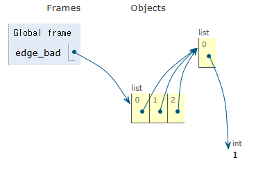

| 코드 | `[[] * (N+1)]` | `[[] for _ in range(N+1)]` |
| --- | --- | --- |
| 리스트 생성 방식 | 하나의 빈 리스트 객체 생성 | N+1개의 새로운 빈 리스트 객체 생성 |
| 내부 동작 | 모든 요소가 동일한 객체를 참조 → 요소 하나를 수정하면 모두 변경 | 모든 요소가 각기 다른 독립적인 객체를 참조 |
| 실행 결과 | `[[]]` | `[[], [], [], [], [], [], [], [], []]` |
| 생성된 리스트의 길이 | 1 | N+1 |

### 길이가 정해진 빈 리스트 생성 시, 권장하는 방법

```python
# 1. 값을 0으로 초기화
my_list = [0] * 3  # [0, 0, 0]

# 2. 값을 None으로 초기화
my_list = [None] * 3  # [None, None, None]

# 3. 리스트 컴프리헨션을 사용한 2차원 배열 생성
my_list = [[] for _ in range(3)]  # [[], [], []]
```


<br><br>

# 수업 필기
## 트리 (Tree)

원소들 간에 **`1:N` 관계**를 가지는 **계층형** 자료구조

- **계층 관계**를 가진다.
- **비선형** 구조 (Non-linear Structure)

### 그래프의 관점에서의 트리

- 연결 그래프 (Connected Graph): 모든 노드들이 하나의 덩어리로 연결되어 있다.
- 무향 그래프 (Undirected Graph): 간선(edge)에 방향이 없다.
- 사이클이 없는 (Acyclic) 그래프: 순환 경로(cycle)가 존재하지 않는다.

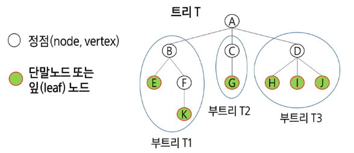

### 용어 정리

| 용어 | 설명 | 예시 |
| --- | --- | --- |
| **노드 (node, vertex)** | 트리를 구성하는 각각의 요소 |  |
| **루트 노드 (root node)** | 최상위 노드. 트리의 시작 노드 | 트리 T의 루트 노드는 `A` |
| 단말/리프 노드 (leaf node) | 자식이 없는, 가장 마지막에 달린 노드 | 리프 노드의 차수는 0 |
| 형제 노드 (sibling node) | 공통된 부모 노드를 공유하는 자식 노드들 | `B, C, D`는 형제 노드 |
| 조상 노드 | 간선을 따라 루트 노드까지 이르는 경로에 있는 모든 노드들 | `K`의 조상 노드는 `F, B, A` |
| 자손 노드 | 서브트리에 있는 하위 레벨의 노드들 | `B`의 자손 노드는 `E, F, K` |
| 서브 트리 (subtree) | 부모 노드와 연결된 간선을 끊었을 때 생성되는 트리 |  |
| **간선 (edge)** | 노드를 연결하는 선. 부모 노드와 자식 노드를 연결한다. |  |
| 노드의 **차수 (degree)** | 노드에 연결된 **자식 노드의 수** | `B`의 차수는 2 |
| 트리의 차수 | 트리에 있는 노드의 차수 중에서 **가장 큰 값** | 트리 T의 차수는 3, 이진 트리의 차수는 2 |
| 노드의 **깊이 (depth)/레벨 (level)** | **루트(시작점)**에서 특정 노드까지의 경로 길이(간선의 수) | 루트 노드의 깊이는 0 |
| 노드의 **높이 (height)** | 가장 가까운 **리프 노드(시작점)**에서 특정 노드까지의 경로 길이(간선의 수) | 리프 노드의 높이는 0 |
| 트리의 높이 | 트리에서 가장 긴 경로의 길이 (= 루트 노드의 높이) | 트리 T의 높이는 3 |

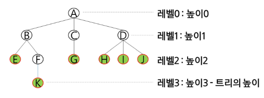

## 이진 트리 (Binary Tree)

모든 노드가 **최대 2개의 자식 노드(왼쪽, 오른쪽)만** 가질 수 있는 트리

- 차수가 2이다.
- 레벨 `i`에서 노드의 최대 개수는 `2 ** i`개
- 높이가 `h`인 이진 트리가 가질 수 있는 노드의 수
    - 최소 노드 개수: `h + 1`
        - 편향 이진 트리
    - 최대 노드 개수: `$2^{(h+1)} - 1$`
        - 포화 이진 트리

### 포화 이진 트리 (Full Binary Tree)

모든 레벨에 노드가 포화상태로 차 있는 이진 트리

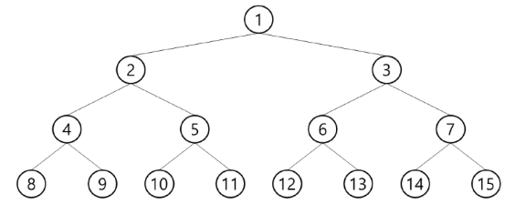

- 높이가 `h`일 때, 노드의 수는 `$2^{(h+1)} - 1$` 개
- 루트의 노드 번호는 `1`번으로 한다.
- 탐색 성능이 `$O(log n)$`으로 매우 효율적이다.

### 완전 이진 트리 (Complete Binary Tree)

높이가 `h`이고 노드 수가 `n`개일 때, 포화 이진 트리의 노드 번호 1번부터 n번까지 빈 자리가 없는 이진 트리

- 노드의 수는 `$2^h$ <= n <= $2^{(h+1)} - 1$`
- 오른쪽 자식 노드만 존재하는 경우는 없다.

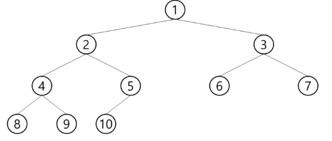

### 편향 이진 트리 (Skewed Binary Tree)

최소 개수의 노드를 가지면서 한쪽 방향의 자식 노드만을 가진 이진 트리

- 높이가 `h`일 때, 노드의 수는 `h`
- 트리의 장점은 사라지고 비효율적이다.

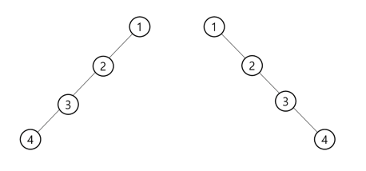

## 이진 트리의 표현 및 생성

### **노드 번호 넘버링**

- 각 노드 번호를 부여한다.
    - 루트의 번호를 `1`로 부여
    - 레벨 `N`에 있는 노드에 대하여 왼쪽부터 오른쪽으로 `$2^N$` 부터 `$2^{N+1}$`까지 차례로 부여

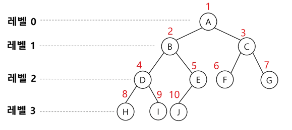

- 노드 번호가 `i`일 때

| 부모 노드 번호 | **`$i  //  2$`** |
| --- | --- |
| 왼쪽 자식 노드 번호 | **`$i * 2$`** |
| 오른쪽 자식 노드 번호 | **`$2 * i + 1$`** |
| 레벨 n의 노드 번호 시작 번호 | `$2^n$` |

### 배열을 이용한 이진 트리의 표현

- **노드 번호를 리스트의 인덱스로** 사용한다.
    - 높이가 `h`인 이진 트리를 위한 리스트의 크기는 `$2^{h+1}$`
    - 리스트의 **0번 인덱스는 사용하지 않는다.**
- 포화 이진 트리, 완전 이진 트리에 적합하다.

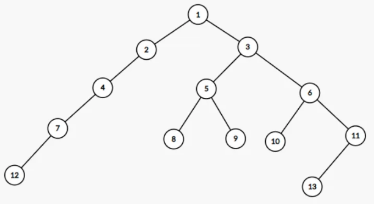

1. **입력 데이터 확인**

```
13  # 노드의 총 개수 V
1 2 1 3 2 4 3 5 3 6 4 7 5 8 5 9 6 10 6 11 7 12 11 13  # 간선 정보 (부모 자식 순)
```

2. **트리를 저장하기 위한 자료구조 준비**
- 왼쪽 자식과 오른쪽 자식 정보를 저장할 두 개의 리스트(`left`, `right`)를 만든다.
    - 인덱스: 부모의 노드 번호
    - 값: 자식의 노드 번호
        - 리프 노드(자식 노드가 없다)의 값은 `0`
    - 노드 번호는 1부터 시작하므로, 인덱스와 노드 번호를 일치시키기 위해 맨 앞에`[0]`을 패딩한다.
        - 인덱스 0은 사용하지 않는다.

```python
V = int(input())  # V: 정점(Vertex)의 총 수
E = V - 1  # E: 간선(Edge)의 수

# 노드 번호와 인덱스를 일치시키기 위해 V+1 크기로 생성
# 노드 번호가 1번부터 시작하니까, 인덱스를 편하게 쓰기 위해 V+1 크기로 만드는 것
left = [0] * (V + 1)  # 각 노드의 왼쪽 자식 정보
right = [0] * (V + 1)  # 각 노드의 오른쪽 자식 정보
```

3. **간선 정보로 트리 구조 완성하기**

```python
edge = list(map(int, input().split()))
# edge = [1, 2, 1, 3, 2, 4, 3, 5, 3, 6, 4, 7, 5, 8, 5, 9, 6, 10, 6, 11, 7, 12, 11, 13]

# 간선 정보를 2개씩 (부모, 자식) 짝지어 순회
# 총 간선의 개수만큼 (부모, 자식) 쌍이 주어진다.
for i in range(E):
    parent, child = edge[i * 2], edge[i * 2 + 1]

    # parent 노드의 왼쪽 자식이 비어있으면(0), 왼쪽 자식으로 등록
    if left[parent] == 0:
        left[parent] = child
    # 왼쪽 자식이 이미 있다면, 오른쪽 자식으로 등록
    else:
        right[parent] = child
        
# left = [0, 2, 4, 5, 7, 8, 10, 12, 0, 0, 0, 13, 0, 0]
# right = [0, 3, 0, 6, 0, 9, 11, 0, 0, 0, 0, 0, 0, 0]
```

**(참고) 자식 노드 번호를 인덱스로, 부모 노드 번호를 값으로 사용하는 방법**

- 부모 배열 하나만 만들면 된다.

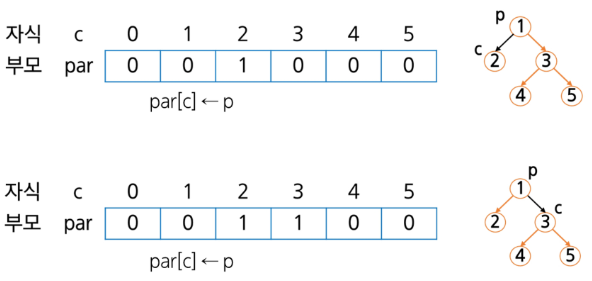

```python
# 5번 노드의 조상 찾기

c = 5
while(par[c] != 0):  # 루트인지 확인
		c = par[c]
		anc.append(c)  # 조상 목록
root = c
```

**배열을 이용한 트리 표현의 문제점**

- 편향 이진 트리의 경우, 사용하지 않는 배열 원소에 대한 메모리 공간 낭비가 발생한다.
- 트리의 중간에 노드를 삽입/삭제할 경우 **배열의 크기를 변경하기 어렵다.**

### 연결 리스트를 이용한 트리의 표현

- 이진 트리의 모든 노드는 최대 2개의 자식 노드를 가지므로 이중 연결 리스트 노드를 사용한다.
    - `left` : 기존의 prev. 왼쪽 자식 노드
    - `right`: 기존의 next. 오른쪽 자식 노드

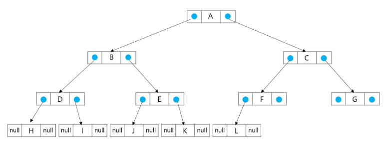

## 이진 트리의 순회 (Traversal)

- 트리의 각 노드를 **중복되지 않게 전부 방문(visit)**하는 것
- 트리는 비선형 구조이기 때문에 선후 연결 관계를 알 수 없다.
- 재귀 함수를 통해 구현 가능

**3가지 순회 방법** - root(나)의 방문 순서에 따라 분류

- 전위순회 (preorder): `root → left → right`
- 중위순회 (inorder): `left → root →  right`
- 후위순회 (postorder): `left → right → root`

### Preorder Traversal (전위 순회): VLR

```python
# 전위 순회(Preorder Traversal)
# 루트 노드를 먼저 방문하고, 왼쪽 자식 노드를 방문하고, 오른쪽 자식 노드를 방문하는 순서
def preorder(node):
    # node가 0이 아닐 때만(유효한 노드일 때만) 실행
    # node가 0이면 자식 노드가 없음(아무것도 안하고 반환)
    if node != 0:
        # 1. 나 먼저 처리 (V)
        print(node, end=' ')
        # 2. 왼쪽 자식으로 이동 (L)
        preorder(left[node])
        # 3. 오른쪽 자식으로 이동 (R)
        preorder(right[node])
```

### Inorder Traversal (중위 순회): LVR

```python
# 중위 순회(Inorder Traversal)
# 왼쪽 자식 노드를 방문하고, 루트 노드를 방문하고, 오른쪽 자식 노드를 방문하는 순서
def inorder(node):
    if node != 0:
        # 1. 왼쪽 자식으로 이동 (L)
        inorder(left[node])
        # 2. 돌아와서 나 처리 (V)
        print(node, end=' ')
        # 3. 그 다음 오른쪽 자식 (R)
        inorder(right[node])
```

### Postorder Traversal (후위 순회): LRV

```python
# 후위 순회(Postorder Traversal)
# 왼쪽 자식 노드를 방문하고, 오른쪽 자식 노드를 방문하고, 루트 노드를 방문하는 순서
def postorder(node):
    if node != 0:
        # 1. 왼쪽 자식으로 이동 (L)
        postorder(left[node])
        # 2. 오른쪽 자식도 먼저 (R)
        postorder(right[node])
        # 3. 나는 맨 마지막에 처리 (V)
        print(node, end=' ')
```

### 예시

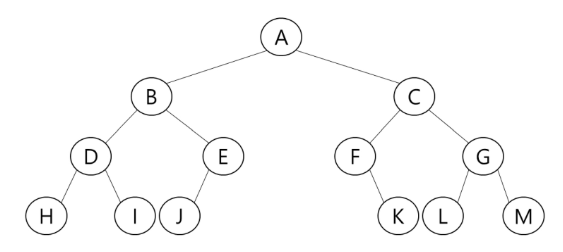

```python
preorder(1)  # A B D H I E J C F K G L M
inorder(1)  # H D I B J E A F K C L G M
postorder(1)  # H I D J E B K F L M G C A
```

## 수식 트리 (Expression Binary Tree)

수식을 (이진) 트리 자료구조로 표현한 것

### 규칙

- 연산자는 루트 노드 또는 가지 노드에 위치한다.
- 피연산자(숫자나 변수)는 모두 리프 노드에 위치한다.

### 수식 표기법과 순회 방법

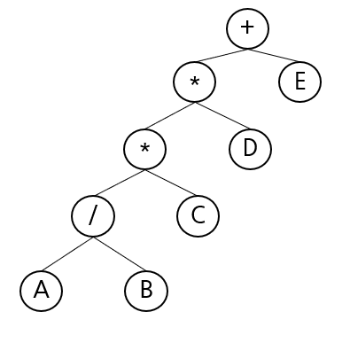

- **중위 순회 (Inorder):** `A / B * C * D + E` → **중위 표기법(Infix)**
- **후위 순회 (Postorder):** `A B / C * D * E +` → **후위 표기법(Postfix)**
- **전위 순회 (Preorder):** `+ * * / A B C D E` → **전위 표기법(Prefix)**

이러한 특징 때문에 컴퓨터는 사람이 사용하는 중위 표기법을 후위 표기법으로 변환한 뒤, 이를 바탕으로 수식 트리를 구성하여 연산을 처리합니다.

수식 트리를 계산할 때는 **후위 순회(L → R → V)** 방식이 가장 자연스럽고 효과적입니다.

- **`L (왼쪽 자식)`**: 왼쪽 자식으로 재귀 호출하여 하위 트리의 계산을 먼저 끝냅니다.
- **`R (오른쪽 자식)`**: 오른쪽 자식으로 재귀 호출하여 하위 트리의 계산도 끝냅니다.
- **`V (나)`**: 왼쪽과 오른쪽의 계산 결과가 모두 준비되면, 비로소 자신의 연산자(`+`,  등)를 이용해 두 결과를 합쳐 반환합니다.