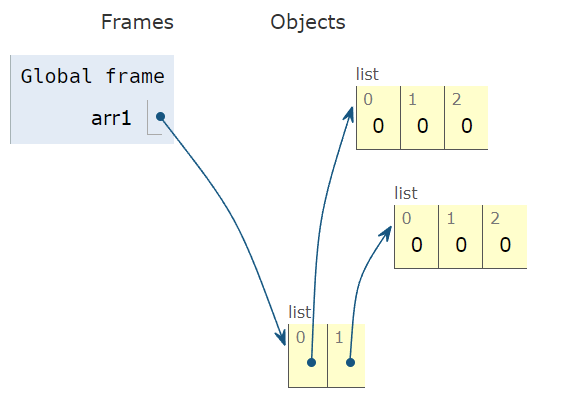
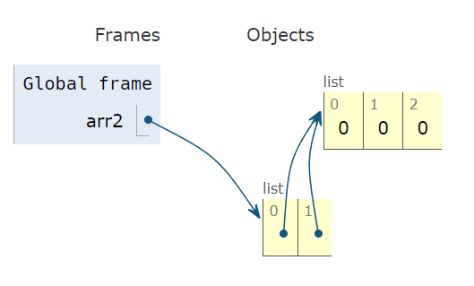

## 배열 (Array)

일정한 자료형의 변수들을 하나의 이름으로 열거하여 사용하는 자료구조

메모리에서도 연속된 공간을 사용한다.

- 다수의 변수로 힘든 작업에서 활용

## 1차원 배열

- 1차원 배열 선언

```python
# 1차원 배열 선언
arr = list()
arr = []
arr = [0] * 10  # 크기가 정해진 배열
arr = [1, 2, 3]
```

`.append()` 배열의 크기가 커지면 시간이 증가한다. 배열의 크기를 정해 선언하는 것을 추천.

- 배열을 처음 만들 때 만든 공간보다 배열의 크기가 커지면, 더 큰 공간에 배열을 복사한 후 추가하기 때문
- 입력 받은 정수를 1차원 배열에 저장하는 방법

```python
# 입력 받은 정수를 1차원 배열에 저장하는 방법
"""
첫 줄에 양수의 개수 N (5 <= N <= 1000)
다음 줄에 빈칸으로 구분된 N개의 양수 Ai (1 <= Ai <= 1000000)

입력 예시
6
2 7 5 3 1 4
"""
N = int(input())
arr = list(map(int, input().split()))
```

## 2차원 배열

1차원 리스트를 묶어놓은 리스트

### 2차원 배열 생성

```python
"""
3
1 2 3
4 5 6
7 8 9
"""
N = int(input())
arr = [ list(map(int, input().split())) for _ in range(N) ]

"""
[ [0, 0, 0, 0],
	[0, 0, 0, 0],
	[0, 0, 0, 0] ]
"""
arr = [ [0] * 4 for _ in range(3) ]
```

**2차원 배열 생성 시 주의사항**

```python
# Good
arr1 = [[0] * M for _ in range(N)]
# 또는
arr1 = []
for _ in range(N):
		arr.append([0] * M)

# Don't
arr2 = [[0] * M] *  N**

arr2[0][0] = 1
# [[1, 0, 0, 0], [1, 0, 0, 0], [1, 0, 0, 0]]
# 첫 번째 행만 바꿨는데 모든 행이 바뀜
```

arr1 예시


arr 2 예시


### N*M 배열 순회

```python
arr = [
    [1, 2, 3],
    [4, 5, 6],
    [7, 8, 9],
]

# 행의 수
N = len(arr)

# 열의 수
M = len(arr[0])
```

1. 행 우선 순회

```python
# 행 우선 순회
for r in range(N):
    for c in range(M):
        print(arr[r][c], end=' ')  # 1 2 3 4 5 6 7 8 9 
```

2. 열 우선 순회

```python
# 열 우선 순회
for c in range(M):
    for r in range(N):
        print(arr[r][c], end=' ')  # 1 4 7 2 5 8 3 6 9 
```

3. 지그재그 순회

```python
# 지그재그 순회
for i in range(N):
		for j in range(M):
				# 짝수행의 경우 array[i][j]
				# 홀수행의 경우 array[i][(M - 1) - j]
				array[i][j + (M - 1 - 2 * j) * (i % 2)]
		
for i in range(N):
		if i % 2 == 0:  # 짝수행은 순방향 순회
				for j in range(M):
						array[i][j]
		if i % 2 == 1:  # 홀수행은 역방향 순회
				for j in range(M-1, -1, -1):
						array[i][j]
```

### 변수명

행과 열: `i, j`, `r, c`, `p, q`, `row, col` 등

(`x, y`는 좌표계에서 주로 사용하는데, 프로그래밍에서의 배열은 방향이 다르기 때문에 혼동 주의!)