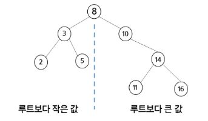
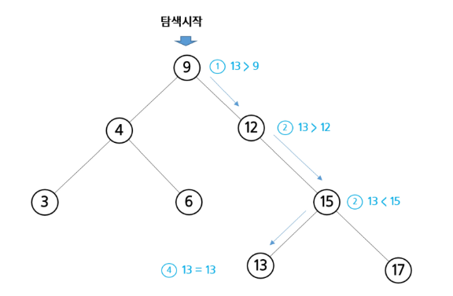
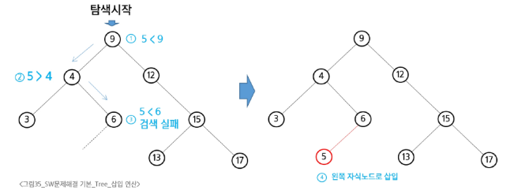

## 이진 탐색 트리 (BST, Binary Search Tree)

data들을 빠르게 검색할 수 있도록 체계적으로 저장하고, **최대 O(logN)의 빠른 속도**로 값을 검색할 수 있는 자료구조



- 이진 트리 형태로 값을 저장
- 모든 원소는 서로 다른 유일한 키를 갖는다.
- key (왼쪽 서브트리) < key (루트 노드) < key (오른쪽 서브트리)
- 중위 순회하면 오름차순으로 정렬된 값을 얻을 수 있다.

### **BST의 규칙**

<aside>
📌

BST가 되기 위해서는 모든 노드가 아래 규칙을 반드시 만족해야 한다.

</aside>

1. **왼쪽 자식 < 부모**
    - 특정 노드의 **왼쪽 서브트리**에 있는 모든 노드의 값은 항상 **그 노드의 값보다 작아야 한다.**
2. **오른쪽 자식 > 부모**
    - 특정 노드의 **오른쪽 서브트리**에 있는 모든 노드의 값은 항상 **그 노드의 값보다 커야 한다.**
3. **모든 서브트리도 BST**
    - 모든 서브트리 역시 이 두 가지 규칙을 재귀적으로 만족해야 한다.

> **주요 특징:** 이 규칙 덕분에 BST를 **중위 순회(Inorder)**하면, 저장된 값들이 **오름차순으로 정렬**된다.
>

### List vs. BST

|  | 리스트 | BST |
| --- | --- | --- |
| 삽입 | O(N), 맨 끝 삽입은 O(1) | 평균 O(logN) |
| 삭제 | O(N), 맨 끝 삭제는 O(1) | 평균 O(logN) |
| 탐색 | O(N) | 평균 O(logN) |

### 탐색 연산 (Search)



루트와 key값 비교한다. 

1. `key > root`: 오른쪽 서브트리로 이동
2. `key < root`: 왼쪽 서브트리로 이동
3. `key = root`: 탐색 종료
```python
def search_bst(node, target):
    # 노드가 없거나(탐색 실패) 값을 찾으면 종료
    if node is None or node.value == target:
        return node

    # 목표 값이 현재 노드보다 작으면 왼쪽으로 이동
    if target < node.value:
        return search_bst(node.left, target)
    # 목표 값이 현재 노드보다 크면 오른쪽으로 이동
    else:
        return search_bst(node.right, target)
```

### 삽입 연산 (Insertion)



1. 탐색 - 삽입할 원소와 같은 원소가 트리에 있는지 확인한다.
2. 탐색 실패가 결정되는 위치가 삽입 위치가 된다.
```python
def insert_bst(node, value):
    # 삽입할 위치를 찾았다면, 새 노드를 생성하여 반환
    if node is None:
        return TreeNode(value)

    # 삽입할 값이 현재 노드보다 작으면 왼쪽에 삽입
    if value < node.value:
        node.left = insert_bst(node.left, value)
    # 삽입할 값이 현재 노드보다 크면 오른쪽에 삽입
    elif value > node.value:
        node.right = insert_bst(node.right, value)

    return node
```

### 삭제 연산 (Deletion) 

1. **리프 노드:** 그냥 삭제
2. **자식이 하나인 노드:** 삭제하려는 노드 자리에 그 자식 노드를 그대로 올린다.
3. **자식이 둘인 노드:**
    - **삭제할 노드의 오른쪽 서브트리에서 가장 작은 값(중위 후속자)**을 찾는다.
    - 찾은 값을 삭제할 노드의 위치에 **복사**
    - 원래 중위 후속자가 있던 노드를 **삭제** (이 노드는 자식이 없거나 하나뿐이므로 1, 2번 규칙에 따라 쉽게 삭제 가능)

