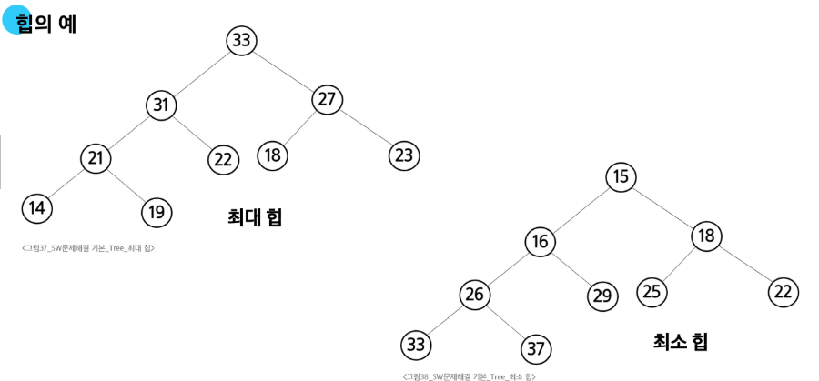

## 힙 (heap)

**완전 이진 트리**에 있는 노드 중에서 **최대값 혹은 최소값**을 찾기 위해서 만든 자료구조

- **완전 이진 트리** 형태를 유지
- 삽입·삭제 시 **부모-자식 교환**(Swap)을 통해 **힙 성질**을 유지

### 힙의 종류



1. **최대 힙 (max heap)**
- 키 값이 가장 큰 노드를 찾기 위한 **완전 이진 트리**
- 부모 노드의 키 값 > 자식 노드의 키 값
- 키 값이 가장 큰 노드가 루트 노드

2. **최소 힙 (min heap)**
- 키 값이 가장 작은 노드를 찾기 위한 **완전 이진 트리**
- 부모 노드의 키 값 < 자식 노드의 키 값
- 키 값이 가장 작은 노드가 루트 노드

### 삽입

1. **새 노드를** 힙의 **마지막 위치**에 삽입 (완전 이진 트리 구조 유지)
2. **부모 노드**와 비교해 힙 성질
(부모 > 자식 for Max-Heap / 부모 < 자식 for Min-Heap)이 **깨지면** **위로 올림(Swim)**
3. 루트 노드나 더 이상 교환이 필요 없을 때까지 반복
    
    ```python
    def heap_push(heap, value):
        # 1. 새로운 값은 힙 리스트의 끝(마지막 인덱스)에 추가
        heap.append(value)
        idx = len(heap) - 1
    
        # 2. 부모와 비교해 힙 성질 유지
        while idx > 1:  # 1-based index 가정, idx=1은 루트
            parent = idx // 2
            if heap[parent] < heap[idx]:
                # 부모보다 자식이 큰 경우(최대 힙)
                heap[parent], heap[idx] = heap[idx], heap[parent]
                idx = parent
            else:
                break
    
    ```
    

### **삭제**

- 일반적으로 **루트 노드**(최대 힙: 최댓값 / 최소 힙: 최솟값)만 삭제 가능
- 과정:
    1. **루트 노드**를 삭제 → 반환할 값
    2. 힙의 **마지막 노드**를 **루트로 이동**
    3. **자식 노드들과** 비교해 힙 성질(부모가 더 큼/작음)이 깨지면, **아래로 내림(Sink)**
    4. 더 이상 교환할 필요가 없을 때까지 반복
    
    ```python
    def heap_pop(heap):
        # 1. 루트 노드(최대 힙이라면 최대값) 반환할 변수에 저장
        top = heap[1]
    
        # 2. 힙의 마지막 노드를 루트 자리에 가져옴
        heap[1] = heap[-1]
        heap.pop()  # 마지막 원소 제거
        idx = 1
        size = len(heap) - 1
    
        # 3. 힙 성질 복원: 자식과 비교, 교환하며 내려감
        while True:
            left = idx * 2
            right = idx * 2 + 1
            largest = idx
    
            if left <= size and heap[largest] < heap[left]:
                largest = left
            if right <= size and heap[largest] < heap[right]:
                largest = right
    
            if largest != idx:
                heap[idx], heap[largest] = heap[largest], heap[idx]
                idx = largest
            else:
                break
    
        return top
    
    ```
    

### 힙을 이용한 우선순위 큐

키 값이 가장 큰 노드나 가장 작은 노드를 찾기에 적합한 자료구조


### `heapq` 모듈

`import heapq`
- 파이썬에서 힙은 리스트(list)로 구현

| 함수 | 설명 | 시간 복잡도 |
| --- | --- | --- |
| **`.heappush(heap, item)`** | 힙에 `item`을 삽입 | $O(log n)$ |
| **`.heappop(heap)`** | 힙에서 **가장 작은 원소**를 삭제 후 반환. 힙이 비어있을 경우 `IndexError` 발생 | $O(log n)$ |
| **`.heappushpop(heap, item)`** | 한 번에 `item`을 삽입 후, **가장 작은 원소**를 꺼냄 | $O(log n)$ |
| **`.heapreplace(heap, item)`** | 힙의 가장 작은 원소를 **바로 제거** 후 `item`을 삽입. `heappushpop`와 비교해, 꼭 `item`이 들어간 뒤 제거되는 것은 아니므로 주의 | $O(log n)$ |
| **`.heapify(x)`** | 기존 리스트 `x`를 **힙 구조**로 변환 | $O(n)$ |