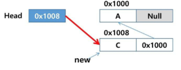

# 수업 필기

## 연결 리스트

### 리스트의 문제점

- 자료의 삽입/삭제 연산 과정에서 연속적인 메모리 배열을 위해 원소들을 이동시키는 작업이 필요하다.
    - 시간 복잡도 `$O(N)$`
- 원소의 개수가 많고, 삽입/삭제 연산이 빈번할수록 작업에 소요되는 시간이 크게 증가한다.

### 연결 리스트의 특징

- 개별적으로 위치하고 있는 각 원소를 연결하여 하나의 전체적인 자료구조를 이룬다.
- 자료의 논리적인 순서와 메모리 상의 물리적인 순서가 일치하지 않는다.
- 링크를 통해 원소에 접근한다.
    - 물리적인 순서를 맞추기 위한 작업이 필요 없다.
    - 자료구조의 크기를 동적으로 조정할 수 있어, **메모리의 효율적인 사용**
    - **인덱스를 이용한 탐색이 불가능하다**! → 리스트 형변환 후 인덱스 연산 가능

## 단순 연결 리스트 (Simply Linked List)

노드가 하나의 링크 필드에 의해 다음 노드와 연결되는 구조


- **`노드(Node)`**
    - 데이터 필드: 원소의 값을 저장한다.
    - 링크 필드: **다음 노드의 참조 값(주소)**을 저장한다.
        - 링크 필드가 Null(`None`)인 노드가 연결 리스트의 마지막 노드
- **`헤드(head)`**: 연결 리스트의 첫 노드에 대한 참조 값(주소)을 갖고 있다.
    - `head가 null`: 공백 상태

### 삽입

**첫 번째 노드로 삽입하는 경우**



1. 새로운 노드 `new` 생성
2. `new`의 **데이터 필드**에 `C` 저장
3. `Head`에 저장된 참조값을 `new`의 **링크 필드값**에 저장
4. `Head`에 **`new`의 참조값**을 저장

**마지막 노드로 삽입하는 경우**


1. 새로운 노드 `new` 생성
2. `new`의 **데이터 필드**에 `D`, **링크 필드**에는 `Null(None)` 저장
3. 리스트의 마지막 노드의 링크 필드에 **`new`의 참조값**을 저장

**가운데 노드로 삽입하는 경우**


1. 새로운 노드 `new` 생성
2. `new`의 **데이터 필드**에 `B` 저장
3. 삽입될 위치의 바로 앞에 위치한 노드의 링크 필드를 `new`의 **링크 필드**에 복사
4. **`new`의 참조값**을 바로 앞 노드의 링크 필드에 저장

### 삭제

**가운데 노드를 삭제하는 경우**


1. 삭제할 노드의 선행노드 탐색
2. 삭제할 노드의 링크 필드를 선행노드의 링크 필드에 복사
3. 삭제할 노드의 링크 필드에 `Null(None)` 저장

**첫 번째 노드를 삭제하는 경우**


1. 삭제할 노드의 선행노드 탐색: 선행노드 없음
2. 삭제할 노드의 링크 필드를 리스트의 `Head`에 복사
3. 삭제할 노드의 링크 필드에  `Null(None)` 저장

### 구현

```python
class Node:
    def __init__(self, data):
        self.data = data
        self.next = None

class SinglyLinkedList:
    def __init__(self):
        self.head = None

    def insert(self, data, position):
        """새로운 노드를 삽입한다."""
        new_node = Node(data)
        # 첫 번째 노드로 삽입
        if position == 0:
            new_node.next = self.head
            self.head = new_node
        else:
            current = self.head
            # current는 새로운 노드의 선행 노드
            for _ in range(position - 1):
                if current is None:
                    raise IndexError("범위를 벗어난 삽입입니다.")
                current = current.next
            new_node.next = current.next
            current.next = new_node

    def is_empty(self):
        """연결 리스트가 비어있는지 확인한다."""
        # head가 None이면 비어있다.
        return self.head is None
    
    def append(self, data):
        """리스트의 끝(마지막)에 노드를 추가한다."""
        new_node = Node(data)
        if self.is_empty():
            self.head = new_node
        else:
            current = self.head
            # current가 None이 아닐 때까지 반복한다.
            # (마지막 노드의 next는 None이기 때문)
            while current.next:
                current = current.next
            current.next = new_node

    def delete(self, position):
        """특정 위치(position)의 노드를 삭제하고 값을 반환한다."""
        if self.is_empty():
            raise IndexError("싱글 링크드 리스트가 비었습니다.")
        # 첫 번째 노드를 삭제
        if position == 0:
            deleted_data = self.head.data
            self.head = self.head.next
        else:
            current = self.head
            for _ in range(position - 1):
                if current is None or current.next is None:
                    raise IndexError("범위를 벗어났습니다.")
                current = current.next
            deleted_node = current.next
            deleted_data = deleted_node.data
            current.next = deleted_node.next
        return deleted_data
    
    def search(self, data):
        """특정 값(data)이 몇 번째 노드에 위치하고 있는지 반환한다."""
        current = self.head
        position = 0
        while current:
            # 처음으로 값을 찾은 위치를 반환
            if current.data == data:
                return position
            current = current.next
            position += 1
        # 찾지 못했다면 -1 반환
        return -1
```

### 단순 연결 리스트의 문제점

- 특정 요소에 접근하려면 순차적으로 탐색해야 한다. (역방향 탐색 불가)
    - 마지막 요소로 접근하거나 추가하려면 리스트 전체를 순회해야 한다.
    - 시간 복잡도: `$O(N)$`

## 이중 연결 리스트 (Double Linked List)

양쪽 방향으로 순회할 수 있도록 노드를 연결한 리스트


- `노드(Node)`
    - 두 개의 링크 필드 (`prev`, `next`)와 한 개의 데이터 필드
- `head`, `tail`

### 삽입


1. 새로운 노드 `new` 를 생성하고, `new`의 데이터 필드에 `D`를 저장
2. 삽입될 위치의 바로 앞에 위치한 노드 `cur`의 `next`를 `new`의 `next`에 저장 
(`cur`의 다음 노드를 `new`의 다음 노드로 연결)
3. `cur`의 참조값을 `new`의 `prev`에 저장 
(`cur`을 `new`의 이전 노드로 연결) 
4. `new`의 참조값을 `new`의 이전 노드의 `next`에 저장
(`new`의 이전 노드의 다음 노드로 `new` 연결)
5. `new`의 참조값을 `new`의 다음 노드의 `prev`에 저장
(`new`의 다음 노드의 이전 노드로 `new` 연결)

### 삭제


1. 삭제할 노드 `cur`의 `next`를 `cur`의 이전 노드의`next`에 저장
(`cur`의 다음 노드를 `cur`의 이전 노드의 다음 노드로 연결)
2. `cur`의 `prev`를 `cur`의 다음 노드의 `prev`에 저장
(`cur`의 이전 노드를 `cur`의 다음 노드의 이전 노드로 연결)
3. `cur`의 `prev, next`에 `Null(None)`을 저장