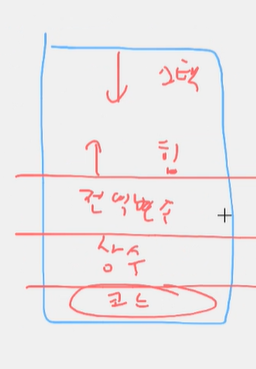
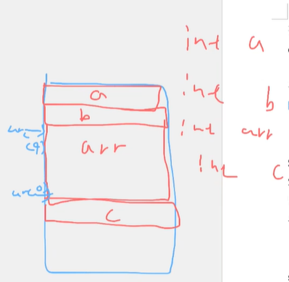
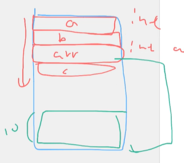
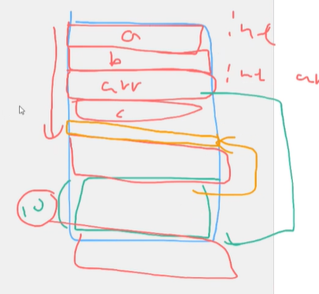

## 배열과 메모리

### vector(C) == ArrayList(J) == list(p)

- Sequence Containers: 데이터를 순차적으로 저장하는 자료구조
- 연속된 메모리 영역을 차지한다. == 인덱싱을 포기하지 않는다. == 랜덤 access가 가능하다.

### 메모리 구조

메모리의 구조는 코드-상수-전역변수-힙-스택

- 코드,상수,전역변수의 메모리 공간은 고정되어 있다.
- 힙, 스택 메모리 공간은 정해져있지 않다.
    - 힙은 아래에서부터 쌓이고
    - 스택은 위에서부터 쌓인다.

메모리 기본 구조

### 정적할당과 동적할당

- 정적할당 → 스택 메모리에 모든 배열의 정보를 저장한다.
    - 배열의 길이가 바뀔 때, 뒤쪽에 쌓여있는 메모리가 모두 밀리는 문제
- 동적할당 → 스택 메모리에는 변수명과 힙메모리 주소를 가지고있고, 힙 메모리에 실제 배열의 정보를 별도로 저장한다.
    - 배열의 길이가 바뀌면, 힙 메모리에 저장되어 있던 배열을 삭제하고 사이즈 바뀐 배열을 다시 만든다.
- 연결 리스트 → 힙메모리에 저장한 배열 위로 다른 메모리가 있다면? 새로 메모리를 쌓고 주소를 연결한다.
    - 대신, 인덱스로 접근 불가능 (연속된 메모리 영역을 차지하지 않기 때문)

스택메모리의 예시 (정적할당)

메모리 예시 (동적할당)

메모리 예시 (연결리스트)

### add의 시간복잡도

> push_back, add, append의 시간복잡도는 O(1)? O(N)?
> 
- ArrayList를 선언하면 예비로 일정 공간의 메모리를 할당해놓는다.
- 여기에 add를 하면, 만들어 둔 메모리 공간에 저장한다. ⇒ O(1)
- 정해진 공간을 다 쓰면? **메모리를 2배로 늘려서 새로 만들고, 내용을 복사**한다. ⇒ O(N)
- 그래서 O(1)과 O(N)을 반복하는 모습 → 결국, worstcase는 O(N)

ex. 처음에 주어지는 공간이 5라고 가정할 때, 81번째 add까지의 연산량을 모두 더하면?

81+(5+10+20+40+80) ~= 3 * 80 = O(N)

- add 1번의 시간복잡도: O(N)
- add N번의 시간복잡도: O(N)
- **add 1번이 마치 O(1)처럼 작동 ⇒ amortized O(1)**

---

### 언어별 자료구조

| C++ | JAVA | Python |
| --- | --- | --- |
| std::vector | ArrayList | list |
| std::deque | Deque | deque |
| std::list | LinkedList |  |
| std::set, set::map | TreeSet, TreeMap | (지원하지 않음) |
| std::unordered_set, std::unordered_map | HashSet, HashMap | set, dict |
| std::stack, std::queue | Stack, Queue | list, deque |
| std::priority_queue | PriorityQueue | heapq |

자료구조는 보통 **배열**에서 파생된 것들이라서, 어떤 게 추가되고 삭제되었는지 비교해보면 좋다.

자료구조는 결국 ‘데이터를 어떻게 관리할 것인가’

정렬된 배열 → TreeSet (중간 데이터의 추가/삭제), PriorityQueue (가장 큰 값을 찾고 싶어. 기능은 적지만 빠름)