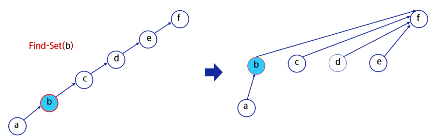
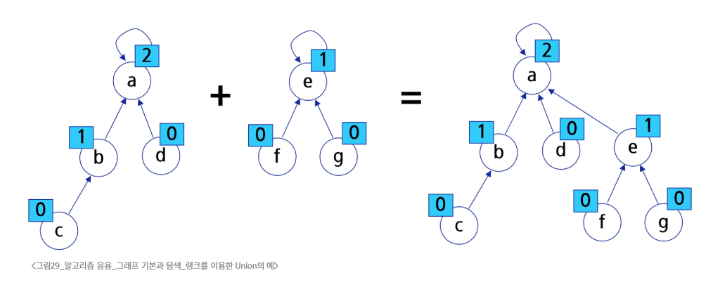

# 스스로 학습

### 그래프 vs Union-Find
| 구분 |	그래프 (Graph) | Union-Find (서로소 집합) |
| -- | --| -- |
|목적	|정점과 간선의 관계, 네트워크 자체를 표현|	원소들의 집합 관계, 연결성을 관리|
|핵심|	정점, 간선, 인접 행렬/리스트|	`find`, `union` 연산|
|관계|	문제의 대상|	문제를 해결하기 위한 효율적인 도구|

Union-Find는 그래프는 아니지만, 그래프 문제를 해결하기 위해 사용하는 **보조 자료구조**
가장 대표적인 예는 **최소 신장 트리(MST)**를 만드는 크루스칼 알고리즘이다.

### 크루스칼 알고리즘 (Kruskal's Algorithm)
1. 모든 간선을 가중치 순으로 정렬합니다.

2. 가장 가중치가 낮은 간선부터 차례대로 선택합니다.

3. 이때, 선택한 간선의 두 정점이 이미 같은 집합에 속해 있는지 `find` 연산으로 확인합니다.

  - 같은 집합이라면? → 이 간선을 추가하면 순환(Cycle)이 생기므로 버립니다.

  - 다른 집합이라면? → 순환이 생기지 않으므로 간선을 추가하고, 두 집합을 `union` 연산으로 합칩니다.

4. 이 과정을 반복합니다.

여기서 3번 과정, 즉 "두 정점이 이미 연결되어 있는가?"를 판별하는 역할을 Union-Find가 압도적으로 빠르게 수행해 줍니다.

<br><br>

# 수업 필기
## Union-Find

서로소 집합들을 효율적으로 관리하기 위한 자료구조 또는 알고리즘

- **Find** (어떤 원소 x의 루트를 찾는)
- **Union** (두 그룹을 합치는)

### 서로소 집합 (Disjoint-sets)

서로 공통 원소가 없는, 즉 교집합이 없는 집합들

- 상호 배타 집합
- **대표자(representative)**: 각 집합을 대표하는 하나의 원소

### 상호 배타 집합 표현

1. **연결리스트**
- 같은 집합의 원소들은 하나의 연결리스트로 관리한다.
- 연결리스트의 맨 앞의 원소가 집합의 대표 원소
- 각 원소는 집합의 대표 원소를 가리키는 링크를 가진다.

1. **트리**
- 하나의 집합을 하나의 트리로 표현한다.
- 자식 노드가 부모 노드를 가리키며 루트 노드가 대표자가 된다.

### 구현 예시

**서로소 집합 연산**

| 연산 | 설명 |
| --- | --- |
| `Make-Set(x)` | x를 원소로 가진 집합을 만든다. |
| `Find-Set(x)` | x가 속한 집합의 대표 원소를 반환한다. |
| `Union(x, y)`  | y가 속한 집합과 x가 속한 집합의 합집합을 만든다. x가 합집합의 대표원소가 된다. |

```python
# 1. 각 집합을 만들어주는 함수
def make_set(n):
    """1 ~ n 까지의 원소가 '각자 자기 자신이 대표자'라고 설정"""
    parents = [i for i in range(n + 1)]
    return parents

# 2. 집합의 대표자를 찾는 함수
def find_set(x):
    # 자신 == 부모 -> 해당 집합의 대표자
    if x == parents[x]:
        return x
    
    # x의 부모노드를 기준으로 다시 부모를 검색
    return find_set(parents[x])

# 3. 두 집합을 합치는 함수
def union(x, y):
    # 1. x, y의 대표자를 검색
    rep_x = find_set(x)
    rep_y = find_set(y)

    # 만약 이미 같은 집합이라면 합칠 필요가 없다.
    if rep_x == rep_y:
        return
    
    # 더 작은 쪽으로 연결하는 문제라면, 조건을 추가해준다.    
    if rep_x < rep_y:
        parents[rep_y] = rep_x
    else:
        parents[rep_x] = rep_y

# -------
N = 6
parents = make_set(N)
union(2, 4)
union(4, 6)

if find_set(2) == find_set(6):
    print("2와 6은 같은 집합")
else:
    print("다른 집합")

# 2와 6은 같은 집합
```

### 최적화 기법

1. **경로 압축 (Path Compression)**

편향 트리가 되는 경우 `find_set()`에 시간이 오래 걸린다.

→ `find_set()`에서 찾아진 대표 원소로 각 원소의 대표 원소를 바꾸면 경로가 단축된다.

```python
def find_set(parent, x):
    # 만약 x의 부모가 자기 자신이 아니라면,
    if parent[x] != x:
        # 재귀적으로 루트를 찾고, 그 루트를 나의 부모로 직접 설정
        parent[x] = find_set(parent, parent[x])
    return parent[x]
```



2. **랭크 기반 통합 (Union by Rank)**

`union` 연산을 할 때, 트리의 높이가 더 낮은(rank가 낮은) 그룹을 더 높은 그룹 밑에 붙인다.

→ 트리의 높이가 불필요하게 깊어지는 것을 방지한다.

```python
def union(parent, rank, x, y):
    """
    두 원소 x, y가 속한 집합을 합치는 함수 (랭크 기반 최적화 적용).
    """
    # 각 원소의 대표(루트)를 찾음
    root_x = find_set(parent, x)
    root_y = find_set(parent, y)

    # 두 원소가 이미 같은 집합에 속해 있다면 합칠 필요 없음
    if root_x == root_y:
        return

    # 랭크(트리 높이)가 더 낮은 쪽을 더 높은 쪽 밑에 붙임
    if rank[root_x] < rank[root_y]:
        parent[root_x] = root_y
    elif rank[root_x] > rank[root_y]:
        parent[root_y] = root_x
    else:
        # 랭크가 같다면, 한쪽을 다른 쪽에 붙이고 랭크를 1 증가시킴
        parent[root_y] = root_x
        rank[root_x] += 1
```



### Union-Find의 활용

- union-find를 혼자 쓰는 경우는 거의 없다. 다른 알고리즘과 함께 활용된다.
- 그래프의 **사이클**을 탐지할 때 사용된다.
- **최소 신장 트리 (MST)**: 크루스칼(Kruskal) 알고리즘에서 간선을 추가할 때 사이클이 생기는지 확인하는 데 사용된다.
- **네트워크 연결성 판별**: 네트워크 상의 두 컴퓨터가 서로 연결되어 있는지 (같은 네트워크 그룹인지) 판별하는 데 사용된다.