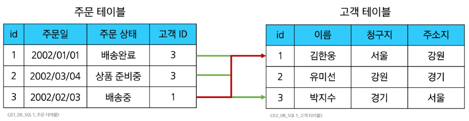

# Database 기초

## 데이터와 데이터베이스

### 데이터 (Data)

- 저장이나 처리를 위해 변환된 정보
- 분석, 계산, 저장을 위해 정보를 구체적인 형태로 정리한 것
- 데이터 저장 방식
    - 파일(File)
    - 스프레드 시트 (Spreadsheet)

### 데이터베이스 (Database)

- 체계적으로 정리된 데이터의 모음
- 데이터베이스의 역할: CRUD

## 관계형 데이터베이스 (RDBMS)

### 관계형 데이터베이스 (Relational Database)

- 데이터 간에 관계가 있는 데이터 항목들의 모음
- 테이블, 행, 열의 정보를 구조화하는 방식
- 서로 관련된 데이터 포인터를 저장하고 이에 대한 엑세스를 제공

- 데이터베이스의 역할: **관계** - 여러 테이블 간의 논리적 연결
    - 데이터를 각각의 테이블에 나눠 저장하되, 공통된 키값을 통해 서로 연결하여 필요할 때 함께 조회하거나 조작할 수 있도록 한다.
    - 두 테이블을 사용하여 데이터를 다양한 형식으로 조회할 수 있다.

### 관계형 데이터베이스 관련 키워드

- Table (Relation): 데이터를 기록하는 곳
- Field (Column, Attribute): 각 필드에는 고유한 데이터 형식(타입)이 지정된다.
- Record (Row, Tuple): 각 레코드에는 구체적인 데이터 값이 저장된다.
- Database (Schema): 테이블의 집합
- **기본키 (Primary Key, PK**): 각 레코드의 고유한 값
    - 관계형 데이터베이스에서 레코드의 식별자로 활용한다.
- **외래키 (Foreign Key, FK)**: 테이블의 필드 중 다른 테이블의 레코드를 식별할 수 있는 키
    - 다른 테이블의 기본 키를 참조한다.
    - 각 레코드에서 서로 다른 테이블 간의 관계를 만드는 데 사용한다.

### DBMS (Database Management System)

- 데이터베이스를 관리하는 소프트웨어 프로그램
- 데이터 저장 및 관리를 용이하게 하는 시스템
- 데이터베이스와 사용자 간의 인터페이스 역할
- 사용자가 데이터 구성, 업데이트, 모니터링, 백업, 복구 등을 할 수 있도록 돕는다.

### RDBMS (Relational Database Management System)

- 관계형 데이터베이스 관리 소프트웨어 프로그램
    - SQLite, MySQL, PostgreSQL, Oracle Database
- SQLite: 경량의 오픈 소스 데이터베이스 관리 시스템
    - 설치 없이 가볍게 실행 가능해 모바일 앱이나 소규모 프로그램에 적합
