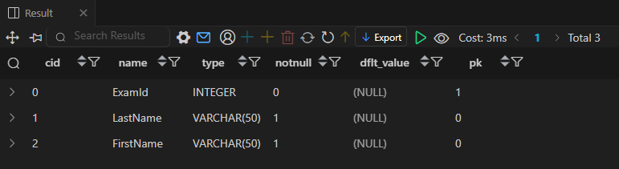
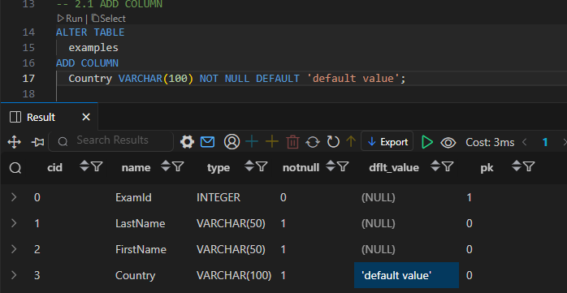

# SQL - CREATE, ALTER, DROP

## DDL (Data Definition Language)

### CREATE TABLE

```sql
CREATE TABLE table_name (
  column_1 data_type constraints,
  column_2 data_type constraints,
  ...
);
```

- 각 필드에 적용할 **데이터 타입** 작성
    - SQLite 데이터 타입: `NULL`, `INTEGER`, `TEXT`(CHAR, VARCHAR), `BLOB`(이미지, 동영상, 문서 등), `REAL`(부동 소수점)
- 테이블 및 필드에 대한 **제약조건 (constraints)** 작성
    - 데이터의 무결성을 유지하고 데이터베이스의 일관성 보장
    - `NOT NULL` (NULL 값을 허용하지 않음), `PRIMARY KEY` *(INTEGER 타입에만 적용!)*, `FOREIGN KEY` 등
    - 반드시 NOT NULL을 사용해야 하는 것은 아니다!
    - 하지만 ‘값이 없음’을 표현할 때 NULL보다는 ‘0’이나 ‘빈 문자열’ 등을 사용하는 것을 권장

- `AUTOINCREMENT`: 필드의 자동 증가를 나타내는 키워드
    - 주로 PRIMARY KEY 필드에 적용
    - 삭제된 값은 무시되며 재사용할 수 없게 한다.

**`PRAGMA table_info('examples');`**

- 테이블 schema(구조) 확인


- BOOLEAN 타입을 지원하지 않기 때문에, TRUE/FALSE를 나타내는 필드는 1/0의 정수로 대신한다.

### SQLite의 타입 선호도 (Type Affinity)

- 컬럼에 데이터 타입이 명시적으로 지정되지 않았거나 지원하지 않을 때, SQLite가 자동으로 데이터 타입을 추론하는 것
- 컬럼에 저장되는 값의 특성을 기반으로 데이터 타입을 유추한다.
- INTEGER Type Affinity를 가진 열에 문자열 데이터를 저장해도 자동으로 숫자로 변환하여 처리한다.

### ALTER TABLE

| 명령어 | 역할 |
| --- | --- |
| ALTER TABLE ADD COLUMN | 필드 추가 |
| ALTER TABLE RENAME COLUMN | 필드 이름 변경 |
| ALTER TABLE DROP COLUMN | 필드 삭제 |
| ALTER TABLE RENAME TO | 테이블 이름 변경 |

#### ALTER TABLE ADD COLUMN

```sql
-- 1. ALTER TABLE ADD COLUMN
ALTER TABLE
  table_name
ADD COLUMN
  column_definition;
```

- ADD COLUMN 키워드 뒤에 추가하고자 하는 새 필드 이름과 데이터 타입 및 제약 조건 작성
- 추가하고자 하는 필드에 NOT NULL 제약조건이 있을 경우, NULL이 아닌 기본 값(DEFAULT) 설정이 필요하다!
- 테이블 생성시 정의한 필드는 기본 값이 없어도 NOT NULL 제약조건으로 생성된다.
- 내부적으로 default value은 NULL로 설정된다.
- SQLite는 단일문을 사용하여 한번에 여러 필드를 추가할 수 없다.



#### ALTER TABLE RENAME COLUMN

```sql
ALTER TABLE
  table_name
RENAME COLUMN
  current_name TO new_name;
```

- RENAME COLUMN 키워드 뒤에 이름을 바꾸려는 필드의 이름을 지정하고 TO 키워드 뒤에 새 이름을 지정

#### ALTER TABLE DROP COLUMN

```sql
ALTER TABLE
  table_name
DROP COLUMN
  column_name;
```

- DROP COLUMN 키워드 뒤에 삭제할 필드 이름 지정

#### ALTER TABLE RENAME TO

```sql
ALTER TABLE
  table_name
RENAME TO
  new_table_name;
```

- RENAME TO 키워드 뒤에 새로운 테이블 이름 지정
- SQLite는 컬럼 수정 불가
    - 대신 테이블의 이름을 바꾸고, 새 테이블을 만들고 데이터를 새 테이블에 복사하는 방식을 사용한다.

### DROP TABLE

```sql
DROP TABLE table_name;
```

- 삭제할 테이블 이름 지정
- 테이블 전체 (구조 + 데이터)를 영구적으로 삭제한다. 복구 불가능!