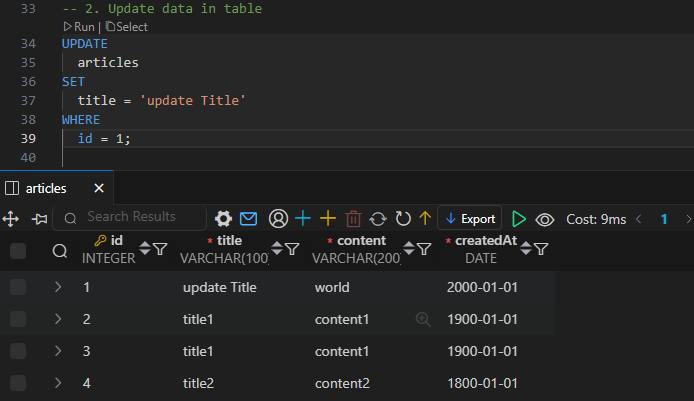

# SQL - INSERT, UPDATE, DELETE

## DML (Data Manipulation Language)

### INSERT

```sql
INSERT INTO table_name (c1, c2, ...)
VALUES (v1, v2, ...);
```

- INSERT INTO 절 다음에 테이블 이름과 괄호 안에 필드 목록 작성
- VALUES 키워드 다음 괄호 안에 해당 필드에 삽입할 값 목록 작성
- `DATE()` 현재 날짜를 자동으로 입력해주는 함수

### DATE 타입에서 연도 추출

- `strftime('%Y', ...)`

```sql
-- "InvoiceDate"를 연도별로 그룹화하고, 각 연도별 총판매액을 계산하여 조회
SELECT
  strftime('%Y', InvoiceDate) AS Year,
  SUM(Total) AS TotalSales
FROM
  invoices
GROUP BY Year;
```

### UPDATE

```sql
UPDATE table_name
SET column_name = expression,
[WHERE
  condition];
```

- SET 절 다음에 수정할 필드와 새 값을 지정
- WHERE 절에서 수정할 레코드를 지정하는 조건 작성
- WHERE 절을 작성하지 않으면 모든 레코드를 수정



### DELETE

```sql
DELETE FROM table_name
[WHERE
  condition];
```

- DELETE FROM 절 다음에 테이블 이름 작성
- WHERE 절에서 삭제할 레코드를 지정하는 조건 작성
- WHERE 절을 작성하지 않으면 모든 레코드를 삭제
- 테이블 내의 특정 행 (Row)을 삭제한다.
