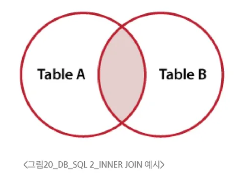
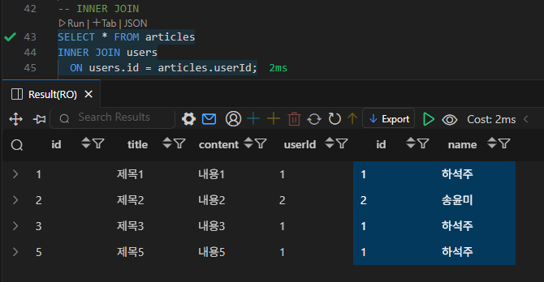
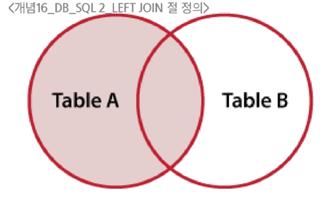
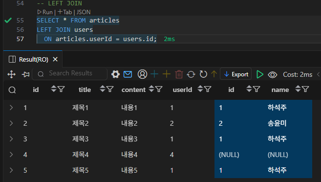

# SQL - SubQuery, JOIN

## Multi table queries

### 서브쿼리 (SubQuery)

- 다른 테이블의 값을 기준으로 한 테이블에서 데이터를 검색할 수 있도록 다른 쿼리 내부에 중첩된 쿼리
- 하나의 쿼리 내에 또 다른 쿼리가 포함되는 쿼리

```sql
-- 작성일이 오래된 순으로 레코드 2개 삭제
DELETE FROM
  articles
WHERE id IN (
  SELECT id
  FROM articles
  ORDER BY createdAt
  LIMIT 2
);
```

### Foreign Key 설정

- `FOREIGN KEY (departmentId) REFERENCES departments(id)`: 테이블을 처음 만들 때 `FOREIGN KEY` 제약 조건 추가

```sql
CREATE TABLE users (
  id INTEGER PRIMARY KEY AUTOINCREMENT,
  name VARCHAR(50) NOT NULL
);

CREATE TABLE articles (
  id INTEGER PRIMARY KEY AUTOINCREMENT,
  title VARCHAR(50) NOT NULL,
  content VARCHAR(100) NOT NULL,
  userId INTEGER NOT NULL,
  FOREIGN KEY (userId) 
    REFERENCES users(id)
);
```

### JOIN

- 테이블 분리 → 중복을 줄이고 수정, 삭제가 쉬워진다.
    - 하지만, 화면에 출력할 때 여러 테이블에 분산된 데이터를 한 번에 출력하기 어렵다.
- 테이블 JOIN → 테이블을 물리적으로 합치는 것이 아니라, 조회만! 하는 것
    - 덮어쓰기 하는 것이 아니다.

#### INNER JOIN

```sql
SELECT
  select_list
FROM
  table_a
INNER JOIN table_b
  ON table_b.fk = table_a.pk;
```



- SELECT 절 이후 조회할 컬럼 지정
    - `table_name.column_name` 형식으로 테이블명과 필드명을 지정
- FROM 절 이후 메인 테이블 지정 (table_a)
- INNER JOIN 절 이후 메인 테이블과 조인할 테이블을 지정 (table_b)
- ON 키워드 이후 조인 조건을 작성
- 조인 조건은 table_a와 table_b 간의 레코드를 일치시키는 규칙을 지정



파란색으로 칠해진 테이블이 users

#### LEFT JOIN

```sql
SELECT
  select_list
FROM
  table_a
LEFT_JOIN table_b
  ON table_b.fk = table_a.pk;
```



- FROM 절 이후 왼쪽 테이블 지정 (table_a)
- INNER JOIN 절 이후 오른쪽 테이블을 지정 (table_b)
- ON 키워드 이후 조인 조건을 작성
    - 왼쪽 테이블의 각 레코드를 오른쪽 테이블의 모든 레코드와 일치시킨다.



파란색으로 칠해진 테이블이 users

- 왼쪽 테이블의 모든 레코드를 표기하고, 오른쪽 테이블과 매칭되는 레코드가 없으면 NULL을 표시한다.
    - 어떤 데이터가 없는지를 확인하고 싶은 때 유용

```sql
-- 게시글을 작성한 이력이 없는 회원 정보 조
SELECT users.name FROM users
LEFT JOIN articles
  ON articles.userId = users.id
WHERE
  articles.userId IS NULL;
```

### CASE WHEN

```sql
CASE
  WHEN [조건문 1] THEN [반환할 값 1]
  WHEN [조건문 2] THEN [반환할 값 2]
  ...
  ELSE [위의 모든 조건이 아닐 때 반환할 기본값]
END
```

- 조건에 따른 값 반환
- 파생 컬럼 (Derived Column, 계산 컬럼): 테이블에 원래 저장된 값이 아닌 새로운 값을 계산하거나 가공해서 만들어내는 컬럼
- `age_group`: `employees` 테이블에 물리적으로 존재하는 컬럼이 아니라, 쿼리를 실행하는 시점에 실시간으로 계산되어 결과에만 포함되는 **가상의 컬럼**

```sql
-- 부서별로 연령대 별 직원 수를 조회한다.
-- 30세 이하, 30-40세 사이, 40세 이상으로 구분한다.
SELECT
  departments.name AS department,
  CASE 
    WHEN age <= 30 THEN 'Under 30'
    WHEN age >= 40 THEN 'Over 40' 
    ELSE 'Between 30-40'
  END AS age_group,
  COUNT(*) AS num_employees
FROM
  employees
LEFT JOIN departments
	ON departments.id = employees.departmentId
GROUP BY department, age_group;
```