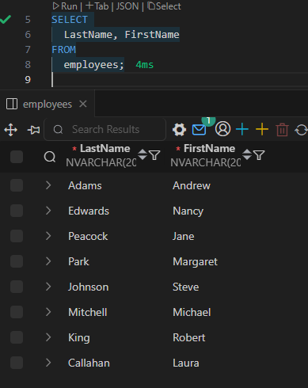
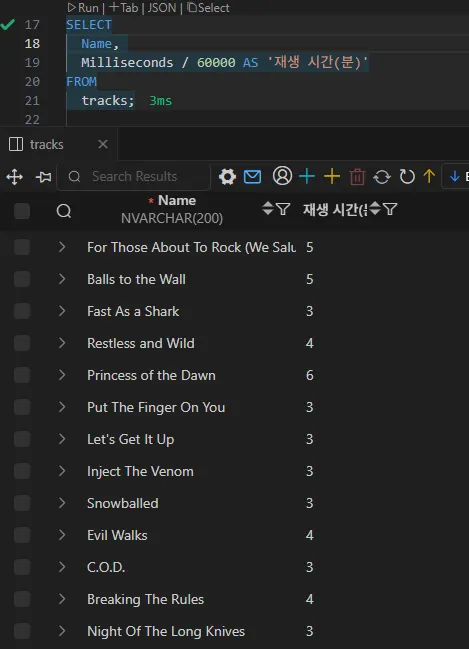
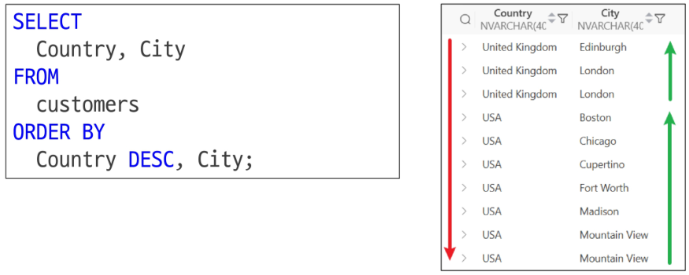
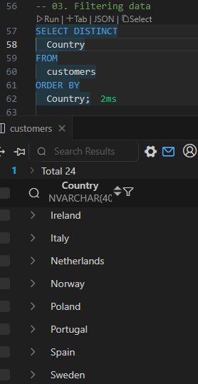
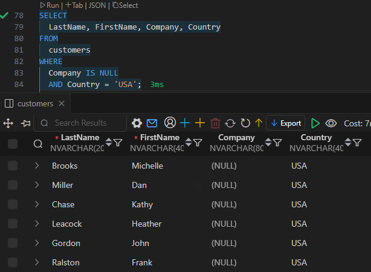
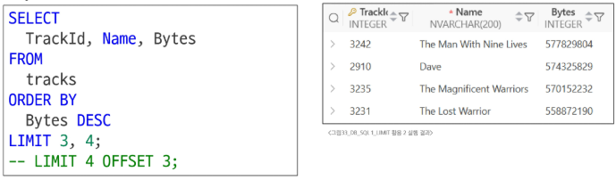
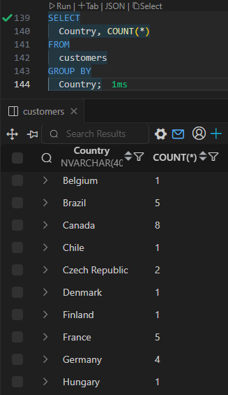

# SQL - SELECT문

## SQL (Structure Query Language)

### SQL (Structure Query Language)

- 명확하게 약속된 형식에 따라 데이터베이스에 정확한 요청을 전달하는 언어
- Query: 데이터베이스로부터 정보를 요청하는 것

`SELECT column_name FROM table_name;`

- SQL 키워드는 대소문자를 구분하지 않는다.
    - 명시적 구분을 위해 대문자로 작성하는 것을 권장한다.
- 각 SQL Statements의 끝에는 세미콜론(`;`)이 필요하다.

### SQL Statements

- 수행 목적에 따라 4가지로 구분

| 유형 | 역할 | SQL 키워드 |
| --- | --- | --- |
| DDL (Data Definition Language) | 데이터의 기본 구조 및 형식 변경 | CREATE, DROP, ALTER |
| DQL (Data Query Language) | 데이터 검색 | SELECT |
| DML (Data Manipulation Language) | 데이터 조작 (추가, 수정, 삭제) | INSERT, UPDATE, DELETE |
| DCL (Data Control Language) | 데이터 및 작업에 대한 사용자 권한 제어 | COMMIT, ROLLBACK, GRANT, REVOKE |

## DQL (Data Query Language)

### SELECT

- 테이블의 데이터를 조회 및 반환

```sql
SELECT select_list FROM table_name;
```

- `SELECT` 키워드 이후 데이터를 선택하려는 필드를 하나 이상 지정
- `FROM` 키워드 이후 데이터를 선택하려는 테이블의 이름을 지정
- 전체 필드 지정할 때 `*` 사용 (예: `SELECT * FROM employees;`)
- `AS` 키워드로 필드명을 지정할 수 있다. 단, 출력될 때의 이름만 변경하는 것이지, 실제 필드명을 바꾸는 것은 아니다.





### SELECT statement 실행 순서

FROM → WHERE → GROUP BY → HAVING → SELECT → ORDER BY → LIMIT


## 데이터 정렬 (Sorting Data)

### ORDER BY

```sql
SELECT
	select_list
FROM
	table_name
ORDER BY
	column1 [ASC|DESC],
	column2 [ASC|DESC],
	...;
```

- `FROM` clause 뒤에 위치
    - 테이블에서(FROM) 조회하여(SELECT) 정렬(ORDER BY)
- 하나 이상의 컬럼을 기준으로 결과를 오름차순(ASC, 기본값), 내림차순(DESC)으로 정렬
    - 첫 번째 컬럼을 정렬한 후, 해당 영역 안에서 각각의 두 번째 컬럼을 정렬하는 방식
- NULL 값이 존재할 경우 오름차순 정렬 시 결과에 NULL이 먼저 출력된다.



### SQL의 논리 연산

- TRUE / FALSE / UNKNOWN
- NULL은 값이 없기 때문에 값을 비교한 결과는 ‘UNKNOWN’이 된다.
- NULL인지 아닌지 연산할 때에는 `IS NULL` 혹은 `IS NOT NULL`을 사용한다.

## 데이터 필터링 (Filtering Data)

### Filtering Data 관련 키워드

- Clause (절)
    - DISTINCT, WHERE, LIMIT
- Operator (연산자)
    - BETWEEN, IN, LIKE, Comparison, Logical

### DISTINCT

```sql
SELECT DISTINCT
	select_list
FROM
	table_name;
```

- `SELECT` 키워드 바로 뒤에 작성
- `SELECT DISTINCT`  키워드 다음에 고유한 값을 선택하려는 하나 이상의 필드를 지정
- 해당하는 데이터를 중복없이 출력



### WHERE

```sql
SELECT
	select_list
FROM
	table_name
WHERE
	search_condition;
```

- FROM clause 뒤에 위치
    - WHERE 뒤에 위치
- search_condition은 비교 연산자 및 논리 연산자 (AND, OR, NOT 등)를 사용하는 구문이 사용된다.



- NULL은 ‘값이 존재하지 않음’을 의미한다. 즉, 특정 값과 동일하다고 볼 수 없다.
    - `IS NULL` 혹은 `IS NOT NULL` 구문을 사용해 비교

```sql
SELECT
  Name, Bytes
FROM
  tracks
WHERE
  Bytes BETWEEN 10000 AND 500000;
  
-- WHERE
--   Bytes >= 10000
--   AND Bytes <= 500000;
```

```sql
SELECT
  LastName, FirstName, Country
FROM
  customers
WHERE
  Country IN ('Canada', 'Germany', 'France');
  
-- WHERE
--   Country = 'Canada'
--   OR Country = 'Germany'
--   OR Country = 'France';
```

```sql
SELECT
  LastName, FirstName
FROM
  customers
WHERE
  LastName LIKE '%son';  -- 'son'으로 끝남

SELECT
  LastName, FirstName
FROM
  customers
WHERE
  FirstName LIKE '___a';  -- 4자리면서 'a'로 끝남
```

### Operators

- 비교 연산자
    - =, ≥, ≤, ≠
    - IS, LIKE, IN
    - BETWEEN … AND
- 논리 연산자
    - AND (&&)
    - OR (||)
    - NOT (!)
- Wildcard Characters
    - `%`: 0개 이상의 문자열과 일치하는지 확인
    - `_`: 단일 문자와 일치하는지 확인

### LIMIT

```sql
SELECT
	select_list
FROM
	table_name
LIMIT [offset,] row_count; 
```

- 하나 또는 두 개의 인자를 사용 (0 또는 양의 정수)
- row_count는 조회하는 최대 레코드 개수를 지정
- offset은 조회하지 않을 최대 레코드 수를 지정 (= offset 다음 인덱스부터 조회)



## 데이터 그룹화 (Grouping Data)

### 집계 함수 (Aggregation Functions)

- 값에 대한 계산을 수행하고 단일한 값을 반환하는 함수
- SUM, AVG, MAX, MIN, COUNT

### GROUP BY

```sql
SELECT
	c1, c2, ..., cn, aggregate_function(ci)
FROM
	table_name
GROUP BY
	c1, c2, ..., cn;
```

- FROM 및 WHERE 절 뒤에 배치
- GROUP BY 절 뒤에 그룹화할 필드 목록을 작성



```sql
SELECT
  Composer, 
  AVG(Bytes) AS avgOfBytes
FROM
  tracks
GROUP BY
  Composer
ORDER BY
  avgOfBytes DESC;
```

- 별칭을 붙였다면, ORDER BY 에서 별칭을 사용해야 한다.

### HAVING

- 집계 항목에 대한 세부 조건을 지정
- 주로 GROUP BY와 함께 사용

|  | WHERE | HAVING |
| --- | --- | --- |
| 목적 | 개별 행에 대한 조건을 지정하여 데이터를 필터링 | GROUP BY에 의해 그룹화된 결과에 대해 조건을 지정하여 그룹을 필터링 |
| 적용 시점 | FROM과 JOIN 등의 단계 이후, GROUP BY 이전에 적용 | 그룹핑 및 집계 함수 적용 후에 조건을 평가 |
| 사용 예 | 특정 조건을 만족하는 행만을 대상으로 집계나 정렬 등의 작업을 수행할 때 사용 | 그룹별 집계 결과에 조건을 걸어 특정 그룹만을 선택할 때 사용 |
| 예시 코드 | `SELECT * FROM employees WHERE salary > 30000;` | `SELECT department, COUNT(*) FROM employees GROUP BY department HAVING COUNT(*) > 5;` |
