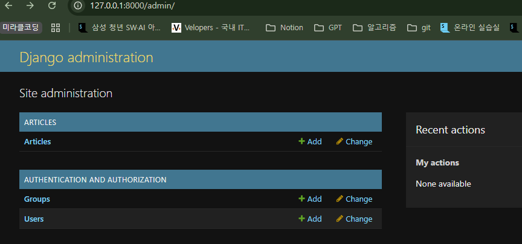

## Admin site

### 관리자 인터페이스 (Automatic admin interface)

Django가 추가 설치 및 설정 없이 자동으로 제공하는 관리자 인터페이스

- 데이터베이스 모델의 **CRUD(생성, 읽기, 업데이트, 삭제)** 작업을 간편하게 수행할 수 있다.
- 빠른 프로토타이핑, 비개발자 데이터 관리, 내부 시스템 구축에 활용할 수 있다.

### Django admin 계정 생성

```bash
python manage.py createsuperuser
```

- username: 관리자 페이지에 로그인할 때 사용할 아이디
- email address: (선택사항) 이메일
- password: 로그인할 때 사용할 비밀번호 (비밀번호 입력 시 콘솔 창에 아무것도 나타나지 않음)
- password(again): 비밀번호 확인

**DB에 생성된 admin 계정 확인**

- **마이그레이션을 진행(테이블 프레임 만듦)한 후에 admin 계정을 만들어야 서버에 기록이 된다.**


**관리자 인터페이스 페이지**

- 등록한 아이디/비번으로 로그인하여 접속


### admin site 모델 클래스 등록 및 확인

```python
# articles/admin.py
from django.contrib import admin
from .models import Article

# Register your models here.
# admin site에 등록(register)한다.
admin.site.register(Article)
```



### CRUD 테스트

- Create(생성), Read(읽기), Update(수정), Delete(삭제)
- 새로운  Article 생성
    - `id`, `created_at`, `updated_at` 필드는 시스템에서 자동으로 생성하기 때문에 사용자로부터 입력받지 않는다.
    - 시간은 UTC 기준으로 자동 저장된다.


