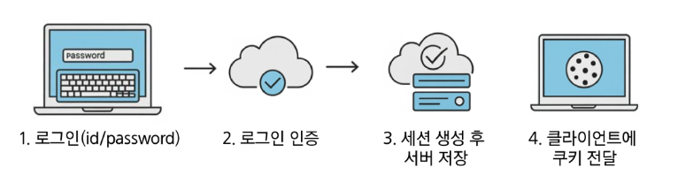
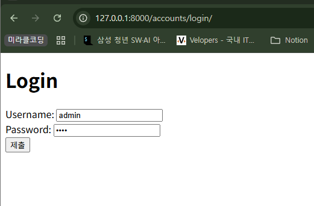
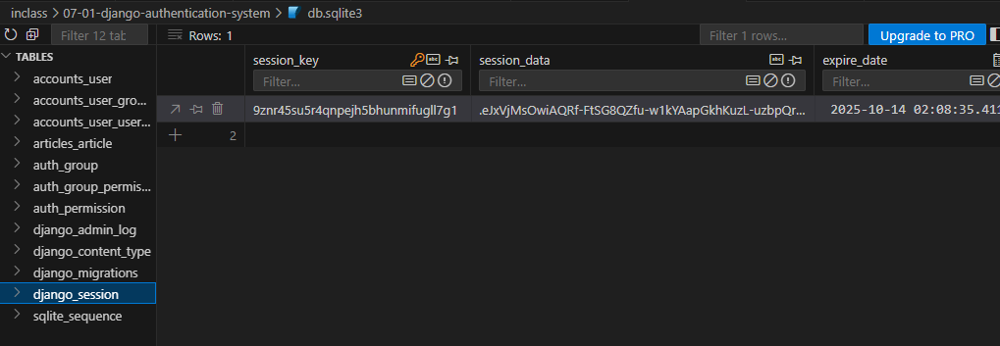
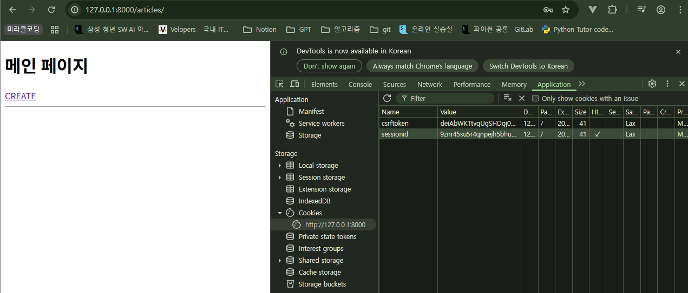
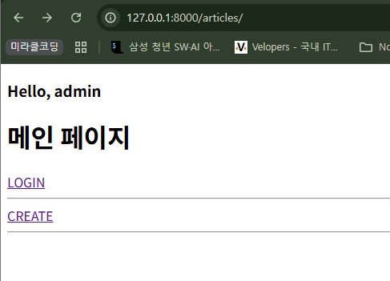
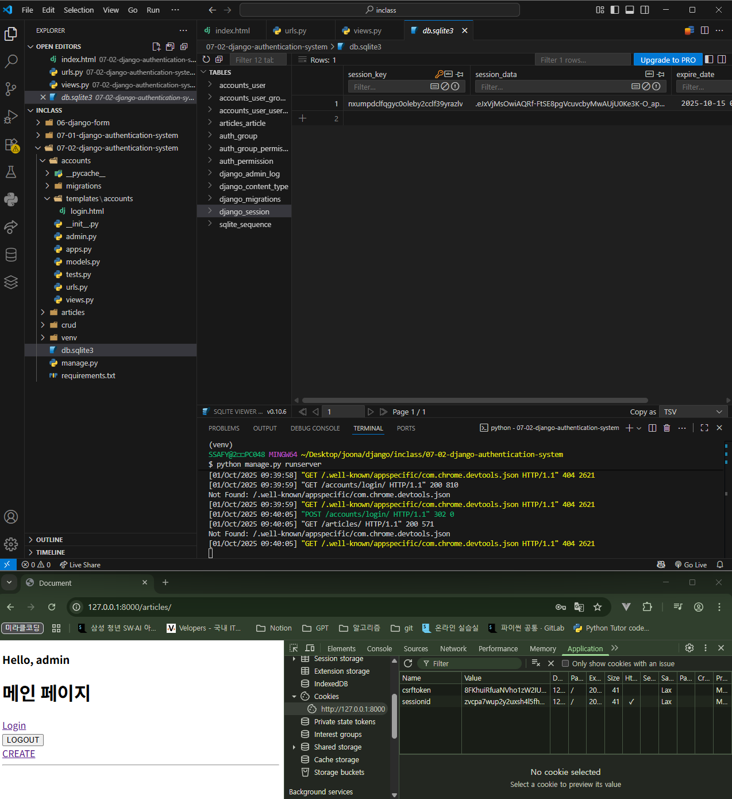
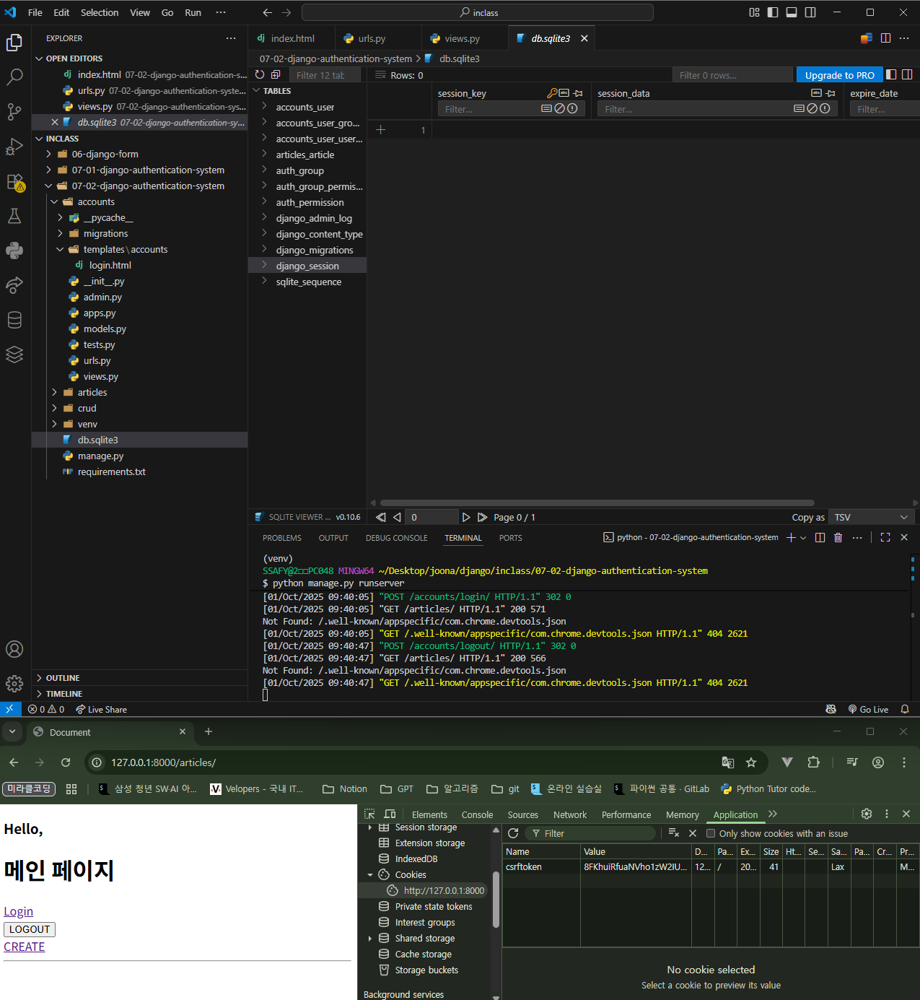
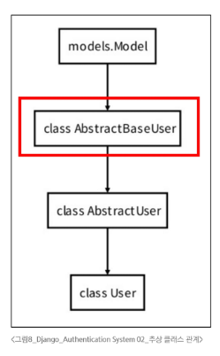

## Login 페이지 만들기

### Login

- 서버에 ‘나’임을 인증하는 과정
- 인증(ID/PW)을 완료하고 **Session을 만들고** 클라이언트와 연결하는 것 → CRUD에서 **C(create)**



### 로그인 페이지 작성

- 로그인 인증에 사용할 데이터를 입력 받는 built-in form `AuthenticationForm()` 사용
    - username, password 입력받고 유효성 검사 진행
    - User 모델과 직접 연결된 ModelForm이 아니다. **일반 Form을 상속 받는다.**
        - Form: 사용자를 생성하거나 수정하는 용도가 아닌 **인증**하는 역할만 수행한다. (예: 로그인)
        - ModelForm: DB에 들어갈 데이터를 입력받아 사용자를 **생성**한다. (예: 회원가입)

```python
# accounts/urls.py
app_name = 'accounts'
urlpatterns = [
    path('login/', views.login, name='login'),
]
```

```python
# accounts/views.py
from django.shortcuts import render
from django.contrib.auth.forms import AuthenticationForm
from django.contrib.auth import login as auth_login  # 세션을 생성해주는 함수

def login(request):
    if request.method == 'POST':
        # Form을 상속받기 때문에 ModelForm과 인자 구성 순서가 다르다.
        form = AuthenticationForm(request, request.POST)
        if form.is_valid():
            # 세션을 생성
            auth_login(request, form.get_user())
            return redirect('articles:index')
    else:
        # GET 요청일때 로그인 페이지를 응답
        form = AuthenticationForm()
    context = {
        'form': form,
    }
    return render(request, 'accounts/login.html', context)

```

- `login(request, user)` AuthenticationForm을 통해 인증된 사용자를 로그인 하는 함수
    - request: 현재 사용자의 세션 정보에 접근하기 위해 사용
    - user: 어떤 사용자가 로그인 되었는지를 기록하기 위해 사용
- `get_user()` AuthenticationForm의 인스턴스 메서드
    - `def get_user(self): return self.user_cache`
    - 유효성 검사를 통과했을 경우, 로그인한 사용자 객체를 반환

```html
<!-- accounts/login.html -->
<!DOCTYPE html>
<html lang="en">
<head>
  <meta charset="UTF-8">
  <meta name="viewport" content="width=device-width, initial-scale=1.0">
  <title>Document</title>
</head>
<body>
  <h1>Login</h1>
  <form action="" method="POST">
    
    {{ form }}
    <input type="submit">
  </form>
</body>
</html>
```




### 로그인 후 발급받은 세션 확인

1. django_session 테이블
    - DB에서 django_session 테이블에 session 생성된 것을 확인할 수 있다.

    

2. 브라우저의 개발자 도구
    - 개발자도구 - Application - Cookies에서 sessionid 생성된 것을 확인할 수 있다.

    

    로그인 성공 후 cookies에서 sessionid 생성 확인할 수 있다.

### Template with Authentication Data

- context processors
    - 템플릿이 렌더링될 때 호출 가능한 컨텍스트 데이터 목록
    - 작성된 컨텍스트 데이터는 기본적으로 템플릿에서 사용 가능한 변수로 포함된다.

```python
# settings.py
TEMPLATES = [
    {
        'BACKEND': 'django.template.backends.django.DjangoTemplates',
        'DIRS': [],
        'APP_DIRS': True,
        'OPTIONS': {
            'context_processors': [
                'django.template.context_processors.request',
                'django.contrib.auth.context_processors.auth',
                'django.contrib.messages.context_processors.messages',
            ],
        },
    },
]
```

```python
# articles/views.py
def index(request):
    articles = Article.objects.all()
    context = {
        'articles': articles,
    }
    return render(request, 'articles/index.html', context)
```

```html
<!-- articles/index.html -->
<h3>Hello, {{ user.username }}</h3>
<h1>메인 페이지</h1>
<a href="">LOGIN</a><br>
<hr>
```

- `user` 라는 context 데이터를 사용할 수 있는 이유는?
    - django가 미리 준비한 context 데이터가 존재하기 때문! (**context processors**)




## Logout

### Logout

- session을 Delete하는 과정
- 서버의 세션 데이터를 비우고 클라이언트의 세션 쿠키를 삭제한다.
    - DB에서 현재 요청에 대한 Session Data를 삭제
    - 클라이언트의 쿠키에서도 Session ID를 삭제

### 로그아웃 <form> 작성

```python
# accounts/urls.py
from django.urls import path
from . import views

app_name = 'accounts'
urlpatterns = [
    path('login/', views.login, name='login'),
    path('logout/', views.logout, name='logout'),
]
```

```python
# accounts/views.py
from django.contrib.auth import logout as auth_logout

def logout(request):
    # 누가 로그아웃하는지 유저를 조회해야 하는가?
    # => 요청 객체 (request)에 이미 유저 정보가 담겨있어서 조회할 필요가 없다.
    # print(request.user)  # admin

    # 해당 유저의 세션을 삭제
    auth_logout(request)

    return redirect('articles:index')
```

- request 덩어리 (요청 객체) 안에 user에 대한 정보가 포함되어 있다.

    → 누가 로그아웃하는지 유저를 조회하지 않아도 된다.




login 직후 화면



logout 직후 화면 - DB와 쿠키에서 세션 모두 삭제됨

### AbstractUser class

- **AbstractBaseUser class (추상 기본 클래스)**
    - 몇 가지 공통 정보를 여러 다른 모델에 넣을 때 사용하는 클래스
    - 데이터베이스 테이블을 만드는 데 사용하지 않으며, 대신 다른 모델의 기본 클래스로 사용되는 경우 해당 필드가 하위 클래스의 필드에 추가된다.
    - 인증에 필요한 최소한의 기능만 제공한다.
- **AbstractUser class**
    - 관리자 권한과 함께 **완전한 기능**을 가지고 있는 User model을 구현하는 추상 기본 클래스
    - 기본 User 모델이 가진 모든 필드가 이미 구현되어 있다.



|  | `AbstractBaseUser` | `AbstractUser` |
| --- | --- | --- |
| 제공 필드 | 최소한의 인증 필드 (비밀번호, last_login 등) | 기본 User 모델의 모든 필드 (username, email 등) |
| 장점 | 최대의 유연성과 자유도 | 개발 속도가 빠르고 편리함 |
| 사용 케이스 | 이메일이 아닌 전화번호 등으로 로그인하는 등, 완전히 새로운 인증 체계를 만들 때 | 기존 인증 방식은 유지하면서 프로필 사진, 닉네임 등 필드만 추가하고 싶을 때 (대부분의 경우) |