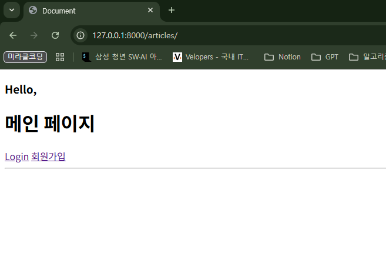

## 회원 가입

- User 객체를 Create 하는 과정
- 사용자로부터 아이디, 비밀번호 등의 정보를 입력 받아, DB에 새로운 User 객체를 생성하고 저장한다.
    - `UserCreationForm` built-in form (**ModelForm**) 사용

```python
# accounts/urls.py
app_name = 'accounts'
urlpatterns = [
    ...
    path('signup/', views.signup, name='signup'),
]
```

```python
# accounts/views.py
from django.contrib.auth.forms import AuthenticationForm, UserCreationForm

def signup(request):
    if request.method == "POST":
        # 사용자 입력 데이터를 받기 (UserCreationForm을 통해서)
        form = UserCreationForm(request.POST)
        if form.is_valid():
            form.save()
            return redirect('articles:index')
    else:
        # 회원가입 폼
        form = UserCreationForm()
    context = {
        'form': form,
    }
    return render(request, 'accounts/signup.html', context)
```

```html
<!-- accounts/signup.html -->
<h1>Signup</h1>
<form action="" method="POST">
  
  {{ form }}
  <input type="submit">
</form>
```


### 회원 가입 로직 에러

회원가입 시도 후 에러 페이지

- Manager isn’t available; ‘auth.User’ has been swapped for ‘accounts.User’


- 원인: 회원가입에 사용하는 UserCreationForm 이 대체한 커스텀 유저 모델이 아닌 과거 django의 기본 유저 모델로 인해 작성된 클래스이기 때문이다.
- 해결: model에 Custom User Model을 연결하자!
    - `UserCreationForm`을 상속받은 후 일부분만 재작성한다.

```python
# accounts/forms.py
from django.contrib.auth.forms import UserCreationForm
from django.contrib.auth import get_user_model

# Django는 User 모델을 직접 참조하는 것을 권장하지 않는다.
# from .models import User

class CustomUserCreationForm(UserCreationForm):
    class Meta(UserCreationForm.Meta):
        # model = 과거의 기본 User 클래스
        #       => 우리의 현재 User 클래스로 대체
        # get_user_model 함수는 현재 프로젝트에 활성화 되어있는 유저 클래스를 자동으로 반환
        model = get_user_model()
        # model = User
```

- `get_user_model()` 현재 프로젝트에서 활성화된 사용자 모델(activate user model)을 반환하는 함수
    - **User 모델을 직접 참조하지 않는다.**
    - 프로젝트 설정(AUTH_USER_MODEL)에 따라 기본 User 모델일수도, 우리가 직접 만든 커스텀 User 모델일수도 있기 때문에 올바른 모델을 동적으로 가져오기 위함
    - User 모델이 바뀌어도 코드를 수정할 필요가 없어 재사용성과 유연성이 높아진다.

```python
# accounts/views.py
from .forms import CustomUserCreationForm

def signup(request):
    if request.method == "POST":
        # 사용자 입력 데이터를 받기 (CustomUserCreationForm을 통해서)
        form = CustomUserCreationForm(request.POST)
        if form.is_valid():
            form.save()
            return redirect('articles:index')
    else:
        # 회원가입 폼
        form = CustomUserCreationForm()
    context = {
        'form': form,
    }
    return render(request, 'accounts/signup.html', context)
```


회원가입 직후 화면 - 로그인하지 않은 상태


testuser 회원가입 후 DB

- UserCreationForm을 이용해서 회원가입하면 일반 회원 (`is_superuser = 0`, `is_staff = 0`)으로 등록된다.

### 회원가입 후 자동 로그인

- 회원가입 성공한 user 객체를 활용해 login을 진행한다.

```python
# accounts/views.py

def signup(request):
    if request.user.is_authenticated:
        return redirect('articles:index')

    if request.method == "POST":
        # 사용자 입력 데이터를 받기 (UserCreationForm을 통해서)
        form = CustomUserCreationForm(request.POST)
        if form.is_valid():
            user = form.save()
            auth_login(request, user)
            return redirect('articles:index')
    else:
        # 회원가입 폼
        form = CustomUserCreationForm()
    context = {
        'form': form,
    }
    return render(request, 'accounts/signup.html', context)
```


회원가입 직후 화면 - 로그인까지 완료


## 회원 탈퇴

- User 객체를 Delete 하는 과정
- `request.user.delete()`를 활용해서 유저 객체 삭제를 진행한다.
- 실제 서비스에서는 사용자를 물리적으로 삭제하는 대신, 계정을 비활성화 처리하는 경우가 더 많다.

```python
# accounts/urls.py
app_name = 'accounts'
urlpatterns = [
    ...
    path('delete/', views.delete, name='delete'),
]
```

```python
# accounts/views.py
def delete(request):
    request.user.delete()
    return redirect('articles:index')
```

```html
<!-- articles/index.html -->
<form action="" method="POST">
  
  <input type="submit" value="회원탈퇴">
</form>
```


testuser 로그인 직후 화면


testuser 회원 탈퇴 후 로그인 시도 화면

### 회원 탈퇴 개선 - session data 삭제

- 사용자 객체 삭제 이후 로그아웃 함수를 호출해야 한다.
- **1)탈퇴 후 2)로그아웃** 순서를 유지할 것!!!
    - 먼저 로그아웃이 진행되면 해당 요청 객체 정보가 없어지면서 탈퇴에 필요한 유저 정보 또한 없어지기 때문

```python
# accounts/views.py

@login_required
def delete(request):
    request.user.delete()
    auth_logout(request)
    return redirect('articles:index')
```


회원 탈퇴 직후 화면 - sessionid 삭제됨

## 인증된 사용자에 대한 접근 제한 (회원/비회원)

### `is_authenticated` 속성

- 사용자가 인증되었는지 여부를 알 수 있는 User model의 읽기 전용 속성
    - 메서드가 아닌 속성 값
- 인증 사용자에 대해서는 항상 True, 비인증 사용자에 대해서는 항상 False
    - 비인증 사용자는 Anonymous User
- 사용 예
    - 사용자의 로그인 상태에 따라 다른 메뉴를 보여줄 때
    - view 함수 내에서 특정 기능을 로그인한 사용자에게만 허용하고 싶을 때

### `login_required` 데코레이터

- 인증된 사용자에 대해서만 view 함수를 실행시키는 데코레이터
- 비인증 사용자의 경우 /accounts/login/ 주소로 redirect 시킨다.
- 게시글 작성, 댓글 달기 등 누가 작성했는지 중요한 곳에서 사용한다.

### 로그인/비로그인 상태 다르게 설정하기

- 로그인 상태 (인증된 사용자) : 로그아웃, 회원탈퇴, CREATE(게시글 작성)
- 비로그인 상태 (인증되지 않은 사용자): 회원가입, 로그인

```html
<!-- articles/index.html -->
<h1>메인 페이지</h1>


  <form action="" method="POST">
    
    <input type="submit" value="LOGOUT">
  </form>

  <form action="" method="POST">
    
    <input type="submit" value="회원탈퇴">
  </form>

  <a href="">CREATE</a>


  <a href="">Login</a>
  <a href="">회원가입</a>

```


로그인 상태 (인증된 사용자)


로그아웃 상태 (인증되지 않은 사용자)

- 로그인한 상태에서는 login, signup의 URL을 직접 입력하더라도 접근할 수 없다.
    - 메인 페이지로 redirect 되기 때문

```python
# accounts/views.py
def login(request):
		# 인증된 사용자는 login할 필요가 없음
    if request.user.is_authenticated:
        return redirect('articles:index')
    ...

def signup(request):
		# 인증된 사용자는 signup할 필요가 없음
    if request.user.is_authenticated:
        return redirect('articles:index')
    ...
```

- 인증된 사용자만 게시글 작성/수정/삭제, 로그아웃/탈퇴 기능을 사용할 수 있다.

```python
# articles/views.py
from django.contrib.auth.decorators import login_required

@login_required
def create(request):
	 	pass

@login_required
def delete(request, pk):
		pass

@login_required
def update(request, pk):
		pass
```

```python
# accounts/views.py
from django.contrib.auth.decorators import login_required

@login_required
def logout(request):
	 	pass

@login_required
def delete(request):
		pass
```


## 회원정보 수정

- User 객체를 Update 하는 과정
- 수정할 대상 User 객체를 가져오고 입력받은 새로운 정보로 기존 내용을 갱신한다.

### UserChangeForm
- `UserChangeForm()` 회원정보 수정 시 사용자 입력 데이터를 받는 built-in **ModelForm**
    - 유효성 검사를 통과한 데이터로 기존 User 객체의 내용을 갱신하고 저장한다.
    - 주로 **관리자 페이지에서 사용**한다.

```python
from django.contrib.auth.forms import AuthenticationForm, UserChangeForm

def update(request):
    if request.method == 'POST':
        pass
    else:
        form = UserChangeForm()
    context = {
        'form': form,
    }
    return render(request, 'accounts/update.html', context)
```

```html
<!-- accounts/update.html -->
<h1>회원정보 수정</h1>
<form action="" method="POST">
  
  {{ form }}
  <input type="submit">
</form>
```


- 회원가입 시 일반 회원으로 등록되는데, 관리자 권한과 동일한 필드(회원 속성) 내용이 모두 노출됨
- `CustomUserChangeForm`에서 출력 필드를 다시 조정해야 한다!

### User 필드 확인하기

- migrations 혹은 공식 문서에서 확인


### `CustomUserChangeForm` 생성하기

```python
# accounts/forms.py
from django.contrib.auth.forms import UserCreationForm, UserChangeForm

class CustomUserChangeForm(UserChangeForm):
    class Meta(UserChangeForm.Meta):
        fields = ('email', 'first_name', 'last_name')
```

```python
# accounts/views.py
from .forms import CustomUserCreationForm, CustomUserChangeForm

def update(request):
    if request.method == 'POST':
        pass
    else:
        form = CustomUserChangeForm()
    context = {
        'form': form,
    }
    return render(request, 'accounts/update.html', context)
```


### 회원정보 수정 로직 에러

- Manager isn’t available; ‘auth.User’ has been swapped for ‘accounts.User’


```python
# accounts/forms.py
class CustomUserChangeForm(UserChangeForm):
    class Meta(UserChangeForm.Meta):
        model = get_user_model()
        fields = ('email', 'first_name', 'last_name')
```

```python
# accounts/views.py
def update(request):
    if request.method == 'POST':
        form = CustomUserChangeForm(request.POST, instance=request.user)
        if form.is_valid():
            form.save()
            return redirect('articles:index')
    else:
        form = CustomUserChangeForm(instance=request.user)
    context = {
        'form': form,
    }
    return render(request, 'accounts/update.html', context)
```

- `instance` 를 통해 데이터를 ‘갱신’하는 것임을 암시한다.


수정 후 DB 반영된 화면

### 비밀번호 변경

- 인증된 사용자의 session 데이터를 Update하는 과정
- 기존 비밀번호를 통해 사용자를 인증하고 새로운 비밀번호를 암호화하여 갱신한다.
- 비밀번호 변경 페이지를 **별도 주소**로 안내한다.
- `PasswordChangeForm()` 비밀번호 변경에 사용할 데이터를 입력받는 built-in **Form** 사용
    - 유효성 검사 (기존 비밀번호 확인, 새 비밀번호 일치 여부)를 통과한 데이터로 사용자의 비밀번호를 안전하게 암호화하여 갱신하는 역할
    - 첫 번째 필수 인자로 `user=request.user`를 받는다.

```python
# accounts/views.py
from django.contrib.auth.forms import AuthenticationForm, PasswordChangeForm

def password(request):
    if request.method == 'POST':
        form = PasswordChangeForm(user=request.user, data=request.POST)
        if form.is_valid():
            form.save()
            return redirect('articles:index')
    else:
        form = PasswordChangeForm(request.user)
    context = {
        'form': form,
    }
    return render(request, 'accounts/password.html', context)
```




비밀번호 변경 직후 화면 - 로그아웃 됨

### 세션 무효화 방지

- 비밀번호 변경 시 로그인 상태가 유지되지 못하고 로그아웃 처리된다.
- 비밀번호가 변경되면 기존 세션과의 회원 인증 정보가 일치하지 않기 때문이다.
- `update_session_auth_hash(request, user)` 암호 변경 시 세션 무효화를 막아주는 함수
    - 새로운 password의 Session Data로 기존 session을 자동으로 갱신한다.

```python
# accounts/views.py
from django.contrib.auth import update_session_auth_hash

def password(request):
    if request.method == 'POST':
        form = PasswordChangeForm(user=request.user, data=request.POST)
        if form.is_valid():
            user = form.save()
            # 세션 무효화 방지
            update_session_auth_hash(request, user)
            return redirect('articles:index')
    else:
        form = PasswordChangeForm(request.user)
    context = {
        'form': form,
    }
    return render(request, 'accounts/password.html', context)
```

### 비밀번호 초기화

- 비밀번호를 잊어버린 사용자가 이메일을 활용하여 비밀번호를 다시 설정하는 과정
1. 비밀번호를 찾으려고 하는 이메일 입력
2. 이메일로 비밀번호 재설정 링크 전송
3. 비밀번호 재설정 페이지에서 새로운 비밀번호 설정
4. 초기화 후 다시 로그인

```python
# urls.py
from django.contrib import admin
from django.urls import path, include

urlpatterns = [
    path('admin/', admin.site.urls),
    path('articles/', include('articles.urls')),
    path('accounts/', include('accounts.urls')),
    path('accounts/', include('django.contrib.auth.urls')),
]
```

- 같은 prefix로 여러 번 include를 해도 내부 URL이 겹치지 않으면 모두 동작한다.
    - 각 include의 내부 URL 패턴을 순차적으로 모두 시도하기 때문


django.contrib.auth.urls에서 제공하는 URL 목록 확인


- 회원 정보에 이메일이 등록되어 있어야 한다.
    - 입력한 이메일에 매칭되는 사용자 이메일이 없다면 이메일 기능은 동작하지 않는다.


터미널에서 비밀번호 초기화 설정 페이지 안내 이메일 확인하기

```python
# settings.py

# 비밀번호 재설정 이메일 확인하기
EMAIL_BACKEND = "django.core.mail.backends.console.EmailBackend"
```


