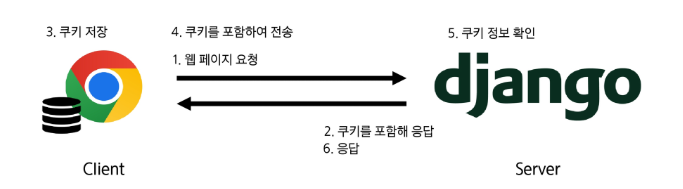
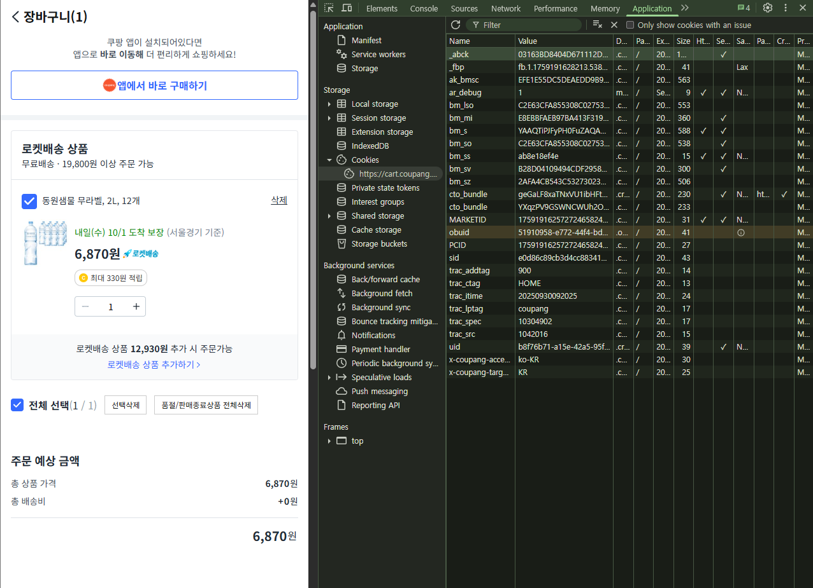
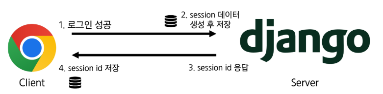
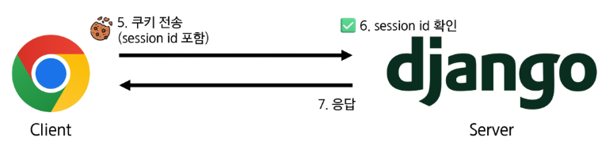

## HTTP (HyperText Transfer Protocol)

웹 브라우저와 서버가 서로 대화하기 위해 사용하는 공통 언어 또는 약속

- 비연결 지향 (connectionless)
    - 서버는 요청에 대한 응답을 보낸 후 연결을 끊는다.
    - 클라이언트는 서버와 서로 연결되어 있는 상태가 아니다.
    - 서버가 문서를 다 읽을 때까지 모든 사용자와의 연결을 유지해야 한다면, 수많은 연결이 서버의 메모리와 자원을 차지하게 된다. 자원 낭비를 막기 위해 비연결 방식을 채택한다.
- 무상태 (stateless)
    - 연결을 끊는 순간 클라이언트와 서버 간의 통신이 끝나며, 상태 정보가 유지되지 않는다.
    - 예시: 장바구니에 담은 상품을 유지할 수 없다. 로그인 상태를 유지할 수 없다.
    - 서버가 모든 클라이언트 상태를 기억한다고 하면 저장하고 관리해야 하므로 매우 복잡해진다. 클라이언트 상태를 공유하기 위해 서로 다른 서버가 연결되어야 하는 문제로 인해서 확장성이 저하된다. 무상태는 서버의 부담을 없애고 어떤 서버든 자유롭게 요청을 처리할 수 있게 한다.

### 쿠키 (Cookie)

서버가 사용자의 웹 브라우저에 전송하는 작은 데이터 조각

- 매 요청마다 쿠키를 담아서 보내면, 서버는 ‘나는 이전에 이 사이트를 방문 했었고, 로그인도 했어’ 처럼 사용자를 기억하고 식별할 수 있다.
- 사용자 인증, 추적, 상태 유지 등에 사용되는 데이터 저장 방식
- key-value 형식의 데이터
- 예시: 로그인 유지(세션 관리), 장바구니, 언어/테마 등 사용자 설정 기억

### 쿠키 동작 예시

1. 브라우저가 웹 서버에 웹페이지를 요청한다.
2. 웹 서버는 요청된 페이지와 함께 쿠키를 포함한 응답을 브라우저에게 전송한다.
3. 브라우저는 받은 쿠키를 저장소에 저장하고 쿠키의 속성(만료 시간, 도메인, 주소 등)도 함께 저장된다.
4. 이후 브라우저가 같은 웹 서버에 웹페이지를 요청할 때, 저장된 쿠키 중 해당 요청에 적용 가능한 쿠키를 포함하여 함께 전송한다.
5. 웹 서버는 받은 쿠키 정보를 확인하고, 필요에 따라 사용자 식별, 세션 관리 등을 수행한다.
6. 웹 서버는 요청에 대한 응답을 보내며, 필요한 경우 새로운 쿠키를 설정하거나 기존 쿠키를 수정할 수 있다.

**예시: 쿠팡에서 장바구니에 물건을 담았을 때 유지되는 경우**

- 개발자 도구 > Application > Cookies에서 쿠팡에 요청을 보낼 때 저장한 쿠키를 확인할 수 있다.
- 쿠키를 clear(삭제)한 후 새로고침(새로운 요청)을 하면, 장바구니가 빈 것을 확인할 수 있다.

### 쿠키의 특징

**쿠키 저장 방식**

- 브라우저(클라이언트)는 쿠키를 key-value의 데이터 형식으로 저장한다.
- 쿠키에는 이름, 값 외에도 만료 시간, 도메인, 경로 등의 추가 속성이 포함된다.

**쿠키 전송 과정**

- 서버는 HTTP 응답 헤더와 Set-Cookie 필드를 통해 클라이언트에게 쿠키를 전송한다.
- 브라우저는 받은 쿠키를 저장해두었다가, 동일한 서버에 재요청 시 HTTP 요청 Header의 Cookie 필드에 저장된 쿠키를 함께 전송한다.

**쿠키의 주요 용도**

- 두 요청이 동일한 브라우저에서 들어왔는지 아닌지를 판단한다.
- 사용자의 로그인 상태를 유지할 수 있다.
- 상태가 없는 (stateless) HTTP 프로토콜에서 상태 정보를 기억시켜주는 역할

**쿠키 사용 목적**

- 세션 관리 (Session Management)
    - 로그인, 아이디 자동완성, 공지 하루 안 보기, 팝업 체크, 장바구니 등의 정보 관리
- 개인화 (Personalization)
    - 사용자 선호 설정 (언어 설정, 테마 등) 저장
- 추적, 수집 (Tracking)
    - 사용자 행동을 기록 및 분석

### 쿠키의 수명

1. Session cookie: 현재 세션이 종료되면 브라우저 종료와 함께 세션이 삭제된다.
2. Persistant cookies: Expires 속성에 지정된 날짜 혹은 Max-Age 속성에 지정된 기간이 지나면 삭제된다.

### 쿠키의 보안 장치

- 제한된 정보: 보통 중요하지 않은 정보만 저장
    - 사용자 ID, 세션 번호 등
- 암호화: 중요한 정보는 서버에서 암호화해서 쿠키에 저장
- 만료 시간: 시간이 지나면 자동으로 삭제
- 도메인 제한: 쿠키는 특정 웹사이트에서만 사용할 수 있도록 설정할 수 있다.
- 개인정보 보호: 쿠키 사용에 대한 사용자 동의가 **필요**

**주의사항**

- 쿠키는 탈취될 수 있으니, 비밀번호 등 민감한 정보는 절대 직접 저장하면 안 된다.
- 쿠키는 모든 요청에 포함되어 전송되므로 크기를 최소화해야 사이트 성능에 유리하다.

## 세션 (Session)

**서버 측에서 생성**되어 클라이언트와 서버 간의 상태를 유지, 상태 정보를 저장하는 데이터 저장 방식

- 로그인 정보와 같은 중요 데이터를 클라이언트가 아닌 서버 쪽에 저장하고 유지한다.
- 서버는 각 사용자를 구분하기 위해 고유한 ‘세션 ID’를 발급하고, 이 ID만 쿠키에 담아 클라이언트에 보내 사용자를 식별한다.
- 실제 데이터는 서버에만 보관되므로 쿠키만 사용하는 방식보다 훨씬 보안에 유리하다.

### 세션 작동 원리

1. 클라이언트가 로그인 요청 후 인증에 성공하면 session 데이터를 생성 후 저장한다.
2. 생성된 session 데이터에 인증할 수 있는 session ID를 발급한다.
3. 발근한 sesson ID를 클라이언트에게 응답한다. (데이터는 서버에 저장, 열쇠만 주는 것)
4. 클라이언트는 응답 받은 session ID를 쿠키에 저장한다.
5. 클라이언트가 다시 동일한 서버에 접속하면 요청과 함께 쿠키(session ID가 저장된)를 서버에 전달한다.
6. 쿠키는 요청할 때마다 서버에 함께 전송되므로 서버에서 session ID를 확인해 로그인 되어있다는 것을 계속해서 확인하도록 한다.
7. 사용자의 요청을 처리하고 응답한다.

### 세션의 특징

- 서버 측에서 생성되어 클라이언트와 서버 간의 상태를 유지한다.
    - 서버의 메모리나 데이터베이스에 저장되므로 서버 리소스를 사용(효율적 관리 필요)
- 상태 정보를 저장하는 데이터 저장 방식
- 쿠키에 세션 데이터를 저장하여 매 요청시마다 세션 데이터를 함께 보낸다.
- 세션은 영구적으로 유지되지 않는다.
    - 만료 기간은 사이트마다 다르다.
- 중요한 데이터를 저장하기 때문에 보안에 신경써야 한다.

### Django에서의 세션 관리

- django는 **database-backed sessions** 저장 방식을 기본 값으로 사용한다.
- DB의 django_session 테이블에 저장된다.
- 요청안에 특정 session id를 포함하는 쿠키를 사용해서 각각의 브라우저와 사이트가 연결된 session 데이터를 알아낸다.

<aside>
💡[쿠키와 세션의 궁극적인 목적]

클라이언트와 서버 간의 **상태 정보를 유지하고 사용자를 식별**하기 위해 사용!

</aside>