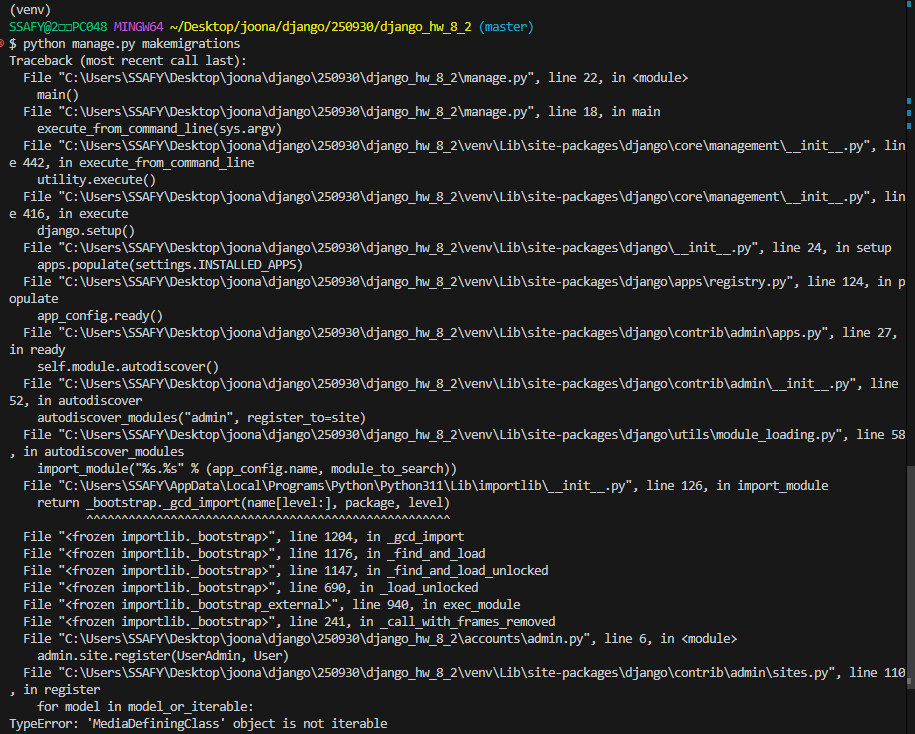
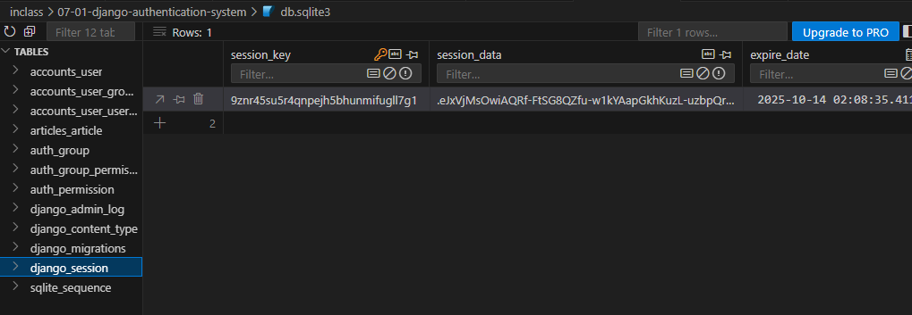
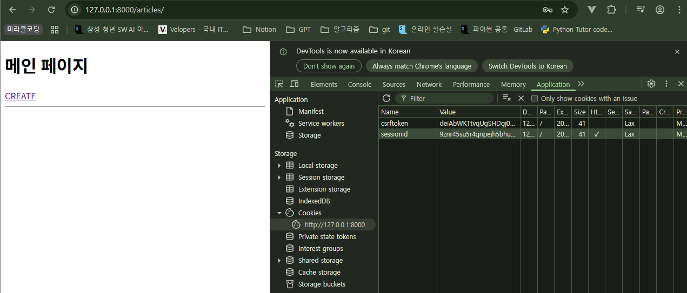
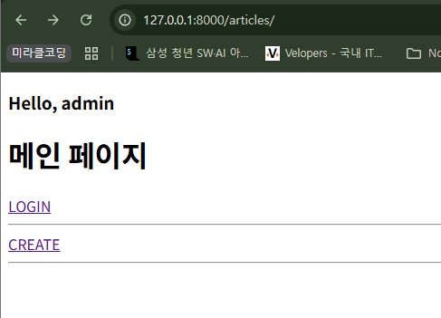

## admin 등록 시 인자의 순서 주의!
### 실습

```python
# accounts/admin.py
from django.contrib import admin
from django.contrib.auth.admin import UserAdmin
from .models import User

# admin.site.register(UserAdmin, User) -> 아래와 같은 오류 발생
admin.site.register(User, UserAdmin)
```



`admin.site.register()` 함수는 **첫 번째 인자**로 **모델 클래스**(`User`)를 받고, **두 번째 인자**로 해당 모델의 관리자 페이지를 커스터마이징할 **Admin 클래스**(`UserAdmin`)를 받습니다. 현재 코드에서는 이 두 인자의 순서가 바뀌어 있습니다.


## Django Authentication System

### 인증 (Authentication)

사용자를 식별하기 위해서 필요한 과정

- 클라이언트와 서버 간의 상태 정보를 유지하기 위해 쿠키와 세션을 사용한다.
- 인증 방법 예시: 아이디와 비밀번호, 소셜 로그인 (OAuth), 생체 인증

### Django Authentication System

Django에서 사용자 인증과 관련된 기능을 모아 놓은 시스템

- User Model: 사용자 인증 후 연결될 User Model 관리
- Session 관리: 로그인 상태를 유지하고 서버에 저장하는 방식을 관리
- 기본 인증 (ID/PW): 로그인/로그아웃 등 다양한 기능을 제공


## Custom User Model

### 기본 User Model의 한계

- 인증 후 사용되는 User Model은 별도의 User 클래스 정의 없이 **내장된 auth 앱**에 작성된 User 클래스를 사용했다.
    - username, password, email 등의 필드를 가진 User 모델을 제공한다.
    - 사용자별 또는 그룹별로 특정 행동에 대한 권한 부여가 가능하다.
- 추가적인 사용자 정보 (예: 생년월일, 주소, 나이 등)가 필요하다면 이를 위해 기본 User Model을 변경하기 어렵다. 개발자가 직접 수정하기 어렵다.

⇒ 프로젝트 특정 요구사항에 맞춰 사용자 모델을 확장할 수 있게 커스텀하자!

### User Model 대체하기

- [Django 공식 문서](https://docs.djangoproject.com/en/5.2/topics/auth/customizing/#substituting-a-custom-user-model)
- django는 기본 User 모델이 충분하더라도 **커스텀 User 모델을 설정하는 것을 강력하게 권장**한다.
    - 커스텀 User 모델은 기본 User 모델과 동일하게 작동하면서도 나중에 맞춤 설정(필드 추가 등)할 수 있기 때문

1. 새로운 app `accounts` 생성 및 등록
    - auth와 관련한 경로나 키워드들은 `accounts`로 지정하는 것을 권장한다.

```python
# settings.py
INSTALLED_APPS = [
    'accounts',
    ...
]
```

```python
# accounts/urls.py
from django.urls import path
from . import views

app_name = 'accounts'
urlpatterns = []
```

2. AbstractUser 클래스를 상속받는 커스텀 User 클래스 생성
    - 기존 User 클래스도 AbstractUser를 상속받기 때문에 커스텀 User 클래스도 기존 User 클래스와 완전히 같은 모습을 가지게 된다.

```python
# accounts/models.py
from django.db import models
from django.contrib.auth.models import AbstractUser

class User(AbstractUser):
    pass
```

3. django 프로젝트에서 사용하는 기본 User 모델을 커스텀 User 모델로 사용할 수 있도록 `AUTH_USER_MODEL` 값을 변경
    - 수정 전 기본 값은 `auth.User`
    - django는 프로젝트 중간에 AUTH_USER_MODEL을 변경하는 것을 강력하게 권장하지 않는다.
        - **프로젝트의 모든 migrations 혹은 첫 migrate를 실행하기 전에 user 모델 대체 작업을 마쳐야 한다.**
        - 이미 프로젝트가 진행되고 있을 경우 데이터베이스 초기화 후 진행한다.

```python
# settings.py

# django의 기본 유저 모델을 설정(대체)
AUTH_USER_MODEL = 'accounts.User'
```

4. admin site에 대체한 User 모델 등록
    - 기본 User 모델이 아니기 때문에 등록해야 admin 페이지에 출력된다.

```python
# accounts/admin.py
from django.contrib import admin
from django.contrib.auth.admin import UserAdmin
from .models import User

admin.site.register(User, UserAdmin)
```


## Login 페이지 만들기

### Login

- 서버에 ‘나’임을 인증하는 과정
- 인증(ID/PW)을 완료하고 **Session을 만들고** 클라이언트와 연결하는 것 → CRUD에서 **C(create)**


### 로그인 페이지 작성

- 로그인 인증에 사용할 데이터를 입력 받는 built-in form `AuthenticationForm()` 사용
    - username, password 입력받고 유효성 검사 진행
    - User 모델과 직접 연결된 ModelForm이 아니다. **일반 Form을 상속 받는다.**
        - Form: 사용자를 생성하거나 수정하는 용도가 아닌 **인증**하는 역할만 수행한다. (예: 로그인)
        - ModelForm: DB에 들어갈 데이터를 입력받아 사용자를 **생성**한다. (예: 회원가입)

```python
# accounts/urls.py
app_name = 'accounts'
urlpatterns = [
    path('login/', views.login, name='login'),
]
```

```python
# accounts/views.py
from django.shortcuts import render
from django.contrib.auth.forms import AuthenticationForm
from django.contrib.auth import login as auth_login  # 세션을 생성해주는 함수

def login(request):
    if request.method == 'POST':
        # Form을 상속받기 때문에 ModelForm과 인자 구성 순서가 다르다.
        form = AuthenticationForm(request, request.POST)
        if form.is_valid():
            # 세션을 생성
            auth_login(request, form.get_user())
            return redirect('articles:index')
    else:
        # GET 요청일때 로그인 페이지를 응답
        form = AuthenticationForm()
    context = {
        'form': form,
    }
    return render(request, 'accounts/login.html', context)

```

- `login(request, user)` AuthenticationForm을 통해 인증된 사용자를 로그인 하는 함수
    - request: 현재 사용자의 세션 정보에 접근하기 위해 사용
    - user: 어떤 사용자가 로그인 되었는지를 기록하기 위해 사용
- `get_user()` AuthenticationForm의 인스턴스 메서드
    - `def get_user(self): return self.user_cache`
    - 유효성 검사를 통과했을 경우, 로그인한 사용자 객체를 반환

```html
<!-- accounts/login.html -->
<!DOCTYPE html>
<html lang="en">
<head>
  <meta charset="UTF-8">
  <meta name="viewport" content="width=device-width, initial-scale=1.0">
  <title>Document</title>
</head>
<body>
  <h1>Login</h1>
  <form action="" method="POST">
    
    {{ form }}
    <input type="submit">
  </form>
</body>
</html>
```


### 로그인 후 발급받은 세션 확인

1. django_session 테이블
    - DB에서 django_session 테이블에 session 생성된 것을 확인할 수 있다.

    

2. 브라우저의 개발자 도구
    - 개발자도구 - Application - Cookies에서 sessionid 생성된 것을 확인할 수 있다.

    

    로그인 성공 후 cookies에서 sessionid 생성 확인할 수 있다.

### Template with Authentication Data

- context processors
    - 템플릿이 렌더링될 때 호출 가능한 컨텍스트 데이터 목록
    - 작성된 컨텍스트 데이터는 기본적으로 템플릿에서 사용 가능한 변수로 포함된다.

```python
# settings.py
TEMPLATES = [
    {
        'BACKEND': 'django.template.backends.django.DjangoTemplates',
        'DIRS': [],
        'APP_DIRS': True,
        'OPTIONS': {
            'context_processors': [
                'django.template.context_processors.request',
                'django.contrib.auth.context_processors.auth',
                'django.contrib.messages.context_processors.messages',
            ],
        },
    },
]
```

```python
# articles/views.py
def index(request):
    articles = Article.objects.all()
    context = {
        'articles': articles,
    }
    return render(request, 'articles/index.html', context)
```

```html
<!-- articles/index.html -->
<h3>Hello, {{ user.username }}</h3>
<h1>메인 페이지</h1>
<a href="">LOGIN</a><br>
<hr>
```

- `user` 라는 context 데이터를 사용할 수 있는 이유는?
    - django가 미리 준비한 context 데이터가 존재하기 때문! (**context processors**)

