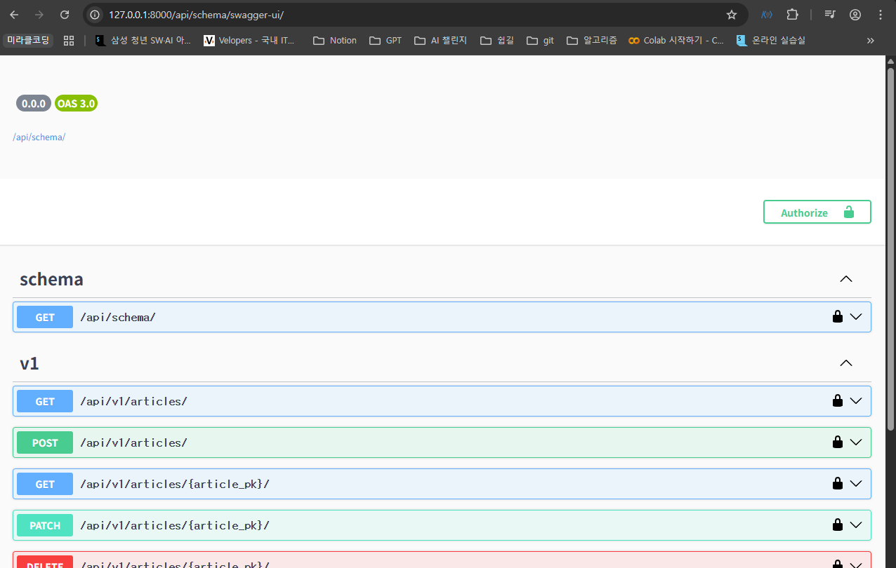
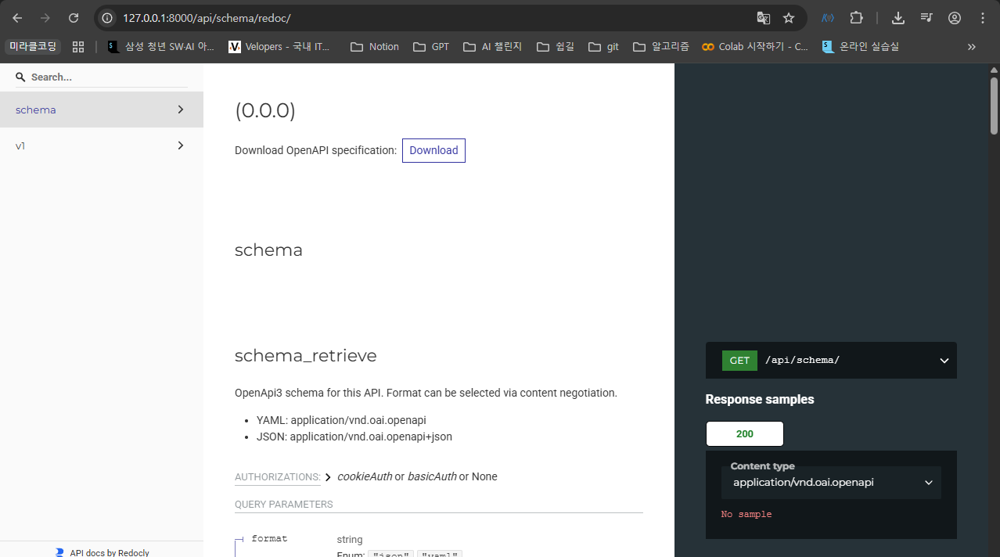

# DRF API 문서화 (drf-spectacular)

## API 문서화의 필요성

### OpenAPI Specification (OAS)

- RESTful API를 설명하고 시각화하는 표준화된 방법
- “설계 우선” 접근법: API를 먼저 설계하고 명세를 작성한 후, 이를 기반으로 코드를 구현하는 방식
- OAS 기반 API에 대한 문서를 생성하는 데 도움을 주는 오픈소스 프레임워크
    - Swagger-UI, Redoc

## drf-spectacular 

### 라이브러리 설치 및 기본 설정

- DRF를 위한 OpenAPI 3.0 구조 생성을 도와주는 라이브러리

[https://github.com/tfranzel/drf-spectacular](https://github.com/tfranzel/drf-spectacular)

```bash
$ pip install drf-spectacular
```

```python
# settings.py
INSTALLED_APPS = [
    'articles',
    'rest_framework',
    'drf_spectacular',
    ...
]

REST_FRAMEWORK = {
    # YOUR SETTINGS
    'DEFAULT_SCHEMA_CLASS': 'drf_spectacular.openapi.AutoSchema',
}
```

### 적용 및 확인

```python
# drf/urls.py
from django.contrib import admin
from django.urls import path, include
from drf_spectacular.views import SpectacularAPIView, SpectacularRedocView, SpectacularSwaggerView

urlpatterns = [
    path("admin/", admin.site.urls),
    path('api/v1/', include('articles.urls')),

    # YOUR PATTERNS
    path('api/schema/', SpectacularAPIView.as_view(), name='schema'),
    # Optional UI:
    path('api/schema/swagger-ui/', SpectacularSwaggerView.as_view(url_name='schema'), name='swagger-ui'),
    path('api/schema/redoc/', SpectacularRedocView.as_view(url_name='schema'), name='redoc'),
]
```



[http://127.0.0.1:8000/api/schema/swagger-ui/](http://127.0.0.1:8000/api/schema/swagger-ui/)



[http://127.0.0.1:8000/api/schema/redoc/](http://127.0.0.1:8000/api/schema/redoc/)
