# DRF - ModelSerializer

## DRF with Single Model

### Django REST Framework

- Django에서 RESTful API 서버를 쉽게 구축할 수 있도록 도와주는 오픈소스 라이브러리
- 복잡한 API 서버 개발 과정을 표준화하고 자동화하여 초보자도 빠르고 안정적으로 RESTful 구조를 구현할 수 있도록 도와주는 개발 도구 세트

```bash
pip install djangorestframework
```

```python
# settings.py
INSTALLED_APPS = [
    ...
    'rest_framework',
]
```

```python
# urls.py
urlpatterns = [
    ...
    path('api-auth/', include('rest_framework.urls'))
]
```

### Postman

- API 응답 결과를 볼 수 있는 프로그램

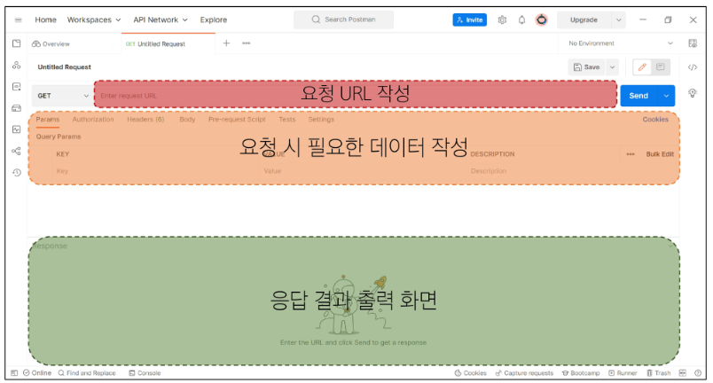
postman 화면 구성

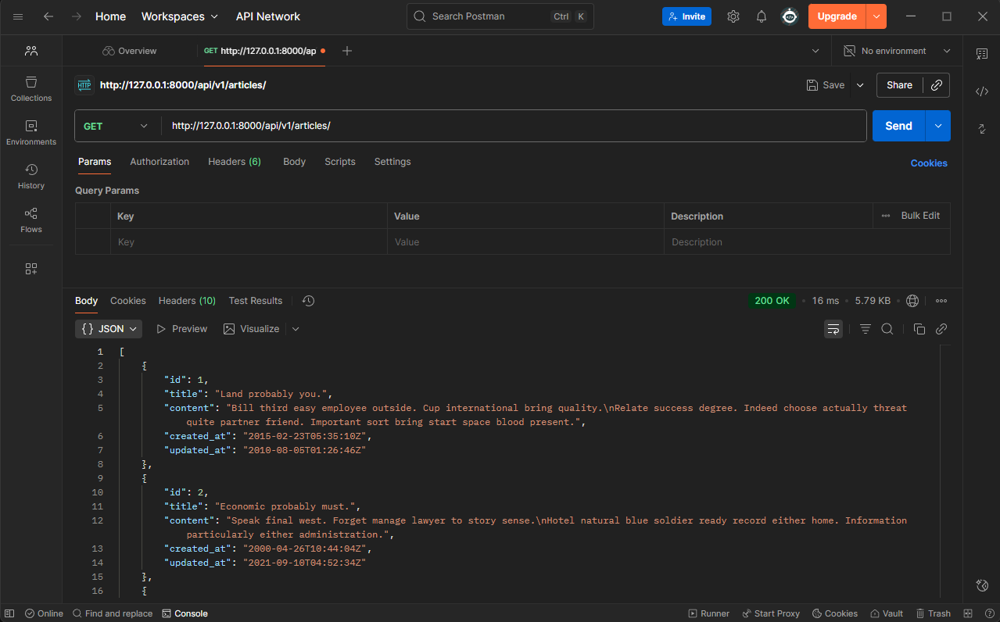
실행 예시

### Serialization

- 여러 시스템에서 활용하기 위해 **데이터 구조나 객체 상태를 재구성할 수 있는 포맷으로 변환**하는 과정
    - 어디서든 읽고 사용할 수 있게 만드는 공통 언어로의 번역
- 변환된 데이터는 다른 프로그램, 다른 언어, 다른 컴퓨터에서도 다시 원래의 구조로 복원할 수 있다.
- DB → Serialization → Serialized data → Client 재구성

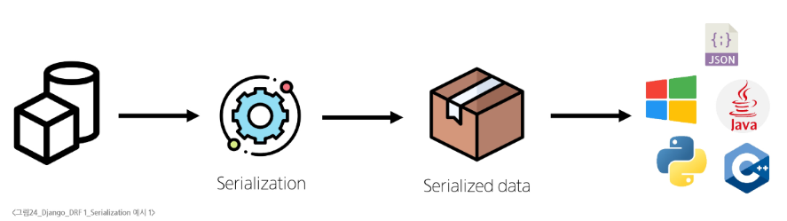

### **ModelSerializer**

- serializer: serialization을 진행하여 serialized data를 반환해주는 클래스
    - 값 검증, 데이터 구조 정의, 모델 연동까지 담당한다.
- **ModelSerializer**: Django 모델과 연결된 Serializer 클래스
    - 사용자 입력 데이터를 받아 자동으로 모델 필드에 맞추어 Serialization을 진행한다.
- 폼을 사용하는 Django 웹 개발과 동일하게, API 기반 개발에서는 Serializer가 데이터 입출력의 중심
- `serializers.py` 파일을 생성하여 작성

```python
# articles/serializers.py
from rest_framework import serializers
from .models import Article

class ArticleSerializer(serializers.ModelSerializer):
    
    class Meta:
        model = Article
        fields = '__all__'
```

## CRUD with ModelSerializer

- 기능이 아닌 자원의 위치만 URL로 표현하고, 동작은 HTTP 메서드로 구분할 것

|  | GET | POST | PUT | DELETE |
| --- | --- | --- | --- | --- |
| `articles/` | 전체 글 조회 | 글 작성 | 전체 글 수정 | 전체 글 삭제 |
| `articles/1/` | 1번 글 조회 | - | 1번 글 수정 | 1번 글 삭제 |

### GET (조회)

```python
# articles/serializers.py
from rest_framework import serializers
from .models import Article
    
class ArticleSerializer(serializers.ModelSerializer):
    
    class Meta:
        model = Article
        fields = '__all__'
        
        
class ArticleListSerializer(serializers.ModelSerializer):
    
    class Meta:
        model = Article
        fields = ('id', 'title', 'content',)
```

```python
# articles/urls.py
urlpatterns = [
		# 전체 게시글 조회/수정/삭제/작성
    path('articles/', views.article_list),
    # 단일 게시글 조회/수정/삭제
    path('articles/<int:article_pk>/', views.article_detail),
]
```

- Django의 template이 없어졌기 때문에 `app_name`, `name`은 사용하지 않는다

**전체 게시글 조회**

```python
# articles/views.py
from rest_framework.decorators import api_view
from rest_framework.response import Response
from .models import Article
from .serializers import ArticleListSerializer

# DRF의 모든 뷰 함수는 반드시 api_view 데코레이터가 필수!
@api_view(['GET'])
def article_list(request):
    # 전체 게시글 데이터 조회
    articles = Article.objects.all()
    # Serialization 진행
    serializer = ArticleListSerializer(articles, many=True)
    # serializer 덩어리에서 json만 추출 (.data 속성)한 것을 응답
    return Response(serializer.data)

```

- `many=True`: serialize 대상이 여러 개 (QuerySet)인 경우
    - 기본 값은 False
- `@api_view`: DRF view 함수가 응답해야 하는 HTTP 메서드 목록을 작성
    - DRF view 함수에서 필수로 작성해야 한다.
    - 목록에 추가하지 않은 다른 메서드 요청에 대해서는 `405 Method Not Allowed` 응답

**단일 게시글 조회**

```python
# articles/views.py
from rest_framework.decorators import api_view
from rest_framework.response import Response
from .models import Article
from .serializers import ArticleListSerializer, ArticleSerializer

...
@api_view(['GET'])
def article_detail(request, article_pk):
    # 단일 게시글 데이터 조회
    article = Article.objects.get(pk=article_pk)
    # Serialization 진행
    serializer = ArticleSerializer(article)
    # serializer 덩어리에서 json만 추출 (.data 속성)한 것을 응답
    return Response(serializer.data)
```

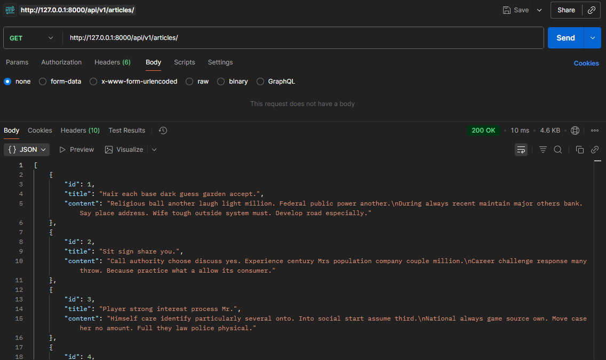
전체 게시글 GET 실행 결과

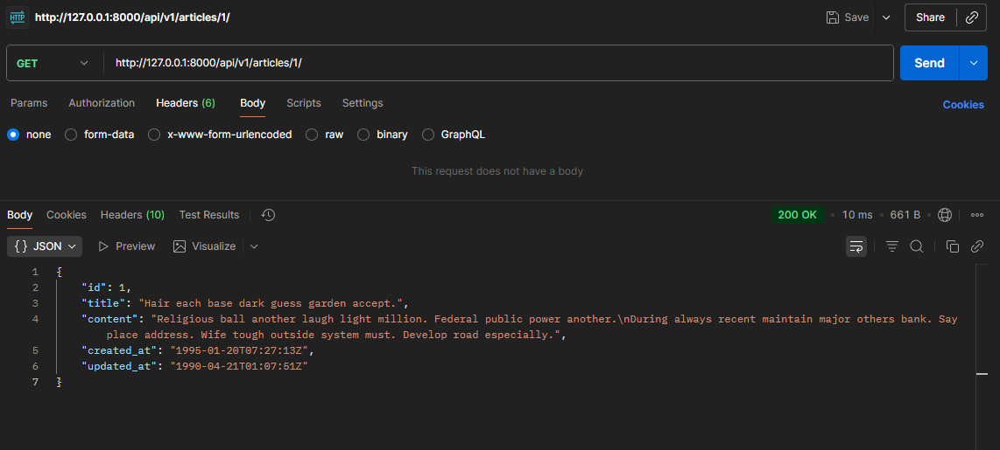
단일 게시글 GET 실행 결과

### POST (생성)

- 데이터 생성이 성공했을 경우 `201 Created` 응답
- 데이터 생성이 실패했을 경우 `400 Bad request` 응답

```python
from rest_framework import status

@api_view(['GET', 'POST'])
def article_list(request):
    if request.method == 'GET':
        articles = Article.objects.all()
        serializer = ArticleListSerializer(articles, many=True)
        return Response(serializer.data)
    
    elif request.method == 'POST':
        # 예전 코드
        # form = ArticleForm(request.POST)
        # 사용자가 보낸 입력 데이터를 직렬화
        serializer = ArticleSerializer(data=request.data) 
        # 직렬화된 데이터를 유효성 검사
        if serializer.is_valid():
            # 저장
            serializer.save()
            # 저장이 성공했다는 응답 (201)
            return Response(serializer.data, status=status.HTTP_201_CREATED)
        # 저장이 실패했다는 응답 (400)
        return Response(serializer.errors, status=status.HTTP_400_BAD_REQUEST)
```

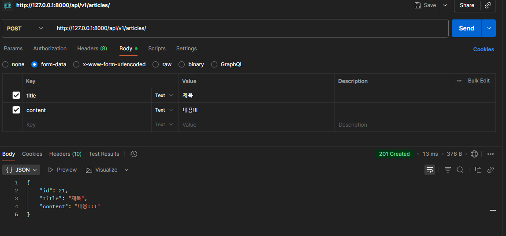
POST 실행 결과 (성공)

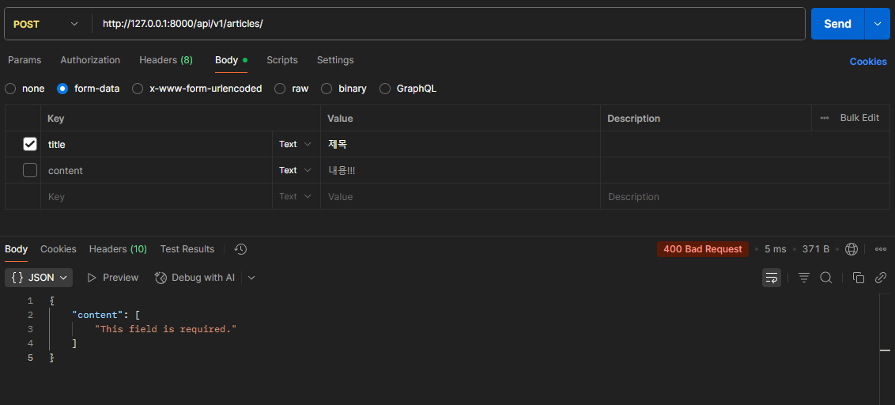
POST 실행 결과 (실패)

- `is_valid(raise_exception=True)`: 유효성 검사를 통과하지 못할 경우 ValidationError 예외 발생
- DRF에서 제공하는 기본 예외 처리기에 의해 자동으로 처리되며 기본적으로 HTTP 400 응답을 반환

```python
@api_view(['GET', 'POST'])
def article_list(request):
    ...
    elif request.method == 'POST':
        serializer = ArticleListSerializer(data=request.data)
        if serializer.is_valid(raise_exception=True):
            serializer.save()
            return Response(serializer.data, status=status.HTTP_201_CREATED)
        # raise_exception이 아래 Response 역할을 대신함
        # return Response(serializer.errors, status=status.HTTP_400_BAD_REQUEST)

```

### DELETE (삭제)

- 요청에 대한 데이터 삭제가 성공했을 경우는 `204 No Content` 응답 (본문 없음)

```python
@api_view(['GET', 'DELETE'])
def article_detail(request, article_pk):
    article = Article.objects.get(pk=article_pk)
    if request.method == 'GET':
        serializer = ArticleSerializer(article)
        return Response(serializer.data)
    
    elif request.method == 'DELETE':
        article.delete()
        return Response(status=status.HTTP_204_NO_CONTENT)
```

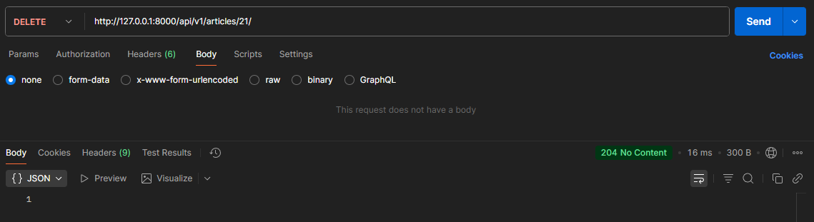

DELETE 실행 결과

- 삭제된 객체의 정보를 함께 반환해야 하는 경우 200 OK로 응답
    - 사용자에게 피드백을 주기 위해 (예: 게시글 ‘django 소개’가 삭제되었습니다.)

```python
@api_view(['GET', 'DELETE'])
def article_detail(request, article_pk):
    article = Article.objects.get(pk=article_pk)
		...
    elif request.method == 'DELETE':
        pk = article.pk
        title = article.title
        article.delete()
        data = {
            'message': f'{pk}번 게시글 "{title}"이 삭제되었습니다.',
        }
        return Response(data, status=status.HTTP_200_OK)
```

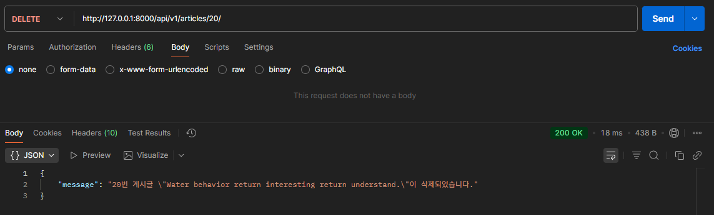
DELETE -200 OK 실행 결과

### PUT (수정)

```python
@api_view(['GET', 'DELETE', 'PUT'])
def article_detail(request, article_pk):
    ...
    elif request.method == 'PUT':
        # 예전 코드
        # form = ArticleForm(request.POST, instance=article)
        # 사용자로부터 새로운 입력 데이터를 받아 직렬화 진행 (+ 기존 데이터)
        serializer = ArticleSerializer(article, data=request.data)
        # 데이터 일부만 수정하려면 partial=True를 설정해야 함
        # PUT에 partial 인자는 권장하지 않는 조합 -> PATCH method 사용
        # serializer = ArticleSerializer(instance=article, data=request.data, partial=True)
        # 직렬화 결과를 유효성 검사
        if serializer.is_valid():
            serializer.save()
            # 수정이 성공했다는 응답
            return Response(serializer.data)
        # 수정이 실패했다는 응답
        return Response(serializer.errors, status=status.HTTP_400_BAD_REQUEST)
```

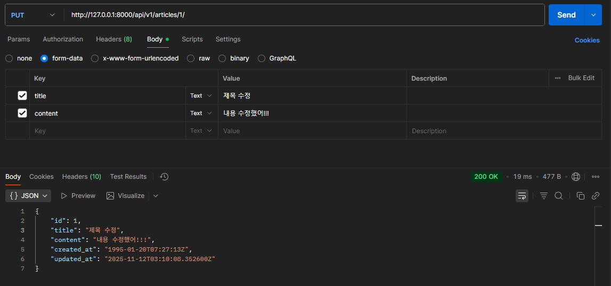
PUT 실행 결과 (성공)

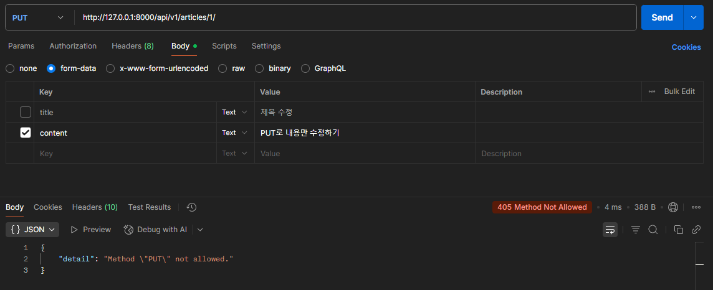
PUT 실행 결과 (실패)

### PATCH (일부 수정)

- `partial=True`: 부분 수정

```python
@api_view(['GET', 'DELETE', 'PATCH'])
def article_detail(request, article_pk):
    ...
    elif request.method == 'PATCH':
        # 사용자로부터 새로운 입력 데이터를 받아 직렬화 진행 (+ 기존 데이터)
        serializer = ArticleSerializer(instance=article, data=request.data, partial=True)
        # 직렬화 결과를 유효성 검사
        if serializer.is_valid():
            serializer.save()
            # 수정이 성공했다는 응답
            return Response(serializer.data)
        # 수정이 실패했다는 응답
        return Response(serializer.errors, status=status.HTTP_400_BAD_REQUEST)
```

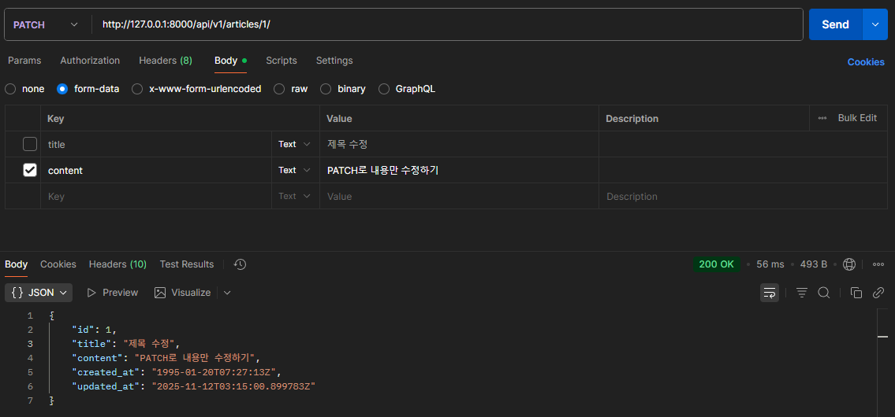
PATCH 실행 결과

### PUT vs. PATCH

| 항목 | PUT | PATCH |
| --- | --- | --- |
| 수정 대상 | 전체 리소스 | 리소스의 일부 필드 |
| 요청 데이터 요구 | 모든 필수 필드 포함 | 수정할 필드만 포함 가능 |
| 사용 목적 | 전체 덮어쓰기 (교체) | 부분 수정 (일부 필드만 갱신) |
| DRF 설정 | 기본 `partial=False` | 반드시 `partial=True` 필요 |
