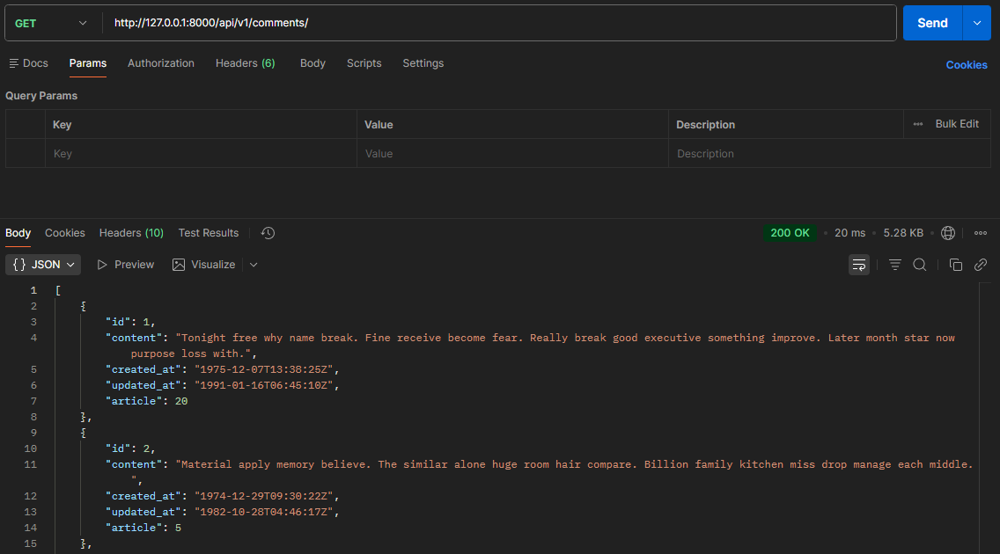
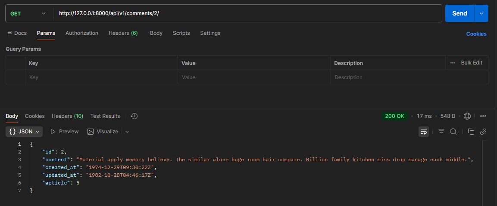
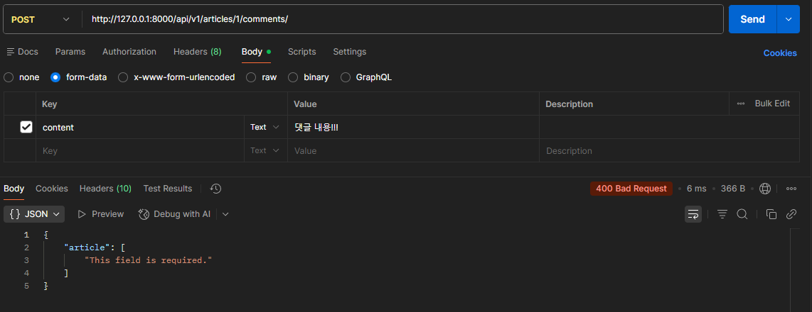
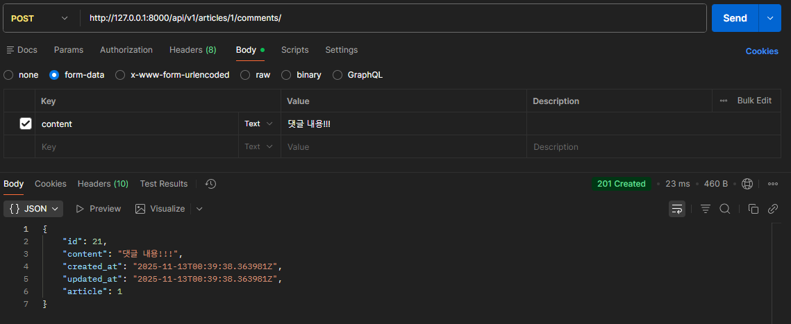
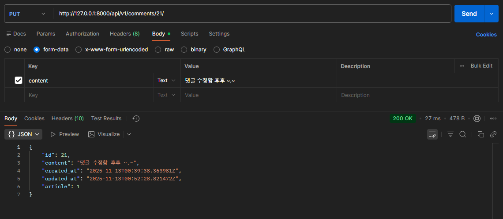
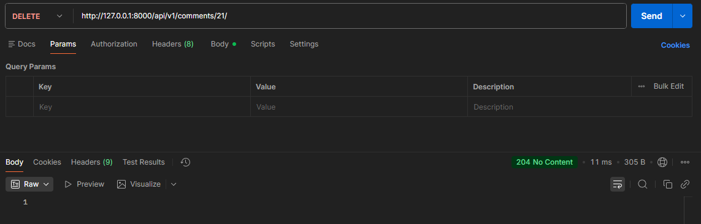
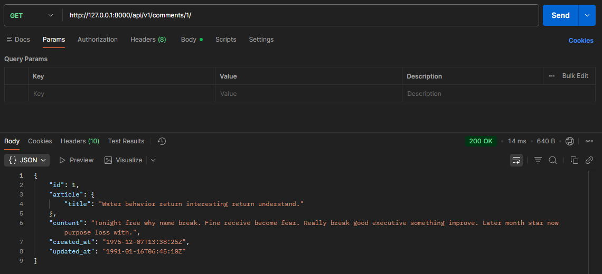
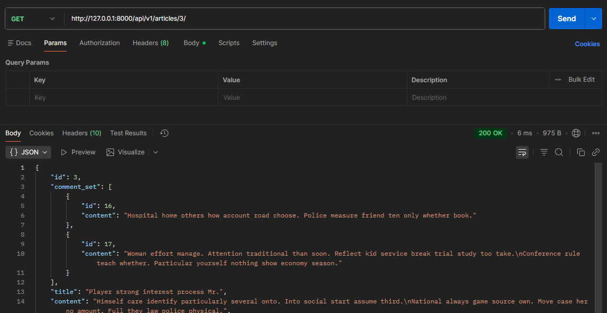
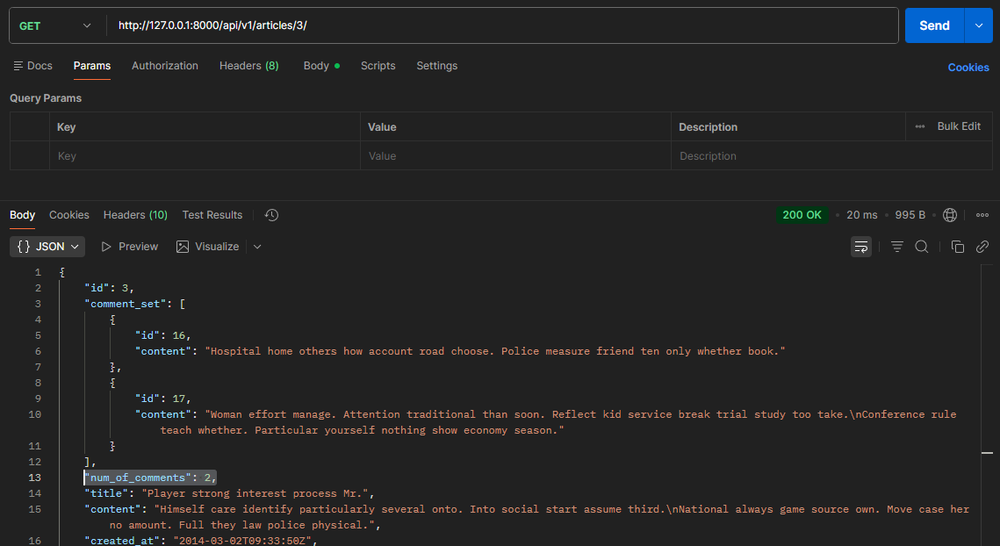

# DRF - N:1 관계 데이터 처리 및 재구성

## DRF N:1 관계 CRUD

### URL 및 HTTP Request method 구성

| URL | GET | POST | PUT | DELETE |
| --- | --- | --- | --- | --- |
| `comments/` | 댓글 목록 조회 |  |  |  |
| `comments/1/` | 단일 댓글 조회 |  | 단일 댓글 수정 | 단일 댓글 삭제 |
| `articles/1/comments` |  | 댓글 생성 |  |  |

### GET method

#### ModelSerializer 클래스 생성

```python
# articles/serializers.py
from rest_framework import serializers
from .models import Article, Comment

class CommentSerializer(serializers.ModelSerializer):
    
    class Meta:
        model = Comment
        fields = '__all__'
```

#### 전체 댓글 조회

```python
# articles/urls.py
urlpatterns = [
    ...
    path('comments/', views.comment_list),
]
```

```python
# articles/views.py
from .models import Article, Comment
from .serializers import ArticleListSerializer, ArticleSerializer, CommentSerializer

@api_view(['GET'])
def comment_list(request):
    # 전체 댓글 조회
    comments = Comment.objects.all()
    # 전체 댓글 쿼리셋 데이터를 serialize
    serializer = CommentSerializer(comments, many=True)
    # 가공된 데이터 덩어리에서 json 데이터를 추출
    return Response(serializer.data)
```


전체 댓글 조회

#### 단일 댓글 조회

```python
urlpatterns = [
    ...
    path('comments/<int:comment_pk>/', views.comment_detail),
]
```

```python
@api_view(['GET'])
def comment_detail(request, comment_pk):
    # 단일 댓글 조회
    comment = Comment.objects.get(pk=comment_pk)
    # 단일 댓글 데이터를 serialize
    serializer = CommentSerializer(comment)
    # 가공된 데이터 덩어리에서 json 데이터를 추출
    return Response(serializer.data)
```


단일 댓글 조회

### POST method

#### 단일 댓글 생성

```python
# articles/urls.py
urlpatterns = [
    ...
    path('articles/<int:article_pk>/comments/', views.comment_create),
]
```

```python
# articles/views.py
@api_view(['POST'])
def comment_create(request, article_pk):
    # 단일 게시글 조회
    article = Article.objects.get(pk=article_pk)
    # 사용자 입력 데이터를 받아서 serialize
    serializer = CommentSerializer(data=request.data)
    # 유효성 검사
    if serializer.is_valid(raise_exception=True):
        serializer.save()
        return Response(serializer.data, status=status.HTTP_201_CREATED)
```


단일 댓글 생성 시 오류 발생: is_valid == False

⇒ article 필드(FK)가 비어있어서 400 Bad Request 오류 발생

- **유효성 검사 목록에서 외래키를 제외**해야 한다!
    - 그러나 ModelSerializer 필드에서 제외하면, 외래키를 영영 설정하지 못함…
- 최종 제공 데이터에는 외래키를 포함시켜야 한다!
    - article field를 **읽기 전용 필드**로 설정하기!

### `read_only_fields` (읽기 전용 필드)

- 서버가 조회 요청에 대한 응답 시에만 값을 표시하는 필드
- 데이터를 전송받은 시점에 **유효성 검사에서 제외**시키고, **데이터 조회 시에는 출력**한다.
- 읽기 전용 필드를 사용하지 않으면, 유효성 검사를 통과하지 못해 400 에러 발생
- 생성(POST), 수정(PUT) 요청 모두에서 적용 가능하다.
- 사용 목적:
    - 클라이언트 측에서 직접 수정하면 안 되는 경우
    - 서버 로직에 의해 자동 생성, 관리되는 값 활용
    - 입력은 받지 않지만 정보를 제공해야 하는 경우
    - 새로운 필드 값(추가 계산, 가공)을 만들어 제공해야 하는 경우

```python
# articles/serializers.py

class CommentSerializer(serializers.ModelSerializer):
    
    class Meta:
        model = Comment
        fields = '__all__'
        read_only_fields = ('article',)
```


단일 댓글 생성

- `read_only_fields`: 기존 외래 키 필드 값을 그대로 응답 데이터에 제공하기 위해 지정하는 경우
- `read_only`: 기존 외래 키 필드 값의 결과를 다른 값으로 덮어쓰는 경우
    - 새로운 응답 데이터 값을 제공하는 경우

### DELETE & PUT method

#### 단일 댓글 삭제 및 수정

```python
# articles/views.py

@api_view(['GET', 'PUT', 'DELETE'])
def comment_detail(request, comment_pk):
    # 단일 댓글 조회
    comment = Comment.objects.get(pk=comment_pk)
    
    if request.method == 'GET':
        # 단일 댓글 데이터를 serialize
        serializer = CommentSerializer(comment)
        # 가공된 데이터 덩어리에서 json 데이터를 추출
        return Response(serializer.data)
    
    elif request.method == 'PUT':
        # 사용자 입력 데이터 + 기존 댓글 데이터를 함께 직렬화
        serializer = CommentSerializer(comment, data=request.data)
        # 유효성 검사
        if serializer.is_valid(raise_exception=True):
            serializer.save()
            return Response(serializer.data)
        
    elif request.method == 'DELETE':
        comment.delete()
        return Response(status=status.HTTP_204_NO_CONTENT)
```


단일 댓글 수정


단일 댓글 삭제

## 응답 데이터 재구성

### 역참조 데이터 구성 (Nested Serializers)

- 게시글 번호만 제공해주는 것이 아닌, 게시글 제목까지 제공하기
- Serializer는 DRF에서 응답 구조를 결정하는 주체
    - article 필드가 id가 아닌 게시글의 제목을 보여주도록 지정할 수 있다.
    - CommentSerializer에서만 사용할 용도이므로, 내부에 정의한다.
    - Comment 모델의 **article 필드를 ArticleTitleSerializer로 재정의**
- 특정 필드를 재정의 혹은 추가한 경우 `read_only_fields`는 동작하지 않는다!
    - 새로운 필드에 **`read_only`키워드 인자**를 작성해야 한다.

```python
# articles/serializers.py
class CommentSerializer(serializers.ModelSerializer):
    
    # 게시글의 제목만 직렬화 해주는 도구
    class ArticleTitleSerializer(serializers.ModelSerializer):
        class Meta:
            model = Article
            fields = ('title',)
    
    # article 필드에 대한 데이터 재정의 (덮어쓰기)
    article = ArticleTitleSerializer(read_only=True)
    
    class Meta:
        model = Comment
        fields = '__all__'
        # read_only_fields = ('article',)
```


article 필드 재정의

### 댓글 목록 (역참조)

- Nested relationships (역참조 매니저 활용)
    - 모델 관계 상으로 참조하는 대상(N)은 참조되는 대상(1)의 표현에도 포함되거나 중첩될 수 있다.
    - Article은 자신을 참조하고 있는 comment들에 대한 정보(예: comment_set)를 **역참조 매니저**를 통해 표현할 수 있다.
    - 단, 역참조 매니저 이름과 동일한 이름으로 작성해야 한다!!
    - `many=True`, `read_only=True` 필수 작성

```python
# articles/serializers.py

class ArticleSerializer(serializers.ModelSerializer):
    
    class CommentDetailSerializer(serializers.ModelSerializer):
        class Meta:
            model = Comment
            fields = ('id', 'content',)
    
    # 역참조 매니저 이름으로 응답에 제공할 필드를 재정의
    # (주의! 역참조 매니저 이름이 아니면 동작하지 않음)
    
    # 만약 comment_set이 아닌 다른 이름으로 사용하고 싶다면
    # models.py에서 외래키 필드에서 related_name 설정으로 변경하고,
    # 여기서도 related_name의 값으로 변경해야 한다.
    comment_set = CommentDetailSerializer(many=True, read_only=True)

    class Meta:
        model = Article
        fields = '__all__'
```


단일 게시글 조회 시 댓글 내용도 함께 응답

### 댓글 개수 (역참조 + SerializerMethodField)

- 댓글의 개수를 직접 계산해서 응답에 포함시켜야 한다.
- `annotate`: SQL의 집계 함수를 활용하여 쿼리 단계에서 데이터 가공을 수행
    - 실제 모델 필드를 생성하지 않는다.
    - 쿼리 시점에만 존재하는 임시 필드를 추가한다.
    - `'comment'`는 Comment 모델이 ForeignKey(article=…)로 Article을 참조할 때 자동 생성되는 역참조 매니저 이름

```python
# articles/views.py
from django.db.models import Count

@api_view(['GET', 'DELETE', 'PATCH'])
def article_detail(request, article_pk):
    # 단일 게시글 조회
    # article = Article.objects.get(pk=article_pk)
    
    # 단일 게시글 조회 + 이 게시글에 작성된 댓글의 개수 데이터
    article = Article.objects.annotate(num_of_comments=Count('comment')).get(pk=article_pk)
    
    if request.method == 'GET':
        # 조회 한 결과를 직렬화
        serializer = ArticleSerializer(article)
        return Response(serializer.data)

    elif request.method == 'DELETE':
        article.delete()
        return Response(status=status.HTTP_204_NO_CONTENT)

    elif request.method == 'PATCH':
        # 1. 사용자로부터 새로운 입력 데이터를 받아 직렬화 진행(+ 기존 데이터)
        # 데이터 일부만 수정하려면 partial=True를 설정해야 함
        serializer = ArticleSerializer(article, data=request.data, partial=True)
        # serializer = ArticleSerializer(instance=article, data=request.data)
        # 2. 직렬화 결과를 유효성 검사
        if serializer.is_valid():
            serializer.save()
            # 3. 수정이 성공했다는 응답
            return Response(serializer.data)
        # 4. 수정이 실패했다는 응답
        return Response(serializer.errors, status=status.HTTP_400_BAD_REQUEST)
```

- `SerializerMethodField`: 동적으로 계산된 필드를 응답에 포함하는 필드
    - `__all__`은 모델의 필드 기준으로 작동하기 때문에 `annotate`로 만들어진 필드인 `num_of_comments`는 포함되지 않는다.
    - **읽기 전용 필드**를 커스터마이징하는 데 사용한다.
    - **`get_<필드명>` 메서드**를 정의하면, 해당 메서드의 반환 값이 직렬화 결과에 포함된다.

```python
# articles/serializers.py
class ArticleSerializer(serializers.ModelSerializer):
    
    class CommentDetailSerializer(serializers.ModelSerializer):
        class Meta:
            model = Comment
            fields = ('id', 'content',)
    
    # 역참조 매니저 이름으로 응답에 제공할 필드를 재정의
    # (주의! 역참조 매니저 이름이 아니면 동작하지 않음)
    
    # 만약 comment_set이 아닌 다른 이름으로 사용하고 싶다면
    # models.py에서 외래키 필드에서 related_name 설정으로 변경하고,
    # 여기서도 related_name의 값으로 변경해야 한다.
    comment_set = CommentDetailSerializer(many=True, read_only=True)

    # 댓글 개수를 제공할 새로운 읽기 전용 필드를 정의
    num_of_comments = serializers.SerializerMethodField()

    class Meta:
        model = Article
        fields = '__all__'
    
    def get_num_of_comments(self, obj):
        # obj는 Serializer가 처리하는 Article 인스턴스
        # view에서 annotate한 필드를 그대로 사용 가능
        return obj.num_of_comments
```


단일 게시글 조회 시 댓글 개수도 함께 응답

### SerializerMethodField

- Serializer에서 추가적인 데이터 가공을 하고 싶을 때 사용
- Serializer 클래스 내에서 필드로 선언하면, DRF는 `get_<필드명>` 이름을 가진 메서드를 자동으로 찾고
- 해당 값을 직렬화 결과에 넣어준다.
- obj는 현재 직렬화 중인 모델 인스턴스
    - 이 메서드에서 obj의 속성이나 annotate된 필드를 활용해 새 값을 만들 수 있다.
- 읽기 전용!!!
- 생성(POST), 수정(PUT) 요청 시에는 사용되지 않는다.


## 참고

### 올바르게 404 응답하기

`get_object_or_404()`

- 모델 manager objects에서 get()을 호출하지만, 해당 객체가 없을 땐 기존 DoesNotExist 예외 대신 HTTP 404를 raise한다.

```python
# articles/views.py
# 기존 작성 방식
# 조회 대상이 없는 경우, 500 Server Error 반환
article = Article.objects.get(pk=article_pk)
comment = Comment.objects.get(pk=comment_pk)

# get_object_or_404 적용
# 조회 대상이 없는 경우, 404 Not Found 반환
from django.shortcuts import get_object_or_404

article = get_object_or_404(Article, pk=article_pk)
article = get_object_or_404(
		Article.objects.annotate(num_of_comments=Count('comment')), 
		pk=article_pk,
)
comment = get_object_or_404(Comment, pk=comment_pk)
```

`get_list_or_404()`

- 모델 manager objects에서 filter()의 결과를 반환하고, 해당 객체 목록이 없을 땐 HTTP 404를 raise한다.

```python
# articles/views.py
# 기존 작성 방식
# 조회 대상 목록이 없어도 200 OK 반환
article = Article.objects.all()
commet = Comment.objects.all()

# get_list_or_404 적용
# 조회 대상이 없는 경우, 404 Not Found 반환
from django.shortcuts import get_list_or_404

article = get_list_or_404()
comment = get_list_or_404()
```

### View와 Serializer의 역할

- view나 queryset: 비지니스 로직(데이터 가공, annotate, 필터링)을 처리
- serializer: 그 결과물을 직렬화하는 역할에 집중

⇒ **복잡한 query나 로직은 View 함수에서** 진행한다!

- 여러 모델을 조인하거나 복잡한 집계가 필요한 경우 view 함수에서 처리한다.
- 필요한 경우 view 함수에서 select_related()나 prefetch_related()를 사용하여 query를 최적화한다.
