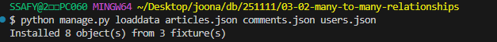

## Fixtures

### Fixtures

- django 개발 시 **데이터베이스 초기화 및 공유**를 위해 사용되는 파일 형식
- 초기 데이터 (initial data) 세팅: 웹 서비스가 처음 시작할 때 기본 데이터 (기본 권한 그룹, 상품 카테고리 등)를 미리 세팅할 수 있다.
- 테스트 샘플 데이터 준비: 테스트할 때, 항상 동일하고 예측 가능한 데이터 환경을 구축하여 테스트의 신뢰성과 반복 가능성을 높이는 데 활용
- 협업 시 동일한 데이터 환경 맞추기
    - 팀원들이 각자의 개발 환경을 설정할 때, 모두 동일한 초기 데이터나 특정 테스트데이터셋을 쉽게 공유하고 적용
    - 개발 환경 간의 일관성을 유지하고 협업 효율을 높이는 데 도움을 준다.

### dumpdata

```bash
$ python manage.py dumpdata [앱이름.모델이름] [옵션] > 추출파일명.json

$ python manage.py dumpdata --indent 4 articles.article > articles.json

# 모델 3개를 json 파일 1개로 추출
python manage.py dumpdata --indent 4 articles.article articles.comment accounts.user > data.json
```

- 데이터베이스에서 데이터를 내보낼 때 사용하는 명령어
- 주로 JSON 파일 형태로 추출한다.
- 특정 테이블의 데이터만 추출 가능
    - 데이터베이스 변경이 잦은 경우 전체 추출보다는 앱 단위 또는 모델 단위로 관리하는 편이 유지보수에 용이하다.
- `--indent 4`: 들여쓰기를 4칸으로 지정하는 옵션

### loaddata

- 데이터베이스에 데이터를 불러올 때 사용하는 명령어
- 내보내기 형태로 저장된 JSON을 읽어와서 데이터베이스에 저장한다.
- fixtures 파일의 기본 경로: `app_name/fixtures/`
    - django는 설치된 모든 app의 디렉토리에서 fixtures 폴더 이후의 경로로 fixtures파일을 찾아 load를 진행한다.

```bash
$ python manage.py loaddata 파일경로

$ python manage.py loaddata articles.json comments.json users.json
```



- 파일을 한 번에 작성하면, django가 **자동으로 우선 순위가 높은 파일부터** 불러온다.
    - json 파일의 작성 순서는 상관없다.
- 단, loaddata를 파일별로 별도로 실행한다면 모델 관계에 따라 load 순서가 중요할 수 있다.
    - 예: user → article → comment 순으로 로드해야 오류가 발생하지 않음
- loaddata를 실행하기 전에 해당 모델에 대한 마이그레이션이 완료되어 있어야 한다.
- 같은 PK를 가진 데이터가 이미 있는 경우 중복 에러가 발생할 수 있다.
    - 이 경우 기존 데이터를 지우거나, 새로운 Fixture 파일을 사용해야 한다.
