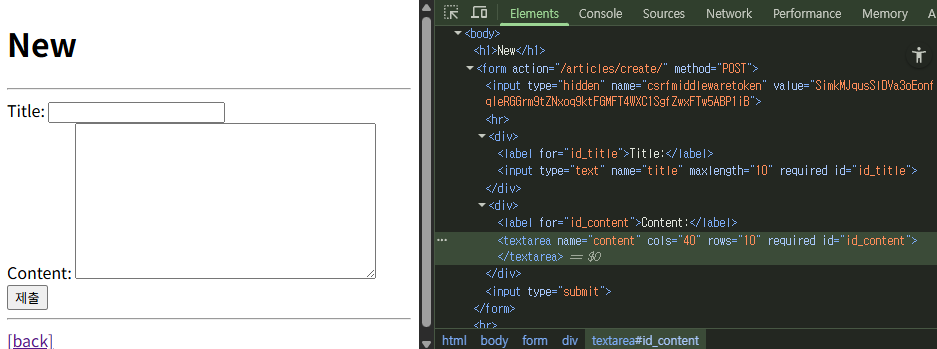
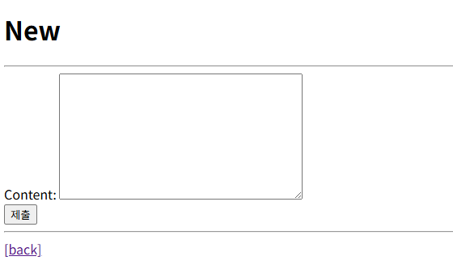
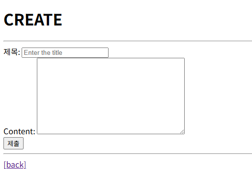
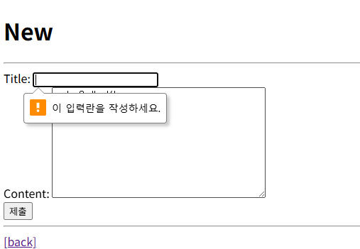
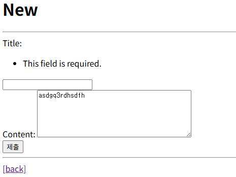

## Django Form

### 유효성 검사

수집한 데이터가 정확하고 유효한지 확인하는 과정

- HTML <form> 태그의 한계: 비정상적인 혹은 악의적인 요청을 필터링할 수 없다.
- Django Form의 유효성 검사: 사용자가 입력한 데이터가 올바른 형식인지 **자동으로 점검**
    - 필수 입력 값이 비어있거나, 잘못된 이메일 형식을 입력하면 오류를 알려준다.

### Django Form Class

사용자 입력 데이터를 수집하고 **처리 및 유효성 검사**를 수행하기 위한 도구

- Form class를 상속받아 정의한다.
- Model class를 정의할 때와 유사한 방법

```python
# articles/forms.py

from django import forms

class ArticleForm(forms.Form):
	title = forms.CharField(max_length=10)
	content = forms.CharField()
```

```python
# articles/views.py
from .forms import ArticleForm

...
def new(request):
    """새로운 게시글을 작성할 수 있는 new.html 페이지를 렌더링"""
    # 사용자가 데이터를 입력할 수 있는 빈 form 페이지를 보여주는 역할만 함
    form = ArticleForm()
    context = {
        'form': form,
    }
    return render(request, 'articles/new.html', context)
```

```html
<!-- articles/new.html -->
...
<form action="" method="POST">
  {{ form }}
  <input type="submit">
</form>
```



- 코드에는 `{{ form }}`만 작성했는데, 개발자도구를 통해 보면 <div> 태그로 대체됨

### Widgets

HTML ‘input’ element의 표현을 담당한다.

- 단순히 input 요소의 속성 및 출력되는 부분을 변경하는 것

```python
class ArticleForm(forms.Form):
    title = forms.CharField(max_length=10)
    content = forms.CharField(widget=forms.Textarea)
```



### Widgets 응용

```python
class ArticleForm(forms.ModelForm):
    title = forms.CharField(
        label='제목',
        widget=forms.TextInput(
            attrs={
                'class': 'my-title',
                'placeholder': 'Enter the title',
                'maxlength': 10,
            }
        ),
    )

    class Meta:
        model = Article
        fields = '__all__'
```




### Meta class

ModelForm의 정보를 작성하는 곳

- meta data: 데이터에 대한 데이터, 데이터를 설명하는 데이터
- ModelForm 내부에서 어떤 모델과 연결할지, 어떤 필드를 사용할지 등을 정의하는 설정 공간
- Django에서 ModelForm에 대한 추가 정보나 속성을 작성하는 클래스 구조를 Meta 클래스로 작성했을 뿐, 파이썬의 inner class와 같은 문법적인 관점으로 접근하지 말 것
- `fields` 속성: 모델에서 포함하도록 지정
    - `__all__`: 모든 속성
- `exclude` 속성: 모델에서 포함하지 않도록 지정

```python
class ArticleForm(forms.ModelForm):
    class Meta:
        model = Article
        fields = ('content', )
        exclude = ('title', )
```


## ModelForm

Model과 연결된 Form을 자동으로 생성해주는 기능을 제공

- Model과 연결됐다 = Form이 이미 Model의 구조를 알고있다 = input의 정보를 알고있다
- 데이터 수집과 저장 과정을 동시에 처리할 수 있도록 도와준다.

### **Form vs. ModelForm**

|  | Form | ModelForm |
| --- | --- | --- |
| 용도 | 사용자 입력 데이터를 DB에 저장하지 않을 때 | 사용자 입력 데이터를 DB에 저장해야 할 때 |
| 예시 | 검색, 로그인 | 게시글 작성, 회원가입 |

```python
# articles/forms.py
from django import forms
from .models import Article

class ArticleForm(forms.ModelForm):
    class Meta:
        model = Article
        fields = '__all__'
```

```python
# articles/views.py

def create(request):
    """사용자가 form을 통해 제출한 데이터를 DB에 저장"""
    # 1. 사용자 입력 데이터를 통째로 Form 클래스의 인자로 넣어서 인스턴스를 생성
    form = ArticleForm(request.POST)

    # 2. 유효성 검사
    if form.is_valid():
        # 2-1. 유효성 검사 통과하면 저장
        # save 메서드가 저장된 객체를 반환
        article = form.save()
        return redirect('articles:detail', article.pk)

    # 2-2. 유효성 검사 통과하지 못하면?
    # 해당 페이지를 다시 응답 (+ 에러 메세지)
    context = {
        'form': form,
    }
    return render(request, 'articles/new.html', context)

# --- Update ---

def edit(request, pk):
    """기존 게시글을 수정할 수 있는 edit.html 페이지를 렌더링"""
    # 1. 수정할 게시글의 기존 데이터를 pk를 이용해 조회
    article = Article.objects.get(pk=pk)
    form = ArticleForm(instance=article)

    # 2. 조회된 데이터를 form에 미리 채워넣기 위해 context에 담아 템플릿에 전달
    context = {
        'article': article,
        'form': form,
    }
    # 3. edit.html 템플릿을 렌더링
    return render(request, 'articles/edit.html', context)


def update(request, pk):
    """사용자가 form을 통해 제출한 수정 데이터를 DB에 반영(UPDATE)"""
    # 1. 수정할 게시글을 pk를 이용해 조회
    article = Article.objects.get(pk=pk)

    # 2. 사용자가 입력한(수정한) 데이터를 통째로 받음 + 기존 데이터
    form = ArticleForm(request.POST, instance=article)

    # 3. 유효성 검사
    if form.is_valid():
        # 3-1. 검사 통과했을 때
        form.save()
        return redirect('articles:detail', article.pk)

    # 3-2. 검사 통과 못했을 때
    context = {
        'article': article,
        'form': form,
    }
    return render(request, 'articles/edit.html', context)
```

- `is_valid()` 여러 유효성 검사를 실행하고 데이터가 유효한지 여부를 Boolean으로 반환
    - 별도로 명시하지 않았지만 모델 필드에는 기본적으로 빈값을 허용하지 않는 제약조건이 설정되어 있다.
- `save()` 데이터베이스 객체를 만들고 저장하는 ModelForm의 인스턴스 메서드
    - 폼 데이터가 유효한 경우 save() 메서드를 호출하면 모델 인스턴스를 생성하고 데이터베이스에 저장된다.
- `instance`인자를 통해 새 객체 생성과 기존 객체 수정도 구분할 수 있다.
    - instance 인자를 지정하면, 기존 객체를 수정하는 update(갱신) 로직이 실행된다.
    - instance 키워드는 생략할 수 없음 (9번째에 위치하기 때문)

|  |  |
| -- | -- |
| django랑 상관없음. html에서 막은 것. 아무것도 입력하지 않아 제출이 안 된 상태. | 공백을 입력한 경우 제출은 됐지만, django의 유효성 검사를 통과하지 못함. 오류 메세지를 포함하여 redirect 된 상태. |


### HTTP 요청 다루기 (CRUD)

HTTP request method 차이점을 활용해 **동일한 목적을 가지는 2개의 view 함수를 하나로** 구조화

**CREATE: 데이터 생성**

- `new` 함수: **GET** method 요청(조회)만 처리
- `create` 함수: **POST** method 요청(생성)만 처리

```python
# new + create 하나로 결합
def new_create(request):
    # 요청 메서드가 POST라면 (과거 create 함수의 역할)
    if request.method == 'POST':
        form = ArticleForm(request.POST)
        if form.is_valid():
            article = form.save()
            return redirect('articles:detail', article.pk)

    # 요청 메서드가 POST가 아니라면 (과거 new 함수의 역할)
    else:
        form = ArticleForm()

    context = {
        'form': form,
    }
    return render(request, 'articles/create.html', context)
```

**UPDATE: 데이터 수정**

- `edit` 함수: **GET** method 요청(조회)만 처리
- `update` 함수: **POST** method 요청(수정)만 처리

```python
def new_update(request, pk):
    article = Article.objects.get(pk=pk)

    # POST 메서드일 때
    if request.method == 'POST':
        form = ArticleForm(request.POST, instance=article)
        if form.is_valid():
            form.save()
            return redirect('articles:detail', article.pk)

    # POST 메서드가 아닌 경우
    else:
        form = ArticleForm(instance=article)

    context = {
        'article': article,
        'form': form,
    }
    return render(request, 'articles/update.html', context)
```