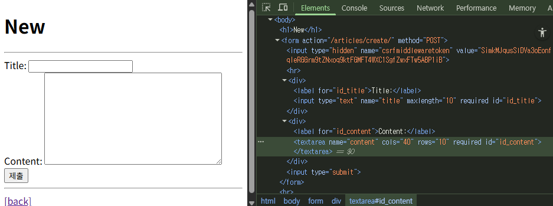

# 스스로 학습
## 실습

### widgets

**1. Specifying the widget directly on the form field:**

```python
from django import forms
from .models import Memo

class MemoForm(forms.ModelForm):
    memo = forms.CharField(
        widget=forms.Textarea(
            attrs={
                'placeholder': 'memo',
                'rows': 50,
                'cols': 5,
            }
        )
    )
    summary = forms.CharField(
        widget=forms.TextInput(
            attrs={
                'placeholder': 'summary',
                'max_length': 20,
            }
        )
    )

    class Meta:
        model = Memo
        fields = '__all__'

```

**2. Specifying widgets within the `Meta` class:**

```python
from django import forms
from .models import Memo

class MemoForm(forms.ModelForm):
    class Meta:
        model = Memo
        fields = '__all__'
        widgets = {
            'memo': forms.Textarea(
                attrs={
                    'placeholder': 'memo',
                    'rows': 50,
                    'cols': 5,
                }
            ),
            'summary': forms.TextInput(
                attrs={
                    'placeholder': 'summary',
                    'max_length': 20,
                }
            )
        }
```

### Bootstrap class

- ModelForm widget을 활용하여 bootstrap form 관련 class를 부여한다.

```python
# menus/models.py
from django.db import models

# Create your models here.
class Menu(models.Model):
    name = models.CharField(max_length=100)
    price = models.DecimalField(max_digits=8, decimal_places=2)
    description = models.TextField()
    is_vegan = models.BooleanField()

    def __str__(self):
        return self.name
```

```python
# menus/forms.py
from django import forms
from .models import Menu

class MenuForm(forms.ModelForm):
    class Meta:
        model = Menu
        fields = '__all__'
        widgets = {
            'name': forms.TextInput(
                attrs={
                    'class': 'form-control',
                    'placeholder': '메뉴 이름을 작성해 주세요.'
                    }
                ),
            'description': forms.Textarea(
                attrs={
                    'class': 'form-control',
                    'placeholder': '메뉴 설명을 작성해 주세요.'
                    }
                ),
            'is_vegan': forms.CheckboxInput(attrs={'class': 'form-check-input'}),
            'price': forms.TextInput(attrs={'class': 'form-control'}),
        }
```


widget 작성 전


widget 작성 후

### RadioSelect

```python
# menus/models.py
from django.db import models

# Create your models here.
class Menu(models.Model):
    CHOICES = [
        (True, 'YES'),
        (False, 'NO'),
    ]

    name = models.CharField(max_length=100)
    price = models.DecimalField(max_digits=8, decimal_places=2)
    description = models.TextField()
    is_vegan = models.BooleanField(choices=CHOICES)

    def __str__(self):
        return self.name
```

**체크박스는 '하나의 독립된 요소'로 취급**되는 반면, **라디오 버튼은 '여러 선택지가 모인 그룹'으로 취급**되기 때문에 렌더링 방식에 차이가 생깁니다.

---

**✅ Checkbox가 `{{ form.as_p }}`에서 괜찮았던 이유: 단일(Single) 위젯**

`is_vegan` 필드를 그냥 두면 Django는 기본적으로 `CheckboxInput` 위젯을 사용합니다.

- **HTML 구조:** `CheckboxInput`은 **단 하나의 `<input type="checkbox">` 태그와 하나의 `<label>` 태그**로 구성됩니다. 매우 단순한 구조죠.
- **렌더링:** `{{ form.as_p }}`는 이 간단한 한 쌍을 `<p>` 태그로 감싸기만 하면 됩니다. Bootstrap의 완벽한 형태(`form-check` div로 감싸는 것)는 아닐지라도, 구조가 워낙 단순해서 화면에 표시될 때 레이아웃이 크게 깨지지 않고 정상적으로 보였던 것입니다.

---

**❌ RadioSelect를 수동으로 수정해야 하는 이유: 다중(Multi-part) 위젯**

`RadioSelect` 위젯은 여러 선택지('YES', 'NO' 등)를 보여줘야 합니다.

- **HTML 구조:** Django는 이 여러 선택지를 구분하기 위해 기본적으로 **`<ul>`(목록)과 `<li>`(목록 아이템) 태그**를 사용하여 그룹으로 묶어버립니다. 즉, 하나의 필드가 여러 개의 HTML 태그 덩어리로 만들어집니다.
- **Bootstrap과의 충돌:** `{{ form.as_p }}`는 이 `<ul>` 목록 전체를 하나의 `<p>` 태그로 감싸버립니다. 하지만 Bootstrap은 `<ul>` 목록이 아니라, **각각의 라디오 버튼과 라벨 쌍이 개별적인 `<div class="form-check">`로 감싸여야** 제대로 된 스타일을 보여줍니다.
- **결과:** Django가 만든 `<ul><li>...</li></ul>` 구조와 Bootstrap이 요구하는 `<div class="form-check">...</div>` 구조가 서로 맞지 않아, 마치 스타일이 전혀 적용되지 않은 것처럼 화면이 깨져 보이게 됩니다. 이 때문에 `for` 반복문으로 각 선택지를 하나씩 꺼내어 Bootstrap이 원하는 HTML 구조로 직접 만들어줘야 했던 것입니다.


widget에서 `'is_vegan': forms.RadioSelect(attrs={'class': 'form-check-input'})` 으로 설정했을 때


widget에서 `'is_vegan': forms.RadioSelect(attrs={'class': 'form-check'})`, models.py에서 is_vegan 필드 `default=None` 으로 설정했을 때

### 필드(Field)와 위젯(Widget)의 역할

Django 폼에서 필드와 위젯은 역할이 나뉘어 있습니다.

- **필드 (`forms.DecimalField`):** 데이터의 유효성 검사 규칙을 담당합니다. (예: "이 값은 숫자여야 한다", "최대 8자리여야 한다" 등)
- **위젯 (`forms.NumberInput`, `forms.TextInput`):** 필드를 HTML로 어떻게 렌더링할지 담당합니다. (예: `<input type="number">`로 만들고, `class="form-control"` 속성을 추가)


현재 코드에서는 유효성 검사를 담당하는 `DecimalField`에 화면 표시를 담당하는 `attrs` 인자를 잘못 전달하여 `TypeError`가 발생한 것입니다.

### error_messages

`ModelForm`이 모델(`models.py`)로부터 `price` 필드의 유효성 검사 규칙(`max_digits`, `decimal_places` 등)을 자동으로 가져오고, 우리가 `Meta` 클래스에 정의한 위젯과 오류 메시지를 그 위에 덧씌워 적용해 줍니다.

```python
# menus/forms.py
from django import forms
from .models import Menu

class MenuForm(forms.ModelForm):
    class Meta:
        model = Menu
        fields = '__all__'
        widgets = {
            'name': forms.TextInput(
                attrs={
                    'class': 'form-control',
                    'placeholder': '메뉴 이름을 작성해 주세요.'
                }
            ),
            'description': forms.Textarea(
                attrs={
                    'class': 'form-control',
                    'placeholder': '메뉴 설명을 작성해 주세요.'
                }
            ),
            'is_vegan': forms.RadioSelect(attrs={'class': 'form-check'}),
            'price': forms.TextInput(attrs={'class': 'form-control'}),
        }

        error_messages = {
            'price': {
                'invalid': '올바른 가격을 입력해 주세요. 예: 12.34',
                'max_digits': '가격은 최대 8자리여야 합니다.',
                'max_decimal_places': '가격은 소수점 이하 두 자리여야 합니다.',
            },
        }

```


### HiddenInput

```python
# todos/forms.py
from django import forms
from .models import Todo

class TodoForm(forms.ModelForm):

    class Meta:
        model = Todo
        fields = '__all__'
        # exclude = ('is_completed', )
        widgets = {
            'is_completed': forms.HiddenInput(),
        }
```

- exclude를 사용하여 'is_completed'필드를 제거한 경우, 해당 컬럼에 삽입되어야 할 데이터가 누락되어 오류가 발생하였다.
- widgets을 활용하여, 'is_completed'필드를 csrf_token과 같이 hidden 타입의 input tag로 변경하여, 보이지 않게 수정한다.
    - 사용자에게 보이지만 않을 뿐, 정상적으로 비어있는 값 (False)가 전송된다.
    - request.POST를 출력하여 전송받은 데이터를 확인 할 수 있다.


<hr>

## Django Form

### 유효성 검사

수집한 데이터가 정확하고 유효한지 확인하는 과정

- HTML <form> 태그의 한계: 비정상적인 혹은 악의적인 요청을 필터링할 수 없다.
- Django Form의 유효성 검사: 사용자가 입력한 데이터가 올바른 형식인지 **자동으로 점검**
    - 필수 입력 값이 비어있거나, 잘못된 이메일 형식을 입력하면 오류를 알려준다.

### Django Form Class

사용자 입력 데이터를 수집하고 **처리 및 유효성 검사**를 수행하기 위한 도구

- Form class를 상속받아 정의한다.
- Model class를 정의할 때와 유사한 방법

```python
# articles/forms.py

from django import forms

class ArticleForm(forms.Form):
	title = forms.CharField(max_length=10)
	content = forms.CharField()
```

```python
# articles/views.py
from .forms import ArticleForm

...
def new(request):
    """새로운 게시글을 작성할 수 있는 new.html 페이지를 렌더링"""
    # 사용자가 데이터를 입력할 수 있는 빈 form 페이지를 보여주는 역할만 함
    form = ArticleForm()
    context = {
        'form': form,
    }
    return render(request, 'articles/new.html', context)
```

```html
<!-- articles/new.html -->
...
<form action="" method="POST">
  {{ form }}
  <input type="submit">
</form>
```



- 코드에는 `{{ form }}`만 작성했는데, 개발자도구를 통해 보면 <div> 태그로 대체됨

### Widgets

HTML ‘input’ element의 표현을 담당한다.

- 단순히 input 요소의 속성 및 출력되는 부분을 변경하는 것

```python
class ArticleForm(forms.Form):
    title = forms.CharField(max_length=10)
    content = forms.CharField(widget=forms.Textarea)
```


### Widgets 응용

```python
class ArticleForm(forms.ModelForm):
    title = forms.CharField(
        label='제목',
        widget=forms.TextInput(
            attrs={
                'class': 'my-title',
                'placeholder': 'Enter the title',
                'maxlength': 10,
            }
        ),
    )

    class Meta:
        model = Article
        fields = '__all__'
```


### Meta class

ModelForm의 정보를 작성하는 곳

- meta data: 데이터에 대한 데이터, 데이터를 설명하는 데이터
- ModelForm 내부에서 어떤 모델과 연결할지, 어떤 필드를 사용할지 등을 정의하는 설정 공간
- Django에서 ModelForm에 대한 추가 정보나 속성을 작성하는 클래스 구조를 Meta 클래스로 작성했을 뿐, 파이썬의 inner class와 같은 문법적인 관점으로 접근하지 말 것
- `fields` 속성: 모델에서 포함하도록 지정
    - `__all__`: 모든 속성
- `exclude` 속성: 모델에서 포함하지 않도록 지정

```python
class ArticleForm(forms.ModelForm):
    class Meta:
        model = Article
        fields = ('content', )
        exclude = ('title', )
```


## ModelForm

Model과 연결된 Form을 자동으로 생성해주는 기능을 제공

- Model과 연결됐다 = Form이 이미 Model의 구조를 알고있다 = input의 정보를 알고있다
- 데이터 수집과 저장 과정을 동시에 처리할 수 있도록 도와준다.

### **Form vs. ModelForm**

|  | Form | ModelForm |
| --- | --- | --- |
| 용도 | 사용자 입력 데이터를 DB에 저장하지 않을 때 | 사용자 입력 데이터를 DB에 저장해야 할 때 |
| 예시 | 검색, 로그인 | 게시글 작성, 회원가입 |

```python
# articles/forms.py
from django import forms
from .models import Article

class ArticleForm(forms.ModelForm):
    class Meta:
        model = Article
        fields = '__all__'
```

```python
# articles/views.py

def create(request):
    """사용자가 form을 통해 제출한 데이터를 DB에 저장"""
    # 1. 사용자 입력 데이터를 통째로 Form 클래스의 인자로 넣어서 인스턴스를 생성
    form = ArticleForm(request.POST)

    # 2. 유효성 검사
    if form.is_valid():
        # 2-1. 유효성 검사 통과하면 저장
        # save 메서드가 저장된 객체를 반환
        article = form.save()
        return redirect('articles:detail', article.pk)

    # 2-2. 유효성 검사 통과하지 못하면?
    # 해당 페이지를 다시 응답 (+ 에러 메세지)
    context = {
        'form': form,
    }
    return render(request, 'articles/new.html', context)

# --- Update ---

def edit(request, pk):
    """기존 게시글을 수정할 수 있는 edit.html 페이지를 렌더링"""
    # 1. 수정할 게시글의 기존 데이터를 pk를 이용해 조회
    article = Article.objects.get(pk=pk)
    form = ArticleForm(instance=article)

    # 2. 조회된 데이터를 form에 미리 채워넣기 위해 context에 담아 템플릿에 전달
    context = {
        'article': article,
        'form': form,
    }
    # 3. edit.html 템플릿을 렌더링
    return render(request, 'articles/edit.html', context)


def update(request, pk):
    """사용자가 form을 통해 제출한 수정 데이터를 DB에 반영(UPDATE)"""
    # 1. 수정할 게시글을 pk를 이용해 조회
    article = Article.objects.get(pk=pk)

    # 2. 사용자가 입력한(수정한) 데이터를 통째로 받음 + 기존 데이터
    form = ArticleForm(request.POST, instance=article)

    # 3. 유효성 검사
    if form.is_valid():
        # 3-1. 검사 통과했을 때
        form.save()
        return redirect('articles:detail', article.pk)

    # 3-2. 검사 통과 못했을 때
    context = {
        'article': article,
        'form': form,
    }
    return render(request, 'articles/edit.html', context)
```

- `is_valid()` 여러 유효성 검사를 실행하고 데이터가 유효한지 여부를 Boolean으로 반환
    - 별도로 명시하지 않았지만 모델 필드에는 기본적으로 빈값을 허용하지 않는 제약조건이 설정되어 있다.
- `save()` 데이터베이스 객체를 만들고 저장하는 ModelForm의 인스턴스 메서드
    - 폼 데이터가 유효한 경우 save() 메서드를 호출하면 모델 인스턴스를 생성하고 데이터베이스에 저장된다.
- `instance`인자를 통해 새 객체 생성과 기존 객체 수정도 구분할 수 있다.
    - instance 인자를 지정하면, 기존 객체를 수정하는 update(갱신) 로직이 실행된다.
    - instance 키워드는 생략할 수 없음 (9번째에 위치하기 때문)

|  |  |
| -- | -- |
| django랑 상관없음. html에서 막은 것. 아무것도 입력하지 않아 제출이 안 된 상태. | 공백을 입력한 경우 제출은 됐지만, django의 유효성 검사를 통과하지 못함. 오류 메세지를 포함하여 redirect 된 상태. |


### HTTP 요청 다루기 (CRUD)

HTTP request method 차이점을 활용해 **동일한 목적을 가지는 2개의 view 함수를 하나로** 구조화

**CREATE: 데이터 생성**

- `new` 함수: **GET** method 요청(조회)만 처리
- `create` 함수: **POST** method 요청(생성)만 처리

```python
# new + create 하나로 결합
def new_create(request):
    # 요청 메서드가 POST라면 (과거 create 함수의 역할)
    if request.method == 'POST':
        form = ArticleForm(request.POST)
        if form.is_valid():
            article = form.save()
            return redirect('articles:detail', article.pk)

    # 요청 메서드가 POST가 아니라면 (과거 new 함수의 역할)
    else:
        form = ArticleForm()

    context = {
        'form': form,
    }
    return render(request, 'articles/create.html', context)
```

**UPDATE: 데이터 수정**

- `edit` 함수: **GET** method 요청(조회)만 처리
- `update` 함수: **POST** method 요청(수정)만 처리

```python
def new_update(request, pk):
    article = Article.objects.get(pk=pk)

    # POST 메서드일 때
    if request.method == 'POST':
        form = ArticleForm(request.POST, instance=article)
        if form.is_valid():
            form.save()
            return redirect('articles:detail', article.pk)

    # POST 메서드가 아닌 경우
    else:
        form = ArticleForm(instance=article)

    context = {
        'article': article,
        'form': form,
    }
    return render(request, 'articles/update.html', context)
```


### MultipleChoiceField

- Form에서 여러 개의 선택지를 동시에 선택할 수 있도록 해주는 필드
- 사용자가 제출하면 선택된 값들은 파이썬 리스트(list) 형태로 처리한다.
- 기본적으로 여러 줄 선택가능한 <select multiple> 태그로 렌더링 되지만,
widget 옵션을 통해 체크박스(Checkbox) 형태로 더 편리하게 바꿀 수 있다.

```python
# formsapp/models.py
class Product(models.Model):
    name = models.CharField(max_length=100)
    price = models.DecimalField(max_digits=8, decimal_places=2, default=0.00)
    created_at = models.DateTimeField(auto_now_add=True)

    # 이후 category 필드에 정의되어있던 choice를 form 으로 옮긴다.
    # 화면에 랜더링 되는 형태와, choices 를 form 에서 설정해줘야 함
    category = models.CharField(
        max_length=500,
        help_text='콤마로 구분된 카테고리 코드',
        blank=True,
        verbose_name='카테고리',
    )
```

```python
# formsapp/forms.py
# form2 (ModelForm 예시)
class ProductForm(forms.ModelForm):
    CATEGORY_CHOICES = [
        ('ELEC', 'Electronics'),
        ('BOOK', 'Books'),
        ('FASH', 'Fashion'),
    ]
    category = forms.MultipleChoiceField(
        choices=CATEGORY_CHOICES,
        required=False,
        help_text='하나 이상의 카테고리를 선택하세요',
        # widget=forms.CheckboxSelectMultiple,  # 체크박스 형태로 랜더링
    )

    class Meta:
        model = Product
        fields = [
            'name',
            'price',
            'category',
        ]
```


```bash
# 서버 로그 확인
cleaned_data: {'name': '제품1', 'price': Decimal('12'), 'category': ['BOOK', 'FASH']}
cleaned_data 타입: <class 'dict'>
```


`widget=forms.CheckboxSelectMultiple` 설정 후 화면

### changed_data

- django 폼에서 유효성 검사를 성공적으로 통과한 ‘깨끗한’ 데이터를 담고 있는 파이썬 딕셔너리
- 반드시 form.is_valid()가 True를 반환한 이후에만 접근할 수 있다.
- 데이터베이스에 저장하기 직전에, 검증된 데이터를 가지고 추가적인 로직 (예: 특정 단어 필터링)을 수행하고 싶을 때 사용할 수 있다.

```python
# formsapp/views.py
def form2(request):
    if request.method == 'POST':
        form = ProductForm(request.POST)
        if form.is_valid():
            product = form.save(commit=False)  # 저장하지 않고 인스턴스 반환
            print(f'cleaned_data: {form.cleaned_data}')  # cleaned_data 확인
            print(
                f'cleaned_data 타입: {type(form.cleaned_data)}'
            )  # cleaned_data 타입 확인
            category_values = form.cleaned_data.get('category', [])
            category_string = ','.join(
                category_values
            )  # 카테고리 데이터를 콤마로 구분된 문자열로 변환
            product.category = category_string
            product.save()
            messages.success(
                request,
                f"제품 '{product.name}'이(가) 성공적으로 저장되었습니다!",
            )
            return redirect('formsapp:form2')
    else:
        form = ProductForm()

    # 저장된 제품 목록 가져오기
    products = Product.objects.all().order_by('-created_at')[:5]

    context = {
        'form': form,
        'products': products,
    }

    return render(request, 'formsapp/form2.html', context)
```

- `request.POST`: 검증되지 않은 문자열 형태
- `form.is_valid()`: 유효성 검사 과정
- `form.cleaned_data`: 검증 완료, 올바른 파이썬 타입으로 변환
    - IntegerField → int, DateField → datetime.date