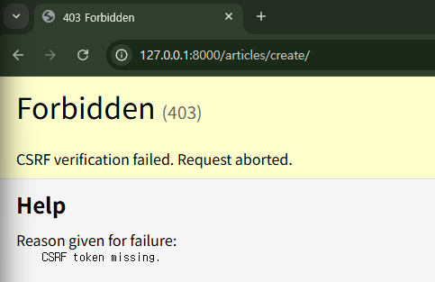

## HTTP request methods

서버에게 데이터에 대해 수행을 **원하는 작업(행동)의 종류**를 알려주는 역할

- GET, POST, PUT, DELETE
- HTTP: 네트워크 상에서 데이터(리소스)를 주고 받기 위한 약속

### **GET**: 리소스 **조회**

- 서버로부터 데이터를 요청하고 받아오는 데 사용
    - 검색 쿼리 전송, 웹 페이지 요청, API에서 데이터를 조회
- URL의 쿼리 문자열을 통해 데이터를 전송한다.
    - URL에 데이터가 노출된다.
    - 사용자가 해당 URL을 북마크하거나 다른 사람과 공유하기에 용이하다.
    - URL 길이에 제한이 있기 때문에 대량의 데이터 전송에 부적합하다.
- 요청 URL이 브라우저 히스토리에 남는다.
- 캐싱: 자주 사용하는 데이터나 결과를 임시로 저장해두고 재활용하여 처리 속도를 높이는 기술
    - 브라우저는 GET 요청의 응답을 로컬에 저장할 수 있다.
    - 동일한 URL로 다시 요청할 때, 서버에 접속하지 않고 저장된 결과를 사용한다.
    - 페이지 로딩 시간을 크게 단축할 수 있다.

### **POST**: 리소스 변경(**생성, 수정, 삭제**)

- 클라이언트가 서버로 데이터를 전송하여 서버의 상태를 변경할 때 사용
    - 로그인 정보 제출, 파일 업로드, 새 데이터 생성, API에서 데이터 변경을 요청
- HTTP Body를 통해 데이터를 전송한다.
    - 데이터 노출이 없다.
    - GET에 비해 더 많은 양의 데이터를 전송할 수 있다.
- 브라우저 히스토리에 남지 않는다.
- POST 요청은 기본적으로 캐시할 수 없다.
    - 일반적으로 서버의 상태를 변경하는 작업을 수행하기 때문

### GET & POST 비교

|  | GET | POST |
| --- | --- | --- |
| 데이터 전송 방식 | URL의 Query string parameter | HTTP body |
| 데이터 크기 제한 | 브라우저 제공 URL의 최대 길이 | 제한 없음 |
| 사용 목적 | 데이터 검색 및 조회 | 데이터 제출 및 변경 |

### 캐시(Cache)

데이터나 정보를 임시로 저장하여, 다시 요청할 때 빠르게 제공하는 저장 공간

- 빠른 응답 시간: 이미 저장된 데이터를 즉시 제공하여 사용자 경험 향상
- 서버 부하 감소: 반복적인 데이터 요청을 줄여 서버 자원을 절약할 수 있다.

## HTTP response status code

서버가 클라이언트의 요청에 대한 처리 결과를 나타내는 3자리 숫자

- `404 Not Found` : 클라이언트가 요청한 URL에 해당하는 리소스가 존재하지 않는다.
- `403 Forbidden` : 서버에 요청이 전달되었지만, 권한 때문에 거절되었다는 의미
    - 현재 상황은 CSRF token이 누락되었기 때문에 발생

        

### CSRF (Cross-Site-Request-Forgery)

사용자가 **자신의 의지와는 무관하게** 공격자가 의도한 행동(글쓰기, 정보 수정, 송금 등)을 특정 웹사이트에 요청하게 만드는 해킹 방식

- 사용자 로그인 → 악성 링크 → 요청 전송 → 공격 성공
- 사용자가 로그인하면 미끼 링크를 클릭하도록 유도한다.
- 사용자는 자신이 해킹당한 사실을 모른다.
- **``** django에서는 DTL의 csrf_token 태그를 사용해 토큰을 발급한다.