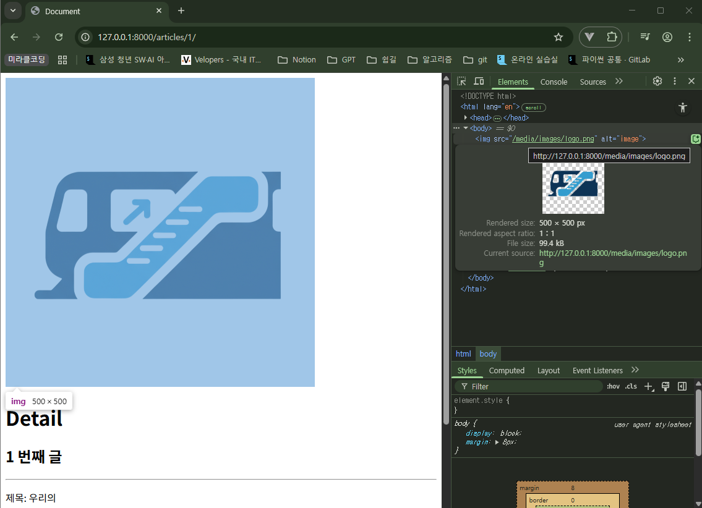

## Media Files (미디어 파일)

사용자가 웹사이트를 통해 직접 업로드하는 파일

- 사이트 운영 중 사용자에 의해 생성되고 변경되는 동적인 파일
- 사용자가 상품 후기를 작성하며 올리는 상품 사진 등

### `ImageField()`

이미지 파일을 업로드하기 위해 사용하는 Django 모델 필드

- 이미지 파일 자체가 데이터베이스에 저장되는 것이 아니다.
- 데이터베이스에는 upload_to 경로를 기준으로 한 이미지 파일의 **경로(문자열)만 저장**되고,
실제 파일은 서버의 특정 폴더**(MEDIA_ROOT)에 저장**된다.
    - upload_to는 선택 인자
- Pillow 라이브러리가 반드시 필요하다. `pip install Pillow`
    - 파이썬에서 이미지를 열고 크기 조절, 필터 적용 등 다양한 편집 작업을 수행한 후 저장할 수 있게 대주는 필수 이미지 처리 라이브러리

```python
# articles/models.py
from django.db import models

class Article(models.Model):
    title = models.CharField(max_length=10)
    content = models.TextField()
    created_at = models.DateTimeField(auto_now_add=True)
    updated_at = models.DateTimeField(auto_now=True)
    # 이미지는 'MEDIA_ROOT경로/images/' 경로에 저장되고,
    # DB에는 'images/sample.png'와 같은 경로 문자열이 저장된다.
    image = models.ImageField(upload_to='images/', blank=True)
```

### upload_to 속성 활용

문자열 경로 외에, 업로드 경로를 동적으로 생성하는 방법

1. 날짜를 이용한 경로 구성
    - `strftime()` 의 형식 코드를 사용하여 파일이 업로드된 날짜를 기준으로 폴더를 자동으로 생성할 수 있다.
        - `%Y`: 4자리 연도
        - `%m`: 2자리 월
        - `%d`: 2자리 일

    ```python
    class Photo(models.Model):
    		# 2100년 1월 1일에 업로드하면 '2100/01/01' 폴더에 저장된다.
    		image = models.ImageField(blank=True, upload_to='%Y/%m/%d/')
    ```

2. 함수를 이용한 동적 경로 생성
    - 특정 유저의 폴더에 파일을 저장하는 등 유연한 경로 생성이 가능하다.
    - `instance`: 파일이 첨부된 모델의 인스턴스 (해당 게시글 객체 등)
    - `filename`: 업로드된 파일의 원본 이름

    ```python
    # 경로 생성 함수 정의
    def articles_image_path(instance, filename):
    		# instance.user.username을 통해 게시글 작성자의 이름을 가져온다.
    		# 예: 'images/ssafy_user/my_photo.jpg'와 같은 경로를 반환
    		return f'images/{instance.user.username}/{filename}'

    class Article(models.Model):
    		user = ...
    		image = models.ImageField(blank=True, upload_to=articles_image_path)
    ```


### **MEDIA_ROOT와 MEDIA_URL**

- `MEDIA_ROOT`: 파일을 저장하고 관리하기 위한 서버의 실제 경로
    - 사용자가 업로드한 미디어 파일들이 서버 컴퓨터 어디에 저장될지를 지정하는 절대 경로
    - 서버 내부에서만 사용하는 물리적인 폴더 주소
    - django는 파일을 저장하거나 읽어올 때 이 경로를 사용한다.
- `MEDIA_URL`: 파일을 웹에서 보여주기 위한 가상의 주소
    - MEDIA_ROOT에 저장된 파일들을 웹 페이지에서 접근할 때 사용할 URL의 시작부분을 지정한다.

```python
# settings.py

# 프로젝트 폴더(BASE_DIR) 안에 'media'라는 폴더를 실제 저장소로 사용한다.
MEDIA_ROOT = BASE_DIR / 'media'
# media/라는 주소로 파일을 요청하면 MEDIA_ROOT 폴더에서 찾아 응답한다.
MEDIA_URL = 'media/'
```

```python
# urls.py
from django.contrib import admin
from django.urls import path, include
from django.conf import settings
from django.conf.urls.static import static

urlpatterns = [
    path('admin/', admin.site.urls),
    path('articles/', include('articles.urls')),
] + static(settings.MEDIA_URL, document_root=settings.MEDIA_ROOT)
# static(미디어 파일의 웹 주소, 미디어 파일의 실제 위치)
```

- `settings.MEDIA_URL`: ‘media/’로 시작하는 URL 요청이 오면,
- `document_root=settings.MEDIA_ROOT`: MEDIA_ROOT에 지정된 실제 폴더에서 파일을 찾아라.

### 이미지 업로드

```python
# articles/models.py
from django.db import models

class Article(models.Model):
    title = models.CharField(max_length=10)
    content = models.TextField()
    image = models.ImageField(upload_to='images/', blank=True)
    created_at = models.DateTimeField(auto_now_add=True)
    updated_at = models.DateTimeField(auto_now=True)
```

```bash
# 이미지 필수 라이브러리 설치
pip install Pillow

# model을 수정했으므로 migrate 재진행
python manage.py makemigrations
python manage.py migrate

# (선택) 의존성 기록
pip freeze > requirements.txt
```

```html
<!-- articles/create.html -->
  <h1>CREATE</h1>
  <form action="" method="POST" enctype="multipart/form-data">
    
    {{ form }}
    <input type="submit">
    
    <div>
      <label for="title">Title: </label>
      <input type="text" name="title" id="title">
    </div>
    <div>
      <label for="content">Content: </label>
      <textarea name="content" id="content"></textarea>
    </div>
    
  </form>
```

- <form> 태그는 기본적으로 text 요소만 받을 수 있다.
    - `enctype="multipart/form-data"` 속성을 추가해야 한다.
    - enctype: form 데이터가 서버로 제출될 때 해당 데이터가 어떤 형식으로 인코딩될 지 지정하는 속성

```python
# articles/views.py

def create(request):
    if request.method == 'POST':
        form = ArticleForm(request.POST, request.FILES)
        ...
```

- ModelForm의 두 번째 인자로 요청 받은 파일 데이터를 작성한다.


실행 화면


media/ 폴더에는 이미지 저장, DB에는 경로 저장

- 동일한 파일명의 이미지를 업로드하면, 파일명 뒤에 임의의 난수를 추가하여 저장한다.
    - 예: logo_SpUNVY2.png

### 업로드한 이미지 제공

- ImageField의 `.url` 속성: 업로드 파일의 웹 주소
    - 해당 파일을 웹에서 접근할 수 있는 전체 URL 주소를 얻을 수 있다.
- 이미지 데이터가 있는 경우만 이미지를 출력할 수 있도록 if 태그를 활용한다.
    - 이미지를 업로드하지 않은 게시물은 detail 템플릿을 렌더링할 수 없다.

```html
 <!-- articles/detail.html -->
 ...

  

 ...
```



- 이미지 경로 확인: http://127.0.0.1:8000/media/images/logo.png

### 업로드한 이미지 수정

```html
<!-- articles/update.html -->
<h1>Update</h1>
<form action="" method="POST" enctype="multipart/form-data">
  
  {{ form }}
</form>
```

```python
# articles/views.py
def update(request, pk):
    article = Article.objects.get(pk=pk)
    if request.method == 'POST':
        form = ArticleForm(request.POST, request.FILES, instance=article)
        ...
```


### AWS (Amazon Web Services)

- 아마존이 제공하는 **클라우딩 컴퓨터 플랫폼**
    - 비용 절감, 필요에 따라 서버 사양이나 저장공간 용량을 조절, 글로벌 서비스
- 서버, 스토리지, 데이터베이스 같은 IT 인프라를 직접 구매하지 않고 인터넷을 통해 필요한 만큼 빌려쓰는 서비스

| 서비스 | 역할 | 설명 | 역할 |
| --- | --- | --- | --- |
| EC2 | 가상 서버 | 클라우드에 생성하는 고성능 컴퓨터 | 웹 어플리케이션(Django)이 실행되는 컴퓨터 |
| S3 | 파일 저장소 | 이미지, 동영상 등 모든 파일을 보관하는 객체 스토리지 | 사용자가 올린 이미지나 사이트의 로고 등 정적 파일을 보관하는 외부 창고 |
| RD5 | 데이터베이스 | 데이터를 체계적으로 관리하는 관계형 데이터베이스 | 회원 정보, 게시글 등 중요한 데이터를 기록하고 관리하는 장부 |

