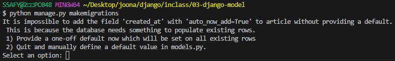

## Migrations

model 클래스의 변경사항(필드 생성, 수정, 삭제 등)을 DB에 최종 반영하는 방법

- 모든 변경 사항이 코드로 관리되어 협업 시 모델 변경 내역에 대한 추적과 공유가 수월하다.
- migrations 폴더에 자동으로 생성된 파일들은 **직접 수정하거나 삭제하지 않는 것**이 원칙.

### Migarations 과정


1. **모델 클래스 작성/수정**
2. **마이그레이션(migration) 파일 생성**
    - 마이그레이션 파일은 모델 변경사항을 기록한 python 코드
    - 마이그레이션 파일은 DB 테이블 변경 내역을 순차적으로 저장하여 추적 관리한다.
    - **마이그레이션 파일은 직접 건드리지 않는다!**

    ```bash
    python manage.py makemigrations
    ```

3. 생성된 마이그레이션 파일(`migrations/0001_initial.py`)을 **DB에 반영**
    - 마이그레이션 파일의 python 코드를 SQL 문으로 자동 변환된다.
    - python 코드  → 번역 → SQL 쿼리문 → 데이터베이스 실행

    ```bash
    python manage.py migrate
    ```


### Migrations 필드 추가 과정

이미 생성된 테이블에 필드를 추가하는 경우

1. **모델 클래스 수정(필드 추가)**
    - `auto_now` 데이터가 **저장될 때마다** 자동으로 현재 날짜시간을 저장 → 수정일
    - `auto_now_add` 데이터가 **처음 생성될 때만** 자동으로 현재 날짜시간을 저장 → 작성일

    ```python
    # articles/models.py
    class Article(models.Model):
        title = models.CharField(max_length=10)
        content = models.TextField()
        created_at = models.DateTimeField(auto_now_add=True)
        updated_at = models.DateTimeField(auto_now=True)
    ```

2. **makemigrations 명령어 입력**

    ```bash
    python manage.py makemigrations
    ```

    

    - 이미 기존 테이블이 존재하기 때문에 필드를 추가할 때 필드의 기본 값 설정이 필요하다.
        1. 현재 대화를 유지하면서 직접 기본 값을 입력하는 방법
        2. 현재 대화에서 나간 후 models.py에 기본 값 관련 설정을 하는 방법
3. **추가 필드의 기본 값 입력**
    - 현재 추가하고자 하는 데이터가 날짜 데이터이지 때문에 django가 제안하는 기본 값(timezone.now)을 사용한다.

        

4. **마이그레이션 파일(`0002_article_created_at_article_updated_at.py`) 생성**
    - `0001_initial.py` 파일을 수정한 것이므로 dependencies에 0001이 추가된다.

    ```python
    # 0002_article_created_at_article_updated_at.py
    # Generated by Django 5.2.6 on 2025-09-23 01:36

    import django.utils.timezone
    from django.db import migrations, models

    class Migration(migrations.Migration):

        dependencies = [
            ('articles', '0001_initial'),
        ]

        operations = [
            migrations.AddField(
                model_name='article',
                name='created_at',
                field=models.DateTimeField(auto_now_add=True, default=django.utils.timezone.now),
                preserve_default=False,
            ),
            migrations.AddField(
                model_name='article',
                name='updated_at',
                field=models.DateTimeField(auto_now=True),
            ),
        ]

    ```

5. **migrate 실행 - DB에 반영**
    - DB 페이지에서 새로고침하면 변경 사항 적용된다.

    ```bash
    python manage.py migrate
    ```

### 데이터베이스 초기화

1. 자동 생성된 migration 파일 삭제
    - `__init__.py`, `migrations/`는 삭제 금지
2. `db.sqlite3` 파일 삭제


### Migrations 기타 명령어

**migrate 여부 확인**

- [ X ] 표시가 있으면 migrate 완료된 것.

```bash
python manage.py showmigrations
```

**SQL 언어로 어떻게 번역되어 DB에 전달되는지 확인**

- `python manage.py sqlmigrate <앱 이름> <마이그레이션 이름>`

```bash
python manage.py sqlmigrate articles 0001
```