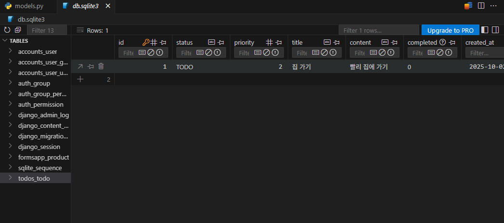

## 실습
### Database Client - VSCode 확장자

- SQLite로 데이터베이스를 연결하면 다음과 같이 확인 가능
- 필드 옵션 중 `null=True`이면 파란색으로 표현된다!


### Validator (유효성 검사)

- min_length 필드 옵션은 없음.

```python
from django.db import models
from django.core.validators import MinLengthValidator

class APIInfo(models.Model):
    name = models.CharField(max_length=200)
    description = models.TextField()
    api_url = models.URLField(max_length=60, validators=[MinLengthValidator(15)])
    documentation_url = models.URLField()
    auth_required = models.BooleanField()
    additional_info = models.JSONField(black=True, null=True, default=None)
    created_at = models.DateTimeField(auto_now_add=True)

```

<hr>

## Model

### SQLite

데이터베이스 관리 시스템 중 하나로, django의 기본 데이터베이스로 사용된다.

- 데이터베이스가 하나의 파일로 저장되어 설치/설정 없이 간편하게 복사/이동/백업이 가능하다.
- 별도 서버 없이 파일로 직접 데이터를 처리한다. 소규모 앱이나 모바일 환경에 최적화
- 호환성이 높다.
- `db.sqlite3` 파일은 git 등 버전 관리 시스템에서 관리하지 않는다.
    - 데이터가 변경될 때마다 파일 전체가 변경되기 때문
    - SQLite 파일은 로컬 컴퓨터에 저장된 데이터 기록
    - `.gitignore` 파일에 `db.sqlite3` 추가

### Model

**데이터베이스**와 python 클래스(**객체**)로 추상화된 형태로 상호작용

- **model ≠ DB**
- Django의 강력한 기능: 개발자가 데이터베이스에 대한 깊은 지식 없이도 쉽게 데이터 관리 가능
- 유지보수 및 확장성 증대: 데이터베이스 변경 시에도 코드 수정 최소화, 재사용 가능한 데이터 모델을 통해 개발 효율성 향상

### Model을 통한 DB(데이터베이스) 관리


- `urls.py` 사용자 요청의 시작점
- `views.py` 요청을 처리하고 models.py를 통해 데이터를 다룬다.
- `models.py` 데이터베이스를 정의하고, 데이터베이스와 상호작용한다.
- `templates` views.py로부터 받은 데이터를 사용자에게 보여줄 화면을 구성한다.

### Model class

DB의 테이블을 정의하고 데이터를 조작할 수 있는 기능들을 제공한다.


- 앱 폴더의 `models.py`에 작성한다.
- 데이터베이스 **테이블의 구조를 설계**하는 ‘청사진(blueprint)’ 역할
- 어떤 데이터(컬럼)를 저장할 지, 그 데이터는 어떤 형태(타입, 길이 등)인지를 python 코드로 정의
- id 필드는 django가 자동 생성한다.

### Model class 정의

```python
# articles/models.py
# 내장된 django 패키지 안에 db 서브 패키지 안에 models.py라는 모듈을 import
from django.db import models

# 게시글을 저장받기 위한 테이블 하나
class Article(models.Model):
		title = models.CharField(max_length=10)
		content = models.TextField()
```

- 모델 클래스로 정의하며, **Model 클래스를 상속**받는다.
    - Model은 model에 관련된 모든 코드가 이미 작성되어 있는 class.
    - ‘테이블 구조를 어떻게 설계할지’에 대한 코드만 작성할 수 있도록 ‘상속’을 활용해 프레임워크 기능을 제공해준다.
- 클래스 변수명(`title`, `content`)은 테이블의 각 “**필드(column)명**”이 된다.
- Model Field는 **“데이터의 유형”과 “제약 조건”**을 정의한다.
    - 데이터베이스 테이블의 열(column)을 나타내는 중요한 구성 요소
    - `CharField`의 `max_length` 매개변수는 선택 사항
        - 유효성 검사 및 데이터의 명확성을 위해 명시적으로 설정하는 것을 권장한다.

## Model Field

- DB 테이블의 필드(열) 정의
- 데이터 타입 (field types) 및 제약 조건 (field options) 명시
- django는 필드 정의를 바탕으로 데이터베이스 컬럼을 자동으로 생성하고 데이터 입력 시 유효성 검사 등 필요한 기능을 제공한다.

- **Field Types :** 데이터베이스에 저장될 ‘데이터의 종류’를 정의한다.
    - models 모듈의 클래스로 정의되어 있다.
    - 문자열 필드
        - `CharField()` 제한된 길이의 문자열을 저장
        - `TextField()` 길이 제한이 없는 대용량 텍스트를 저장
    - 숫자 필드: IntegerField, FloatField
    - 날짜/시간 필드: DataField, TimeField, DateTimeField
    - 파일 관련 필드: FileField, ImageField

- **Field Options :** 필드의 동작과 제약 조건을 정의한다.
    - `max_length`
    - `null` 데이터베이스에서 NULL값을 허용할지 여부를 결정 (기본값: False)
    - `blank` form에서 빈 값을 허용할지 여부를 결정 (기본값: False)
    - `default` 필드의 기본값을 설정

### Choices 속성

- 모델 필드에 미리 정해진 선택지를 부여하는 속성
- 데이터베이스에는 실제 값이 저장되지만 사용자에게는 더 이해하기 쉬운 이름(레이블)을 보여주는 Dropdown 메뉴를 손쉽게 만들 수 있다.
- `(저장될 실제 값, 사용자에게 보여줄 이름)` 형태의 튜플을 담은 리스트 또는 튜플로 정의한다.
    - `('TODO', '할 일 ')` : 사용자가 ‘할 일’을 선택하고 저장하면 데이터베이스의 status 필드에는 ‘TODO’라는 문자열이 저장된다.
    - `STATUS_CHOICES` 처럼 변수명을 대문자로 명명하는 것이 django의 관례
- ModelForm이나 관리자 페이지에서 자동으로 기본 텍스트 입력창 대신 드롭다운(select) 위젯으로 렌더링해준다.


- `choices`: 미리 정의된 값들만 선택할 수 있도록 제한
- `default`: 사용자가 값을 입력하지 않았을 때 자동으로 할당되는 기본값
- `help_text`: Admin이나 Form 에서 해당 필드 옆에 간단한 안내문으로 표시되는 설명
- `verbose_name`: Admin이나 Form 에서 필드의 라벨로 표시될 텍스트

### PositiveIntegerField

- 0을 포함한 양의 정수만 저장할 수 있도록 강제하는 Django 모델 필드
- 데이텁베이스에는 일반 정수 (integer) 타입으로 생성되지만,
django의 유효성 검사를 통해 음수 값이 저장되려고 하면 오류(`ValidationError`)를 발생시킨다.
- 음수가 될 수 없는 모든 종류의 숫자 데이터에 사용할 수 있다.
    - 수량 (재고 수량, 주문 개수)
    - 수치 (나이, 조회수, 좋아요 수)
    - 포인트 및 금액 (포인트, 가격, 예산)

```python
# todos/models.py
from django.db import models

class Todo(models.Model):

    # 1) CharField + choices
    STATUS_CHOICES = [
        ('TODO', '할 일'),
        ('DOING', '진행 중'),
        ('DONE', '완료'),
    ]
    status = models.CharField(
        max_length=5,
        choices=STATUS_CHOICES,
        default='TODO',
        help_text='현재 작업 상태를 선택해주세요.',
        verbose_name='상태',
    )

    # 2) IntegerField + choices
    PRIORITY_CHOICES = [
        (1, '낮음'),
        (2, '보통'),
        (3, '높음'),
    ]
    priority = models.PositiveIntegerField(
        choices=PRIORITY_CHOICES,
        default=2,
        help_text='우선순위를 선택해주세요 (1=낮음, 2=보통, 3=높음).',
        verbose_name='우선순위',
    )
```





### null vs blank

| 속성 | 적용 레벨 | 역할 | 주사용 대상 |
| --- | --- | --- | --- |
| `blank=True` | Form validation | - Form 레벨에서 해당 필드를 ‘필수 입력이 아님’으로 처리
- Admin, ModelForm 등에서 빈 값으로 제출 가능 | 문자열 필드 (CharField, TextField) |
| `null=True` | DB | - DB 레벨에서 NULL 값 허용
- DB 컬럼이 NULL을 저장할 수 있도록 설정 | 문자열 외 필드 (IntegerField, DateTimeField 등) |
- Form 에서 빈 값을 허용 (blank=True)은 DB의 NULL과 직접 대응하지 않는다.
- DB 컬럼을 NULL 허용 (null=True)해도, 폼 입력에서는 여전히 필수 값이 될 수 있다.

`blank=True`

- Form 유효성 검사 차원
    - 필수 입력이 아니다.
    - Admin이나 ModelForm 에서 해당 필드를 비워 제출해도 검증 에러가 발생하지 않는다.
- DB와는 무관
    - django의 Form이나 Admin에서 ‘비워둘 수 있다’는 의미
    - DB에는 ‘’(빈 문자열)로 저장될 수 있지만, 실제로 DB가 NULL 상태가 되는 것은 아니다. (기본적으로 null=False일 때)

`null=True`

- DB 스키마 레벨
    - null=True면 해당 컬럼에 NULL 값을 저장할 수 있다.
- Form 검증과는 별개
    - django Form에서 blank=True가 아니면, 여전히 필수 입력으로 간주한다.
    - DB에서 NULL을 허용하더라도 Form에서 공백 제출을 막을 수 있다.
- 문자열 필드에 null=Ture를 설정하는 것은 일반적으로 권장하지 않는다.
    - 데이터베이스에 ‘값이 없음’을 나타내는 상태가 두 가지 (NULL, ‘’)가 되어버리기 때문

