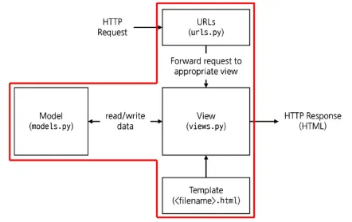
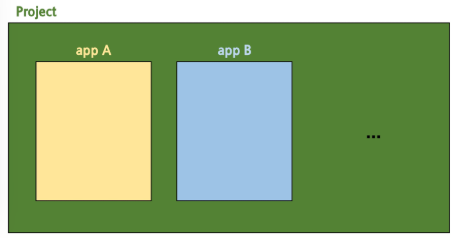

## Django Design Pattern

### 디자인 패턴 (Design Pattern)

소프트웨어 설계에서 반복적으로 발생하는 문제에 대한 검증되고 재사용 가능한 일반적인 해결책

- ‘애플리케이션의 구조는 이렇게 구성하자’라는 모범 답안 또는 관행

### MTV 디자인 패턴 (Model, Template, View)

Django에서 애플리케이션을 구조화하는 디자인 패턴

- 기존 MVC 패턴과 동일하나 단순히 명칭을 다르게 정의한 것
- **Model**
    - 데이터와 관련된 로직을 관리
    - 응용프로그램의 데이터 구조를 정의하고 데이터베이스의 기록을 관리
- **Template**
    - 레이아웃과 화면을 처리
    - 화면상의 사용자 인터페이스 구조와 레이아웃을 정의
    - 특정 URL에 대한 파이썬 콜백 함수 → “어떤 데이터를 보여주는지” 설명
- **View**
    - Model & Template과 관련한 로직을 처리해서 응답을 반환
    - 클라이언트의 요청에 대해 처리를 분기하는 역할
    - 데이터가 필요하다면 Model에 접근해서 데이터를 가져오고, 가져온 데이터를 Template으로 보내 화면을 구성하고, 구성된 화면을 응답으로 만들어 클라이언트에게 반환한다.

**MVC 디자인 패턴**

하나의 애플리케이션을 구조화하는 대표적인 구조적 디자인 패턴

- **Model** : 데이터 및 비지니스 로직을 처리
- **View(=Template)** : 사용자에게 보이는 화면을 담당
- **Controller(=View)** : 사용자의 입력을 받아 Model과 View(=Template)를 제어

## Django 프로젝트와 앱

- Django project: 애플리케이션의 집합
    - DB설정, URL 연결, 전체 앱 설정 등을 처리
- Django application: 독립적으로 작동하는 기능 단위 모듈
    - 각자 특정한 기능을 담당
    - 다른 앱들과 함께 하나의 프로젝트를 구성
    - 기능 단위로 나누는 것은 순전히 개발자의 선택

**프로젝트-앱 구성 예시**

- 커뮤니티 프로젝트 - 게시글, 댓글, 회원 관리 앱
- 쇼핑몰 프로젝트 - 상품 조회, 배송 조회, 결제 앱
- 교육 관리 프로젝트 - 학생 관리, 문제 관리, 점수 관리 앱

### 프로젝트 구조

| 파일명 | 역할 설명 |
| --- | --- |
| `settings.py` | 프로젝트의 모든 설정을 관리 |
| `urls.py` | 요청 들어오는 URL을 따라 이에 해당하는 적절한 views를 연결 |
| `__init__.py` | 해당 폴더를 패키지로 인식하도록 설정하는 파일 |
| `asgi.py` | 비동기식 웹 서버와의 연결 관련 설정 |
| `wsgi.py` | 웹 서버와의 연결 관련 설정 |
| `manage.py` | Django 프로젝트와 다양한 방법으로 상호작용하는 커맨드라인 유틸리티 |

**project의 settings.py**
- `LANGUAGE_CODE = 'ko-kr’` : 사용 언어 설정
- `USE_I18N = True`
    - i18n은 "internationalization"의 약자로, 소프트웨어를 여러 언어와 문화권에 맞게 지원하는 기술을 의미
    - 기본값은 True
- `TIME_ZONE = 'Asia/Seoul’` & `USE_TZ = True`
    - tz은 timezone의 약자로, 시간대 지원 기능을 활성화할지 여부를 결정
    - True일 때 `TIME_ZONE`에 저장되어 있는 지역에 맞춰 자동으로 변환

### 앱 구조

| 파일명 | 역할 설명 |
| --- | --- |
| `admin.py` | 관리자용 페이지 설정 |
| `models.py` | DB와 관련된 Model을 정의 (MTV 패턴의 M) |
| `views.py` | HTTP 요청을 처리하고 해당 요청에 대한 응답을 반환, url, model, template과 연동 (MTV 패턴의 V) |
| `__init__.py` | 해당 폴더를 패키지로 인식하도록 설정하는 파일 |
| `apps.py` | 앱의 정보가 작성된 곳 |
| `tests.py` | 프로젝트 테스트 코드를 작성하는 곳 |
| `migrations/` |  |

