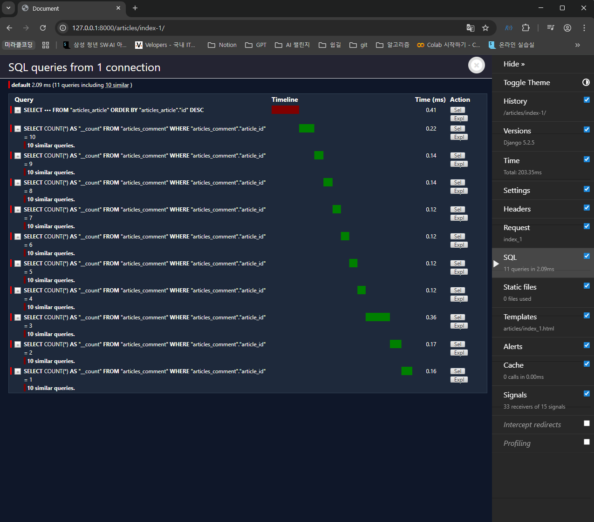
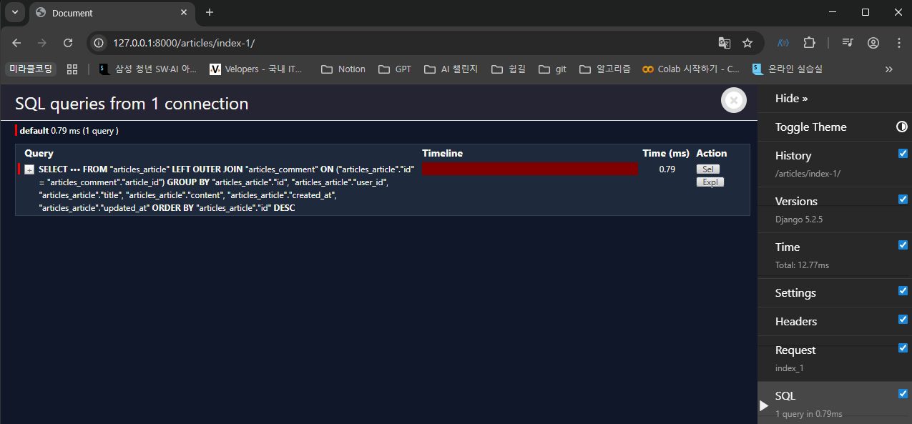
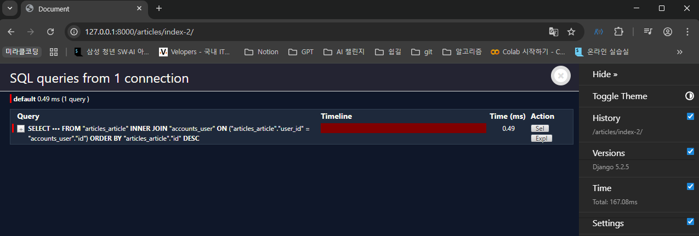
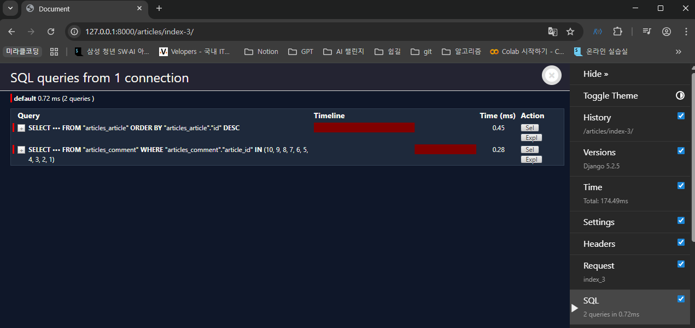

## 쿼리 최적화

같은 결과를 얻기 위해 DB 측에 보내는 query 개수를 점차 줄여 조회하기

(”**처음부터 지시사항 한번에 똑바로 요청하기”**)

→ N+1 Problem 을 해결할 수 있다

### N+1 Problem

- 1개의 쿼리로 데이터를 가져왔더라도 관련 데이터를 추가로 가져오기 위해 추가 쿼리가 N개 더 실행되는 상황
- ORM에서 관련 객체를 반복적으로 접근할 때 과도한 쿼리가 발생하는 현상
- 데이터가 많을 수록 성능 저하나 DB 부하가 심해질 수 있다.


비효율적인 코드 예시

- 각 10개의 댓글마다 COUNT 함수를 실행하고 있어서 11번의 쿼리문을 실행함

### annotate

- SQL의 GROUP BY를 사용하여 각 행별로 계산된 필드를 추가한다.
- 주로 집계 함수 (Count, Sum, Avg, Max, Min)와 함께 사용된다.

```python
articles = Article.objects.annotate(comment_count=Count('comment')).order_by('-pk')
```

- 결과 객체에 새로운 필드 `comment_count`에 댓글의 개수를 추가해서 반환한다.
    - 한 번에 조회해서 재사용하므로, 1 번의 쿼리문을 실행함


annotate 집계함수 사용 예시

### select_related

- ForeignKey 또는 OneToOne 관계에서 사용되는 Django ORM 메서드
- 내부적으로 INNER JOIN을 사용하여 관련 객체를 한 번에 불러온다.

```python
articles = Article.objects.select_related('user').order_by('-pk')
```

- 게시글을 조회하면서 유저 정보까지 한번에 조회해서 가져온다.
    - 1번의 쿼리문을 실행


select_related 사용 예시

### prefetch_related

- Python을 사용한 JOIN을 진행
- M:N 또는 N:1의 역참조 관계에서 사용한다.

```python
articles = Article.objects.prefetch_related('comment_set').order_by('-pk')
```

- 게시글을 조회하면서 참조된 댓글까지 한번에 조회해서 가져오기
    - 11 queries including 10 similar → 2 queries


prefetch_related 사용 예시
