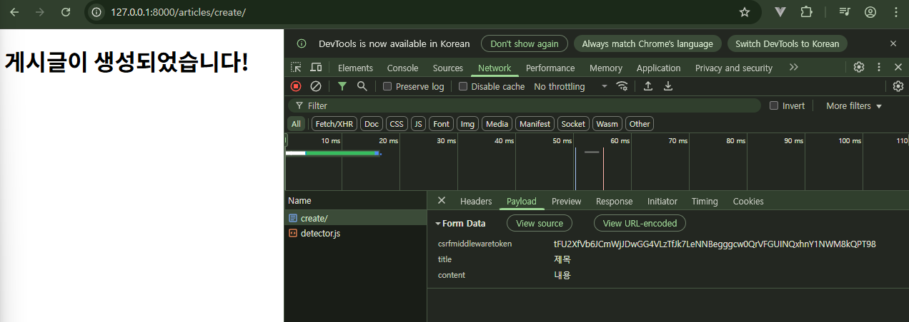

## ORM with view

view 함수에서 QuerySet API 활용

- 웹 페이지에 보여줄 데이터를 DB에서 가져올 때 사용
- 사용자가 입력한 새로운 데이터를 DB에 저장할 때 사용

### QuerySet API 정렬

- `order_by()` 메소드에 필드 이름을 전달하여 오름차순으로 정렬할 수 있다.
- 필드 이름 앞에 하이픈(-)을 붙이면 내림차순으로 정렬된다.
- 여러 필드로 정렬하고 싶다면 콤마(,)로 구분하여 전달할 수 있다.

```python
# 'title' 필드를 기준으로 오름차순 정렬
Post.objects.order_by('title')

# 'id' 필드를 기준으로 내림차순 정렬
Post.objects.order_by('-id')

# 'id' 필드를 기준으로 오름차순, 'title' 필드를 기준으로 내림차순 정렬
Post.objects.order_by('id', '-title')
```

## Read: 데이터 조회

### 전체 게시글 조회


**App URL Mapping**

```python
# crud/urls.py
from django.urls import path, include

urlpatterns = [
	path('admin/', admin.site.urls),
	path('articels/', include('articles.urls')),
]
```

```python
# articles/urls.py
from django.urls import path
from . import views

app_name = 'articles'
urlpatterns = [
    path('', views.index, name='index'),
]
```

**QuerySet API 조회**

```python
# articles/views.py
from django.shortcuts import render
from .models import Article  # Article 모델 클래스를 불러옴

# Create your views here.
# 1)전체 게시글 조회 후 2) 메인 페이지 응답
def index(request):
    # 1. DB에 전체 게시글을 조회
    articles = Article.objects.all()

    # 2. 전체 게시글 목록을 템플릿과 함꼐 응답
    context = {
        'articles': articles,
    }
    return render(request, 'articles/index.html', context)
```

```html
<!-- articles/index.html -->
...
<body>
  <h1>메인 페이지</h1>
  
    <p>{{ article.pk }}</p>
    <p>{{ article.title }}</p>
    <p>{{ article.content }}</p>
    <hr>
  
</body>
</html>
```


### 단일 게시글 조회

```python
# articles/urls.py
app_name = 'articles'
urlpatterns = [
    path('', views.index, name='index'),
    path('<int:pk>/', views.detail, name='detail'),
]
```

```python
# articels/views.py

# 게시글 상세 페이지를 응답하는 함수
def detail(request, pk):
    # 1. DB에 몇 번 게시글인지를 조회
    # 단일 게시글 조회: queryset API method ==> get(데이터 컬럼=조건 변수)
    # Article.objects.get(id=pk)
    article = Article.objects.get(pk=pk)

    # 2. 조회한 상세 게시글 데이터를 템플릿과 함께 응답
    context = {
        'article': article,
    }
    return render(request, 'articles/detail.html', context)
```

- `get()` 메서드는 없는 데이터를 조회하거나, 여러 개의 데이터를 조회하면 에러가 발생한다.


```html
<!-- articles/detail.html -->
<body>
  <h1>Detail</h1>
  <h2>{{ article.pk }} 번째 글</h2>
  <hr>
  <p>제목: {{ article.title }}</p>
  <p>내용: {{ article.content }}</p>
  <p>작성일: {{ article.created_at }}</p>
  <p>수정일: {{ article.updated_at }}</p>
  <hr>
  <a href="">[back]</a>
</body>
```

**브라우저 상 ‘뒤로가기’와 [back]버튼의 차이**


- 브라우저는 페이지 히스토리를 스택에 쌓아두고 ‘뒤로가기’를 누르면 스택을 pop하면서 이전 페이지를 보여준다.
- [back]버튼은 `<a>` 태그로 구현되었기 때문에 URL로 접근한다.

**NoReverseMatch** 에러: URL 관련 문제

- detail의 variable routing 변수를 입력하지 않았기 때문


```html
<!-- articles/index.html -->

<!-- NoReverseMatch 에러 발생 -->
<a href="">글 제목: {{ article.title }}</a>

<!-- 수정된 코드 -->
<a href="">글 제목: {{ article.title }}</a>
```


## Create: 데이터 생성

2개의 view 함수가 필요하다 (throw & catch)

- `new`: 사용자 입력 데이터를 받을 페이지를 렌더링
- `create`: 사용자가 입력한 요청 데이터를 받아 DB에 저장

### 새로운 게시글 등록 - render

```python
# articles/urls.py
app_name = 'articles'
urlpatterns = [
    ...
    path('new/', views.new, name='new'),
    path('create/', views.create, name='create'),
]
```

```python
# articles/views.py
# 사용자가 게시글 생성을 위한 작성 페이지를 응답하는 함수
def new(request):
    return render(request, 'articles/new.html')

# 사용자로부터 입력 받은 데이터를 DB에 저장 후 작성 완료 페이지를 응답하는 함수
def create(request):
    # 1. 사용자로부터 입력 받은 데이터를 추출
    # request.POST 은 QueryDict 자료형 ==> key값으로 접근
    # key값은 new.html의 input태그의 name 태그와 일치
    title = request.POST.get('title')
    content = request.POST.get('content')

    # 2. 추출한 데이터를 DB에 저장
    # 2-1. 빈 객체 생성 후 인스턴스 변수 할당
    # article = Article()
    # article.title = title
    # article.content = content
    # article.save()
    # 2-2. 인스턴스 변수를 할당한 객체 생성
    article = Article(title=title, content=content)
    article.save()
    # 2-3. create 메서드 사용
    # Article.objects.create(title=title, content=content)

    return render(request, 'articles/create.html')
```

- 유효성 검사 혹은 추가 데이터 등록을 처리하기 위해 생성 즉시 저장하는 3번(create 메서드) 방법보다는 1,2번 방법을 추천한다.

```html
<!-- articles/new.html -->

<h1>New</h1>
<form action="" method="POST">
	
  <div>
    <label for="title">Title: </label>
    <input type="text" name="title", id="title">
  </div>
  <div>
    <label for="content">Content: </label>
    <textarea name="content" id="content"></textarea>
  </div>
  <input type="submit">
</form>
```

- `<label>` 태그: input 박스의 이름(예: Title: , Content: )을 클릭하면 같은 id를 가진 <input> 태그가 활성화된다.
- `` ’django가 직접 제공한 페이지에서 데이터를 작성하고 있는 것인지’를 확인하기 위한 인증 토큰
    - POST는 리소스의 변경(생성, 수정, 삭제 등)을 요청, 즉 데이터베이스에 대한 변경사항을 만드는 요청
    - DB에 조작을 가하는 요청은 반드시 **인증 수단**이 필요하다.

```html
<!-- articles/create.html -->
<body>
  <h1>게시글이 생성되었습니다!</h1>
</body>
```



- 개발자 도구 `F12`의 Network > Payload에서 Form Data가 전송되는 것을 확인할 수 있다.


### 새로운 게시글 등록 - redirect

**현재 게시글 작성 후 응답 방식**


게시글 작성(POST 요청) 이후, 완료 메시지 페이지를 직접 반환하고 있다. 이는 후속 행동(예: 새로고침, 뒤로 가기 등)에서 예기치 않은 동작을 유발할 수 있다.

- HTTP 표준 관점: 사용자가 완료 페이지에서 새로고침 시 **중복 게시글 작성**의 위험
- 사용자 경험(UX) 관점: 브라우저의 페이지 기록 관리와 상태 관리에 혼란

**적절한 응답 방법**

서버는 데이터 저장 후 페이지를 응답하는 것이 아닌, 사용자를 적절한 기존 페이지로 보내야한다.

- 사용자를 보낸다 = 사용자가 GET 요청을 한 번 더 보내도록 해야 한다.
- 서버가 클라이언트를 직접 다른 페이지로 보내는 것이 아닌,
**클라이언트가 GET 요청을 한 번 더 보내도록 응답하는 것**

```html
<!-- articles/new.html -->
<form action="" method="POST">
	
  <div>
    <label for="title">Title: </label>
    <input type="text" name="title", id="title">
  </div>
  <div>
    <label for="content">Content: </label>
    <textarea name="content" id="content"></textarea>
  </div>
  <input type="submit">
</form>
```

- `<form>` 태그의 action은 해당 URL로 요청을 보내는 것이기 때문에, 변경할 필요 없다.
    - create.html이 필요 없어지는 것일 뿐, `url "articles:create”`은 살아 있다.
    - `articles/create/` URL로 요청을 보내면 create 뷰 함수가 실행된다.
    - create 뷰 함수가 실행되면, `articles:detail`로 리다이렉트 요청이 전송된다.

```python
# articles/views.py
from django.shortcuts import render, redirect

# 사용자로부터 입력 받은 데이터를 DB에 저장 후 작성 완료 페이지를 응답하는 함수
def create(request):
    # 1. 사용자로부터 입력 받은 데이터를 추출
    title = request.POST.get('title')
    content = request.POST.get('content')

    # 2. 추출한 데이터를 DB에 저장
    article = Article(title=title, content=content)
    article.save()

    # 클라이언트한테 새로운 주소로 요청을 보내게끔
    return redirect("articles:detail", article.pk)
```

- `return redirect("articles:detail", article.pk)` detail url로 다시 요청을 보내게 되고, detail 뷰 함수가 호출되어 detail 페이지(render)를 응답받게 된다.


**index 페이지가 아닌 detail 페이지를 요청하는 이유?**

`return render(request, 'articles/index.html')` 실행 결과


- index 뷰 함수가 실행되지 않기 때문에 DB가 없고, 이로 인해 반환되는 article context가 없기 때문에 빈 페이지가 나온다.

**redirect 순서**


1. 클라이언트가 데이터를 입력하고 서버(django)에게 [POST] 게시글 작성을 요청한다.
2. django는 create view 함수를 호출한다.
3. create 함수의 반환값인 redirect 응답을 통해 클라이언트가 detail 주소로 요청을 보내게 만든다.
4. 클라이언트는 서버에 [GET] detail 페이지를 요청한다.
5. django는 detail view 함수를 호출한다.
6. detail 함수의 반환값인 render 함수를 호출하고, detail 페이지를 응답한다.


## Delete: 데이터 삭제

### 단일 게시글 삭제

```python
# articles/urls.py
app_name = 'articles'
urlpatterns = [
    ...
    path('<int:pk>/delete/', views.delete, name='delete'),
]
```

```python
# articles/views.py

def delete(request, pk):
    # 1. 어떤 게시글을 삭제할 것인지 조회
    article = Article.objects.get(pk=pk)

    # 2. 조회한 게시글을 삭제
    article.delete()

    # 3. 메인 페이지로 리다이렉트
    return redirect('articles:index')
```

```html
<!-- articles/detail.html -->
  <h1>Detail</h1>
  <h2>{{ article.pk }} 번째 글</h2>
  <hr>
  <p>제목: {{ article.title }}</p>
  <p>내용: {{ article.content }}</p>
  <p>작성일: {{ article.created_at }}</p>
  <p>수정일: {{ article.updated_at }}</p>
  <hr>
  <!-- 삭제 버튼 추가 -->
  <form action="" method="POST">
    
    <input type="submit" value="삭제">
  </form>
  <a href="">[메인페이지로 이동]</a>
```


## Update: 데이터 수정

2개의 view 함수가 필요하다.

- `edit`: 사용자 입력 데이터를 받을 페이지를 렌더링
- `update`: 사용자가 입력한 요청 데이터를 받아 DB에 저장

### 단일 게시글 수정

```python
# articles/urls.py
app_name = 'articles'
urlpatterns = [
    ...
    path('<int:pk>/edit/', views.edit, name='edit'),
    path('<int:pk>/update/', views.update, name='update'),
]
```

```python
# articles/views.py

# 사용자 입력 데이터를 받을 페이지를 응답
def edit(request, pk):
    # 어떤 게시글을 수정할 것인지 조회
    article = Article.objects.get(pk=pk)
    context = {
        'article': article,
    }
    return render(request, 'articles/edit.html', context)

# 사용자로부터 입력 받은 데이터를 DB에 저장
def update(request, pk):
    # 어떤 게시글을 수정할 것인지 조회
    article = Article.objects.get(pk=pk)

    # 사용자가 새로 입력한 값
    title = request.POST.get('title')
    content = request.POST.get('content')

    # DB의 값 변경 및 저장
    article.title = title
    article.content = content
    article.save()

    # 수정된 게시글 페이지로 리다이렉트
    return redirect("articles:detail", article.pk)
```

```html
<!-- articles/edit.html -->
  <h1>Edit</h1>
  <form action="" method="POST">
    
    <div>
      <label for="title">Title: </label>
      <input type="text" name="title" id="title" value="{{ article.title }}">
    </div>
    <div>
      <label for="content">Content: </label>
      <textarea name="content" id="content">{{ article.content }}</textarea>
    </div>
    <input type="submit">
  </form>
  <hr>
  <a href="">[back]</a>
```

- 수정할 게시글의 원본 내용을 input 창에 보여준다.

```html
<!-- articles/detail.html -->
...
<a href="">EDIT</a>
<br>
<form action="" method="POST">
  
  <input type="submit" value="삭제">
</form>
<a href="">[메인페이지로 이동]</a>
```


