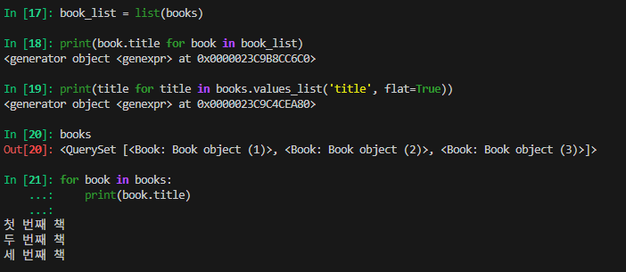
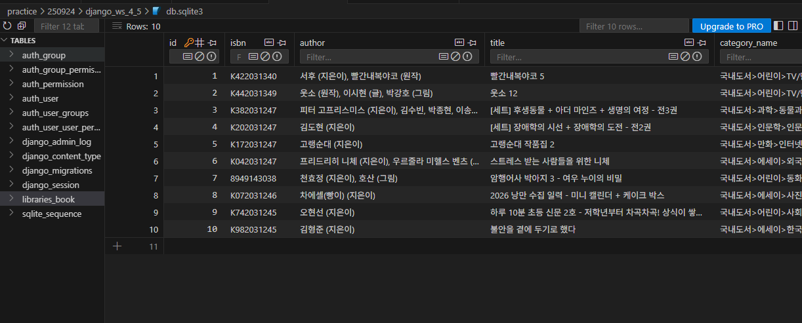
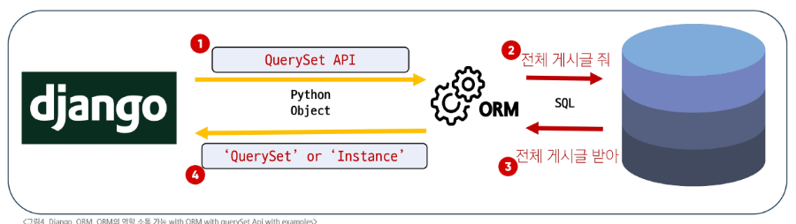
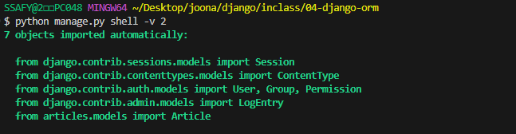

# 실습

## 1834. 도서 관리 서비스 만들기 - 데이터 생성 및 조회 Lv2

### 특정 필드 값만 출력하기

1. **value_list 메서드**

```bash
>>> garages = Garage.objects.filter(is_parking_avaliable=True)
>>> garages.values_list('location')
<QuerySet [('부산',), ('독도',)]>
>>> garages.values_list('location', flat=True)
<QuerySet ['부산', '독도']>
```

- `values_list()` 메서드: Django ORM에서 특정 모델의 필드(열) 값들만 **튜플(tuple)의 리스트 형태**로 가져올 수 있다.
    - `flat=True` **단 하나의 필드만** 가져오고 싶을 때, 튜플이 아닌 **단일 값의 리스트**로 결과 반환

2. **for문으로 순회**
- shell 에서도 for문으로 출력 가능!



- 왜 `generator object`가 출력되었나요?

    `In [18]: print(book.title for book in book_list)`는 소괄호로 감싼 형태(또는 함수에 인자로 전달될 땐 괄호 생략 가능)이므로 제너레이터 표현식

    따라서 `print()` 함수는 리스트의 내용물을 출력하는 것이 아니라, **'값을 생성할 준비가 된' 제너레이터 객체 그 자체**를 출력한 것. `<generator object ...>` 라는 결과는 "여기 값을 만들어낼 수 있는 생성기 객체가 있습니다"라는 의미


### 리스트 컴프리헨션 vs. 제너레이터 표현식

**1. 리스트 컴프리헨션 (List Comprehension)**

- **문법**: 대괄호 `[]`로 감쌉니다. `[item for item in iterable]`
- **동작**: 코드가 실행되는 즉시 **모든 결과를 메모리에 만들어** 완전한 리스트를 반환합니다.

**2. 제너레이터 표현식 (Generator Expression)**

- **문법**: 소괄호 `()`로 감쌉니다. `(item for item in iterable)`
- **동작**: 코드가 실행될 때 값을 미리 만들지 않습니다. 대신, 값이 필요할 때마다 **하나씩 계산해서 만들어주는** '생성기(generator)' 객체만 만듭니다. 이를 '지연 평가(Lazy Evaluation)'라고 하며, 메모리를 매우 효율적으로 사용할 수 있습니다.

## 1837. API를 활용한 도서 관리 서비스 만들기 - 데이터 수집 및 생성 Lv5

### API 호출해서 데이터 추출 후 저장

- classmethod 를 사용해서 함수를 정의한다.

```python
# libraries/models.py
from django.db import models
import requests

# Create your models here.
class Book(models.Model):
    isbn = models.CharField(max_length=10)
    author = models.TextField()
    title = models.TextField()
    category_name = models.TextField()
    category_id = models.IntegerField()
    price = models.IntegerField()
    fixed_price = models.BooleanField()
    pub_date = models.DateField()

    @classmethod
    def insert_data(cls):
        response = requests.get('http://www.aladin.co.kr/ttb/api/ItemList.aspx?ttbkey=KEY&QueryType=ItemNewSpecial&MaxResults=10&start=1&SearchTarget=Book&output=js&Version=20131101')
        data = response.json()

        for item in data.get('item', []):
            my_model = cls(
                isbn=item['isbn'],
                author=item['author'],
                title=item['title'],
                category_name=item['categoryName'],
                category_id=item['categoryId'],
                price=item['priceSales'],
                fixed_price=item['fixedPrice'],
                pub_date=item['pubDate'],
            )
            my_model.save()
```

```bash
Book.insert_data()
```



<hr>

## ORM

### ORM (Object Relational Mapping)

객체 지향 프로그래밍 언어의 객체(Object)와 데이터베이스의 데이터를 매핑(Mapping)하는 기술

- Django와 DB 사이에서 언어 번역자의 역할
    - 개발자는 데이터베이스 구조를 잘 몰라도 파이썬 코드로 쉽게 데이터를 다룰 수 있다.

### ORM, QuerySet API 를 사용하는 이유

- 데이터베이스 추상화
    - 개발자가 특정 데이터베이스 시스템에 종속되지 않고 일관된 방식으로 데이터를 다룰 수 있다.
- 생산성 향상
    - python 코드로 데이터베이스 작업을 수행할 수 있다.
- 객체 지향적 접근
    - 데이터베이스 테이블을 python 객체로 다룰 수 있다.

## QuerySet API

### QuerySet API

ORM을 통해 데이터베이스로부터 객체 목록을 가져오거나, 필터링, 정렬하는 등 다양한 조작을 할 수 있도록 해주는 인터페이스(도구 모음)

- **Query**: 데이터베이스에 특정한 데이터를 보여달라는 요청
- **QuerySet**: 데이터베이스에서 전달받은 객체 목록(데이터 모음)
  - django ORM을 통해 만들어진 자료형. python 자료형은 아니다.
  - **순회 가능**한 데이터로, 1개 이상의 데이터를 불러와 사용 가능하다.
  - 데이터베이스가 단일 객체를 반환할 때는 QuerySet이 아닌 모델(class)의 **인스턴스**로 반환된다.

**Django에서 Query가 처리되는 과정**



1. **파이썬 코드 → ORM**: 개발자의 QuerySet API(파이썬 코드)가 ORM으로 전달
2. **ORM → SQL 변환**: ORM이 이를 데이터베이스용 SQL쿼리로 변환하여 데이터베이스로 전달
3. **DB 응답 → ORM**: 데이터베이스가 SQL 쿼리를 처리하고 결과 데이터를 ORM에 반환
4. **ORM → QuerySet 변환**: ORM이 데이터베이스의 결과를 QuerySet (파이썬 객체) 형태로 변환하여 Django로 반환

### QuerySet API 기본 구조

게시글 전체 조회: `Article.objects.all()`

**`Article` (모델 클래스)**

- 데이터베이스 테이블에 대한 Python 클래스 표현
- ariticles_article 테이블의 스키마(필드, 데이터 타입 등)를 정의
- Django ORM이 데이터베이스와 상호작용할 때 사용하는 기본적인 구조체

**`.objects` (매니저)**

- 데이터베이스 조회(Query) 작업을 위한 기본 인터페이스
- 모델 클래스가 데이터베이스 쿼리 작업을 수행할 수 있도록 하는 진입점
- Django는 모든 모델에 objects라는 이름의 매니저를 자동으로 추가
- .all(), .filter() 등의 쿼리 메서드를 호출한다.

**`.all()` (QuerySet API 메서드)**

- 특정 데이터베이스 작업을 수행하는 명령
- 매니저를 통해 호출되는 메서드
- 해당 모델과 연결된 테이블의 모든 레코드(rows)를 조회하라는 SQL 쿼리를 생성하고 실행한다.

### Field lookups

단순 동치 비교(`=`)를 넘어 더 상세한 조건으로 데이터를 조회할 수 있도록 Django ORM이 제공하는 기능

**조회 조건 예시**

- `exact` /`iexact` : 대소문자를 구분하여/무시하여 정확히 일치하는 값을 찾는다.
- `contains` /`icontains` : 대소문자를 구분하여/무시하여 문자열 내에 특정 값이 포함되어 있는지 확인한다.
- 비교 연산자 (`gt, gte, lt, lte`): 숫자 또는 날짜 필드에 대해 크거나 작음을 비교한다.

**예시**: title 필드가 ‘second’로 시작하는 Article 데이터(레코드)를 모두 찾고 싶은 경우

```bash
Article.objects.filter(title__startswith='second')
```

- `title`: 모델 필드명
- `startswith`: 조회 조건
- `‘second’`: 비교할 값

### CRUD

대부분의 소프트웨어가 가지는 기본적인 데이터 처리 기능

- django에서는 QuerySet API를 통해 python 코드로 CRUD 작업을 직관적으로 수행할 수 있다.

- **Create** : 새로운 데이터를 생성(저장)
- **Read** : 기존 데이터를 조회
- **Update** : 기존 데이터를 수정(갱신)
- **Delete** : 기존 데이터를 삭제

## QuerySet API 실습

### 사전 준비

- 데이터를 처리하기 전에 데이터베이스를 생성하는 migrate 실행이 선행되어야 한다.

```bash
# 데이터베이스 생성
python manage.py migrate
```

- ipython: 자동 완성 등 파이썬 작업 환경을 편리하게 만들어주는 도구
- django shell: django 프로젝트의 코드를 명령창에서 바로 실행하고 테스트하는 파이썬 환경
    - `exit()` django shell 종료
    - `python manage.py shell -v 2` 더 자세한 설명(디버깅 정보, 진행 상황 메시지 등)을 보여달라는 요청

        


```bash
# 외부 라이브러리 설치, 의존성 기록
pip install ipython
pip freeze > requirements.txt

# Django Shell 접속
python manage.py shell
```

### Create: 데이터 객체 생성

1. **빈 객체 생성 후 값 할당 및 저장**

    ```bash
    # Article(class)로부터 article(instance) 생성
    article = Article()
    In [2]: article
    Out[2]: <Article: Article object (None)>

    # 인스턴스 변수로 값을 할당
    article.title = 'first'
    article.content = 'django!'
    ### 아직 DB에 값이 저장되지 않음 ###
    In [5]: article
    Out[5]: <Article: Article object (None)>

    In [6]: Article.objects.all()
    Out[6]: <QuerySet []>

    # save 호출해서 DB에 값 저장
    article.save()
    ### 이제 DB에 값이 저장됨 ###
    In [8]: article
    Out[8]: <Article: Article object (1)>

    In [9]: Article.objects.all()
    Out[9]: <QuerySet [<Article: Article object (1)>]>

    # 인스턴스 article을 활용하여 인스턴스 변수 활용
    In [13]: article.title
    Out[13]: 'first'

    In [14]: article.content
    Out[14]: 'django!'

    In [15]: article.pk
    Out[15]: 1
    ```

    - `save()` 를 하지 않으면 값이 저장되지 않아, 아무 의미가 없다.
        - save() 호출 시점(DB에 레코드하는 시점)의 시각이 auto_now에 기록된다.
    - id 대신 pk로 인스턴스의 고유번호를 확인할 수 있다.
        - pk = primary key

2. **초기 값과 함께 객체 생성 및 저장**

    ```bash
    # 인스턴스 선언
    article = Article(title='second', content='django!')

    ### 아직 저장되지 않음 ###
    In [17]: article
    Out[17]: <Article: Article object (None)>

    In [18]: article.title
    Out[18]: 'second'

    article.save()
    ### 이제 값이 저장됨 ###
    In [21]: article
    Out[21]: <Article: Article object (2)>

    In [22]: Article.objects.all()
    Out[22]: <QuerySet [<Article: Article object (1)>, <Article: Article object (2)>]>
    ```

    - `save()` : 객체를 데이터베이스에 저장하는 인스턴스 메서드
        - 객체를 먼저 생성한 후 데이터베이스에 저장하기 전에 추가적인 처리(예: 유효성 검사, 다른 데이터와 관계 설정 등)가 필요할 때 save()를 호출한다.

3. **create() 메서드로 한 번에 생성 및 저장**

    ```bash
    # 생성과 저장 + 데이터 반환까지 한 번에 진행된다.
    In [23]: Article.objects.create(title='third', content='django!')
    Out[23]: <Article: Article object (3)>
    ```

    - `create()` : 객체 생성과 데이터베이스 저장을 한 번에 처리하는 단축 메서드

### Read: 데이터 조회

**QuerySet 반환 메서드**

- `all()`: 전체 데이터 조회

    ```bash
    In [24]: Article.objects.all()
    Out[24]: <QuerySet [<Article: Article object (1)>, <Article: Article object (2)>, <Article: Article object (3)>]>
    ```

- `filter()`: 주어진 매개변수와 일치하는 객체를 포함하는 **QuerySet** 반환

    ```bash
    In [25]: Article.objects.filter(content='django!')
    Out[25]: <QuerySet [<Article: Article object (1)>, <Article: Article object (2)>, <Article: Article object (3)>]>

    # 데이터가 없는 경우, 에러가 발생하지 않는다.
    In [26]: Article.objects.filter(title='ssafy')
    Out[26]: <QuerySet []>

    # 단일 데이터라도 QuerySet 덩어리로 반환한다.
    In [27]: Article.objects.filter(title='first')
    Out[27]: <QuerySet [<Article: Article object (1)>]>
    ```


**QuerySet을 반환하지 않는 메서드**

- `get()`: 주어진 매개변수와 일치하는 **객체**를 반환
    - 객체를 찾을 수 없으면, DoesNotExist 예외 발생
    - 둘 이상의 객체를 찾으면, MulitpleObjectsReturned 예외 발생
    - **primary key(pk)**와 같이 **고유성을 보장하는 조회**에서 사용한다.

    ```bash
    # 단일 데이터를 조회하는 경우
    In [28]: Article.objects.get(pk=1)
    Out[28]: <Article: Article object (1)>

    # 없는 데이터를 조회하는 경우, 에러가 발생한다.
    In [29]: Article.objects.get(pk=100)
    DoesNotExist: Article matching query does not exist.

    # 여러 개의 데이터를 조회하는 경우, 에러가 발생한다.
    In [30]: Article.objects.get(content='django!')
    MultipleObjectsReturned: get() returned more than one Article -- it returned 3!
    ```


### Update: 데이터 수정

수정할 인스턴스 조회 후 변경, `save` 메서드 호출

```bash
# 수정할 인스턴스 조회
article = Article.objects.get(pk=1)

# 인스턴스 변수를 변경
article.title = 'byebye'

# 저장!!!
article.save()
```

- `update()` 메서드: 필터링된  QuerySet에 대해 필드 값을 일괄적으로 수정한다.

### Delete: 데이터 삭제

삭제하려는 데이터 조회 후 `delete` 메서드 호출

```bash
# 삭제할 인스턴스 조회
In [37]: article = Article.objects.get(pk=1)

# delete 메서드 호출 (삭제 된 객체가 호출)
In [38]: article.delete()
Out[38]: (1, {'articles.Article': 1})

# 삭제한 데이터는 더이상 조회할 수 없다.
In [39]: Article.objects.get(pk=1)
DoesNotExist: Article matching query does not exist.

# 추가로 데이터를 생성하면, 삭제된 id(pk)는 재사용하지 않는다.
In [41]: Article.objects.create(title='ssafy', content='django!!')
Out[41]: <Article: Article object (4)>
```
