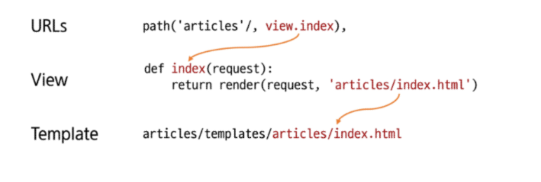

# 스스로 학습
### 에러가 발생한다면,,,

1. `settings.py`에 앱을 등록했는지 확인하자. 저장까지 잊지말기!
2. `urls.py`에 import문 썼는지 확인하기 
3. 로컬 서버를 확인할 때, url 경로를 입력하지 않으면 에러가 발생한다.
    - django를 처음 실행했을 때 (url 경로를 아무것도 지정하지 않았을 때)는 로켓 페이지가 뜨지만,
    - url 경로를 하나라도 지정한 후에는 로컬 서버(http://127.0.0.1:8000/)는 없는 페이지(404 Error)가 된다.
    - 그러므로 url 경로를 입력해주어야 한다! (예: http://127.0.0.1:8000/**hello/**)
  

<br><br>

# 수업 필기

## Django 프로젝트와 앱 생성

### 가상 환경 생성 루틴

**Django 프로젝트 생성 전 루틴**

```bash
# 1. 가상 환경(venv) 생성
python -m venv venv

# 2. 가상 환경 활성화
source venv/Scripts/activate

# 3. Django 설치
pip install django

# 4. 패키지 목록 파일 생성 (패키지 설치시마다 진행)
pip freeze > requirements.txt
```

**Django 프로젝트를 git 저장소로 만드는 경우**

위의 Django 프로젝트 생성 전 루틴을 진행한 후에, 아래 코드 추가로 실행

```bash
# 5. .gitignore 파일 생성 (첫 add 전 진행)
touch .gitignore

# 6. git 저장소 생성
git init

# 7. Django 프로젝트 생성
django-admin startproject firstpjt .
```


### Django 프로젝트 생성 및 서버 실행

1. **Django 설치**
    
    ```bash
    pip install django
    ```
    
2. **프로젝트 생성**
    
    ```bash
    django-admin startproject firstpjt .
    ```
    
    - `.`(현재 디렉토리)에 `firstpjt`라는 이름의 django 프로젝트를 생성한다.

3. **서버 실행**
    
    ```bash
    python manage.py runserver
    ```
    
    - `manage.py`는 장고 명령어를 제공한다.
    - (주의) 현재 디렉토리와 `manage.py`가 같은 경로에 있는지 확인!
    
    → [`http://127.0.0.1:8000/`](http://127.0.0.1:8000/) 로컬 서버
    
    
     
    - 서버 종료 : `ctrl + C`


### Django 앱 생성 및 등록

1. **앱 생성**
    
    ```bash
    python manage.py startapp articles
    ```
    
    - `articles`라는 폴더와 내부에 여러 파일이 새로 생성된다.
        - 앱의 이름은 **복수형**으로 지정하는 것을 권장
        
        
        
    - (주의) 프로젝트 폴더와 앱 폴더는 별도의 폴더로 생성된다. (상위-하위 포함 관계가 아님) → 프로젝트에 앱 등록 필요

2. **앱 등록**
    - 프로젝트의 `settings.py`의 `INSTALLED_APPS`에 작성한다.
    - 사용자가 생성한 앱은 상단부터 작성하는 것을 권장한다.
        - Django의 내부 구동 순서 때문
        
        
        
    - **반드시 앱을 생성한 후에 등록한다.**
    - 등록 후 생성은 불가하다.
        - 등록을 먼저 할 경우 생성을 위한 명령어 실행 중 아직 존재하지 않는 `articles` 앱을 찾으려다가 실패하기 때문


## 요청과 응답 과정


- `views.py`가 MVC 패턴의 컨트롤러(C) 역할이라 가장 중요하고 많이 사용하게 될 것

### 구현 예시


1. `pjt/urls.py` : ‘입구’ 역할
    - `urlpatterns`에 `path('url 경로/', view.함수명)`입력
        - **각 url 경로는 반드시 `/`로 끝난다.**
        - url로 articles/까지 일치되었을 때, 두 번째 인자에 있는 view함수를 호출한다.
        - 위에서부터 일치하는 문자열을 찾아나가기 때문에 작성하는 순서를 신경쓸 것
    
    ```python
    # urls.py
    
    from django.contrib import admin
    from django.urls import path
    from articles import views
    
    urlpatterns = [
        path('admin/', admin.site.urls),
        # url로 articles/까지 일치되었을 때, 두번째 인자에 있는 view 함수를 호출한다.
        path('articles/', views.index),
    ]
    ```
    
2. `app/views.py` : view 함수가 정의되는 곳
    - 특정 경로에 있는 template과 request 객체를 결합해 응답 객체를 반환
    - **모든 view 함수는 첫 번째 인자로 요청 객체(`request`)를 필수적으로 받는다.**
        - 매개 변수 이름은 request가 아니어도 되지만 관례적으로 request로 작성
    - `return render(요청 객체, 템플릿 경로)` 응답을 반환한다.
        - 템플릿 경로 작성 시 **`app폴더/templates/` 이후의 경로를 작성해야 한다.**
    
    ```python
    # views.py
    
    from django.shortcuts import render
    
    # Create your views here.
    # 메인 페이지를 응답하는 함수
    def index(request):
        return render(request, 'articles/index.html')
    ```
    
3. `app/templates/` : 템플릿을 저장할 폴더
    - 폴더명은 반드시 `templates`여야 하며 개발자가 직접 생성해야 한다.
    - `articles/` 안에 템플릿 파일 생성
    
    ```html
    <!-- templates/articles/index.html -->
    
    <!DOCTYPE html>
    <html lang="en">
    <head>
      <meta charset="UTF-8">
      <meta name="viewport" content="width=device-width, initial-scale=1.0">
      <title>Document</title>
    </head>
    <body>
      <h1>메인 페이지입니다.</h1>
    </body>
    </html>
    ```

### render 함수

주어진 템플릿을 주어진 컨텍스트 데이터와 결합하고 렌더링 된 텍스트와 함께 HttpResponse 응답 객체를 반환하는 함수

`render(request, template_name, context)`

| 파라미터 | 설명 |
| --- | --- |
| `request` | 응답을 생성하는 데 사용되는 요청 객체 |
| `template_name` | 템플릿 이름의 경로 |
| `[context]` | 템플릿에서 사용할 데이터, 딕셔너리 타입으로 작성 |

### 코드 작성 시 주의사항

- 데이터가 흐르는 순서에 따라 코드 작성하기
    
    **“URLs → View → Template”**
    



