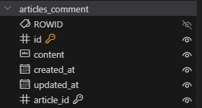
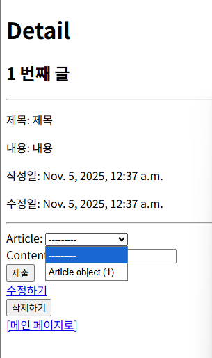
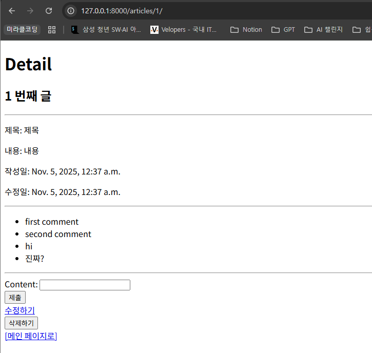
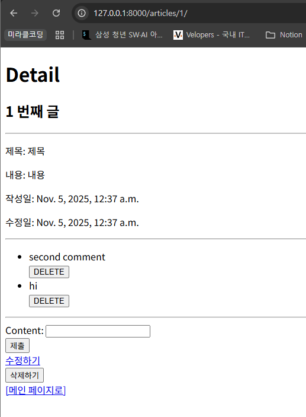
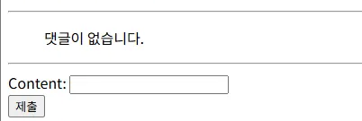
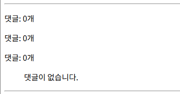

# 1:N Model Relationships

## 모델 관계

### 관계의 종류

- 관계 (Relationship): 데이터베이스 내 여러 테이블 간의 논리적인 연결 관계

- **1:1 (One to One) 관계**
    - 한 사람당 하나의 주민등록번호
- **N:1 (Many to One) 관계**
    - **외래키 (Foreign Key)**는 관계형 데이터베이스에서 두 테이블 간의 논리적인 연결 고리 역할
    - 한 테이블의 0개 이상의 레코드가 다른 테이블의 레코드 한 개와 관련된 관계
    - 여러 교육생(N)을 한 강사(1)가 가르침
- **N:M (Many to Many) 관계**
    - 보통 중간 테이블(예: 수강신청)을 사용해 구현
    - 여러 학생(N)이 여러 과목(M)을 수강함

### 관계 예시

- SSAFY Track (1) : Student (N)
- Account (N) : Bank (1)
- Baseball Team (1) : Member (N)
- Order (N) : Customer (1)
- Country (1) : City (N)
- Movie (N) : Actor (M)
- Comment (N) : Article (1)
    - 0개 이상의 댓글은 1개의 게시글에 작성될 수 있다.

### ForeignKey 필드

`ForeignKey(to, on_delete)`

- Django에서 한 모델이 다른 모델을 참조하는 관계를 설정하는 필드
- N:1 관계를 표현할 때 사용한다.
    - 관계 설정을 위한 외래키(Foreign Key)는 N:1에서 **N**을 담당하는 테이블에 위치
- 데이터베이스에서 외래 키로 구현된다.

**속성 정보**

- `to`: 참조하는 모델 클래스 이름 (N:1에서 1의 클래스 정보)
- `on_delete`: 외래키가 참조하는 객체(1)가 삭제되었을 때, 외래키를 가진 객체(N)를 어떻게 처리할지를 정의하는 설정 (데이터의 무결성 원칙)
    - `CASCADE` : 부모 객체가 삭제될 때 이를 참조하는 모든 객체도 삭제되도록 지정
    - `PROTECT` : 삭제하려는 부모 객체에 자식 객체가 존재한다면 해당 부모 객체를 삭제하지 못하도록 지정
    - `SET_NULL` : 부모 객체가 삭제되면, 해당 필드 값이 NULL이 저장되도록 지정
        - 단, 해당 Foreign Key 필드 설정이 null=True가 설정되어야 한다.

### 데이터 무결성

- 데이터베이스에 저장된 데이터의 정확성, 일관성, 유효성을 유지하는 것
- 데이터베이스에 저장된 데이터 값의 정확성을 보장하는 것
- 데이터의 신뢰성 확보, 시스템 안정성, 보안 강화

## 참조와 역참조
 
### 참조 (Forward Reference)

- 직접 대상의 정보를 저장하고 필요할 때 활용하는 것
- 댓글(comment)은 게시글(article)을 참조한다.
- N → 1 : 참조
- QuerySet API의 .filter() 사용

```bash
# 특정 게시글 정보를 가져온 후 filter를 이용할 수 있음
article = Article.objects.get(pk=1)
comments = Comment.objects.filter(article=article)
```

### 역참조 (Reverse Reference)

- 누가 나를 참조하는지 거꾸로 조회하는 것
- 1 → N : 역참조

```bash
# 1번 게시글에 작성된 모든 댓글 조회하기 (역참조)
In [16]: article.comment_set.all()
Out[16]: <QuerySet [<Comment: Comment object (1)>, <Comment: Comment object (2)>]>
```

- 모델 인스턴스 `article`: models.py에 정의된 모델 클래스로 생성된 실제 데이터
    - 참조 가능한 필드가 없는 모델 클래스의 인스턴스를 사용하면 된다.
- related manager (역참조 이름) `comment_set`: 역참조 시에 사용하는 매니저
    - related_name은 명시적으로 설정하지 않으면 자동으로 생성되지 않는다. 
    - 대신, django는 기본적으로 `모델명_set` 형식의 역참조 매니저를 제공한다.
- QuerySet API `all()`: 데이터를 가져오기 위한 쿼리 결과 집합

- Article 모델에는 Comment를 직접 참조하는 필드가 없기 때문에 직접 접근할 수 없다. 
- 대신, Django는 역참조 기능을 통해 article.comment_set.all() 과 같은 방식으로 참조하는 데이터를 거꾸로 조회할 수 있도록 지원한다.

## [실습] 댓글 구현

### 모델 정의하기 (ForeignKey)

- 인스턴스 이름은 **참조하는 모델 클래스 이름의 단수형**으로 작성하는 것을 권장
    - 만들어지는 필드 이름은 `작성한 필드명_id`
- 외래키는 models.py의 클래스 내에 ForeignKey 필드를 작성하는 순서와 관계없이 테이블의 마지막 필드로 생성된다.

```python
# articles/models.py
class Comment(models.Model):
    article = models.ForeignKey(Article, on_delete=models.CASCADE)
    content = models.CharField(max_length=200)
    created_at = models.DateTimeField(auto_now_add=True)
    updated_at = models.DateTimeField(auto_now=True)
```

db.sqlite3



### 댓글 생성 연습 (ORM)

1. 게시글 생성
2. 댓글 생성
    
    ```bash
    comment = Comment()
    comment.content = 'first comment'
    comment.save()
    
    # 에러 발생
    IntegrityError: NOT NULL constraint failed: articles_comment.article_id
    ⇒ 외래 키에는 NOT NULL 제약조건이 걸려있다!
    ```
    
3. 외래키 데이터 입력
    
    ```bash
    # 게시글 정보 조회하여 가져오기
    article = Article.objects.get(pk=1)
    
    # 외래 키 데이터 입력
    comment.article = article
    # 직접적으로 테이블의 필드에 pk를 넣어도 저장되지만 권장하지 않음
    # comment.article_id = article.pk
    
    # 댓글 저장 및 확인
    comment.save()
    ```
    
    ```bash
    comment = Comment()
    comment.content = 'second comment'
    # 잘못된 예
    comment.article_id = article
    comment.save()
    
    # 에러 발생
    TypeError: Field 'id' expected a number but got <Article: Article object (1)>.
    => article_pk는 정수 자료형만 입력 가능하다!
    
    # 가능한 예
    # 그러나, 직접 pk를 넣는 것은 권장하지 않는다.
    comment.article_id = article.pk
    comment.save()
    ```
    
    - 직접 객체를 할당하는 경우, 숫자를 저장하기 때문에 잘못된 객체의 PK 값이 저장될 수 있다.
        - 예: `comment.article_id = book.pk` 잘못된 정보지만 에러 발생 안함

### 댓글 CREATE

- 사용자로부터 댓글 데이터를 입력받기 위한 CommentForm 정의

```python
# articles/forms.py
from django import forms
from .models import Article, Comment

class ArticleForm(forms.ModelForm):
    class Meta:
        model = Article
        fields = '__all__'

class CommentForm(forms.ModelForm):
    class Meta:
        model = Comment
        fields = '__all__'
```

```python
# articles/views.py
from .models import Article, Comment
from .forms import ArticleForm, CommentForm

...
def detail(request, pk):
    article = Article.objects.get(pk=pk)
    comment_form = CommentForm()

    context = {
        'article': article,
        'comment_form': comment_form,
    }
    return render(request, 'articles/detail.html', context)

```

```html
<!-- articles/detail.html -->
...
  <hr>
   댓글 form 
  <form action="#" method="POST">
    
    {{ comment_form }}
    <input type="submit">
  </form>
 ...
```



- 실행 결과, 게시글을 사용자가 직접 선택해서 작성해야 함…
    - 댓글 작성을 허용하지 않은 게시글을 선택해서 댓글을 추가할 수 있다.
    - 엉뚱한 게시글에 댓글을 달 수 있다.

- CommentForm 의 출력 필드 조정 + URL의 variable routing에서 `article.pk`값을 이용해 외래키 데이터로 사용

```python
# articles/forms.py
class CommentForm(forms.ModelForm):
    class Meta:
        model = Comment
        fields = ('content',)
```

```python
# articles/urls.py
app_name = 'articles'
urlpatterns = [
    ...
    path('<int:pk>/comments/', views.comments_create, name='comments_create'),
]

```

```html
<!-- articles/detail.html -->
...
  <hr>
   댓글 form 
  <form action="" method="POST">
    
    {{ comment_form }}
    <input type="submit">
  </form>
```

```python
# articles/views.py
def comments_create(request, pk):
    article = Article.objects.get(pk=pk)
    # 댓글 데이터 받기
    comment_form = CommentForm(request.POST)
    # 유효성 검사
    if comment_form.is_valid():
        # commit=False는 DB에 저장 요청을 잠시 보류하고,
        # 대신 comment 인스턴스는 반환해줌
        comment = comment_form.save(commit=False)
        # 외래키 데이터를 할당
        comment.article = article
        comment.save()
        return redirect('articles:detail', article.pk)
    context = {
        'article': article,
        'comment_form': comment_form,
    }
    return render(request, 'articles/detail.html', context)
```


DB에 ‘hi’ 댓글 생성 확인

- save 메서드의 commit 속성은 True가 기본 값
- `commit=False`인 경우 DB에 저장 요청을 보내지 않고 인스턴스만 반환한다.

### 댓글 READ

```python
# articles/views.py
def detail(request, pk):
    article = Article.objects.get(pk=pk)
    comment_form = CommentForm()
    # 특정 게시글에 작성된 모든 댓글 조회 (역참조)
    # comments = Comment.objects.all()      # 잘못된 댓글 정보 조회
    comments = article.comment_set.all()    # 특정 게시글의 댓글을 역참조로 조회

    context = {
        'article': article,
        'comment_form': comment_form,
        'comments': comments,
    }
    return render(request, 'articles/detail.html', context)
```

```html
 <!-- articles/detail.html -->
  <hr>
   댓글 목록 
  <ul>
    
      <li>{{ comment.content }}</li>
    
  </ul>
```



### 댓글 DELETE

- 개별 댓글마다 삭제할 수 있는 기능 추가
- 어떤 댓글을 삭제해야 하는지 삭제 대상 정보를 전달하기 위해 variable routing 이용

```python
# articles/urls.py
urlpatterns = [
    ...
    # 댓글 삭제
    # URL 패턴의 구조적인 통일성을 위해 article_pk 정보를 작성함
    path('<int:article_pk>/comments/<int:comment_pk>/delete/', 
        views.comments_delete, 
        name='comments_delete'
    ),
]
```

```python
# articles/views.py
# 댓글 삭제 함수
def comments_delete(request, article_pk, comment_pk):
    # 삭제할 댓글 조회
    comment = Comment.objects.get(pk=comment_pk)
    # 댓글 삭제
    comment.delete()
    # 삭제 후 게시글 상세 페이지로 리다이렉트
    return redirect('articles:detail', article_pk)
```

```html
<!-- articles/detail.html -->
...
  <hr>
   댓글 목록 
  <ul>
    
      <li>{{ comment.content }}</li>
      <form action="" method="POST">
        
        <input type="submit" value="DELETE">
      </form>
    
  </ul>
```



### 댓글 추가 구현

**댓글이 없는 경우 대체 콘텐츠 출력**

- DTL의 `for empty` 태그: for문에 반복할 요소가 없는 경우 `empty` 태그가 실행된다.

```html
<!-- articles/detail.html -->
    <ul>
    
        <li>{{ comment.content }}
        <form action="" method="POST">
        
        <input type="submit" value="DELETE">
        </form>
        </li>
    
        <p>댓글이 없습니다.</p>
    
    </ul>
```
    



**댓글 개수 출력하기**

- DTL filter의 `length` 활용
- QuerySet API의 `count()`메서드 활용

```html
<!-- articles/detail.html -->
     댓글 개수 
    <p>댓글: {{ comments|length }}개</p>
    <p>댓글: {{ article.comment_set.all|length }}개</p>  <!-- 역참조 -->
    <p>댓글: {{ article.comment_set.count }}개</p>
```




### admin site 댓글 등록

```python
# articles/admin.py
from django.contrib import admin
from .models import Article, Comment

admin.site.register(Article)
admin.site.register(Comment)
```

