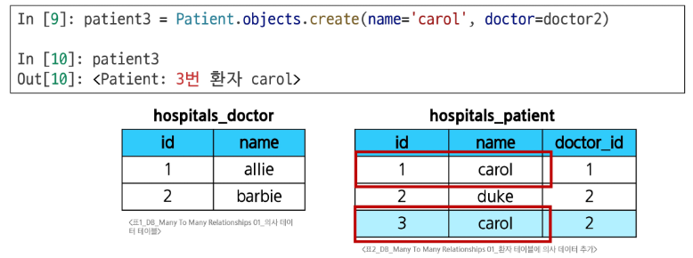
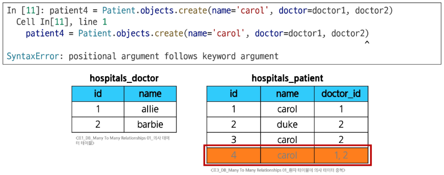
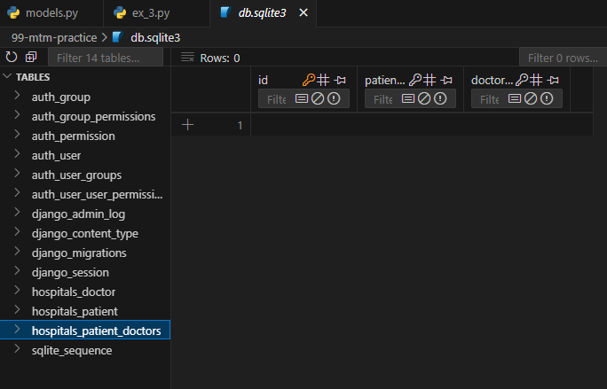
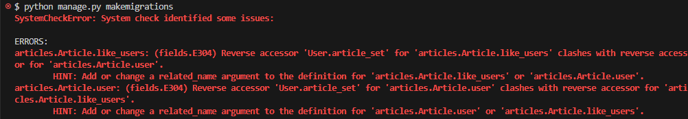
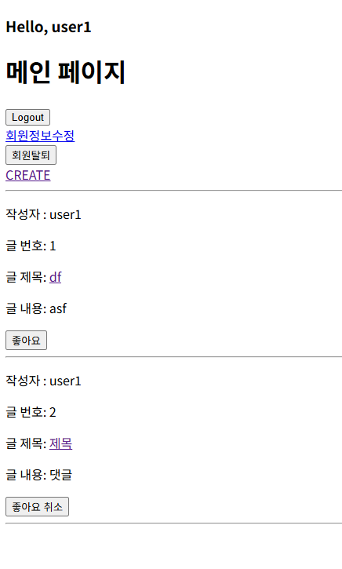

# Model Relationships - M:N (ManyToManyField)

## 다대다 관계 (Many to Many Relationships)

한 테이블의 0개 이상의 레코드가 다른 테이블의 0개 이상의 레코드와 관련된 경우

### N:1의 한계

- 1번 환자 (carol)가 두 의사 모두에게 진료받고자 한다면, 환자 patient 테이블에 1번 환자 데이터가 중복으로 입력된다.



- 그렇다고 doctor_id에 두 의사를 동시에 저장하고자 한다면, SyntaxError가 발생한다.
    - 제1정규형을 만족하지 못하기 때문에 사용이 불가함
    - 제1정규형: 테이블의 모든 칸에 더 이상 쪼갤 수 없는 하나의 값만 넣어야 한다.



### 중개 모델

- 다대다 관계에서 두 모델을 연결하는 역할을 하는, 특별한 기능을 가진 모델
- Reservation 모델은 Doctor와 Patient에 각각 N:1 관계를 가진다.
- M:N 관계로 맺어진 두 테이블에는 물리적인 변화가 없다.

```python
class Doctor(models.Model):
    name = models.TextField()

    def __str__(self):
        return f'{self.pk}번 의사 {self.name}'

# 외래키 삭제
class Patient(models.Model):
    name = models.TextField()

    def __str__(self):
        return f'{self.pk}번 환자 {self.name}'

# 중개모델 작성
class Reservation(models.Model):
    doctor = models.ForeignKey(Doctor, on_delete=models.CASCADE)
    patient = models.ForeignKey(Patient, on_delete=models.CASCADE)

    def __str__(self):
        return f'{self.doctor_id}번 의사의 {self.patient_id}번 환자'
```

## ManyToManyField

### ManyToManyField(to, **options)

- M:N 관계 설정 모델 필드
- 어느 모델에서든 관련 객체에 접근할 수 있는 **양방향 관계**
- 동일한 관계는 한 번만 저장되며 **중복되지 않는다.**
- 이 필드를 설정하면 Django가 자동으로 중개 모델을 생성한다.
    - Doctor 혹은 Patient 어느 모델에 정의해도 상관없다.
    - 대신 필드 작성 위치에 따라 **참조/역참조 관계가 달라진다.**

```python
class Doctor(models.Model):
    name = models.TextField()

    def __str__(self):
        return f'{self.pk}번 의사 {self.name}'

class Patient(models.Model):
    # ManyToManyField 작성
    # patient -> doctor : 참조
    # doctor -> patient : 역참조
    doctors = models.ManyToManyField(Doctor)
    name = models.TextField()

    def __str__(self):
        return f'{self.pk}번 환자 {self.name}'

# Reservation Class 주석 처리
```



- `add()` 메서드: 중개 테이블에 새로운 데이터를 추가할 때 사용

```python
patient.doctors.add(doctor1)
patient.doctors.add(doctor2, doctor3)
```

- `remove()` 메서드: 중개 테이블에 있는 데이터를 삭제할 때 사용
    - 인자로 전달한 인스턴스를 중개 테이블에서 제거하며, 대상 객체 자체는 삭제되지 않는다.

```python
patient.doctors.remove(doctor1)
patient.doctors.remove(doctor2, doctor3)
```

### through 속성

- 중개 테이블에 **추가 데이터**를 사용해 M:N 관계를 형성하려는 경우에 사용한다.
- `add()`, `remove()` 메서드를 그대로 활용할 수 있다.
    - `add()` 메서드의  `through_defaults={필드명: 값}` 형태로 전달

```python
# models.py
class Doctor(models.Model):
    name = models.TextField()

    def __str__(self):
        return f'{self.pk}번 의사 {self.name}'

class Patient(models.Model):
    doctors = models.ManyToManyField(Doctor, through='Reservation')
    name = models.TextField()

    def __str__(self):
        return f'{self.pk}번 환자 {self.name}'

class Reservation(models.Model):
    doctor = models.ForeignKey(Doctor, on_delete=models.CASCADE)
    patient = models.ForeignKey(Patient, on_delete=models.CASCADE)
    
    # 추가 필드
    symptom = models.TextField()
    reserved_at = models.DateTimeField(auto_now_add=True)

    def __str__(self):
        return f'{self.doctor.pk}번 의사의 {self.patient.pk}번 환자'
```

```python
# 2. Patient 객체를 통한 예약 생성
patient2.doctors.add(doctor1, through_defaults={'symptom': 'flu'})
doctor1.patient_set.all()
patient2.doctors.all()
```

### related_name 속성

- 역참조시 사용하는 manager name을 변경
- 기본 값인 `역참조모델명_set`을 다른 이름으로 변경할 수 있다.
- 단, 이름을 변경하면 더 이상 기본 값을 사용할 수 없다.

```python
class Patient(models.Model):
    # ManyToManyField - related_name 작성
    doctors = models.ManyToManyField(Doctor, related_name='patients')
    name = models.TextField()

    def __str__(self):
        return f'{self.pk}번 환자 {self.name}'
```

```python
# 변경 전
doctor.patient_set.all()

# 변경 후
doctor.patients.all()
```

### symmetrical 속성

- 관계 설정 시 대칭 유무 설정
- ManyToManyField가 동일한 모델을 가리키는 정의에서만 사용
- 기본 값: True
    - source 모델 (관계를 시작하는 모델)의 인스턴스가 target 모델 (관계의 대상이 되는 모델)의 인스턴스를 참조하면 자동으로 target 모델 인스턴스도 source 모델 인스턴스를 자동으로 참조하도록 한다.
    - 즉, 한 명이 팔로우하면 자동으로 맞팔로우

## 좋아요 기능 구현

### 모델 관계 설정

- 다대다 관계: Article (M) - User (N)
    - 게시글은 좋아요가 없을 수도 있고, 여러 개 존재할 수 있다.
    - 사용자는 게시글에 좋아요를 한 번도 누르지 않았을 수도 있고, 여러 개의 게시글에 좋아요를 누를 수 있다.

```python
# articles/models.py
class Article(models.Model):
    user = models.ForeignKey(
        settings.AUTH_USER_MODEL, on_delete=models.CASCADE
    )
    like_users = models.ManyToManyField(settings.AUTH_USER_MODEL)
    title = models.CharField(max_length=10)
    content = models.TextField()
    created_at = models.DateTimeField(auto_now_add=True)
    updated_at = models.DateTimeField(auto_now=True)
```



Error message

- migration 진행 시 에러 발생
    - 유저가 게시글을 역참조할 때 역참조 이름에 대한 충돌이 발생하고 있다.
    - 게시글의 작성자 저장을 위해 설정한 ForeignKey의 역참조: `user.article_set.all()`
    - 좋아요 기능을 위해 설정한 ManyToManyField의 역참조: `user.article_set.all()`
- 일반적으로 M:N 관계 쪽에 related_name을 추가한다.
    - ForeignKey - ‘소유’ 관계의 기본값 유지: `user.article_set.all()`
    - ManyToManyField - ‘행위’ 관계의 명시적 표현: `user.like_articles.all()`

```python
# articles/models.py
class Article(models.Model):
    user = models.ForeignKey(
        settings.AUTH_USER_MODEL, on_delete=models.CASCADE
    )
    like_users = models.ManyToManyField(settings.AUTH_USER_MODEL, related_name='like_articles')
    title = models.CharField(max_length=10)
    content = models.TextField()
    created_at = models.DateTimeField(auto_now_add=True)
    updated_at = models.DateTimeField(auto_now=True)

```

### **User-Article 간 사용가능한 전체 related manager**

| related manager | 설명 | 관계 |
| --- | --- | --- |
| `article.user` | 게시글을 작성한 유저 | N:1 |
| `user.article_set` | 유저가 작성한 게시글 (역참조) | N:1 |
| `article.like_users` | 게시글을 좋아요 한 유저 | M:N |
| `user.like_articles` | 유저가 좋아요 한 게시글 (역참조) | M:N |

### 기능 구현

```python
# articles/urls.py
app_name = 'articles'
urlpatterns = [
    ...
    path('<int:article_pk>/likes/', views.likes, name='likes'),
]
```

```python
# articles/views.py
# 좋아요 처리 함수
def likes(request, article_pk):
    # 어떤 게시글에 좋아요를 누르는 건지 조회
    article = Article.objects.get(pk=article_pk)
    
    # Article = User 다대다 관계 생성/삭제
    # 좋아요 생성/취소인지 확인
    # 주체: 유저
    # 유저가 해당 게시글에 좋아요를 누른 유저 목록에 포함되어있느냐/없느냐
    if request.user in article.like_users.all():
        article.like_users.remove(request.user)
        # request.user.like_article.remove(article)
    else:
        article.like_users.add(request.user)
        # request.user.like_article.add(article)
        
    return redirect('articles:index')
```

```html
<!-- articles/index.html -->
...
<form action="" method='POST'>
  
  
    <input type="submit" value="좋아요 취소">
  
    <input type="submit" value="좋아요">
  
</form>
...
```



