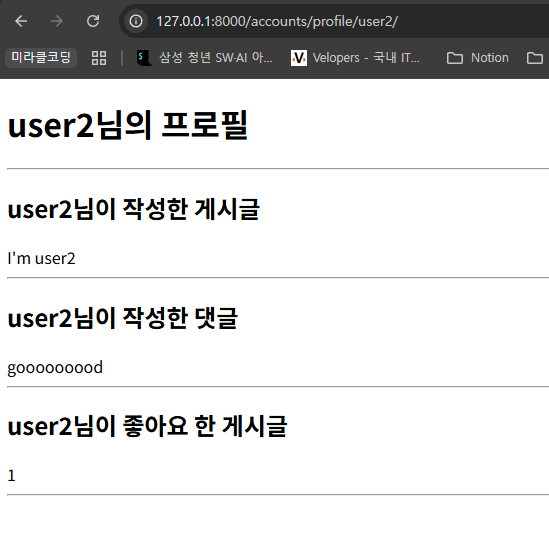
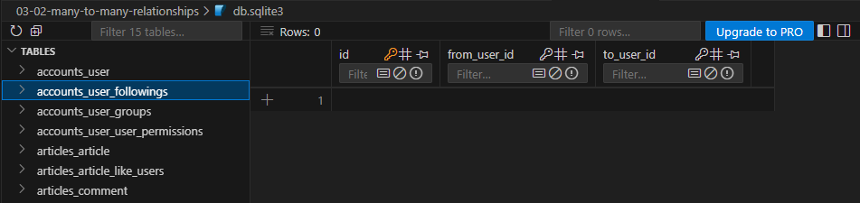
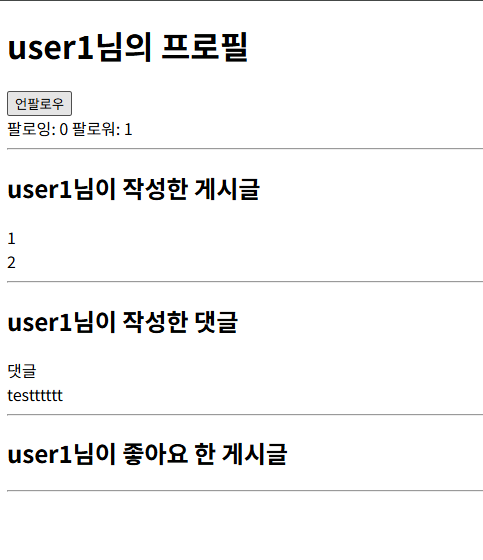
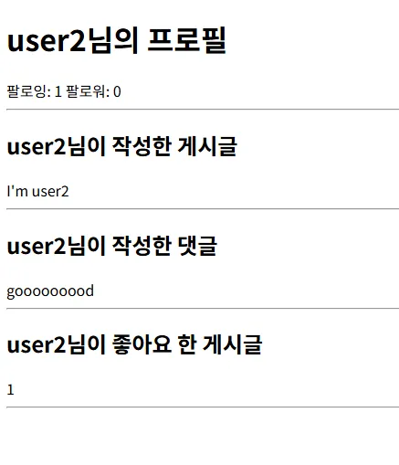
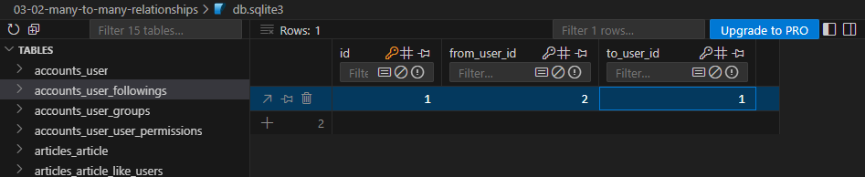

# Model Relationships - M:N (ManyToManyField)

## 다대다 관계 (Many to Many Relationships)

한 테이블의 0개 이상의 레코드가 다른 테이블의 0개 이상의 레코드와 관련된 경우

### N:1의 한계

- 1번 환자 (carol)가 두 의사 모두에게 진료받고자 한다면, 환자 patient 테이블에 1번 환자 데이터가 중복으로 입력된다.


- 그렇다고 doctor_id에 두 의사를 동시에 저장하고자 한다면, SyntaxError가 발생한다.
    - 제1정규형을 만족하지 못하기 때문에 사용이 불가함
    - 제1정규형: 테이블의 모든 칸에 더 이상 쪼갤 수 없는 하나의 값만 넣어야 한다.


### 중개 모델

- 다대다 관계에서 두 모델을 연결하는 역할을 하는, 특별한 기능을 가진 모델
- Reservation 모델은 Doctor와 Patient에 각각 N:1 관계를 가진다.
- M:N 관계로 맺어진 두 테이블에는 물리적인 변화가 없다.

```python
class Doctor(models.Model):
    name = models.TextField()

    def __str__(self):
        return f'{self.pk}번 의사 {self.name}'

# 외래키 삭제
class Patient(models.Model):
    name = models.TextField()

    def __str__(self):
        return f'{self.pk}번 환자 {self.name}'

# 중개모델 작성
class Reservation(models.Model):
    doctor = models.ForeignKey(Doctor, on_delete=models.CASCADE)
    patient = models.ForeignKey(Patient, on_delete=models.CASCADE)

    def __str__(self):
        return f'{self.doctor_id}번 의사의 {self.patient_id}번 환자'
```

## ManyToManyField

### ManyToManyField(to, **options)

- M:N 관계 설정 모델 필드
- 어느 모델에서든 관련 객체에 접근할 수 있는 **양방향 관계**
- 동일한 관계는 한 번만 저장되며 **중복되지 않는다.**
- 이 필드를 설정하면 Django가 자동으로 중개 모델을 생성한다.
    - Doctor 혹은 Patient 어느 모델에 정의해도 상관없다.
    - 대신 필드 작성 위치에 따라 **참조/역참조 관계가 달라진다.**

```python
class Doctor(models.Model):
    name = models.TextField()

    def __str__(self):
        return f'{self.pk}번 의사 {self.name}'

class Patient(models.Model):
    # ManyToManyField 작성
    # patient -> doctor : 참조
    # doctor -> patient : 역참조
    doctors = models.ManyToManyField(Doctor)
    name = models.TextField()

    def __str__(self):
        return f'{self.pk}번 환자 {self.name}'

# Reservation Class 주석 처리
```


- `add()` 메서드: 중개 테이블에 새로운 데이터를 추가할 때 사용

```python
patient.doctors.add(doctor1)
patient.doctors.add(doctor2, doctor3)
```

- `remove()` 메서드: 중개 테이블에 있는 데이터를 삭제할 때 사용
    - 인자로 전달한 인스턴스를 중개 테이블에서 제거하며, 대상 객체 자체는 삭제되지 않는다.

```python
patient.doctors.remove(doctor1)
patient.doctors.remove(doctor2, doctor3)
```

### through 속성

- 중개 테이블에 **추가 데이터**를 사용해 M:N 관계를 형성하려는 경우에 사용한다.
- `add()`, `remove()` 메서드를 그대로 활용할 수 있다.
    - `add()` 메서드의  `through_defaults={필드명: 값}` 형태로 전달

```python
# models.py
class Doctor(models.Model):
    name = models.TextField()

    def __str__(self):
        return f'{self.pk}번 의사 {self.name}'

class Patient(models.Model):
    doctors = models.ManyToManyField(Doctor, through='Reservation')
    name = models.TextField()

    def __str__(self):
        return f'{self.pk}번 환자 {self.name}'

class Reservation(models.Model):
    doctor = models.ForeignKey(Doctor, on_delete=models.CASCADE)
    patient = models.ForeignKey(Patient, on_delete=models.CASCADE)
    
    # 추가 필드
    symptom = models.TextField()
    reserved_at = models.DateTimeField(auto_now_add=True)

    def __str__(self):
        return f'{self.doctor.pk}번 의사의 {self.patient.pk}번 환자'
```

```python
# 2. Patient 객체를 통한 예약 생성
patient2.doctors.add(doctor1, through_defaults={'symptom': 'flu'})
doctor1.patient_set.all()
patient2.doctors.all()
```

### related_name 속성

- 역참조시 사용하는 manager name을 변경
- 기본 값인 `역참조모델명_set`을 다른 이름으로 변경할 수 있다.
- 단, 이름을 변경하면 더 이상 기본 값을 사용할 수 없다.

```python
class Patient(models.Model):
    # ManyToManyField - related_name 작성
    doctors = models.ManyToManyField(Doctor, related_name='patients')
    name = models.TextField()

    def __str__(self):
        return f'{self.pk}번 환자 {self.name}'
```

```python
# 변경 전
doctor.patient_set.all()

# 변경 후
doctor.patients.all()
```

### symmetrical 속성

- 관계 설정 시 대칭 유무 설정
- ManyToManyField가 동일한 모델을 가리키는 정의에서만 사용
- 기본 값: True
    - source 모델 (관계를 시작하는 모델)의 인스턴스가 target 모델 (관계의 대상이 되는 모델)의 인스턴스를 참조하면 자동으로 target 모델 인스턴스도 source 모델 인스턴스를 자동으로 참조하도록 한다.
    - 즉, 한 명이 팔로우하면 자동으로 맞팔로우

## 좋아요 기능 구현

### 모델 관계 설정

- 다대다 관계: Article (M) - User (N)
    - 게시글은 좋아요가 없을 수도 있고, 여러 개 존재할 수 있다.
    - 사용자는 게시글에 좋아요를 한 번도 누르지 않았을 수도 있고, 여러 개의 게시글에 좋아요를 누를 수 있다.

```python
# articles/models.py
class Article(models.Model):
    user = models.ForeignKey(
        settings.AUTH_USER_MODEL, on_delete=models.CASCADE
    )
    like_users = models.ManyToManyField(settings.AUTH_USER_MODEL)
    title = models.CharField(max_length=10)
    content = models.TextField()
    created_at = models.DateTimeField(auto_now_add=True)
    updated_at = models.DateTimeField(auto_now=True)
```


Error message

- migration 진행 시 에러 발생
    - 유저가 게시글을 역참조할 때 역참조 이름에 대한 충돌이 발생하고 있다.
    - 게시글의 작성자 저장을 위해 설정한 ForeignKey의 역참조: `user.article_set.all()`
    - 좋아요 기능을 위해 설정한 ManyToManyField의 역참조: `user.article_set.all()`
- 일반적으로 M:N 관계 쪽에 related_name을 추가한다.
    - ForeignKey - ‘소유’ 관계의 기본값 유지: `user.article_set.all()`
    - ManyToManyField - ‘행위’ 관계의 명시적 표현: `user.like_articles.all()`

```python
# articles/models.py
class Article(models.Model):
    user = models.ForeignKey(
        settings.AUTH_USER_MODEL, on_delete=models.CASCADE
    )
    like_users = models.ManyToManyField(settings.AUTH_USER_MODEL, related_name='like_articles')
    title = models.CharField(max_length=10)
    content = models.TextField()
    created_at = models.DateTimeField(auto_now_add=True)
    updated_at = models.DateTimeField(auto_now=True)

```

### **User-Article 간 사용가능한 전체 related manager**

| related manager | 설명 | 관계 |
| --- | --- | --- |
| `article.user` | 게시글을 작성한 유저 | N:1 |
| `user.article_set` | 유저가 작성한 게시글 (역참조) | N:1 |
| `article.like_users` | 게시글을 좋아요 한 유저 | M:N |
| `user.like_articles` | 유저가 좋아요 한 게시글 (역참조) | M:N |

### 기능 구현

```python
# articles/urls.py
app_name = 'articles'
urlpatterns = [
    ...
    path('<int:article_pk>/likes/', views.likes, name='likes'),
]
```

```python
# articles/views.py
# 좋아요 처리 함수
def likes(request, article_pk):
    # 어떤 게시글에 좋아요를 누르는 건지 조회
    article = Article.objects.get(pk=article_pk)
    
    # Article = User 다대다 관계 생성/삭제
    # 좋아요 생성/취소인지 확인
    # 주체: 유저
    # 유저가 해당 게시글에 좋아요를 누른 유저 목록에 포함되어있느냐/없느냐
    if request.user in article.like_users.all():
        article.like_users.remove(request.user)
        # request.user.like_article.remove(article)
    else:
        article.like_users.add(request.user)
        # request.user.like_article.add(article)
        
    return redirect('articles:index')
```

```html
<!-- articles/index.html -->
...
<form action="" method='POST'>
  
  
    <input type="submit" value="좋아요 취소">
  
    <input type="submit" value="좋아요">
  
</form>
...
```


## 팔로우 기능 구현

### 프로필 페이지

- 사용자가 작성한 게시글/댓글, 좋아요를 누른 게시글 목록
- 로그인한 유저뿐만 아니라 다른 사람의 프로필 페이지 방문도 가능해야 한다.
- 사용자의 username (`unique=True`)을 variable routing을 활용하여 정보 전달
    - django는 url을 판단할 때 위에서부터 순차적으로 읽어온다.
    - 따라서 문자열(예: ‘<username>/’)로 시작하는 variable routing이 가장 위에 있다면, 모든 경로를 문자열 variable routing 경로로 연결하게 되는 동시에, 해당 경로의 하단 모든 경우가 무시된다.
    - 그래서 `profile/`을 variable routing 앞에 작성한 것!

```python
# accounts/urls.py

app_name = 'accounts'
urlpatterns = [
    ...
    # path('profile/<str:username>/')
    path('profile/<username>/', views.profile, name='profile'),
]
```

 

```python
# accounts/views.py
from django.contrib.auth import get_user_model

# 프로필 페이지를 제공
def profile(request, username):
    # 해당 프로필 페이지의 유저를 조회
    User = get_user_model()
    # user 변수명은 request.user와 겹치기 때문에 권장하지 않음
    # user = User.objects.get(username=username)
    person = User.objects.get(username=username)
    context = {
        'person': person,
    }
    return render(request, 'accounts/profile.html', context)
```

```html
<!-- acconts/profile.html -->
  <h1>{{ person.username }}님의 프로필</h1>
  <hr>

   게시글 
  <h2>{{ person.username }}님이 작성한 게시글</h2>
  
    <div>{{ article.title }}</div>
  
  <hr>

   댓글 
  <h2>{{ person.username }}님이 작성한 댓글</h2>
  
    <div>{{ comment.content }}</div>
  
  <hr>

   좋아요 한 게시글 
  <h2>{{ person.username }}님이 좋아요 한 게시글</h2>
  
    <div>{{ article.title }}</div>
  
  <hr>
```

```html
<!-- articles/index.html -->

  <a href="">내 프로필</a>
  <form action="" method="POST">
    
    <input type="submit" value="Logout">
  </form>
  <a href="">회원정보수정</a>
  <form action="" method="POST">
    
    <input type="submit" value="회원탈퇴">
  </form>
  <a href="">CREATE</a>

  <a href="">Login</a>
  <a href="">회원가입</a>


...
<p>
  작성자 : 
  <a href="">{{ article.user }}</a>
</p>
```



### 모델 관계 설정

**User (M) - User (N)**

- ‘팔로우’는 유저와 유저와의 관계를 나타낸다.
    - 회원은 여러 명의 회원을 팔로우할 수 있고, 한 명도 하지 않을 수도 있다. (0개 이상)
    - 회원은 여러 명의 팔로워를 가질 수 있고, 한 명도 가지지 않을 수도 있다. (0개 이상)
- **단방향 관계**이기 때문에 `symmetrical=False`
- 참조 필드: followings 필드로, “내가 팔로우하는 사람들”을 의미한다.
    - from_user_id → to_user_id
- 역참조 필드: user_set을 사용해도 되지만, 명확한 설정을 위해 `related_name='followers'`로 변경
    - to_user_id → from_user_id

```python
# accounts/models.py
from django.db import models
from django.contrib.auth.models import AbstractUser

class User(AbstractUser):
    followings = models.ManyToManyField('self', symmetrical=False, related_name='followers')
```



중개 테이블 생성 확인

### 기능 구현

```python
# accounts/urls.py
app_name = 'accounts'
urlpatterns = [
    ...
    path('profile/<username>/', views.profile, name='profile'),
    # 상대방의 user_pk 정보를 variable routing으로 전달
    path('<int:user_pk>/follow/', views.follow, name='follow'),
]
```

```python
# accounts/views.py
def follow(request, user_pk):
    User = get_user_model()
    # 상대방 (프로필 유저) 조회
    you = User.objects.get(pk=user_pk)
    me = request.user
    
    # 나자신을 팔로우하면 안되기 때문에 상대방이 다른 사람인 경우에만 진행
    if me != you:
        # 팔로우 해야하는지 / 언팔로우를 해야하는지
        # 내가 상대방의 팔로워 목록에 있으면 => 언팔로우
        if me in you.followers.all():
            you.followers.remove(me)
            # me.followings.remove(you)
            
        # 내가 상대방의 팔로워 목록에 없으면 => 팔로우
        else:
            you.followers.add(me)
            # me.followings.add(you)
    
    return redirect('accounts:profile', you.username)
```

- 프로필 페이지의 유저(person)와 로그인한 사용자(request.user)가 다른 경우에만 팔로우 버튼 생성

```html
  <!-- accounts/profile.html -->
  <h1>{{ person.username }}님의 프로필</h1>
  
    <form action="" method="POST">
      
      
        <input type="submit" value="언팔로우">
      
        <input type="submit" value="팔로우">
      
    </form>
  
  <div>
    <div>
      팔로잉: {{ person.followings.all|length }}
      팔로워: {{ person.followers.all|length }}
    </div>
  </div>
```



user2 로그인하고 user1을 팔로우 한 상태



user2의 본인 프로필 페이지 - 팔로우 버튼 없음



### ‘exists’ method

- `.exits()`: QuerySet에 결과가 하나 이상 존재하는지 여부를 확인하는 메서드
    - 결과가 포함되어 있으면 True, 아니면 False
- 전체 QuerySet을 평가하지 않고 결과의 존재 여부만 확인
    - 해당 데이터를 불러오지 않고, 데이터베이스 수준에서 빠르게 판단 가능
    - 대량의 QuerySet에 있는 특정 객체 검색에 유용

```python
# if request.user in persons.followers.all():
if person.followers.filter(pk=request.user.pk).exists():
```


