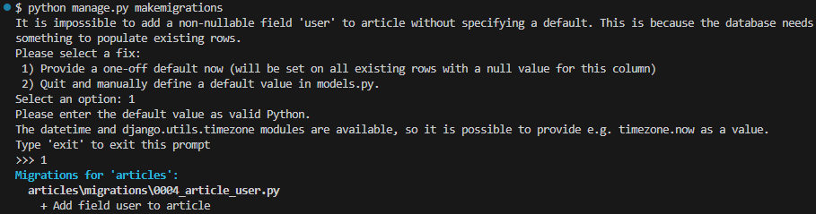
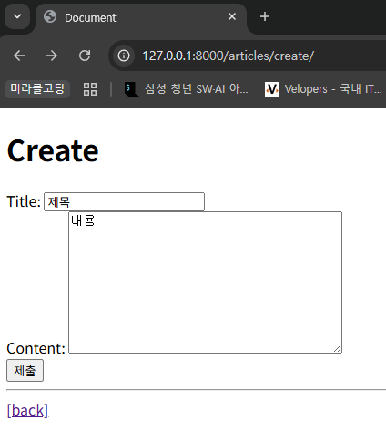
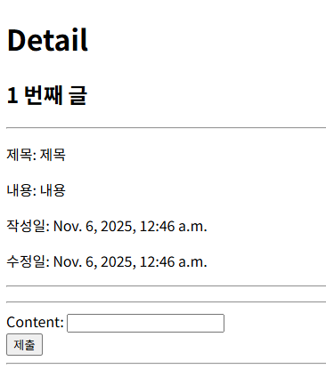
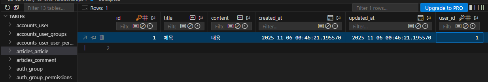
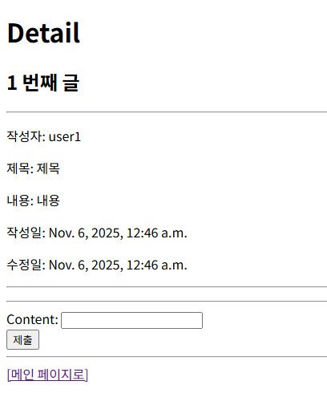
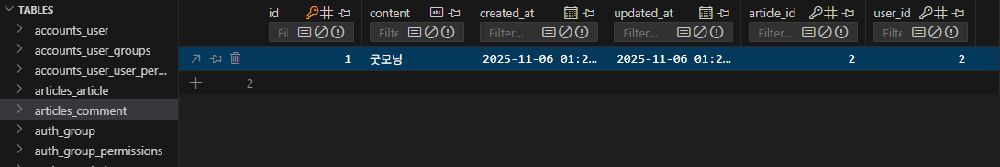
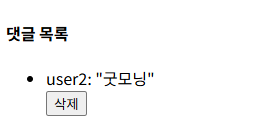

# 1:N Model Relationships - User Model 참조

## Article & User

### 지연 평가 (Lazy Evaluation)

- INSTALLED_APPS에 등록된 순서대로 앱을 구동한다.
- articeles/가 먼저 실행되기 때문에 accounts의 User 모델을 참조할 수 없다.
    - User Object가 아직 존재하지 않기 때문!
    - 대신 `AUTH_USER_MODEL`로 나중에 활성화하겠다는 임시 문자열을 박아넣는다.
- 모델의 경로 형태인 문자열이 ForeignKey의 참조 모델로 설정되면 django에서 내부적으로 해당 모델이 완전히 로딩된 후 모델 클래스를 가져와 처리한다.

```python
# articles/models.py

from django.db import models
from accounts.models import User
from django.contrib.auth import get_user_model
from django.conf import settings

class Article(models.Model):
    # 1. Django는 User 클래스를 직접 참조하는 것을 권장하지 않는다.
    # user = models.ForeignKey(User)
    # 2. models.py에서는 get_user_model로 현재 활성화된 User 모델을 가져오지 못하는 경우가 있음
    # user = models.ForeignKey(get_user_model())
    # models.py에서만 User를 참조할 때는 User를 가리키는 문자열('accounts.User')을 임시로 작성해두어야 함
    # 이 models.py가 실행될 때 아직 django 프로젝트에 User 객체가 존재하지 않으므로 
    # 나중에 User 객체가 생성되었을 때 평가되도록 하기 위함
    user = models.ForeignKey(settings.AUTH_USER_MODEL, on_delete=models.CASCADE)
    ...
```

### User 모델을 참조하는 방법

1. `settings.AUTH_USER_MODEL`
    - **models.py**에서 사용!
    - settings.py에서 정의된 AUTH_USER_MODEL 설정 값을 가져옴
    - 반환 값: `‘accounts.User’` (문자열)

```python
# settings.py

# django의 기본 유저 모델을 설정(대체)
AUTH_USER_MODEL = 'accounts.User'  # << 문자열!
```

1. `get_user_model()`
    - **models.py를 제외한 다른 모든 위치**에서 사용
    - 현재 settings.py에 정의되어 활성화된 User 모델을 가져옴
    - 반환 값: User Object (객체)

### Migration

- 기존에 테이블이 있는 상황에서 필드(user)를 추가하면, 옵션 선택 창이 뜬다
    - 기본적으로 모든 필드에 NOT NULL 제약조건이 설정되어 있기 때문
- migrate 과정이 끝나면 articles_article 테이블에 user_id 필드 생성




### 게시글 CREATE

- ArticleForm에서 사용자가 입력할 수 있는 필드를 ‘title’, ‘content’로 제한
- 게시글 작성자는 로그인 된 사용자의 정보(`request.user`)를 사용

```python
# articles/forms.py

from django import forms
from .models import Article, Comment

class ArticleForm(forms.ModelForm):
    class Meta:
        model = Article
        fields = '__all__'
        # 사용자가 user 항목을 직접 입력하지 못하도록 함
        exclude = ('user',)
        # fields = ('title', 'content',)
```

```python
# articles/views.py

@login_required
def create(request):
    if request.method == 'POST':
        form = ArticleForm(request.POST)
        if form.is_valid():
            article = form.save(commit=False)
            article.user = request.user
            article.save()
            return redirect('articles:detail', article.pk)
    else:
        form = ArticleForm()
    context = {
        'form': form,
    }
    return render(request, 'articles/create.html', context)

```







DB에서 user_id 저장 확인

### 게시글 READ

- `article.user`를 통해 게시글 작성자 정보를 출력

```python
# accounts/models.py

class User(AbstractUser):
    pass

    # AbstractUser에 아래 매직메서드가 있어서
    # User 인스턴스를 출력할 때 굳이 username까지 참조하지 않아도
    # username이 출력되는 이유
    # def __str__(self):
    #     return self.username

```

```html
<!-- articles/index.html -->
 <p>작성자: {{ article.user.username }}</p> 
<p>작성자: {{ article.user }}</p>
```

### 게시글 UPDATE

- 게시글 작성자와 게시글 수정 요청자가 같은 유저인지 확인

```python
# articles/views.py

@login_required
def update(request, pk):
    article = Article.objects.get(pk=pk)
    # 현재 수정을 요청하는 유저와 게시글의 작성자가 같은지 확인
    if request.user == article.user:
        if request.method == 'POST':
            form = ArticleForm(request.POST, instance=article)
            if form.is_valid():
                form.save()
                return redirect('articles:detail', article.pk)
        else:
            form = ArticleForm(instance=article)
    # 본인 게시글이 아니라면 리다이렉트
    else:
        return redirect('articles:index')
    
    context = {
        'article': article,
        'form': form,
    }
    return render(request, 'articles/update.html', context)
```

- 게시글 상세 페이지에서 게시글 작성자가 아니라면 수정/삭제 버튼 없애기

```html
<!-- articles/detail.html -->
  
    <a href="">수정하기</a><br>
    <form action="" method="POST">
      
      <input type="submit" value="삭제하기">
    </form>
  
  <a href="">[메인 페이지로]</a>
```



user2 로그인한 상태

### 게시글 DELETE

- 요청을 보내는 방법은 다양하기 때문에 내부적으로 사용자 구분하는 과정이 필수적
    - 브라우저 → 출력화면에서 삭제 버튼 제거
    - requests 패키지 혹은 postman 어플을 이용한 요청 → 내부에서 사용자 구분 필요

```python
# articles/views.py
@login_required
def delete(request, pk):
    article = Article.objects.get(pk=pk)
    if request.user == article.user:
        article.delete()

    return redirect('articles:index')
```

## Comment & User

### 모델 관계 설정

- User(1)는 여러 개의 댓글(N)을 작성
- Comment(N)는 한 명의 작성자(1)가 작성

```python
# articles/models.py

class Comment(models.Model):
    article = models.ForeignKey(Article, on_delete=models.CASCADE)
    user = models.ForeignKey(settings.AUTH_USER_MODEL, on_delete=models.CASCADE)
    ...
```

### 댓글 CREATE

```python
# articles/views.py

# 댓글 작성 함수
@login_required
def comments_create(request, pk):
    # 게시글 조회
    article = Article.objects.get(pk=pk)
    # 댓글 데이터 받기
    comment_form = CommentForm(request.POST)
    # 유효성 검사
    if comment_form.is_valid():
        # commit False는 DB에 저장 요청을 잠시 보류하고,
        # 대신 comment 인스턴스는 반환 해줌
        comment = comment_form.save(commit=False)
        # 외래 키 데이터(어떤 게시글에 작성되는지)를 할당
        comment.article = article
        # 외래 키 데이터(누가 작성하는지)를 할당
        comment.user = request.user
        comment.save()
        return redirect('articles:detail', article.pk)
    context = {
        'article': article,
        'comment_form': comment_form,
    }
    return render(request, 'articles/detail.html', context)

```



### 댓글 READ

```html
 <!-- articles/detail.html -->
  <h4>댓글 목록</h4>
  <ul>
  
    <li>
      {{ comment.user }}: "{{ comment.content }}"
      <form action="" method="POST">
        
        <input type="submit" value="삭제">
      </form>
    </li>
  
  </ul>
```



### 댓글 DELETE

```html
 <!-- articles/detail.html -->
  <h4>댓글 목록</h4>
  <ul>
  
    <li>
      {{ comment.user }}: "{{ comment.content }}"
      
        <form action="" method="POST">
          
          <input type="submit" value="삭제">
        </form>
      
    </li>
  
  </ul>
```

```python
# articles/veiws.py
# 댓글 삭제 함수
@login_required
def comments_delete(request, article_pk, comment_pk):
    # 삭제할 댓글 조회
    comment = Comment.objects.get(pk=comment_pk)
    # 댓글 삭제를 요청하는 유저가 현재 삭제되는 댓글의 작성자가 맞는지 확인
    if request.user == comment.user:
        # 댓글 삭제
        comment.delete()
    # 삭제 후 게시글 상세 페이지로 리다이렉트
    return redirect('articles:detail', article_pk)

```


user1 로그인 상태

