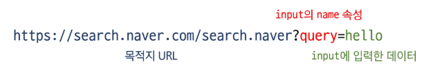
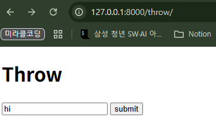
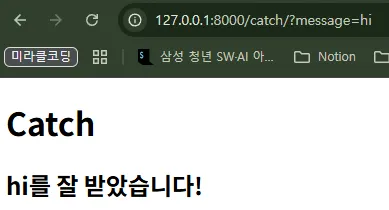
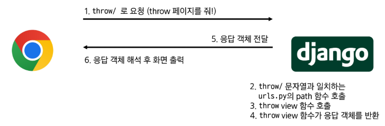
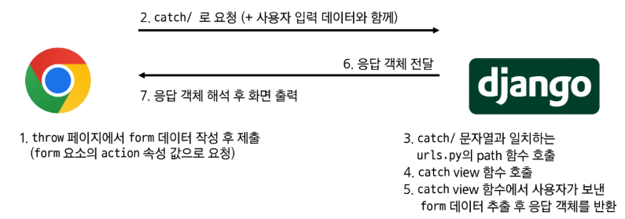

# 스스로 학습
## 입력 데이터 처리
### id 속성의 사용

```html
<!-- articles/throw.html -->




  <h1>Throw</h1>
  <form action="/catch/" method="GET">
    <input type="text" name="message" id="message">
    <input type="submit" value="submit">
  </form>

```

- 서버에 전송되는 값은 `name`에 있는 값만 전송된다.
- `id`의 값은 브라우저(클라이언트 측)에서 특정 요소를 식별할 때 사용된다.
    - JavaScript 조작: 자바스크립트가 특정 HTML 요소를 쉽게 찾아내어 내용을 바꾸거나, 이벤트를 추가하는 등 동적인 기능을 구현할 때
        - `document.getElementById('message')`
    - CSS 스타일링: 특정 요소 하나에만 고유한 스타일을 적용하고 싶을 때 CSS 선택자로 사용
        - `#message { border: 2px solid blue; }`
    - <label> 태그와 연결(웹 접근성)
        - `<label>` 태그의 `for` 속성값과 `<input>` 태그의 `id` 값을 일치시키면, 라벨을 클릭했을 때 해당 입력창에 자동으로 포커스가 이동한다.

<br><br>

# 수업 필기

## 사용자 입력 데이터 처리

### `form` element

사용자와 애플리케이션 간에 데이터(예: text, password, checkbox 등)를 보내고 가져오는 HTML 요소

- HTTP 요청(*GET, POST, PUT, DELETE**)***을 서버에 보내는 가장 편리한 방법
- `action`: 입력 데이터가 전송될 URL(**목적지**)을 지정한다.
    - actions를 지정하지 않으면 데이터는 현재 페이지의 URL로 설정된다.
- `method`: 데이터를 **어떤 방식**으로 보낼 것인지 정의한다.
    - 데이터의 HTTP request method를 지정한다.
        - `method="GET"` : 조회

### `input` element

사용자의 데이터를 입력 받을 수 있는 HTML 요소

- type 속성 값에 따라 다양한 유형의 입력 데이터를 받는다.
- `name` : 사용자가 입력한 데이터에 붙이는 **이름(key)**
    - 데이터를 제출했을 때 서버는 name 속성에 설정된 값을 통해서만 사용자가 입력한 데이터에 접근할 수 있다.
    - `name="query"` : URL에서 `query` 값에 입력받은 데이터가 할당된다.

```html
<form action="https://search.naver.com/search.naver" method="GET">
  <label for="message">검색어</label>
  <input type="text" name="query" id="message">
  <input type="submit" value="submit">
</form>

<!-- 
form에 “싸피”를 입력하면, 
'https://search.naver.com/search.naver?query=싸피'
로 연결된다. 
-->
```

### Query String Parameters

사용자의 입력 데이터를 URL 주소에 파라미터를 통해 서버로 보내는 방법

`http://host:port/path?key=value&key=value`

- 문자열은 `&`로 연결된 key=value 쌍으로 구성된다.
- 기본 URL과는 `?`로 구분된다.



 

### HTTP request 객체

- Django로 들어오는 모든 요청 관련 데이터가 담겨있다.
- view 함수의 첫 번째 인자로 전달된다.
- 서버에는 `name`이 key값으로 전송된다.

```html
<!-- articles/throw.html -->




  <h1>Throw</h1>
  <form action="/catch/" method="GET">
    <input type="text" name="message" id="message">
    <input type="submit" value="submit">
  </form>

```

```python
# views.py

def throw(request):
    return render(request, 'articles/throw.html')

# throw/에서 'SSAFY'를 입력했을 때
def catch(request):
    # 사용자 입력 데이터는 대체 어디에 있을까? -> request 객체
    print(request)  # <WSGIRequest: GET '/catch/?message=SSAFY'>
    print(request.GET)  # <QueryDict: {'message': ['SSAFY']}>
    print(request.GET.get('message'))  # SSAFY
    context = {
        'message': request.GET.get('message'),
    }
    return render(request, 'articles/catch.html', context)
```





**throw - catch 간 요청과 응답 처리 과정**

1. http://127.0.0.1:8000/throw/ : 총 2번의 서버-클라이언트 요청&응답
    
    
    
    