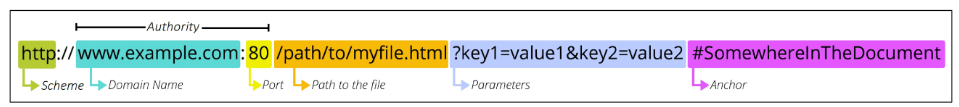
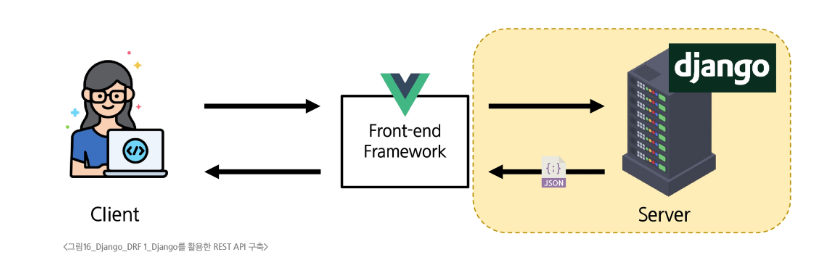
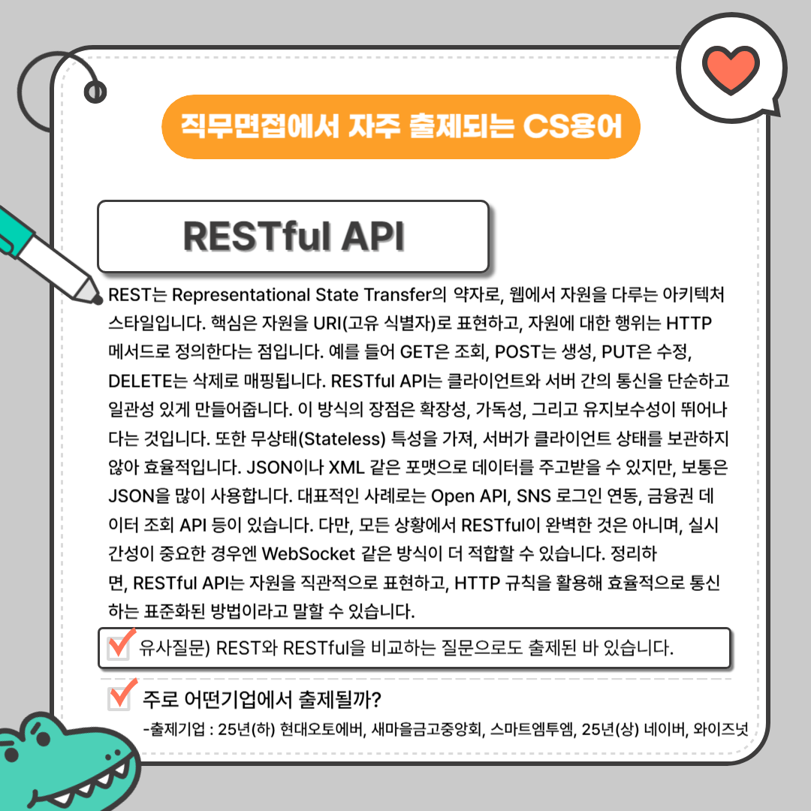

## REST API

### API (Application Programming Interface)

- 두 소프트웨어가 서로 통신할 수 있게 하는 메커니즘
- Web API: 웹 서버 또는 웹 브라우저를 위한 API
    - Third Party Open API 예: Youtube API, Google Map API, Naver Papago API, Kakao Map API

### RESTful API

- REST (Representational State Transfer): API server 를 개발하기 위한 일종의 소프트웨어 설계 **방법론**
- REST 원리를 따르는 시스템을 ‘RESTful하다’고 부른다.
- 자원(Resource)을 URI(예: /users/1)로 표현하고, HTTP 메서드(GET, POST, PUT, DELETE 등)를 활용해 자원에 대한 행위를 정의한다.
    - 자원의 식별: URI
    - 자원의 행위: HTTP Methods
    - 자원의 표현: JSON 데이터
- URL만 보고도 무슨 데이터를, 어떤 방식으로 처리할 지 예측할 수 있어야 한다.
- 개발 시 항상 “자원 중심 + 동작 명확화 + 일관된 응답 포맷”을 기준으로 설계해야 한다.

### 특징
- Stateless(무상태성): 서버는 클라이언트 상태를 보관하지 않고, 각 요청이 독립적으로 처리됨.
- Uniform Interface(일관성): 동일한 구조로 요청/응답을 정의.
- Client-Server 분리: 프론트엔드와 백엔드가 독립적으로 개발/운영 가능.
- Cacheable: HTTP 캐싱을 활용해 성능 최적화 가능.

### 활용

- 웹/모바일 앱 백엔드와 통신할 때: 예를 들어, 모바일 앱에서 서버로 사용자 데이터 요청.
- 외부 서비스 연동: Google Maps API, Twitter API처럼 제3자 서비스를 사용할 때.
- 마이크로서비스 아키텍처: 여러 서비스 간 통신에 활용.
- CRUD 중심 시스템: 게시판, 쇼핑몰, 데이터 관리 시스템 등에서 자원 중심의 데이터 조작.

### 기능

CRUD(Create, Read, Update, Delete) 기능을 제공한다.

- GET /users → 사용자 목록 조회
- POST /users → 사용자 생성
- PUT /users/1 → 특정 사용자 정보 수정
- DELETE /users/1 → 특정 사용자 삭제
- 확장적으로, 필터링, 페이징, 인증(OAuth2, JWT), 캐싱, 응답 포맷(JSON/XML) 등을 제공한다.

### 자원의 식별 - URI

- **URI** (Uniform Resource Identifier, 통합 자원 식별자): 인터넷에서 리소스(자원)를 식별하는 문자열
    - 가장 일반적인 URI는 웹 주소로 알려진 **URL**
- **URL** (Uniform Resource Locator, 통합 자원 위치): 웹에서 주어진 리소스의 주소

**URL의 구성**

URL 예시

- **Schema (or Protocol)**: 브라우저가 리소스를 요청하는 데 사용해야 하는 규약
    - URL의 첫 부분은 브라우저가 어떤 규약을 사용하는지를 나타낸다.
    - 기본적으로 웹은 http(s)를 요구한다.
- **Domain Name**: 요청 중인 웹 서버
    - 어떤 웹 서버가 요구되는지를 가리킨다.
    - 직접 IP주소를 사용하는 것도 가능하다.
- **Port**: 웹 서버의 리소스에 접근하는데 사용되는 기술적인 문(Gate)
    - HTTP 프로토콜의 표준 포트: 80 (HTTP), 443 (HTTPS)
    - 표준 포트만 작성 시 생략 가능
- **Path**: 웹 서버의 리소스 경로
    - 실제 위치가 아닌 추상화된 형태의 구조를 표현한다.
- **Parameters**: 웹 서버에 제공하는 추가적인 데이터
    - `&` 기호로 구분되는 key-value 쌍 목록
    - 서버는 리소스를 응답하기 전에 이러한 파라미터를 사용하여 추가 작업을 수행할 수 있다.
- **Anchor**: 일종의 ‘북마크’
    - 브라우저의 해당 지점에 있는 콘텐츠를 표시한다.
    - `#`(fragment identifier, 부분 식별자) 이후 부분은 서버에 전송되지 않는다.

### 자원의 행위 - HTTP Request Methods

- 리소스에 대한 행위
- 수행하고자 하는 동작을 정의한다.
- POST, GET, DELETE, PUT
- HTTP response status codes: 특정 HTTP 요청이 성공적으로 완료되었는지 여부

| 종류 | status code | 의미 |
| --- | --- | --- |
| Informational responses | 100 ~ 199 | 요청을 계속 진행 중이라는 중간 응답 |
| Successful responses | 200 ~ 299 | 요청이 정상적으로 처리되었음을 의미 |
| Redirection messages | 300 ~ 399 | 요청한 리소스가 다른 위치로 옮겨졌을 때 사용 |
| Client error responses | 400 ~ 499 | 클라이언트 요청에 문제가 있을 때 반환 |
| Server error responses | 500 ~ 599 | 서버 내부의 문제로 요청을 처리하지 못했을 때 사용 |

### 자원의 표현 - JSON

- 지금까지 Django 서버는 사용자에게 페이지(html)만 응답하고 있었다.
- 하지만 서버가 응답할 수 있는 것은 페이지 뿐만 아니라 다양한 데이터 타입을 응답할 수 있다.
- REST API는 이 중에서도 JSON 타입으로 응답하는 것을 권장한다.
    - HTML 대신 JSON만 전달하므로 응답 용량이 줄고 처리 속도가 빨라진다.
    - Django는 더 이상 Template 부분을 담당하지 않고, Front-end와 Back-end가 분리된다.
- JSON: 데이터만을 전달하기 위한 최소한의 형식
    - 어떤 클라이언트와도 언어와 플랫폼에 독립적으로 통신할 수 있게 해준다.

### **RESTful API vs WebSocket**

REST는 하나의 요청, 하나의 응답으로 이루어지고

Socket은 세션이 열려있는 동안 계속해서 요청과 응답이 반복된다는 것이 가장 큰 차이점

- RESTful API는 데이터 중심의 요청-응답 모델에 적합합니다.
- WebSocket은 실시간성이 중요한 경우(채팅, 주식 시세, 게임) 적합합니다.
- 실제 시스템에서는 RESTful API + WebSocket을 함께 사용하는 경우가 많습니다.
예: 회원 가입/로그인 → REST API, 채팅 메시지 송수신 → WebSocket

| 구분 | RESTful API | WebSocket |
| --- | --- | --- |
| **통신 방식** | 요청-응답(Request/Response) | 양방향 실시간 통신(Full-duplex) |
| **연결** | 요청마다 새 연결(Stateless) | 한 번 연결 후 계속 유지(Stateful) |
| **사용 목적** | CRUD 작업, 리소스 기반 데이터 조작 | 실시간 알림, 채팅, 게임, 스트리밍 |
| **데이터 전송** | JSON, XML 등 (HTTP 기반) | 텍스트/바이너리 프레임 |
| **장점** | 단순, 표준화, 캐싱 용이 | 실시간성, 지연시간 최소화 |
| **단점** | 실시간 알림에 비효율적 | 상태 관리 필요, 서버 리소스 부담 |

---

