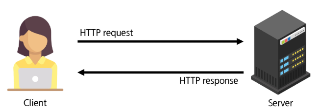
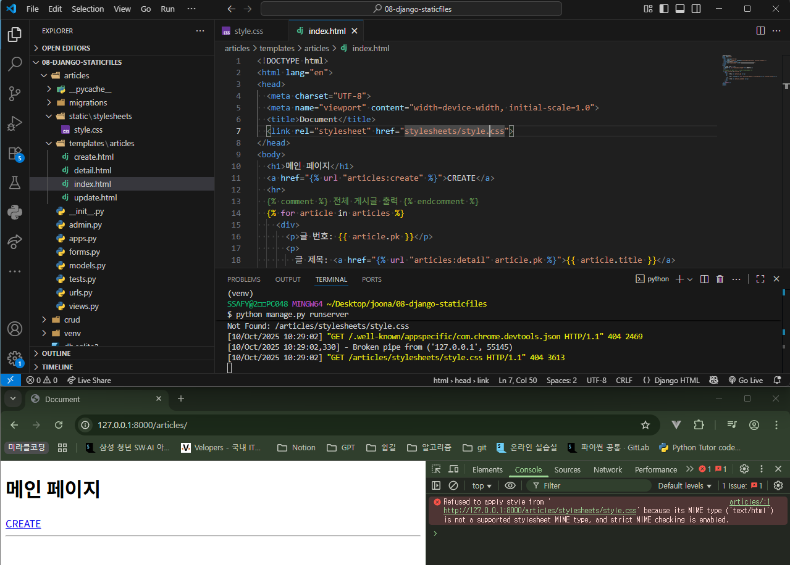
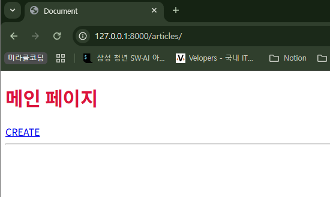
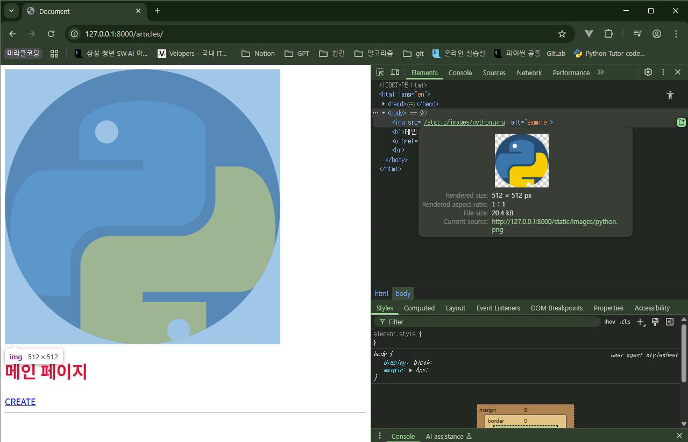
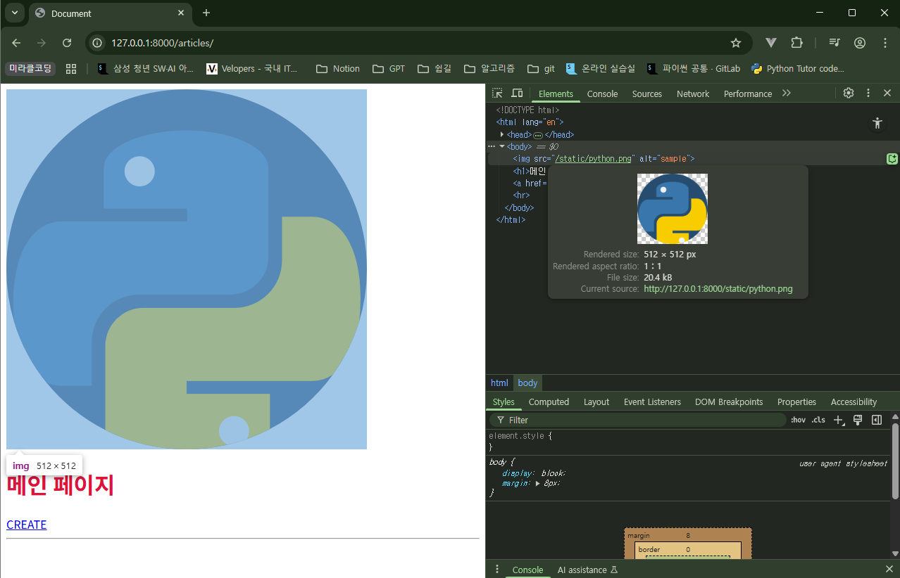

## Static Files (정적 파일)

**서버** 측에서 변경되지 않고 고정적으로 제공되는 파일

↔ Dynamic files (동적 파일)

- CSS 파일, JavaScript 파일, 이미지 파일(예: 로고, 아이콘), 폰트 파일 등

### 웹 서버와 정적 파일



- 웹 서버는 요청 받은 주소(URL)에 해당하는 자원을 찾아 응답해준다.
- 서버 컴퓨터의 특정 폴더에 저장된 정적 파일(Static files: CSS, JS, 이미지 등)을 찾아 제공한다.
- 정적 파일이 사용자에게 보이려면 그 파일에 접근할 수 있는 고유한 주소(URL)가 반드시 필요하다.

**처리 과정**

1. 사용자: 브자우저에 https://example.com/images/logo.png 라는 주소를 입력하여 이미지를 요청한다.
2. 웹 서버: /images/logo.png 라는 URL을 확인하고, 서버에 미리 약속된 폴더에서 logo.png 파일을 찾는다.
3. 웹 서버: 찾은 이미지 파일을 HTTP 응답에 담아 사용자에게 전송한다.
4. 사용자: 브라우저가 응답 받은 이미지 파일을 화면에 보여준다.

### Static Files 기본 경로

`app폴더/static/`

```css
/* articles/static/stylesheets/style.css */
h1 {
  color: crimson;
}
```

- 오류 발생



```html

...
  <link rel="stylesheet" href="">
...
```

- DTL의 static tag를 사용해야 한다.
    - built-in tag가 아니기 때문에 load tag를 사용해 import 후 사용해야 한다.



### DTL static tag

- `` 특정 라이브러리의 태그와 필터를 현재 템플릿에서 사용할 수 있도록 불러오는 역할
    - load 태그는 템플릿 파일의 가장 상단에 한 번만 작성하면 된다.
    - 단, extends 태그보다 상단에 있을 수는 없다. extends의 하단에 작성한다.
    - 이미지 경로 하드코딩해서 작성해도 당연히 작동하는데, 굳이 static tag를 사용하는 이유는?
      - STATIC_URL 설정만 바꾸면 모든 static tag에 일괄 적용
      - 캐시 관리 기능인 `ManifestStaticFilesStorage` 등 고급 기능 활용에 유리하다.

- ``
    - [settings.py](http://settings.py) 파일의 STATIC_URL값을 기준으로 해당 정적 파일의 전체 URL 경로를 계산하여 생성한다.

- `STATIC_URL`: 웹 페이지에서 정적 파일에 접근할 때 사용할 URL의 시작 부분(접두사)을 지정하는 설정
    - 서버 컴퓨터에 저장된 실제 파일 경로가 아니다. 오직 웹(브라우저)에서만 사용되는 주소이다.
    - 기본값: `'static/'`

```html
<!-- articles/index.html -->

...
<body>
  
  ...
```



- 이미지 경로가 다음과 같은 주소로 생성된다.
    - http://127.0.0.1:8000/static/images/python.png
    - URL [http://127.0.0.1:8000/] + STATIC_URL [static/] + 정적파일 경로 [images/python.png]


### Static Files 추가 경로

STATICFILED_DIRS에 문자열로 추가 경로를 설정한다.

- STATICFILED_DIRS: 기본 경로 외에 추가적으로 탐색할 경로의 목록을 지정하는 리스트
    - settings.py에 추가 작성한다.

```python
# settings.py
STATICFILES_DIRS = [
    BASE_DIR / 'static',
]
```

```html
<!-- articles/index.html -->
<!-- 이미지 경로는 static/python.png -->

...
<body>
  
  ...
```




### 활용

- 프론트엔드 프레임워크를 따로 사용하지 않고도 CSS, JavaScript를 static file로 로드하여 풀스택 개발 가능
- 이미지, 영상, 기타 모든 종류의 데이터를 쉽게 웹 서버에 저장하고 불러올 수 있음

### django template(html)에 css, js 붙이기

1. settings.py 수정
    - STATICFILES_DIRS : 개발 중 django가 정적 파일을 찾을 경로
    - STATIC_ROOT : 배포시 모든 정적 파일을 모을 경로

    ```python
    STATICFILES_DIRS = [
        BASE_DIR / 'static',
    ]

    STATIC_ROOT = BASE_DIR / 'staticfiles'
    ```

2. 참조할 경로 및 static 파일 생성
    - 당연히 이름 달라도 작동하지만 이게 표준
        - /static/css/style.css
        - /static/js/script.js

3. static 파일을 사용할 모든 템플릿(html파일) 최상단에 static 태그 사용 선언

    ```html
    
    ```

4. static 태그의 사용
    - bootstrap 쓰기 전에 \<link\>, \<script\> 작성하는 것과 같은 방식
    - html파일의 head 태그 안에 link 태그로 style.css 파일 로드

    ```html
    <link rel="stylesheet" href="">
    ```

    - html파일의 body 태그 안(보통 맨 아래)에 script 태그로 script.js 파일 로드

    ```html
    <script src=""></script>
    ```

