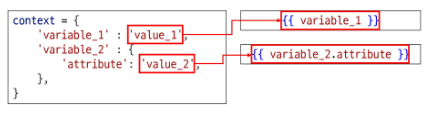
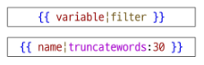
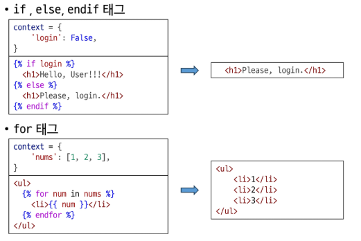
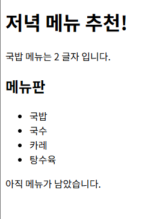

## DTL (Django Template Language)

Template에서 조건, 반복, 변수 등의 프로그래밍적 기능을 제공하는 시스템

### Django Template System

**파이썬 데이터(context)를 HTML 문서(Template)와 결합**하여 로직과 표현을 분리한 채 **동적인 웹페이지**를 생성하는 도구

- HTML 콘텐츠를 변수 값에 따라 변경할 수 있다.
- ‘페이지 틀’에 ‘데이터’를 동적으로 결합하여 수많은 페이지를 효율적으로 만들어 내기 위함
- 예시: 뉴스사이트
    
    모든 기사는 헤더, 폰트, 광고 위치 등 동일한 페이지 틀(Template) 을 공유한다. 하지만 각 페이지에 들어가는 데이터(context), 즉 기사 제목, 내용, 기자 이름은 모두 다르다.
    
    → context에 각 페이지별 데이터를 지정해서 사용
    

```bash
# views.py

def index(request):
    context = {
        'name': 'Jane',
    }
    return render(request, 'articles/index.html', context)
```

```html
<!-- articles/index.html -->

<body>
  <h1>Hello, {{ name }}!</h1>
</body>
```

### Variable 변수  `{{ variable.attribute }}`

- `render` 함수의 세 번째 인자로, **딕셔너리 타입**으로 전달된다.
- 해당 **딕셔너리 key**에 해당하는 문자열이 **template에서 사용 가능한 변수명**이 된다.
    - 관례적으로 key와 value의 값을 같게 설정한다.
- `.`을 사용하여 변수 속성에 접근할 수 있다.



### Filters 필터 `{{ variable|filter }}`

- 표시할 변수를 수정할 때 사용한다.
- chained(연결)이 가능하며 일부 필터는 인자를 받기도 한다.
- 약 60여 개의 built-in template filters



### Tags 태그 ``

- 반복 또는 논리를 수행하여 제어 흐름을 만든다.
- 화면에 출력되지 않는다.
- 일부 태그는 시작과 종료 태그가 필요하다.
- 약 24개의 built-in template tags
    - if, else, endif 태그, for 태그



### Comments 주석

- 인라인 `{# 주석 #}`
- 여러 줄  ` … `

**사용 예시**

```html
<!-- articles/dinner.html -->

<body>
  <h1>저녁 메뉴 추천!</h1>
   랜덤으로 생성된 picked 메뉴, length 필터로 글자수 계산 
  <p>{{ picked }} 메뉴는 {{ picked|length }} 글자 입니다.</p>

  <h2>메뉴판</h2>
   for 태그 
  <ul>
    
      <li>{{ food }}</li>
    
  </ul>

   if 태그 
  
    <p>메뉴가 모두 소진되었습니다.</p>
  
    <p>아직 메뉴가 남았습니다.</p>
  
</body>
```



### DTL 주의사항

- python처럼 일부 프로그래밍 구조(if, for 등)를 사용할 수 있지만 명칭을 그렇게 설계했을 뿐 python과는 관련이 없다.
- 프로그래밍적 로직이 아니라 표현을 위한 것임을 명심하기
- **프로그래밍적 로직은 되도록 view 함수에서 작성 및 처리할 것**
    - 템플릿(.html) 파일에서의 연산은 지양할 것
    - view(.py) 함수에서 python으로 연산을 지향


## 템플릿 상속

### 템플릿 상속

여러 템플릿이 **공통 요소를 공유**할 수 있게 해주는 기능

- 만약 모든 템플릿에 Bootstrap을 적용하려면, 모든 템플릿에 Bootstrap CDN을 작성해야 할까?
    
    → 공통적인 요소는 상속받을 수 있게 하자!
    
- 페이지의 **공통 요소**를 포함한다.
- 하위 템플릿이 **재정의할 수 있는 공간**을 정의한다.

### 상속 구조 만들기

1. **skeleton 역할**을 하는 상위 템플릿(`base.html`)을 작성한다.
    - 모든 템플릿이 공유했으면 좋겠는 공통 요소를 작성
    - 템플릿별로 재정의할 부분은 **block 태그**``를 활용
        
        ```html
        <!-- articles/base.html -->
        
        <!doctype html>
        <html lang="en">
          <head>
            <meta charset="utf-8">
            <meta name="viewport" content="width=device-width, initial-scale=1">
            <title>Bootstrap demo</title>
            <link href="https://cdn.jsdelivr.net/npm/bootstrap@5.3.8/dist/css/bootstrap.min.css" rel="stylesheet" integrity="sha384-sRIl4kxILFvY47J16cr9ZwB07vP4J8+LH7qKQnuqkuIAvNWLzeN8tE5YBujZqJLB" crossorigin="anonymous">
          </head>
          <body>
             템플릿별로 재정의할 부분 
            
            
            <script src="https://cdn.jsdelivr.net/npm/bootstrap@5.3.8/dist/js/bootstrap.bundle.min.js" integrity="sha384-FKyoEForCGlyvwx9Hj09JcYn3nv7wiPVlz7YYwJrWVcXK/BmnVDxM+D2scQbITxI" crossorigin="anonymous"></script>
          </body>
        </html>
        ```
        
2. 기존 하위 템플릿들이 상위 템플릿을 상속받도록 변경한다.
    - **extends 태그** ``
        - 자식(하위) 템플릿이 부모 템플릿을 확장한다(상속받는다)는 것을 알린다.
        - 상속받을 템플릿을 결정한다.
        - 반드시 자식 템플릿의 최상단에 작성되어야 한다.
        - extends 태그는 1개만 사용할 수 있다.
    - **block 태그** ``
        - 하위 템플릿에서 재정의할 수 있는 블록을 정의한다.
        - 상위 템플릿에서 → 하위 템플릿이 작성할 수 있는 공간을 지정한다.
        - 하위 템플릿에서 → 부모 템플릿(`base.html`)에서 같은 이름으로 작성된 block 태그의 내용을 대체한다.
    
    ```html
    <!-- articles/index.html -->
    
    
    
    
      <h1>Hello, {{ name }}!</h1>
    
    ```
    
    ```html
    <!-- articles/dinner.html -->
    
    
    
    
      <h1>저녁 메뉴 추천!</h1>
       랜덤으로 생성된 picked 메뉴, length 필터로 글자수 계산 
      <p>{{ picked }} 메뉴는 {{ picked|length }} 글자 입니다.</p>
    
      <h2>메뉴판</h2>
       for 태그 
      <ul>
        
          <li>{{ food }}</li>
        
      </ul>
    
       if 태그 
      
        <p>메뉴가 모두 소진되었습니다.</p>
      
        <p>아직 메뉴가 남았습니다.</p>
      
    
    ```

### 컴포넌트 분리

컴포넌트로서 쓸 수 있는 파일을 따로 만들고, `include` 태그로 불러올 수 있다.

- 관행적으로 파일명은 underscore `_`로 시작한다.

```html
<!-- index.html -->




  

  <h1>메인 페이지입니다!</h1>

```


## 추가 템플릿 경로

### 추가 템플릿 경로

- 약속된 기본 템플릿 경로: `app_directory/templates/`
- 추가하고 싶은 템플릿 경로는 `settings.py`에 추가한다.
    - `BASE_DIR` : settings.py에서 프로젝트 최상단 지점을 지정해 둔 변수.
    - 프로젝트 내부에서 경로는 `BASE_DIR / 'subdir'` 형식으로 쓴다.

### 파이썬의 객체 지향적 경로 표현

운영 체제마다 디렉토리 경로 작성 문법이 다르기 때문에 각 운영 체제마다 각각 작성하기는 어렵다. 

운영 체제에 맞도록 자동으로 해석되는 새로운 문법을 사용한다.

- 예: `BASE_DIR / 'subdir'`