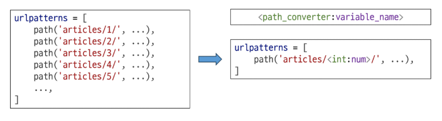
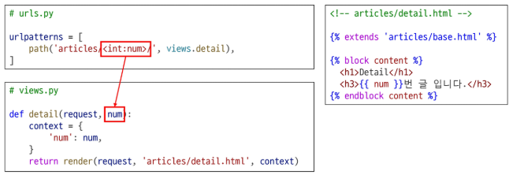
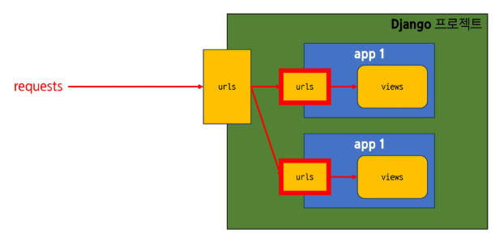

## Django URLs

- 요청 URL에 따라 실행될 view 함수가 달라진다.
- **URL dispatcher** (운항 관리자, 분배기): URL 패턴을 정의하고 해당 패턴이 일치하는 요청을 처리할 view 함수를 연결(매핑)

### Variable Routing




- URL 일부에 변수를 포함시키는 것
    - 변수는 view 함수의 인자로 전달할 수 있다.
- 요청 URL의 path converter의 위치에 들어있는 값이 **변수처럼 취급**된다.
- **Path Converter**
    - URL 변수의 타입(str, int 등)을 지정
    - `<path_converter:variable_name>`
        - 예시: `<int:num>`, `<str:name>`
    - path converter의 변수명과 view 함수의 파라미터 이름이 같아야 한다.

### App URL mapping

각 앱에 URL을 정의하는 것



- 프로젝트와 각 앱들이 URL을 나누어 관리하기 위함
- URL을 각자 app에서 관리하자
- include 함수를 이용한다.

### inclue 함수

`include('app.urls')`

프로젝트 내부 앱들의 URL을 참조할 수 있도록 매핑하는 함수

- URL의 일치하는 부분까지 잘라내고, 남은 문자열 부분은 후속 처리를 위해 include된 URL로 전달한다.
- 앱 폴더 안에 `urls.py` 파일을 새로 생성하고 관련 URL을 복사한다.
    - 변경된 상대 경로에 맞게 수정한다.

```python
# firstpjt/urls.py

from django.urls import path, include
from articles import views

urlpatterns = [
    path('admin/', admin.site.urls),
    # 클라이언트 요청 주소가 /articles/까지 일치한다면,
    # 나머지 주소는 articles 앱의 urls.py로 넘긴다.
    path('articles/', include('articles.urls'))
]
```

```python
# articles/urls.py

from django.contrib import admin
from django.urls import path
from . import views  # 명시적 상대 경로

urlpatterns = [
    path('', views.index),
    path('dinner/', views.dinner),
    path('search/', views.search),
    path('throw/', views.throw),
    path('catch/', views.catch),
    path('<int:num>/', views.detail),
]
```

## URL 이름 지정

### URL의 Trailing Slashes

- 기술적인 측면에서 [`foo.com/bar`](http://foo.com/bar) 와 [`foo.com/bar/`는](http://foo.com/bar/는) 서로 다른 URL이다.
    - 검색 엔진 로봇이나 웹 트래픽 분석 도구에서는 이 두 주소를 서로 다른 페이지로 보기 때문이다.
- Django는 URL 끝에 `/`가 없다면 자동으로 붙인다.
    - 검색 엔진이 혼동하지 않게 하기 위해 무조건 붙이는 것을 선택
    - 그래서 path 함수에서 경로 이름 끝에 `/`를 반드시 붙여야 한다.
    - 단, 모든 프레임워크가 이렇게 동작하는 것은 아니다.

### Naming URL Patterns

URL에 이름을 지정하는 것

- path 함수에 **name 키워드 인자**를 정의해서 사용한다.
- 경로를 수정해도 이름으로만 사용하기 때문에 재사용성이 좋다.

```python
# pages/urls.py

from django.urls import path
from . import views

urlpatterns = [
    path('index/', views.index, name='index'),
]
```

### DTL URL tag

``

- URL에 이름을 붙였을 경우 url 태그와 이름을 이용해 템플릿 상에서 이름으로 실제 주소를 작성할 수 있게 해준다.
- 주어진 **URL 패턴의 이름**과 일치하는 절대 경로 주소를 반환한다.
- URL 패턴에 변수가 포함되어 있으면, ‘url_name’ 이후 추가

```html
<!-- articles/index.html -->



  
  <h1>안녕하세요, {{ name }}님!</h1>
  <a href="">dinner</a>
  <a href="">search</a>
  <a href="">throw</a>
  <a href="">Article 1</a>
  <a href="">Article 2</a>
  <a href="">Article 3</a>

```

### URL 이름 공간

- `app_name` 속성: 앱이 여러 개일 때 url 이름이 같은 상황을 관리하기 위해 `app_name`을 지정해 구분한다.
- app_name이 추가 또는 수정되면 url 태그에도 해당 내용이 반영되어야 한다.
    - ``

```python
# articles/urls.py

from django.urls import path
from . import views  # 명시적 상대 경로

app_name = 'articles'
urlpatterns = [
    path('', views.index, name='index'),
    path('dinner/', views.dinner, name='dinner'),
    path('search/', views.search, name='search'),
    path('throw/', views.throw, name='throw'),
    path('catch/', views.catch, name='catch'),
    path('<int:num>/', views.detail, name='detail'),
]
```

```python
<a href="">저녁 메뉴 확인하러 가기!</a>
```