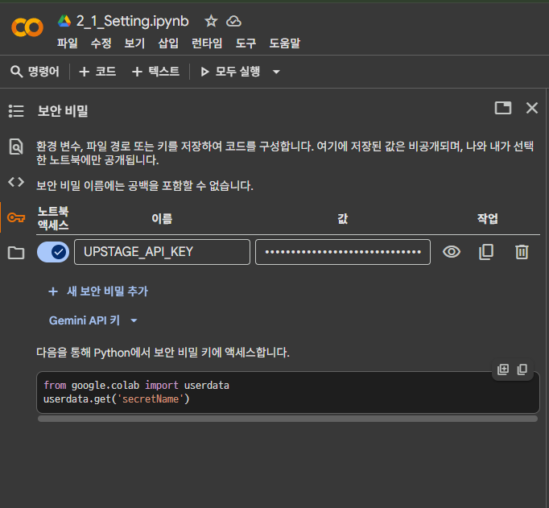

## Colab에서 API KEY 불러오기

### 환경 변수를 설정하자

- `.env` 파일을 생성하고 API 키를 저장하는 방법
- 환경 변수는 코드 외부에서 안전하게 관리할 수 있습니다.
    - 개발, 테스트, 배포 등 각 환경마다 다른 API KEY를 사용해야 할 경우, 코드를 직접 수정하지 않고 환경 변수 값만 변경하여 유연하게 관리할 수 있습니다.

```python
# Colab 환경에서 .env 파일을 생성하고 API 키를 저장하는 명령어.
# 실제 키를 {your_api_key} 부분에 입력
!echo "UPSTAGE_API_KEY={your_api_key}" > "/content/drive/MyDrive/Colab Notebooks/AI/08_data_argument/.env"
```

```python
# .env 파일에서 환경 변수를 로드하기 위한 라이브러리.
from dotenv import load_dotenv
# 운영체제의 환경 변수를 가져오기 위한 함수.
from os import getenv

# .env 파일을 로드하여 환경 변수를 설정.
load_dotenv(base_path + ".env")

# getenv 함수를 사용해 "UPSTAGE_API_KEY"라는 이름의 환경 변수 값을 가져옴.
UPSTAGE_API_KEY = getenv("UPSTAGE_API_KEY")

# API 키가 성공적으로 로드되었는지 확인하고 메시지를 출력.
if UPSTAGE_API_KEY:
    print("Success API Key Setting!")
else:
    print(f"ERROR: Failed to load UPSTAGE_API_KEY from {base_path}")

"""
Success API Key Setting!
"""
```

- `.env` 파일에서 API 키가 제대로 로드되었지만, API 호출 시 ‘유효하지 않은 API 키’ 오류가 발생했습니다.
- `.env` 파일에서 키를 읽어오거나 API 클라이언트에 전달하는 과정에서 문제가 있는 것으로 추정됩니다.
    - API 키를 직접 문자열로 입력했을 때는 정상적으로 로드됨. ⇒ API 키는 유효하다.
    - `print(UPSTAGE_API_KEY)` 실행 결과 API 키가 출력됨. ⇒ .env 파일에 API 키가 로드되었다.

### Colab Secrets Manager를 활용하자

- Colab 에서 민감한 정보를 다룰 때에는 내장된 Secrets Manager를 사용하는 것이 더 안전하고 신뢰할 수 있는 방법입니다.



1. **Secrets에 API 키 추가:**
    - Colab 노트북 왼쪽 사이드바에서 "🔑 Secrets" 탭을 클릭합니다.
    - "New secret"을 클릭합니다.
    - "Name"에 `UPSTAGE_API_KEY`를 입력합니다.
    - "Value"에 실제 Upstage API 키를 붙여넣습니다.
    - 이 secret에 대해 "Notebook access"를 활성화해야 합니다.
2. **코드를 수정하여 Secret 사용:**
    - API 키를 로드하는 셀(`2aeca190`)을 수정하여 `getenv("UPSTAGE_API_KEY")` 대신 `userdata.get('UPSTAGE_API_KEY')`를 사용하도록 변경합니다.

- 수정 후 코드

```python
# .env 파일에서 환경 변수를 로드하기 위한 라이브러리.
from dotenv import load_dotenv
from google.colab import userdata

# .env 파일을 로드하여 환경 변수를 설정.
load_dotenv(base_path + ".env")

# get 함수를 사용해 "UPSTAGE_API_KEY"라는 이름의 보안 비밀 값을 가져옴.
UPSTAGE_API_KEY = userdata.get('UPSTAGE_API_KEY')

# API 키가 성공적으로 로드되었는지 확인하고 메시지를 출력.
if UPSTAGE_API_KEY:
    print("Success API Key Setting!")
else:
    print(f"ERROR: Failed to load UPSTAGE_API_KEY from {base_path}")

"""
Success API Key Setting!
"""
```

- 성공적으로 API Key를 가져오고, 다음 코드들도 정상적으로 실행되었습니다.