# Git Branch, Merge, Workflow

## Branch

### Git Branch

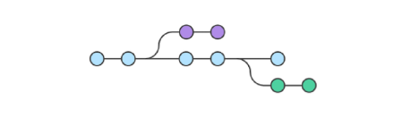

- 작업 공간을 나누어 독립적으로 작업할 수 있도록 도와주는 git의 도구
- 독립된 개발 환경을 형성하기 때문에 원본(master)에 대해 안전하다.
- git으로 협업하기

### Master(main) 브랜치

- 기본 브랜치 (Default Branch): 저장소의 초기 상태를 나타낸다.
    - 일반적으로 프로젝트의 가장 최신 버전 또는 배포 가능한 안정적인 코드를 포함한다.
- 다른 브랜치가 파생되는 기준점으로 사용된다.
- 다른 브랜치에서 작업한 기능이나 버그 수정을 끝낸 후, 코드 리뷰와 테스트를 거쳐 master(main) 브랜치에 병합한다.

### git branch 명령어

- 브랜치 조회, 생성, 삭제 등 브랜치와 관련된 git 명령어

| 명령어 | 기능 |
| --- | --- |
| `git branch` | 브랜치 목록 확인 |
| `git branch -r` | 원격 저장소의  브랜치 목록 확인 |
| `git branch <브랜치 이름>` | 새로운 브랜치 생성 |
| `git branch -d <브랜치 이름>` | 브랜치 삭제 (병합된 브랜치만 삭제 가능) |
| `git branch -D <브랜치 이름>` | 브랜치 삭제 (강제 삭제) |

### git switch 명령어

- 현재 브랜치에서 다른 브랜치로 HEAD를 이동시키는 명령어
- HEAD: 현재 브랜치나 commit 을 가리키는 포인터
    - 현재 내가 바라보는 위치

| 명령어 | 기능 |
| --- | --- |
| `git switch <이동할 브랜치 이름>` | 다른 브랜치로 전환 |
| `git switch -c <브랜치 이름>` | 새 브랜치 생성 후 전환 |
| `git switch -c <브랜치 이름> <commit ID>` | 특정 커밋에서 새 브랜치 생성 후 전환 |

### git switch 주의사항

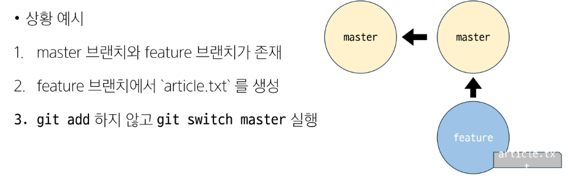

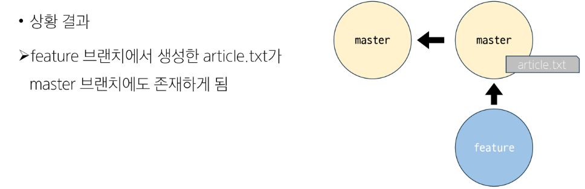

- git의 브랜치는 독립적인 작업 공간을 갖지만, git이 관리하는 파일 트리에 제한된다.
- `git add`를 하지 않았던, 즉 Stagina Area에 한번도 올라가지 않은 새 파일은 **git의 버전 관리를 받고 있지 않기 때문**에 브랜치가 바뀌더라도 계속 유지된다.
    - 아직 commit이 없기 때문에 버전 관리 트랙킹이 안 되고 있는 상태
- `git switch` 하기 전에 Working Directory 파일이 모두 버전 관리가 되고 있는지 반드시 확인해야 한다.

### Branch Scenario

1. commit 목록 확인

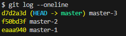

git log

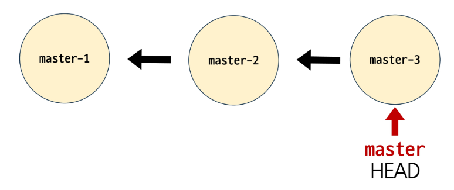

git log 시각화

- commit은 이전 commit 이후의 변경사항만 기록한 것
- **이전 commit에 종속**되어 생성된다.
- 일반적으로 화살표 방향을 이전 commit을 가리키도록 표기한다.

1. branch 생성 및 조회

```python
# login 브랜치 생성
$ git branch login

# article.txt에 master-4 작성
$ git add .
$ git commit -m 'master-4'
```

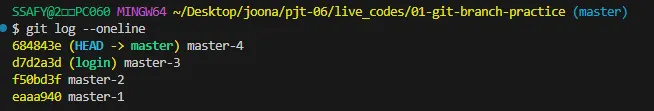

1. branch 이동
- login 브랜치로 이동하면, article.txt에는 master-4가 작성되어 있지 않다.

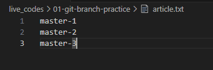

article.txt


1. branch에서 commit 생성

```python
# login 브랜치에서 article.txt에 login-1 작성
$ git add .
$ git commit -m 'login-1'
```

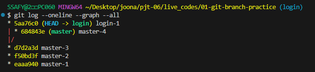

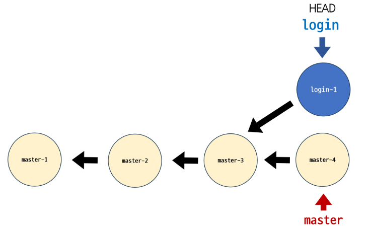

- 브랜치의 이동은 HEAD가 특정 브랜치를 가리킨다는 것
- 브랜치는 가장 최신 commit을 가리키므로, HEAD가 해당 브랜치의 최신 commit을 가리킨다.
- Working Directory의 내용도 HEAD가 가리키는 브랜치의 최신 commit 상태로 변화하는 것

## Merge (병합)

### Git Merge

- `git merge <병합 브랜치 이름>`
- 두 브랜치를 하나로 병합

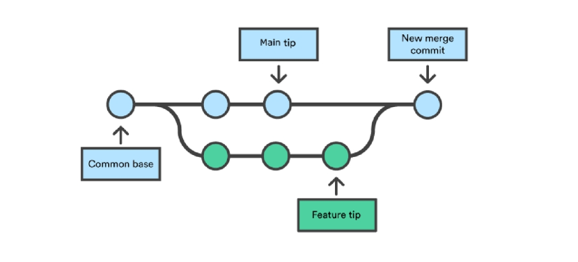

### 병합 전 주의사항

- 수신 브랜치 (병합 브랜치를 가져오고자 하는 브랜치) 확인하기
    - git branch 명령어를 통해 HEAD가 올바른 수신 브랜치를 가리키는지 확인
    - 병합 진행 위치는 반드시 수신 브랜치에서 진행되어야 한다.
- 최신 commit 상태 확인하기
    - 수신 브랜치와 병합 브랜치 모두 최신 상태인지 확인

### Fast-Forward Merge

- 현재 브랜치 상태를 대상 브랜치 상태로 이동시키는 작업 (빨리 감기)
- merge 과정 없이 단순히 브랜치의 포인터가 앞으로 이동한다.
    - master의 상태를 강제로 최신으로 땡겨오는 것
- `git branch -d hotfix`: 병합이 완료된 브랜치는 삭제한다.

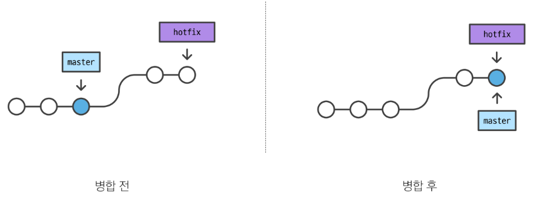

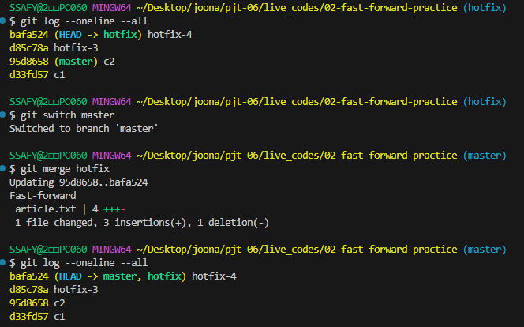

### 3-way Merge

- 병합하는 각 브랜치의 commit 2개와 공통 조상 commit 하나를 사용하여 병합
- vim 에디터가 뜨면 `:wq` 입력하여 종료

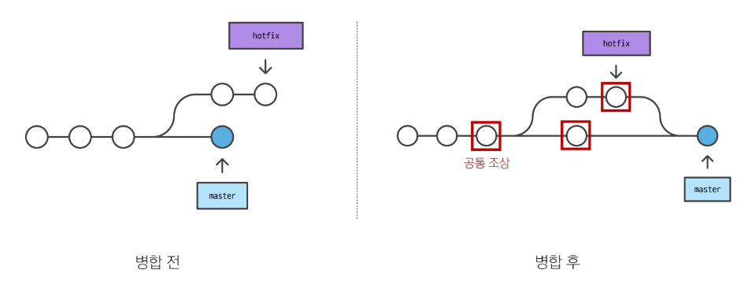

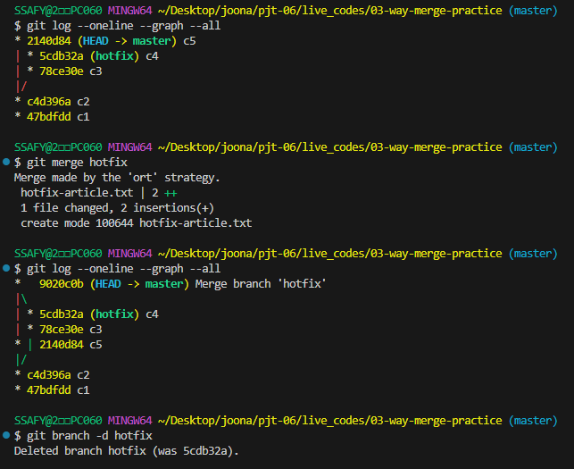

### Merge Conflict (충돌)

- 3-way merge에서 두 브랜치가 ‘동일한 파일’의 ‘동일한 부분’에서 변경된 후 병합하려고 할 때 충돌이 발생한다.
- git이 충돌을 표시하는 시각적 마커
    - <<<<<<< 수신 브랜치
    - =======
    - >>>>>>> 병합 브랜치
- 충돌하는 부분을 확인, 충돌 내용을 수정한 후 merge commit 생성하여 해결한다.
    - `git commit`만 입력해도 자동으로 merge 메시지를 작성해준다 (vim 에디터)

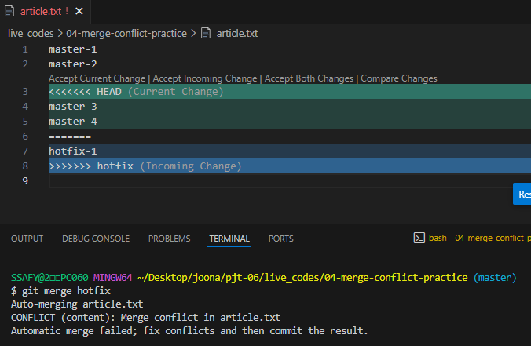

충돌 발생

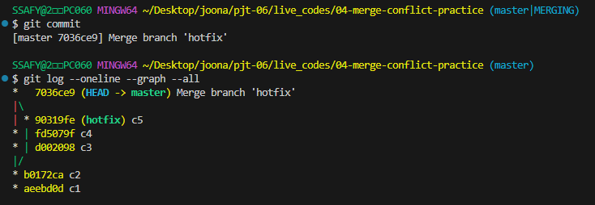

merge commit

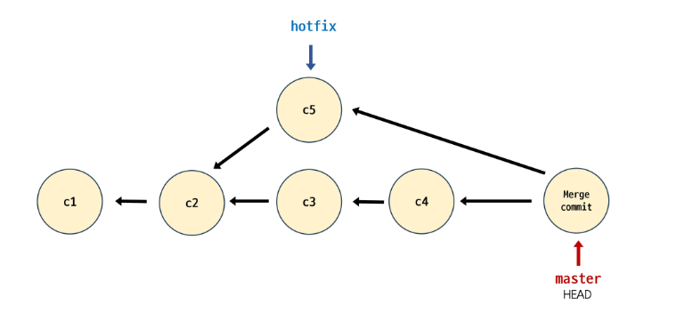

## Git Workflow

- 원격 저장소를 활용해 다른 사용자와 협업하는 방법

### Feature Branch Workflow

**중앙 원본 저장소 (Origin)는 하나, 기능 개발은 별도의 브랜치 (Branch)에서!**

- Shared repository model: 각 사용자가 원격 저장소의 소유권을 공유받는 방식
- master(main) 브랜치는 항상 안정적이고 배포 가능한 상태로 유지되어야 한다.
- 새로운 기능 개발이나 버그 수정은 반드시 `feature/login`, `fix/header-bug` 처럼 별도의 브랜치를 생성하여 진행한다.
- 작업이 완료되면 중앙 저장소에 브랜치를 push하고 **Pull Request (PR)**를 통해 **코드 리뷰**를 거친 뒤, master(main) 브랜치에 병합(merge)한다.
    - **Pull Request (PR)**: 내가 별도 브랜치에서 작업한 내용을 원본 브랜치에 merge해달라고 공식적으로 요청하는 기능
    - PR의 목적은 코드 리뷰: 검토(review)하고 피드백을 줄 수 있는 공식적인 장을 마련하는 것!
- 신뢰할 수 있는 팀원들이 하나의 프로젝트를 함께 개발할 때 표준적으로 사용되는 방식

### Git Flow

- `main`, `develop`, `feature`, `release`, `hotfix`라는 5가지 종류의 브랜치를 각자의 명확한 역할에 따라 운영하는 방식
- 충돌을 최소화하고 배포 과정을 안정적으로 관리할 수 있다.

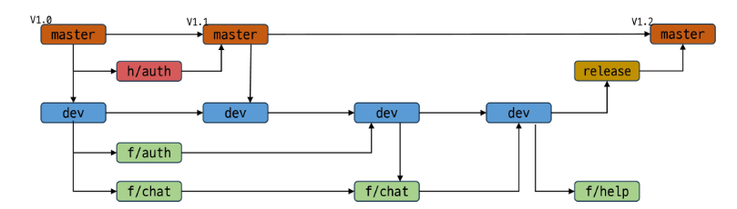

- `master(main)`: 실제 프로덕션(운영 서버)에 배포되는 가장 안정적인 최신 버전의 코드
    - 절대 직접 commit 하지 않는다!
    - `release` 또는 `hotfix` 브랜치의 내용만 병합한다.
    - 항상 배포 가능한 상태임을 보장한다.
    - 각 커밋은 `v1.0`, `v1.1` 같은 버전 태그로 관리하는 것이 좋다.
- `develop`: 다음 릴리즈 버전을 개발하기 위한 모든 기능들이 통합되는 브랜치
    - `master`와는 독립적으로 개발이 진행된다.
    - 직접 커밋하지 않는다.
    - 모든 `feature` 브랜치들이 개발 완료 후 `develop`으로 병합된다.
    - 배포할 시점이 되면, 이 브랜치에서 `release` 브랜치가 분기된다.
- `feature`: 하나의 특정 기능(예: 로그인, 장바구니)을 개발하기 위한 브랜치
    - 항상 `develop` 브랜치에서 분기한다.
    - 브랜치 이름에는 기능을 명시한다.
    - 개발이 완료되면 다시 `develop` 브랜치로 병합한다. (PR)
    - `master`나 `release` 브랜치와는 절대 직접 상호작용하지 않는다.
    - 충돌을 방지하기 위해, 병합 전 항상 최신 `develop` 브랜치의 내용을 받아와(pull) 내 브랜치를 최신화해야 한다.
- `release`: 이번 버전 배포를 준비하기 위한 브랜치
    - 새로운 기능 개발을 멈추고, 배포 전 최종 테스트와 버그 수정, 버전 번호 업데이트 수행
    - `develop` 브랜치에서 분기한다.
    - 배포 준비가 완료되면, `master` 브랜치로 병합하여 배포한다.
    - `release` 브랜치에서 수정한 버그 내용이 `develop` 브랜치에도 반영될 수 있도록, 반드시 `develop` 브랜치에도 다시 병합해야 한다!!!
- `hotfix`: 이미 배포된 `master` 브랜치에서 발생한 긴급한 버그를 즉시 수정하기 위한 브랜치
    - 항상 `master` 브랜치에서 직접 분기한다.
    - 버그 수정이 완료되면 즉시 `master` 브랜치로 병합하여 재배포한다.
    - 버그 수정 내용은 반드시 `develop` 브랜치에도 병합하여, 다음 릴리즈 버전에 반영되도록 해야 한다!!!

### Forking Workflow

- Fork & Pull model: 각 사용자가 소유권이 없는 원격저장소를 복제하는 방식
- Fork: 다른 사용자의 원격 저장소를 자신의 계정으로 복제하는 것
- 오픈 소스 프로젝트처럼, 신뢰할 수 없는 다수의 외부 기여자가 프로젝트에 참여할 때 사용된다.

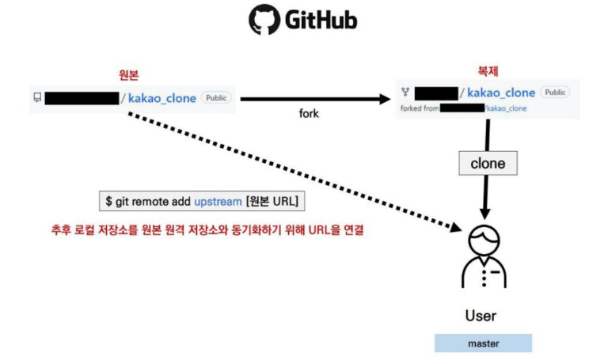

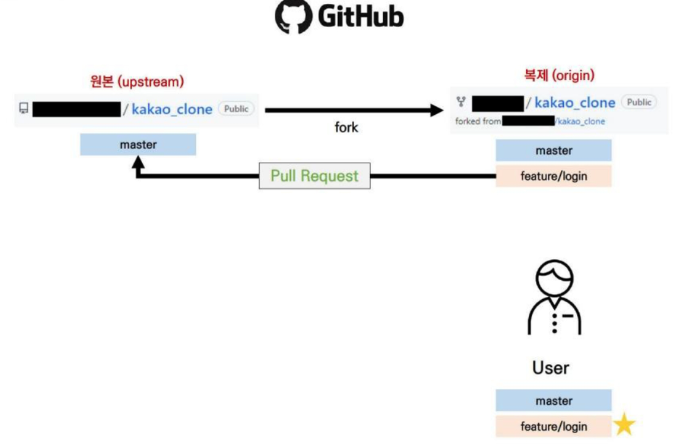

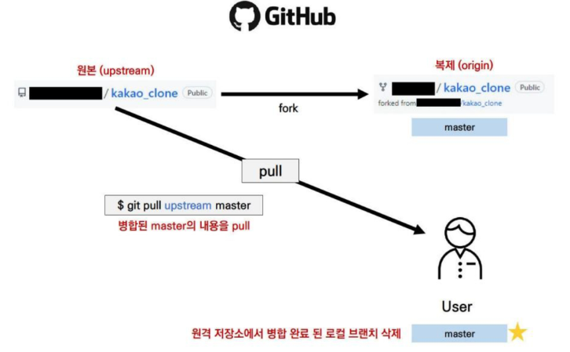