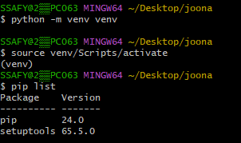
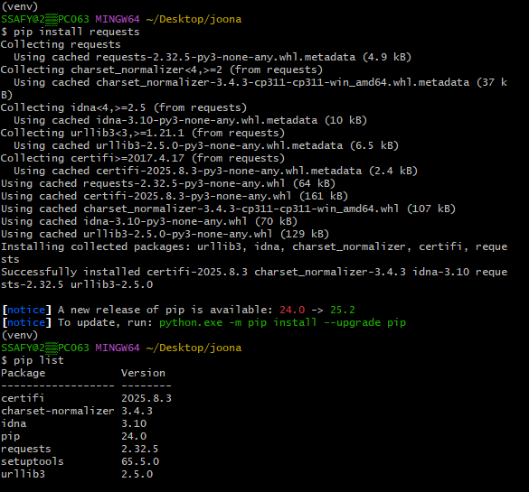
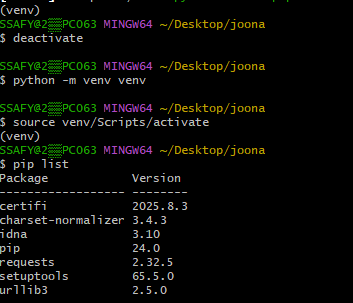

# 스스로 학습
### 가상 환경을 생성한 후에 똑같은 이름의 가상 환경을 중복 생성한다면?

의미 없다. 새로운 빈 가상 환경이 리셋되는 것이 아니라, 그대로 유지된다.





<br><br>

# 수업 필기

## 가상 환경

### 가상 환경 (Virtual Environment)

하나의 컴퓨터 안에서 또 다른 **독립된** 파이썬 환경

- 두 가지 이상의 패키지 버전을 사용하기 위한 독립적인 개발 환경이 필요한 경우
- 패키지 충돌을 피하기 위한 독립적인 개발 환경이 필요한 경우

### 가상 환경 생성 및 활성화

1. **가상 환경 생성**
    
    ```bash
    python -m venv venv
    ```
    
    - 현재 디렉토리 안에 `venv` 이름의 폴더(가상 환경)가 생성된다.
        - 임의의 이름으로 생성이 가능하나 관례적으로 venv 이름을 사용한다.
    - `venv` 폴더 안에는 파이썬 실행 파일, 라이브러리 등을 담을 공간이 마련된다.
    - **`venv` 폴더는 절대 직접 수정하면 안 된다!**
2. **가상 환경 활성화 (ON)**
    
    ```bash
    source venv/Scripts/activate
    ```
    
    - 활성화 후, 프롬프트 앞에 (venv)와 같이 표시된다면 가상 환경 활성화에 성공한 것
        
        
        
    - 독자적인 가상 환경을 ON/OFF하는 개념으로 이해할 것 (가상 환경 접속 ≠ 폴더 이동)
    - Mac / Linux에서는 경로가 다르다: `source venv/bin/activate`
3. **가상 환경 종료 (OFF)**
    
    ```bash
    deactivate
    ```
    
    - 가상 환경을 OFF하고 다시 python global 환경으로 돌아온다.

### 의존성 패키지

- 의존성 (Dependencies): 하나의 소프트웨어가 동작하기 위해 필요로 하는 다른 소프트웨어나 라이브러리
- 의존성 패키지: 프로젝트가 실행되기 위해 꼭 필요한 각각의 패키지
    - 프로젝트가 의존하는 ‘개별 라이브러리’

1. **패키지 목록 확인**
    
    ```bash
    pip list
    ```
    
2. **의존성 기록**
    
    ```bash
    pip freeze > requirements.txt
    ```
    
    - `pip freeze` 가상 환경에 설치된 모든 패키지를 버전과 함께 특정한 형식으로 출력
    - 이를 `requirements.txt` 라는 파일로 저장한다.
        - 다른 파일명으로도 가능하나 관례적으로 `requirements.txt`를 사용한다.
    - 협업 시에도 팀원들이 똑같은 버전의 라이브러리를 설치하도록 공유 가능 → 동일한 환경을 재현할 때 유용하다.
    - `venv` 폴더는 직접 공유하지 않는다.
    
    **의존성 패키지 관리가 필요한 이유**
    
    - 패키지마다 버전이 다르다.
    - 프로젝트가 커질수록 사용하는 패키지의 개수도 늘어난다. 기록 및 공유가 필수
    - 다른 PC나 팀원들이 같은 환경을 구성할 때 의존성 리스트가 반드시 필요하다.
    - 예시: `requests` 패키지를 설치한 경우, `requests`가 필요로 하는 의존성들 모두 의존성 리스트에 추가됨
        
        ```
        certifi==2025.8.3
        charset-normalizer==3.4.3
        idna==3.10
        requests==2.32.5
        urllib3==2.5.0  
        ```
        
3. **의존성 패키지 설치**
    - `requirements.txt`를 활용하여 다른 환경(혹은 팀원의 PC)에서도 동일한 패키지 버전을 설치한다.
    
    ```bash
    python -m venv venv
    source venv/Scripts/activate
    pip install -r requirements.txt
    ```
    
    - `requirements.txt`로부터 패키지를 설치한다.

### 가상 환경 주의사항

- 가상 환경은 python 환경을 ON/OFF로 전환하는 개념
    - 가상 환경에 ‘들어가고 나오는’ 것이 아니다.
    - 가상 환경 활성화는 현재 터미널 환경에서만 영향을 끼친다.
    - 새 터미널 창을 열면 다시 활성화해야 한다.
- 프로젝트마다 별도의 가상 환경을 사용한다.
- 일반적으로 가상 환경 폴더 venv는 관련된 프로젝트와 동일한 경로에 위치시킨다.
- 폴더 venv는 `.gitignore`파일에 작성되어 원격 저장소에 공유하지 않는다.
    - 저장소 크기를 줄여 효율적인 협업과 배포를 가능하게 한다.
    - `requirements.txt`를 공유하여 각자의 가상 환경을 구성한다.
- 드래그해서 다른 폴더로 이동하지 않는다.
    - 내부 파일의 경로는 바뀌지 않기 때문
    - 가상 환경을 잘못 설정했다면, 삭제하고 다시 생성하는 것을 추천

### 가상 환경이 필요한 이유

1. 프로젝트마다 다른 버전의 라이브러리 사용
    - 서로 다른 버전을 동시에 설치해도 충돌 없이 각각의 프로젝트를 유지할 수 있다.
2. 의존성 충돌 방지
    - 프로젝트별로 라이브러리를 독립적으로 관리하게 한다.
    - 여러 프로젝트가 동시에 같은 라이브러리를 쓰더라도 버전 충돌 문제를 예방할 수 있다.
3. 팀원 간 협업