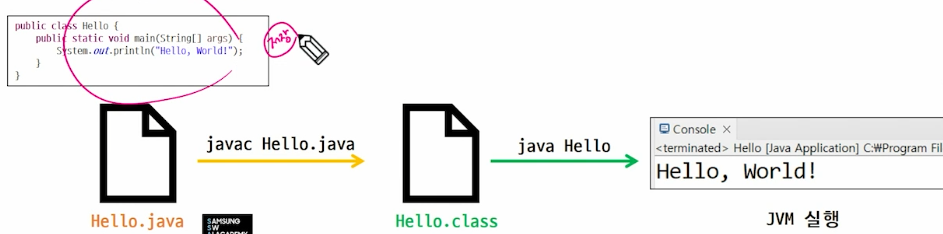
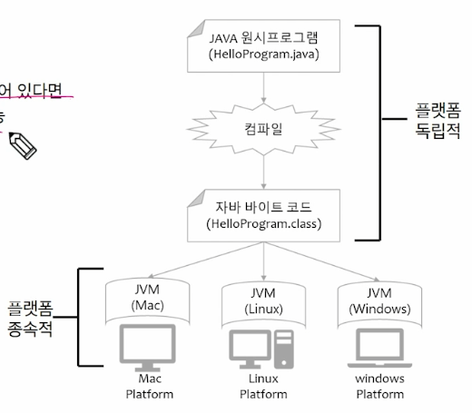
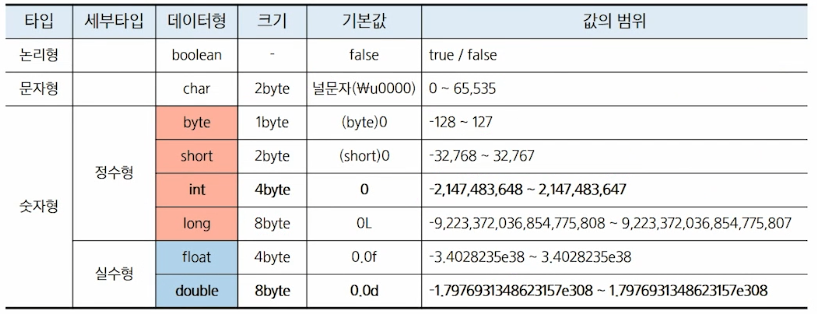

## Hello Java

### Java 개발 환경

```
java project
  ㄴ class
```

### 출력

```java
public class java01_hello {

  public static void main(String[] args) {
    System.out.println("Hello World");
    System.out.println();
  }
}

// Hello World
```

- `System.out.print(데이터)` 전달된 데이터를 줄바꿈 없이 출력
- `System.out.println(데이터)` 전달된 데이터를 출력한 뒤 줄바꿈(개행) 추가
- `System.out.printf(형식 문자열, 데이터1, 데이터2, ...)` 문자열을 형식화(formatting)하여 출력
    - `%d`: 정수
    - `%f`: 실수
    - `%s`: 문자열
    - `%c`: 문자
    - `%n`: 줄 바꿈(플랫폼 독립적)

### **JVM 실행 과정**



1. javac Hello.java 저장
2. Hello.class의 java Hello 실행

- Write Once, Run Anywhere
- 플랫폼에 독립적이고, JVM만 설치되어 있다면 다양한 OS에서 동일한 코드 실행 가능



## 객체지향 프로그래밍 (OOP, Object Oriented Programming)

### 객체 지향 프로그래밍

- 객체(Object): 데이터와 관련된 알고리즘(메서드)을 하나의 단위로 묶어 놓은 것
- 객체 모델링: 현실세계의 객체를 SW 객체로 설계하는 것

### OOP의 특징

- Abstraction 추상화
- Polymorphism 다형성
- Inheritance 상속
- Encapsulation 캡슐화
- 모듈화된 프로그래밍 → 재사용성이 높다

## 변수와 자료형

### 변수 (Variable)

- 컴퓨터 메모리의 데이터 저장소
- 자료형에 따라 값 또는 참조 값을 저장
- `=`을 통해서 CPU에게 연산작업을 의뢰

### 변수 작명 규칙

- 대/소문자 구분 (공백x)
- 숫자로 시작할 수 없다
- 특수문자 중 `$`, `_`만 사용 가능
- 합성어는 camelCase 표기법 사용

### 자료형 (Data Type)

- 기본 자료형 (Primitive Type): 변수 자체에 **값(리터럴, literal)이 직접 저장**됨
    - boolean, char, byte, short, **int**, long, float, **double**
    - 메모리의 스택(stack)에 저장

    

- 참조 자료형 (Reference Type): 변수에 **참조(레퍼런스, 주소)를 저장**, 기본 값은 null(아무것도 참조하지 않음)
    - 메모리의 힙(heap)에 실제 값을 저장하고, 그 참조값(주소)을 갖는 변수는 스택에 저장

### 변수의 선언과 초기화

- 선언: 데이터를 저장할 수 있는 공간을 확보하고 이름을 부여하는 작업
    - 자료형 + 이름
        - `int a;`
        - `int b;`
        - `double c, d;`
- 초기화: 변수에 값을 저장하는 과정
    - 선언과 동시에 초기화 가능
        - `a = 10;`
        - `b = 100;`
        - `int f = 1000;`
- [주의] 큰따옴표(`"`)는 문자열(`String`)을, 작은따옴표(`'`)는 단일 문자(`char`)를 나타낸다.

### 형 변환 (Type Casting)

- 묵시적 형 변환 (Implicit Casting): 작은 데이터 타입을 큰 데이터 타입으로 변환
    - 데이터의 손실이 없다.
    - 자동으로 변환
- 명시적 형 변환 (Explicit Casting): 큰 데이터 타입을 작은 데이터 타입으로 변환
    - 데이터 손실 가능성
    - 직접 명시해주어야 한다.

```java
// 묵시적 형 변환
int a = 10;
double b = a;  // int -> double

// 명시적 형 변환
double x = 9.99;
int y = (int) x;  // double -> int
```
