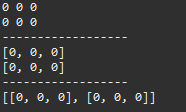

## 다차원 배열 (Multidimensional Array)

### 다차원 배열

- 배열 안에 또 다른 배열을 포함하는 구조
- n차원 배열은 배열의 요소로 **n-1차원 배열의 참조를 가지는 배열**
- n차원 배열의 요소에 접근하기 위해서는 n개의 인덱스가 필요하다.
- **각 행의 길이가 달라도 된다!**

### 2차원 배열 선언

- `데이터타입[][] 배열이름`
- `데이터타입 배열이름[][]`
- `데이터타입[] 배열이름[]`

```java
package java02_array;

public class multidimensional_array {
	public static void main(String[] args) {
		// 선언
		int[][] arr1;
		int[] arr2[];
		int arr3[][];
	}
}
```

### 2차원 배열 출력

```java
// 2차원 배열 출력
// 1. 2중 for 문
for (int i = 0; i < arr4.length; i++) {
	for (int j = 0; j < arr4[i].length; j++) {
		System.out.print(arr4[i][j] + " ");
	}
	System.out.println();
}

// 2. 단일 for 문
System.out.println("------------------");
for (int[] a : arr4) {
	System.out.println(Arrays.toString(a));
}

// 3. Arrays.deepToString() 메서드
System.out.println("------------------");
System.out.println(Arrays.deepToString(arr4));
```



### 2차원 배열 초기화

- 크기만 지정: `new 데이터타입[1차원 배열의 개수(행의 수)][1차원 배열의 크기(열의 수)]`
- 비정형 배열: `new 데이터타입[1차원 배열 개수(행의 수)][]`
- 값으로 초기화

```java
// 초기화
int[][] arr4 = new int[2][3]; // 행:2, 열:3
System.out.println(Arrays.toString(arr4[0])); // [0, 0, 0]
System.out.println(arr4[0][0]); // 0

// 1차원 배열의 개수만 지정하고, 크기를 지정하지 않을 수 있다!
int[][] arr5 = new int[5][];
System.out.println(Arrays.deepToString(arr5)); // [null, null, null, null, null]

arr5[0] = new int[] { 1, 2, 3 };
System.out.println(Arrays.deepToString(arr5)); // [[1, 2, 3], null, null, null, null]

int[][] arr6 = new int[][] { { 1, 2, 3 }, { 3, 4, 5 }, { 6, 7, 8 } };
System.out.println(Arrays.deepToString(arr6)); // [[1, 2, 3], [3, 4, 5], [6, 7, 8]]

// (번외) 배열의 크기가 0이라면?
int[] arr7 = new int[0];
System.out.println(arr7.length);  // 0
```

### 2차원 배열 메모리 구조

```java
int[][] arr = new int[2][];
arr[0] = new int[3];
arr[0][1] = 100;
// arr[1][1] = 100; // null인 상태에서 값을 할당하면 NullPointerException 에러 발생
arr[1] = new int[3];
arr[1][2] = 1000;

// 단계별 JVM 메모리
// arr -> [null | null]
// arr -> [0xa | null] / arr[0] -> [0 | 0 | 0]
// arr -> [0xa | null] / arr[0] -> [0 | 100 | 0]
// arr -> [0xa | 0xd] / arr[1] -> [0 | 0 | 0]
// arr -> [0xa | 0xd] / arr[1] -> [0 | 0 | 1000]
```

### 3차원 배열

- 선언: `데이터타입[][][] 배열이름`
- `배열이름 = new 데이터타입[크기a][크기b][크기c];`
    - 크기 a: 3차원 배열의 크기
    - 크기 b: 2차원 배열의 크기
    - 크기 c: 1차원 배열의 크기
- `배열이름 = new 데이터타입[크기a][][];`
- `배열이름 = new 데이터타입[][][] {3차원 배열의 초기값};`