## 오늘 한 일: 프론트 프로토타입

### 1. 피그마 플러그인 **cursor-talk-to-figma MCP**

- 기능 정의서 csv로 제공했더니 반영해줌
- html, css, js 파일로 만들어줌
- 작동 방식은 gemini-cli MCP 혹은 copilot과 유사함
- 프롬프트를 입력하면 agent 모드로 코드를 작성해줌
- 커서에서 내가 코드를 수정할 수 있음

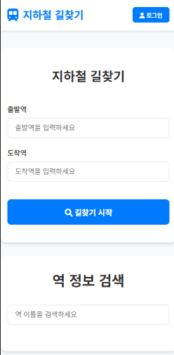

메인페이지

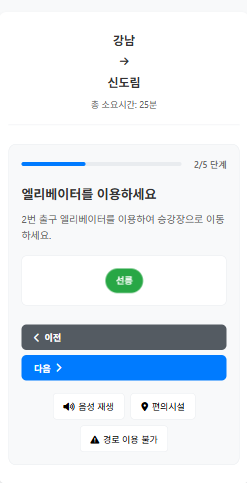

경로 안내 스토리 카드

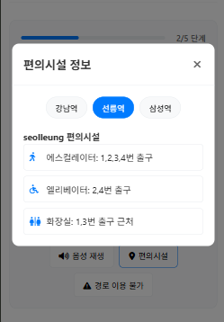

경로 안내 중 편의 시설 조회

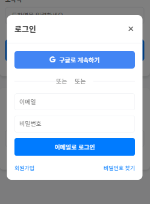

로그인 팝업

### **2. 피그마 AI**

- 피그마 프로토타입만 만드려고 했는데, .tsx 과 .css 파일까지 만들어줌
- 요소 하나를 수정하고 싶은데 내가 직접 삭제/수정할 수 없고,
자연어 프롬프트로 요구해야 한다.
- 요소 선택해서 수정 요구할 수 있는데, 프롬프트 하나에 요소 하나만 선택할 수 있다.

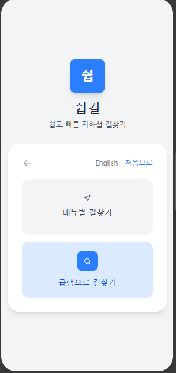

메인페이지

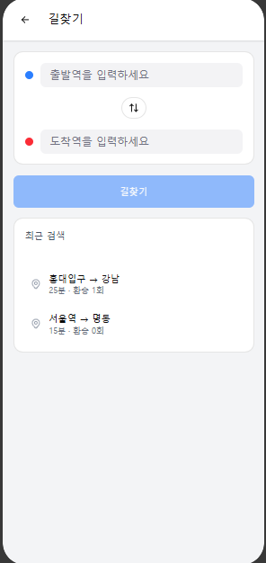

길찾기 검색

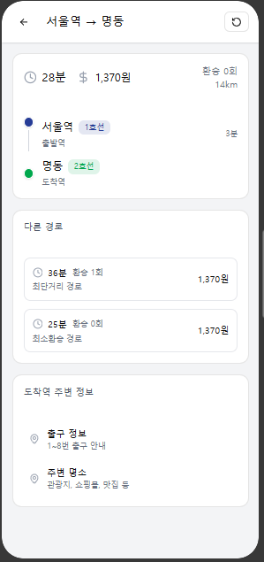

길찾기 결과

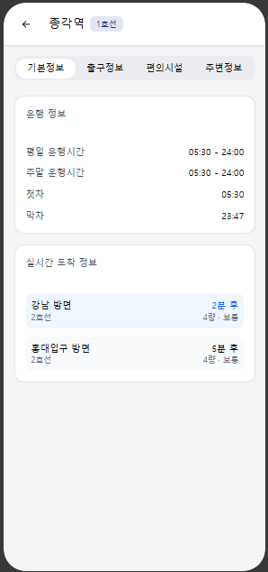

역 정보

### **3. Gemini-CLI**

- Cursor 토큰 만료 이슈로 gemini-CLI로 갈아탔다.
- 기능정의서에 입력된 기능을 토대로 기능을 구현함
- 색상은 온라인실습실 컬러를 추출해 색상표를 구성했고,
- 길찾기에서의 출발역, 도착역 입력과 역 정보에서의 역 이름 입력 프로세스를 통일함
- 만들어진 페이지를 바탕으로 스타일 가이드를 작성함

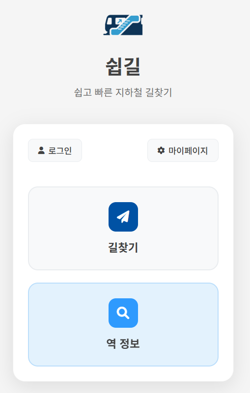

메인페이지

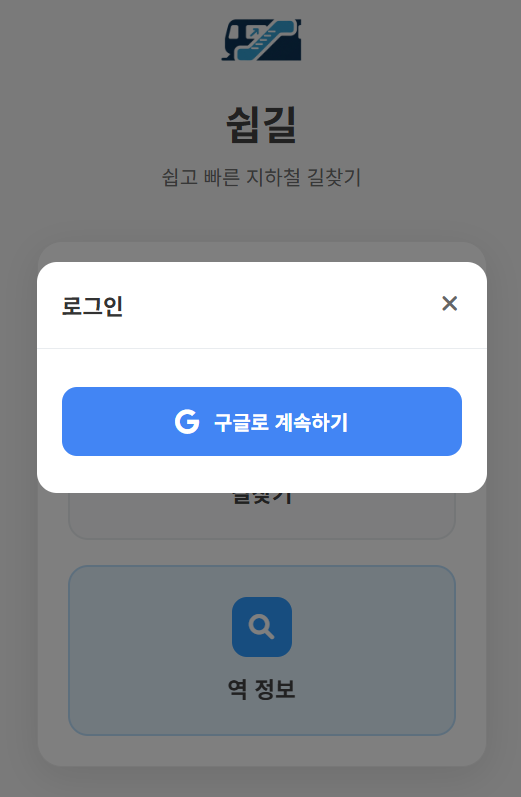

구글 로그인

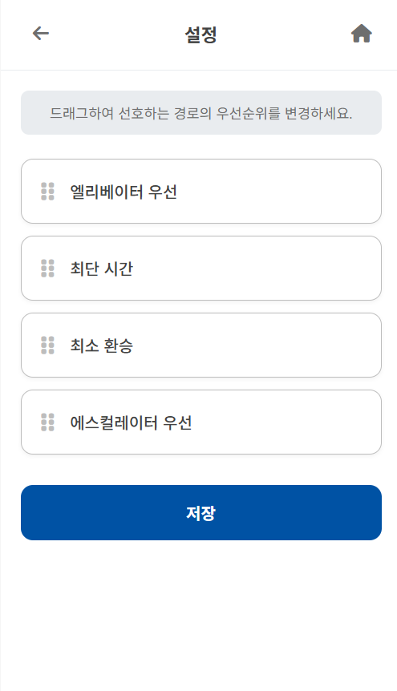

마이페이지 (경로 안내 우선순위 설정)

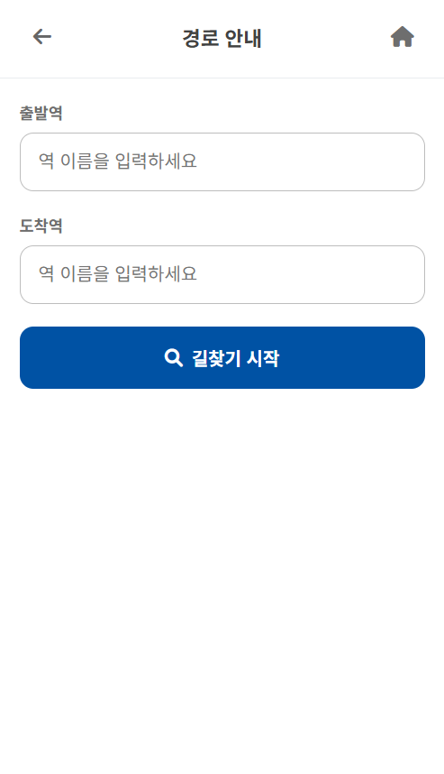

길 찾기 검색

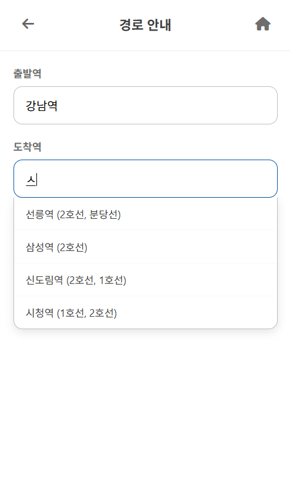

길 찾기 검색 - 자동 추천

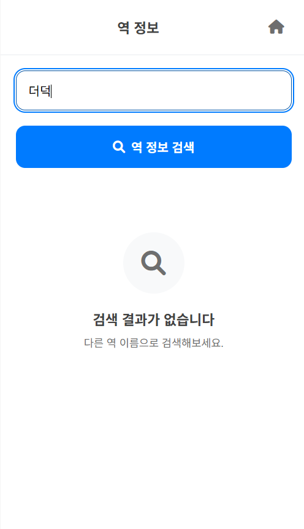

역 정보 검색 - 역명 불일치

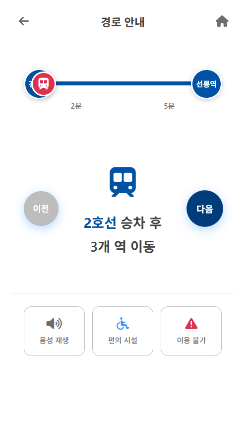

경로 안내 스토리 카드

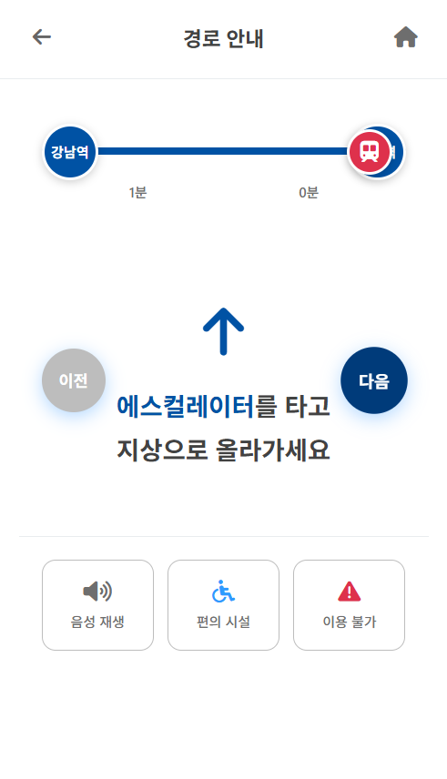

경로 안내 스토리 카드

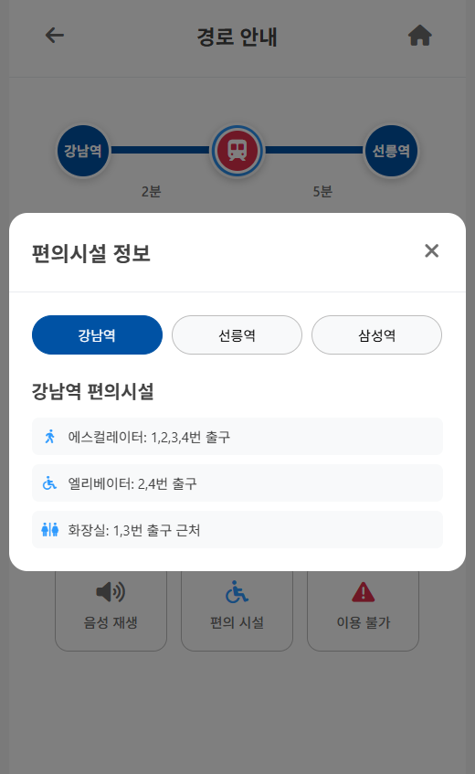

경로 안내 중 편의시설 정보 확인

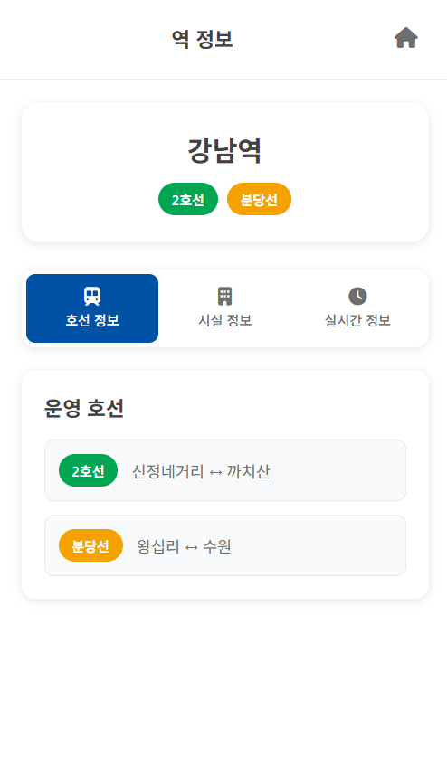

역 정보 - 호선 정보

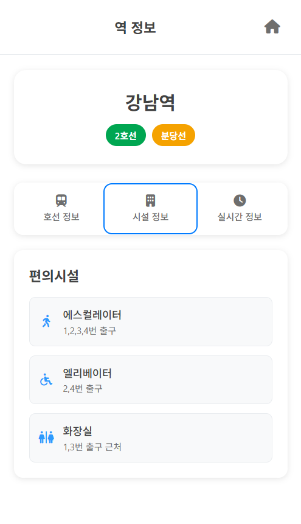

역 정보 - 시설 정보

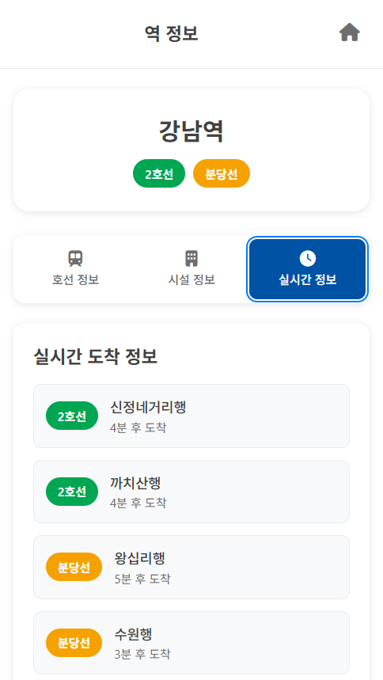

역 정보 - 실시간 정보

### 정리

cursor-pigma MCP를 활용해서 기능정의서를 기반으로 초기 웹페이지를 작성한 후에, 디벨롭하는 과정을 거쳤다.

중간에 토큰을 다써버리는 바람에, 커서에서 만든 파일을 가지고 Gemini-CLI를 활용해 작업을 이어갔다.

간단한 선굵기 조정이나 마진,패딩 값 조정 같은 부분은 css 파일에서 내가 직접 수정했고, 마지막으로 컬러칩을 주어 색상톤을 맞췄다.

설치부터 작업까지 3시간(플러그인 적용해보고 피그마 ai써보고 이것저것 설치해 시도해본 시간)+3시간(본격 초안 만들고 디벨롭한 시간) 정도 걸린 것 같다.

만들어준 프로토타입에서 스타일 가이드를 추출하는 역방향 작업 과정을 거쳤다.

### 사용한 Prompt 예시

> @기능정의서 에서 ver1에 YES 표시되어 있는 기능만 구성해줘. 메인 페이지는 첨부한 이미지를 참고해서, 길찾기와 역 정보 검색 두 개의 버튼으로 구성해줘.
>

> 역 정보 검색과 길찾기에서의 출발역, 도착역 입력은 같은 방식으로 진행되도록 해줘. 사용자가 입력한 텍스트에서 접두(prefix) 검색으로 자동 완성을 제안하고, 사용자가 자동 완성 중에 클릭하면 입력칸에 해당 역이 입력됟도록 수정해줘.
>

> 경로 안내 페이지에서 헤더부분은 출발역과 도착역을 마커표시하고, 환승역이 포함된다면 환승역도 마커로 추가해서 보여줘. 각 역의 호선 색깔과 일치하는 색으로 마커 색깔을 지정하고, 진행선 하단에는 소요 시간을 표시해줘. 중앙에는 경로 안내 텍스트를 보여주는데, 중요한 정보(0-0 플랫폼, 0호선, 에스컬레이터 등)에는 포인트 컬러를 사용하고 각 텍스트와 어울리는 이모지를 추가해줘. ‘이전’, ‘다음’ 버튼은 텍스트를 가리지 않게 현재보다 70% 크기로 수정해줘.
>

> 역 이름 입력이 끝나고 ‘역 정보 검색’ 버튼을 누르면, 입력창은 화면에서 보이지 않고 역 상세 정보 페이지만 보이도록 해줘.
>

## 해결 내역

문제 상황: 위의 2번까지 작업해보면서 피그마 플러그인과 AI를 활용해봤는데, 원래 정했던 작업 순서와는 다르게, 피그마 레이아웃을 그려주는 플러그인을 찾지 못했다. 대부분의 플러그인이나 AI는 코드를 구현하고 html, tsx, css 파일 등을 만들어서 페이지를 보여주더라. 그래서 피그마 작업에 집착하지 않고 MCP를 사용하는 것에 의의를 두기로 하고, 작업 과정을 아래와 같이 수정했다.

1. cursor-talk-to-figma MCP를 활용해서 초안을 만들고, 직접 코드 뜯어보면서 기능 정의서에 맞게 수정하기
2. 어느정도 기능 구현을 마치면 디자인은 GPT에게 맡기기
3. 데이터 연결되는 부분은 fake data 로 채우기

그렇게 해서 만든 프로토타입이 위의 3번(Gemini-CLI) 작업물이다.

## 할 일

공통 레포에 커밋

1. 백엔드 담당이 장고 프로젝트, 앱 생성 후 커밋
2. 프론트 담당이 작업한 코드(html, css, js) 앱 구조에 맞춰서 복붙 후 커밋
3. 커밋 메시지는 커밋 컨벤션 GPT에 등록해두고 만들어 달라 하기

**참고할 만한 블로그**

[AI와 함께 테스트 코드 작성 하기 | MUSINSA tech](https://medium.com/musinsa-tech/ai%EC%99%80-%ED%95%A8%EA%BB%98-%ED%85%8C%EC%8A%A4%ED%8A%B8-%EC%BD%94%EB%93%9C-%EC%9E%91%EC%84%B1-%ED%95%98%EA%B8%B0-8a04225ed51a)