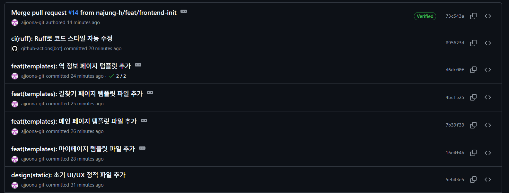

## 오늘 한 일 : git

주말 동안 프론트 작업한 거 오늘 깃허브에 올렸다.

커밋 컨벤션 맞추고 git branch 전략에 맞춰서 작업하느라 하나하나 신중하게 했다.

뭔가 커밋은 한번 올리면 되돌릴 수가 없으니 떨리더라…

작업 과정을 정리하자면…

1. 내가 작업할 branch 생성 (임시)
2. commit
    1. 커밋 컨벤션에 맞춰서 메시지 작성
    2. 기능 단위별로 쪼개서 올리기
    3. `git add .` 금지
3. push
4. PR(pull request)
5. CI 실행 완료 후 merge pull request

---

막연한 두려움 이기기.

일단 해라. 해보고 안되는 거 고쳐나가면 된다.

**참고할 만한 블로그**

[AI와 함께 테스트 코드 작성 하기 | MUSINSA tech](https://medium.com/musinsa-tech/ai%EC%99%80-%ED%95%A8%EA%BB%98-%ED%85%8C%EC%8A%A4%ED%8A%B8-%EC%BD%94%EB%93%9C-%EC%9E%91%EC%84%B1-%ED%95%98%EA%B8%B0-8a04225ed51a)