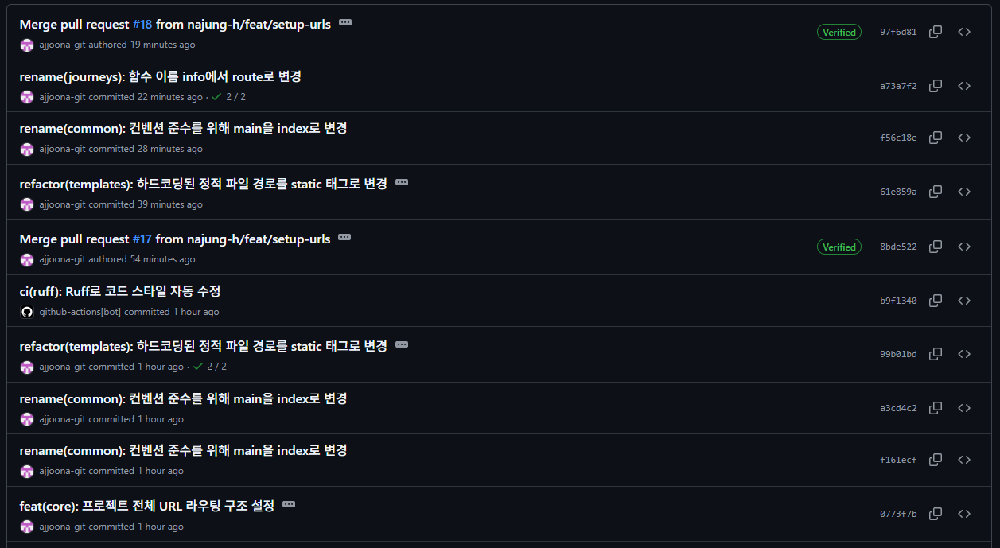

## 오늘 한 일

### **1. App URL Mapping**

```python
# urls.py
from django.contrib import admin
from django.urls import path, include

urlpatterns = [
    path("admin/", admin.site.urls),
    path("", include("apps.common.urls")),
    path("accounts/", include("apps.accounts.urls")),
    path("stations/", include("apps.stations.urls")),
    path("journeys/", include("apps.journeys.urls")),
]
```

```python
# common/urls.py
from django.urls import path
from .views import healthz
from . import views

app_name = "common"
urlpatterns = [
    path("", views.index, name="index"),
    path("healthz/", healthz, name="healthz"),
]
```

```python
# stations/urls.py
from django.urls import path
from . import views

app_name = "stations"
urlpatterns = [
    path("", views.station_info, name='station_info'),
]
```

```python
# journeys/urls.py
from django.urls import path
from . import views

app_name = "journeys"
urlpatterns = [
    path("", views.route, name='route'),
]
```

```python
# accounts/urls.py
from django.urls import path
from . import views

app_name = "accounts"
urlpatterns = [
    path("settings/", views.settings, name="settings"),
]
```

### 2. static 태그 추가하면서 파일 경로 일괄 수정

```python
# settings.py

# 정적 파일을 찾을 경로
STATICFILES_DIRS = [
    BASE_DIR / "static",
]
```

```html


...
<link rel="stylesheet" href="">
...
<script src=""></script>
...
```

### 3. 일부 파일명 변경

| 변경 전 | 변경 후 | 변경 사유 |
| --- | --- | --- |
| `station.html/css/js` | `station_info.html/css/js` | stations 앱 이름과의 유사성으로 인한 혼란을 줄이고,
역 정보를 제공하는 역할을 명시하기 위함 |
| `main.html/css/js` | `index.html/css/js` | 특정 앱(app)의 시작점이 되는 뷰 함수의 이름으로 index를 사용하는 것이 표준 |

### 4. URL 엔드포인트 정의서

| 화면 | URL 주소 | 기능 | 뷰 함수 |
| --- | --- | --- | --- |
| 관리자 페이지 | `wisheasy.site/admin/` |  |  |
| 헬스 체크 | `wisheasy.site/healthz/` |  | common/healthz |
| 메인 페이지 | `wisheasy.site/` | 홈 화면 | common/index |
| 사용자 설정 페이지 | `wisheasy.site/accounts/settings/` | 경로 안내 우선순위 설정 | accounts/settings |
| 길찾기 페이지 | `wisheasy.site/journeys/` | 출발역/도착역 입력, 경로 안내 | journeys/route |
| 역 정보 페이지 | `wisheasy.site/stations/` | 역 입력, 시설 정보 안내 | stations/station_info |

### git commit log




## 느낀점

git push 후에도 PR(pull request)이 뜨지 않는다면, 수동으로 new pull request를 만들어서 등록하면 된다!
왜 꼭 커밋하고 나면 함수명이 틀린 게 보이는 걸까… 좀 더 꼼꼼히 검수 후 커밋하겠습니다.. 중복 커밋 죄송합니다ㅜㅜ